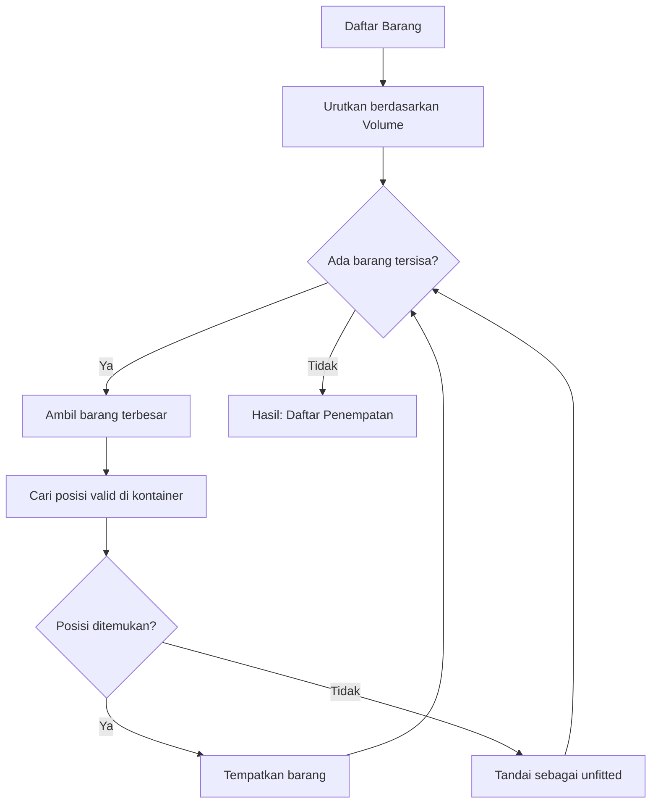
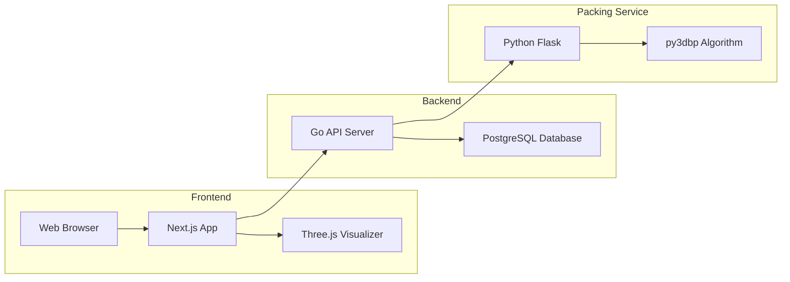

---
aliases:
---
# Load & Stuffing Calculator

**Implementasi Arsitektur dan Visualisasi 3D untuk Sistem Optimasi Kargo**

---

## Daftar Isi

1. [Bab 1: Digitalisasi Logistik dan Tantangan Pemuatan](#bab-1-digitalisasi-logistik-dan-tantangan-pemuatan)
2. [Bab 2: Perancangan Arsitektur Layanan Mikro](#bab-2-perancangan-arsitektur-layanan-mikro)
3. [Bab 3: Pengembangan Backend API dengan Bahasa Go](#bab-3-pengembangan-backend-api-dengan-bahasa-go)
4. [Bab 4: Membangun Mesin Kalkulasi (Packing Service) dengan Python](#bab-4-membangun-mesin-kalkulasi-packing-service-dengan-python)
5. [Bab 5: Visualisasi 3D Interaktif dengan Three.js](#bab-5-visualisasi-3d-interaktif-dengan-threejs)
6. [Bab 6: Tantangan Sinkronisasi dan Transformasi Geometris](#bab-6-tantangan-sinkronisasi-dan-transformasi-geometris)
7. [Bab 7: Evaluasi Performa dan Skalabilitas Sistem](#bab-7-evaluasi-performa-dan-skalabilitas-sistem)
8. [Bab 8: Integrasi IoT dan Masa Depan Pemuatan](#bab-8-integrasi-iot-dan-masa-depan-pemuatan)

---

<!-- BAB 1 STARTS HERE -->

## Bab 1: Digitalisasi Logistik dan Tantangan Pemuatan

Pada bab ini, kita akan memahami landasan teoritis dari permasalahan optimasi pemuatan kontainer dan mengapa sistem manual tidak lagi memadai untuk industri logistik modern. Tujuan utamanya adalah untuk memberikan fondasi pemahaman sebelum kita membangun sistem *Load & Stuffing Calculator*.

Terdapat beberapa tantangan teknis yang akan kita bahas, meliputi:

- Memahami kompleksitas matematis *NP-hard* pada *3D Bin Packing Problem* (3D-BPP).
- Mengidentifikasi inefisiensi *manual planning* yang menyebabkan *void space* dan kerugian operasional.
- Menentukan pendekatan algoritmik yang tepat untuk menghasilkan solusi dalam waktu komputasi yang wajar.

Dalam bab ini, kita akan menjawab tantangan tersebut dengan mengeksplorasi teori dasar *Container Loading Problem*, memahami mengapa pendekatan heuristik menjadi solusi praktis, dan mendefinisikan visi sistem yang akan kita bangun.

**Dalam bab ini, kita akan membahas topik-topik berikut:**

- Tantangan Logistik dalam Era Perdagangan Global
- *Container Loading Problem* (CLP) dan Kompleksitas NP-hard
- Pendekatan Algoritmik: Dari Optimal ke Heuristik
- Visi Sistem *Load & Stuffing Calculator*


### 1.1 Tantangan Logistik dalam Era Perdagangan Global

Pada tahun 1956, seorang pengusaha truk bernama Malcolm McLean melakukan eksperimen sederhana yang mengubah wajah perdagangan dunia: ia memuat 58 trailer truk ke dalam kapal tanker bekas di pelabuhan Newark, New Jersey. Eksperimen ini melahirkan kontainerisasi modern—sebuah inovasi yang mengurangi biaya pengiriman barang hingga 90% dan memungkinkan globalisasi ekonomi seperti yang kita kenal hari ini.

Namun, enam dekade kemudian, sebuah ironi masih terjadi di hampir setiap pelabuhan dunia. Meskipun proses pengangkutan kontainer telah sepenuhnya terotomasi dengan crane raksasa dan sistem pelacakan digital, proses *stuffing*—memuat barang ke dalam kontainer—masih dilakukan dengan cara yang nyaris tidak berubah sejak era McLean. Seorang operator berdiri di depan kontainer kosong, memegang clipboard atau tablet, lalu mengarahkan forklift berdasarkan intuisi dan pengalaman.

Pendekatan manual ini bukanlah masalah ketika sebuah kontainer berisi barang homogen—ribuan unit produk identik yang dapat ditumpuk dengan pola sederhana. Namun, realitas perdagangan modern jauh lebih kompleks. Sebuah eksportir furnitur, misalnya, mungkin harus memuat meja konferensi berukuran 3 meter berdampingan dengan kursi kantor, rak buku, dan aksesori kecil—semuanya dengan dimensi berbeda, batasan orientasi berbeda, dan kebutuhan penopang berbeda.

Di sinilah keterbatasan fundamental metode manual mulai terlihat. Otak manusia, sehebat apapun, memiliki batas dalam memproses kombinasi spasial tiga dimensi. Ketika jumlah barang meningkat dari puluhan menjadi ratusan, jumlah kemungkinan konfigurasi penempatan meledak secara eksponensial—dan tidak ada operator yang dapat mengevaluasi semua opsi dalam waktu yang wajar.

Dampak dari keterbatasan ini terukur dan multidimensi. Pertama, ada masalah **waktu**—perencanaan muatan dengan puluhan SKU berbeda dapat memakan waktu berjam-jam, menyebabkan delay pengiriman dan biaya overtime pekerja. Kedua, masalah **akurasi**—utilisasi volume rata-rata hanya mencapai 50-70%, sangat bergantung pada skill individu operator, yang langsung meningkatkan biaya pengiriman per unit produk.

Ketiga, ada tantangan **konsistensi**. Dua operator berbeda yang merencanakan muatan yang sama mungkin menghasilkan konfigurasi berbeda dengan utilisasi berbeda. Ketidakpastian ini menyulitkan perusahaan memprediksi kapasitas dan biaya secara akurat. Keempat, metode manual tidak **scalable**—ketika volume pengiriman meningkat, bottleneck terjadi karena jumlah planner berpengalaman terbatas.

Terakhir, ada risiko institusional yang sering diabaikan. Dokumentasi perencanaan manual cenderung tidak lengkap, menyulitkan audit dan klaim asuransi ketika terjadi kerusakan barang. Lebih kritis lagi, pengetahuan dan intuisi yang dibangun selama bertahun-tahun tersimpan di kepala individu—ketika karyawan berpengalaman resign atau pensiun, perusahaan kehilangan aset intelektual yang tidak ternilai.

Tantangan ini semakin kritis dalam konteks e-commerce dan *just-in-time manufacturing*, di mana perusahaan harus menangani ratusan hingga ribuan SKU (*Stock Keeping Unit*—kode unik untuk setiap varian produk) dengan dimensi berbeda-beda. Setiap pengiriman mungkin melibatkan kombinasi produk yang berbeda, dan perencanaan harus dilakukan dalam hitungan jam—bukan hari. Kontainer yang tersedia pun bervariasi: 20 feet, 40 feet standar, 40 feet High Cube—masing-masing dengan dimensi internal dan batasan berat maksimum yang berbeda.

Industri logistik membutuhkan solusi yang dapat memproses kompleksitas ini secara sistematis, konsisten, dan cepat. Solusi tersebut harus mampu mengevaluasi ribuan kemungkinan konfigurasi dalam hitungan detik, bukan jam. Solusi tersebut harus menghasilkan output yang dapat dipahami oleh operator lapangan—bukan hanya angka abstrak, tetapi panduan visual langkah demi langkah. Dan solusi tersebut harus robust terhadap variasi input: dari selusin barang homogen hingga ratusan SKU heterogen.

---

### 1.2 Container Loading Problem dan Kompleksitas NP-hard

Masalah yang tampak sederhana—menempatkan kotak-kotak ke dalam wadah lebih besar—ternyata telah menarik perhatian matematikawan dan ilmuwan komputer selama lebih dari setengah abad. Dalam literatur akademis, permasalahan ini dikenal sebagai *Container Loading Problem* (CLP), dan ia memiliki sejarah panjang yang terkait dengan perkembangan teori kompleksitas komputasi.

Definisi formal CLP dapat dirumuskan sebagai berikut:

> **Diberikan sebuah wadah (kontainer) dengan dimensi tertentu dan sekumpulan objek berbentuk kotak dengan dimensi masing-masing, tempatkan objek-objek tersebut ke dalam wadah sedemikian rupa sehingga total volume yang dimuat maksimal, tanpa terjadi tumpang tindih (overlap) antar objek, dan dengan memenuhi batasan fisik yang berlaku.**

Rumusan ini terdengar straightforward. Namun, di balik kesederhanaan definisinya tersembunyi kompleksitas matematis yang luar biasa.

Pada tahun 1972, Richard Karp mempublikasikan makalah seminal yang mengidentifikasi 21 masalah komputasi yang ia buktikan sebagai "NP-complete"—sebuah kelas masalah yang, hingga hari ini, tidak ada algoritma efisien yang diketahui dapat menyelesaikannya. *Bin Packing Problem*, versi satu dimensi dari CLP, termasuk dalam daftar Karp. Versi tiga dimensi—yang kita hadapi dalam pemuatan kontainer—bahkan lebih kompleks.

Apa artinya sebuah masalah bersifat **NP-hard** bagi praktisi? Mari kita telusuri implikasi praktisnya.

Pendekatan paling intuitif untuk menyelesaikan CLP adalah *brute force*: coba semua kemungkinan konfigurasi penempatan, evaluasi masing-masing, lalu pilih yang terbaik. Pendekatan ini dijamin menemukan solusi optimal. Masalahnya terletak pada jumlah kemungkinan yang harus dievaluasi.

Untuk setiap barang, kita perlu memutuskan: (1) di mana menempatkannya dalam ruang tiga dimensi, dan (2) dengan orientasi apa. Jika kita menyederhanakan dengan mengasumsikan kontainer dapat dibagi menjadi grid unit kecil, setiap barang memiliki ribuan kemungkinan posisi. Kalikan dengan 6 kemungkinan rotasi. Kalikan lagi dengan jumlah barang. Hasilnya adalah ledakan kombinatorial yang melampaui kapasitas komputasi manapun:

```
Jumlah Barang    Perkiraan Kombinasi       Waktu Brute Force
─────────────────────────────────────────────────────────────
      5          ~10^4                     < 1 detik
     10          ~10^10                    ~3 jam
     20          ~10^18                    ~30.000 tahun
     50          ~10^50                    > usia alam semesta
    100          ~10^150                   Angka yang tak bermakna
```

Perhatikan bagaimana penambahan linier pada jumlah barang menghasilkan pertumbuhan eksponensial pada kompleksitas. Inilah ciri khas masalah NP-hard: tidak ada "trik pintar" yang diketahui dapat menghindari ledakan kombinatorial ini. Jika seseorang menemukan algoritma yang dapat menyelesaikan CLP dalam waktu polynomial untuk semua kasus, ia akan membuktikan P = NP—salah satu masalah terbuka paling terkenal dalam matematika, dengan hadiah $1 juta dari Clay Mathematics Institute.

Dalam praktik industri, kompleksitas teoritis ini diterjemahkan menjadi batasan nyata. Sebuah perusahaan logistik tidak dapat menunggu bertahun-tahun untuk mendapatkan rencana pemuatan "optimal". Mereka membutuhkan jawaban dalam hitungan menit—bahkan detik—meskipun jawaban tersebut mungkin tidak sempurna.

Lebih jauh lagi, CLP dunia nyata jarang sesederhana definisi akademis. Batasan praktis (*constraints*) menambah dimensi kompleksitas baru:

**Orientasi dan arah "atas"**: Tidak semua barang boleh diputar secara bebas. Sebuah komputer harus tetap tegak. Sebuah mesin mungkin memiliki titik pengangkatan yang menentukan orientasinya. Constraint ini mengurangi ruang solusi, tetapi juga mengurangi fleksibilitas algoritma.

**Stabilitas tumpukan**: Barang yang ditumpuk harus memiliki penopang yang memadai di bawahnya. Algoritma tidak dapat seenaknya "menggantung" barang di udara. Biasanya, minimal 75% permukaan bawah barang harus didukung oleh barang lain atau lantai kontainer.

**Batasan berat**: Setiap kontainer memiliki *payload maksimum*—berat total yang boleh dimuat. Kontainer standar 40 feet, misalnya, memiliki batas sekitar 28 ton. Algoritma harus melacak akumulasi berat dan menolak penempatan yang melanggar batas ini.

**Distribusi berat**: Selain total berat, distribusi berat juga penting. Kontainer yang terlalu berat di satu sisi dapat menyebabkan masalah stabilitas saat pengangkutan. Beberapa algoritma advanced memperhitungkan *center of gravity*.

**Urutan pemuatan/pembongkaran**: Dalam skenario multi-destinasi, barang untuk pemberhentian pertama harus dapat diakses tanpa memindahkan barang lain. Ini menambahkan constraint temporal ke masalah spasial.

Dengan semua constraint ini, ruang solusi yang "valid" menjadi jauh lebih sempit—tetapi menemukannya di tengah lautan kemungkinan tetap merupakan tantangan komputasional yang besar.

---

### 1.3 Pendekatan Algoritmik: Dari Optimal ke Heuristik

Mengingat kompleksitas NP-hard, pendekatan matematis murni (*exact algorithms*) seperti *Integer Linear Programming* atau *Branch and Bound* menjadi tidak praktis untuk data dengan skala industri. Oleh karena itu, industri dan akademisi beralih ke **algoritma heuristik**.

Algoritma heuristik adalah metode yang:

- **Tidak menjamin solusi optimal**, tetapi menghasilkan solusi "cukup baik" dalam waktu komputasi yang wajar.
- **Menggunakan aturan prioritas** (*rules of thumb*) untuk membuat keputusan penempatan.
- **Dapat disesuaikan** dengan batasan spesifik domain.

Salah satu pendekatan heuristik yang terbukti efektif adalah **3D Bin Packing** dengan strategi *Bigger First*. Ide dasarnya sederhana namun powerful: **tempatkan barang terbesar terlebih dahulu**.

Mengapa pendekatan ini masuk akal? Bayangkan Anda mengemas koper untuk bepergian. Jika Anda memasukkan baju-baju kecil terlebih dahulu, kemungkinan besar laptop atau sepatu besar tidak akan muat di akhir. Sebaliknya, jika laptop dan sepatu dimasukkan dulu, baju-baju kecil dapat mengisi celah yang tersisa.

Flowchart berikut menggambarkan langkah-langkah algoritma secara sistematis:



Mari kita telusuri alur ini:

1. **Pengurutan awal**: Semua barang diurutkan berdasarkan volume (panjang × lebar × tinggi) dari terbesar ke terkecil. Ini adalah langkah krusial yang menentukan urutan penempatan.

2. **Iterasi penempatan**: Algoritma mengambil barang terbesar yang belum ditempatkan, lalu mencari posisi valid di dalam kontainer. "Valid" berarti tidak bertumpukan dengan barang lain dan tidak melampaui batas kontainer.

3. **Pencarian posisi**: Untuk setiap barang, algoritma mencoba berbagai kombinasi koordinat (x, y, z) dan rotasi. Proses ini adalah bagian yang paling *compute-intensive*.

4. **Penanganan kegagalan**: Jika tidak ada posisi valid ditemukan (misalnya kontainer sudah terlalu penuh), barang ditandai sebagai "unfitted" dan dilanjutkan ke barang berikutnya.

5. **Output akhir**: Setelah semua barang diproses, algoritma menghasilkan daftar penempatan (koordinat + rotasi) dan daftar barang yang tidak muat.

**Mengapa strategi *Bigger First* efektif?**

1. **Prioritas yang tepat**: Barang besar memiliki lebih sedikit opsi penempatan yang valid. Dengan memprioritaskannya, kita menghindari situasi di mana barang besar "tersingkir" oleh barang kecil.

2. **Pondasi yang stabil**: Barang besar yang ditempatkan di dasar menciptakan permukaan yang rata untuk menumpuk barang di atasnya.

3. **Pemanfaatan celah**: Barang kecil lebih fleksibel dan dapat mengisi *void space* yang tidak dapat diisi oleh barang besar.

**Alternatif Strategi Heuristik**

*Bigger First* bukanlah satu-satunya strategi yang tersedia. Dalam literatur bin packing, terdapat beberapa pendekatan alternatif yang layak dipertimbangkan:

**Bottom-Left-Back (BLB)**: Strategi ini menempatkan setiap barang di posisi yang paling "bawah-kiri-belakang" yang tersedia. Koordinat Y (tinggi) diprioritaskan paling rendah, diikuti X (kiri), lalu Z (belakang). BLB cenderung menghasilkan penumpukan yang rapi secara visual, tetapi tidak selalu optimal untuk utilisasi volume.

**Best Fit Decreasing (BFD)**: Mirip dengan *Bigger First*, tetapi saat mencari posisi, algoritma memilih posisi yang menyisakan ruang kosong paling sedikit. Ini mengurangi fragmentasi ruang, tetapi membutuhkan komputasi lebih berat karena harus mengevaluasi lebih banyak opsi.

**First Fit Decreasing (FFD)**: Barang diurutkan dari besar ke kecil, lalu ditempatkan di posisi valid pertama yang ditemukan. Lebih cepat dari BFD karena tidak mencari posisi "terbaik", tetapi hasilnya cenderung kurang optimal.

Untuk implementasi kita, *Bigger First* dengan pencarian posisi standar dipilih karena menyeimbangkan **kualitas solusi** dan **kecepatan komputasi**. Dalam pengujian dengan data industri, strategi ini mencapai utilisasi volume 50-60% untuk kargo heterogen—angka yang kompetitif dengan algoritma yang lebih kompleks, tetapi dengan waktu eksekusi yang jauh lebih singkat.

**Trade-off: Kualitas vs Waktu**

Dalam dunia praktis, ada trade-off fundamental antara kualitas solusi dan waktu komputasi:

- **Algoritma exact** (seperti Integer Linear Programming) dapat menemukan solusi optimal, tetapi waktu eksekusinya meledak eksponensial seiring bertambahnya barang. Untuk 50+ barang, waktu bisa mencapai jam atau bahkan hari.

- **Algoritma heuristik** seperti *Bigger First* mengorbankan optimalitas demi kecepatan. Solusi yang dihasilkan mungkin "hanya" 95% sebaik solusi optimal, tetapi didapat dalam hitungan detik.

Untuk aplikasi industri di mana keputusan harus dibuat dengan cepat dan volume pengiriman tinggi, trade-off ini hampir selalu menguntungkan heuristik. Selisih beberapa persen utilisasi volume tidak sebanding dengan penundaan berhari-hari menunggu solusi "sempurna".

**Ilustrasi Numerik Sederhana**

Untuk memperjelas cara kerja algoritma, mari kita lihat contoh sederhana dengan 4 barang yang akan dimuat ke kontainer berukuran 1000 × 500 × 500 mm:

```
Barang Awal (belum diurutkan):
┌─────────┬────────────────────┬─────────────┐
│ Item    │ Dimensi (mm)       │ Volume      │
├─────────┼────────────────────┼─────────────┤
│ A       │ 200 × 200 × 200    │ 8.000.000   │
│ B       │ 400 × 300 × 250    │ 30.000.000  │
│ C       │ 100 × 100 × 100    │ 1.000.000   │
│ D       │ 300 × 200 × 200    │ 12.000.000  │
└─────────┴────────────────────┴─────────────┘

Setelah Pengurutan (Bigger First):
B (30jt) → D (12jt) → A (8jt) → C (1jt)

Proses Penempatan:
1. B ditempatkan di (0, 0, 0) — pojok kiri-bawah-depan
2. D ditempatkan di (400, 0, 0) — di samping B
3. A ditempatkan di (0, 250, 0) — di atas B
4. C ditempatkan di celah yang tersisa
```

Dengan urutan ini, barang besar mendapat prioritas posisi optimal, sementara barang kecil mengisi celah. Jika urutan dibalik (C dulu), barang C mungkin mengambil posisi yang seharusnya lebih baik untuk B.

---

### 1.4 Visi Sistem Load & Stuffing Calculator

Berdasarkan pemahaman tantangan di atas, kita akan membangun sistem **Load & Stuffing Calculator**—sebuah platform yang mentransformasi proses perencanaan pemuatan dari intuisi manual menjadi komputasi algoritmik dengan visualisasi interaktif.

**Visi Sistem:**

> Menyediakan solusi perencanaan pemuatan yang **akurat**, **visual**, dan **operasional**—menghubungkan kalkulasi algoritmik dengan kebutuhan praktis pekerja lapangan.

**Tujuan Operasional:**

Sistem yang kita bangun memiliki target yang terukur. Dari sisi *Fill Rate*, kita menargetkan 100%—artinya semua barang yang diminta harus dapat dimuat jika secara fisik memungkinkan. Untuk *Volume Utilization*, target kita adalah di atas 50% untuk kargo heterogen, sesuai dengan benchmark industri untuk barang dengan dimensi bervariasi. Waktu kalkulasi harus di bawah 40 detik untuk 300 barang, memastikan penggunaan interaktif tetap responsif. Akurasi geometris harus bebas *overlap* dan stabil—hasil yang dapat diterapkan secara literal di lapangan. Terakhir, output disajikan dalam dua format: visualisasi 3D interaktif untuk planner dan PDF instruksi untuk operator.

**Siapa yang Akan Menggunakan Sistem Ini?**

Sistem ini dirancang untuk melayani berbagai peran dalam rantai pasok logistik:

**Logistics Planner** adalah pengguna utama. Mereka bertanggung jawab merencanakan muatan untuk pengiriman mendatang. Skenario tipikal: planner menerima daftar order dari tim sales, lalu perlu menentukan berapa kontainer yang dibutuhkan dan bagaimana konfigurasi optimalnya. Dengan sistem ini, mereka dapat simulasi berbagai skenario dalam hitungan menit—bukan jam.

**Warehouse Supervisor** menggunakan output sistem sebagai panduan operasional. Visualisasi step-by-step membantu mereka mengarahkan operator forklift dengan presisi. PDF instruksi dapat dicetak dan dibawa ke lapangan, mengurangi miskomunikasi antara planner di kantor dan pekerja di gudang.

**Management** membutuhkan visibility untuk decision-making. Dashboard statistik—utilisasi volume, waktu kalkulasi, trend pengiriman—membantu mereka mengidentifikasi inefisiensi dan mengoptimalkan operasi secara keseluruhan.

**Skenario Penggunaan Khas:**

1. **Pengiriman rutin**: Sebuah pabrik furnitur mengirim produk ke retailer setiap minggu. Kombinasi produk relatif konsisten. Planner menggunakan template yang sudah ada, memodifikasi quantity, dan mendapat rencana baru dalam detik.

2. **Pengiriman ad-hoc**: Sebuah eksportir menerima order besar dengan produk yang belum pernah dikirim bersama. Planner memasukkan dimensi baru, bereksperimen dengan berbagai ukuran kontainer, dan menemukan konfigurasi paling efisien.

3. **Evaluasi kapasitas**: Sales team ingin memberikan quote kepada customer baru. Mereka perlu tahu apakah order tertentu muat dalam satu kontainer atau dua. Sistem memberikan jawaban instan tanpa harus menunggu tim operasional.

**Gambaran Arsitektur Sistem:**

Untuk mewujudkan visi di atas, kita memerlukan arsitektur yang modular—di mana setiap komponen memiliki tanggung jawab spesifik dan dapat dikembangkan secara independen. Sistem yang akan kita bangun terdiri dari tiga lapisan utama:



Mari kita telusuri alur data dalam sistem ini:

1. **User membuka browser** dan mengakses aplikasi Next.js. Di sini, mereka memilih kontainer dan menambahkan barang yang akan dimuat.

2. **Frontend mengirim request** ke Go API Server. Request ini berisi informasi kontainer dan daftar barang lengkap dengan dimensi dan quantity.

3. **Go API Server memvalidasi data** dan menyimpannya ke PostgreSQL. Ini memastikan data persisten dan dapat diakses kembali.

4. **Ketika user meminta kalkulasi**, Go API Server meneruskan request ke Packing Service (Python Flask). Di sinilah algoritma py3dbp bekerja untuk menghitung penempatan optimal.

5. **Hasil kalkulasi dikembalikan** ke Go API Server, yang menyimpannya ke database dan mengirimkannya ke frontend.

6. **Three.js Visualizer merender hasil** dalam bentuk 3D interaktif. User dapat memutar, zoom, dan melihat animasi step-by-step pemuatan.

Setiap komponen dipilih berdasarkan kekuatan spesifiknya. **Go** digunakan untuk API Server karena performa tinggi dan *concurrency* yang kuat melalui goroutines, plus kemudahan deployment sebagai single binary. **Python** menjadi pilihan untuk algoritma packing karena ekosistem pustaka matematikanya yang matang dan sintaks yang ekspresif untuk logika kompleks. **Three.js** menangani visualisasi 3D dengan *hardware-accelerated* rendering langsung di browser tanpa plugin. **PostgreSQL** menyediakan persistensi data yang reliable dengan dukungan JSON untuk data semi-structured. Terakhir, **Next.js** membangun frontend dengan server-side rendering, routing otomatis, dan integrasi TypeScript yang kuat.

**Hasil Akhir Buku Ini:**

Setelah menyelesaikan buku ini, pembaca akan memiliki pengetahuan dan *source code* untuk membangun platform yang mampu:

1. **Optimasi Maksimal**: Mencapai *Fill Rate* 100% dan *Volume Utilization* hingga 55,26% untuk kargo heterogen.
2. **Kecepatan Operasional**: Menyelesaikan perhitungan 300 barang dalam waktu kurang dari 40 detik.
3. **Akurasi Visual**: Menyajikan panduan pemuatan langkah-demi-langkah yang akurat secara geometris.
4. **Arsitektur Standar Industri**: Memahami cara membangun sistem multi-bahasa yang berkomunikasi secara efisien.

---

### Summary

Pada bab ini, kita telah memahami mengapa optimasi pemuatan kontainer merupakan masalah yang signifikan bagi industri logistik. *Container Loading Problem* adalah masalah NP-hard yang tidak dapat diselesaikan secara optimal dalam waktu yang wajar untuk skala industri. Pendekatan heuristik, khususnya algoritma *3D Bin Packing* dengan strategi *Bigger First*, menjadi solusi praktis yang akan kita implementasikan.

Kita juga telah mendefinisikan visi dan tujuan operasional sistem *Load & Stuffing Calculator* yang akan dibangun sepanjang buku ini. Pada bab berikutnya, kita akan merancang arsitektur layanan mikro yang memisahkan tanggung jawab antara manajemen data, komputasi algoritma, dan visualisasi.

---

### Further Reading

Berikut adalah referensi untuk memperdalam pemahaman konsep-konsep yang dibahas dalam bab ini:

- **Manajemen Logistik**: [Council of Supply Chain Management Professionals (CSCMP)](https://cscmp.org/)
- **Container Loading Problem**: [Bischoff, E. & Ratcliff, M. (1995) - Issues in the Development of CLP](https://doi.org/10.1016/0377-2217(95)00021-6)
- **NP-hard & Kompleksitas**: [Introduction to Algorithms (CLRS) - Chapter 34: NP-Completeness](https://mitpress.mit.edu/9780262046305/introduction-to-algorithms/)
- **Heuristic Algorithms**: [Geeksforgeeks: Heuristic Algorithms](https://www.geeksforgeeks.org/heuristic-algorithms/)
- **3D Bin Packing**: [py3dbp: 3D Bin Packing Library](https://github.com/enzoruiz/3dbinpacking)
- **Container Standard (ISO)**: [ISO 668:2020 - Series 1 Freight Containers](https://www.iso.org/standard/76912.html)

<!-- BAB 2 STARTS HERE -->

