---
aliases:
---
# Load & Stuffing Calculator

**Implementasi Arsitektur dan Visualisasi 3D untuk Sistem Optimasi Kargo**

---

## Daftar Isi

1. [Bab 1: Digitalisasi Logistik dan Tantangan Pemuatan](#bab-1-digitalisasi-logistik-dan-tantangan-pemuatan)
2. [Bab 2: Perancangan Arsitektur Layanan Mikro](#bab-2-perancangan-arsitektur-layanan-mikro)
3. [Bab 3: Pengembangan Backend API dengan Bahasa Go](#bab-3-pengembangan-backend-api-dengan-bahasa-go)
4. [Bab 4: Membangun Mesin Kalkulasi (Packing Service) dengan Python](#bab-4-membangun-mesin-kalkulasi-packing-service-dengan-python)
5. [Bab 5: Visualisasi 3D Interaktif dengan Three.js](#bab-5-visualisasi-3d-interaktif-dengan-threejs)
6. [Bab 6: Tantangan Sinkronisasi dan Transformasi Geometris](#bab-6-tantangan-sinkronisasi-dan-transformasi-geometris)
7. [Bab 7: Evaluasi Performa dan Skalabilitas Sistem](#bab-7-evaluasi-performa-dan-skalabilitas-sistem)
8. [Bab 8: Integrasi IoT dan Masa Depan Pemuatan](#bab-8-integrasi-iot-dan-masa-depan-pemuatan)

---

<!-- BAB 1 STARTS HERE -->

## Bab 1: Digitalisasi Logistik dan Tantangan Pemuatan

Pada bab ini, kita akan memahami landasan teoritis dari permasalahan optimasi pemuatan kontainer dan mengapa sistem manual tidak lagi memadai untuk industri logistik modern. Tujuan utamanya adalah untuk memberikan fondasi pemahaman sebelum kita membangun sistem *Load & Stuffing Calculator*.

Terdapat beberapa tantangan teknis yang akan kita bahas, meliputi:

- Memahami kompleksitas matematis *NP-hard* pada *3D Bin Packing Problem* (3D-BPP).
- Mengidentifikasi inefisiensi *manual planning* yang menyebabkan *void space* dan kerugian operasional.
- Menentukan pendekatan algoritmik yang tepat untuk menghasilkan solusi dalam waktu komputasi yang wajar.

Dalam bab ini, kita akan menjawab tantangan tersebut dengan mengeksplorasi teori dasar *Container Loading Problem*, memahami mengapa pendekatan heuristik menjadi solusi praktis, dan mendefinisikan visi sistem yang akan kita bangun.

**Dalam bab ini, kita akan membahas topik-topik berikut:**

- Tantangan Logistik dalam Era Perdagangan Global
- *Container Loading Problem* (CLP) dan Kompleksitas NP-hard
- Pendekatan Algoritmik: Dari Optimal ke Heuristik
- Visi Sistem *Load & Stuffing Calculator*


### 1.1 Tantangan Logistik dalam Era Perdagangan Global

Pada tahun 1956, seorang pengusaha truk bernama Malcolm McLean melakukan eksperimen sederhana yang mengubah wajah perdagangan dunia: ia memuat 58 trailer truk ke dalam kapal tanker bekas di pelabuhan Newark, New Jersey. Eksperimen ini melahirkan kontainerisasi modern—sebuah inovasi yang mengurangi biaya pengiriman barang hingga 90% dan memungkinkan globalisasi ekonomi seperti yang kita kenal hari ini.

Namun, enam dekade kemudian, sebuah ironi masih terjadi di hampir setiap pelabuhan dunia. Meskipun proses pengangkutan kontainer telah sepenuhnya terotomasi dengan crane raksasa dan sistem pelacakan digital, proses *stuffing*—memuat barang ke dalam kontainer—masih dilakukan dengan cara yang nyaris tidak berubah sejak era McLean. Seorang operator berdiri di depan kontainer kosong, memegang clipboard atau tablet, lalu mengarahkan forklift berdasarkan intuisi dan pengalaman.

Pendekatan manual ini bukanlah masalah ketika sebuah kontainer berisi barang homogen—ribuan unit produk identik yang dapat ditumpuk dengan pola sederhana. Namun, realitas perdagangan modern jauh lebih kompleks. Sebuah eksportir furnitur, misalnya, mungkin harus memuat meja konferensi berukuran 3 meter berdampingan dengan kursi kantor, rak buku, dan aksesori kecil—semuanya dengan dimensi berbeda, batasan orientasi berbeda, dan kebutuhan penopang berbeda.

Di sinilah keterbatasan fundamental metode manual mulai terlihat. Otak manusia, sehebat apapun, memiliki batas dalam memproses kombinasi spasial tiga dimensi. Ketika jumlah barang meningkat dari puluhan menjadi ratusan, jumlah kemungkinan konfigurasi penempatan meledak secara eksponensial—dan tidak ada operator yang dapat mengevaluasi semua opsi dalam waktu yang wajar.

Dampak dari keterbatasan ini terukur dan multidimensi. Pertama, ada masalah **waktu**—perencanaan muatan dengan puluhan SKU berbeda dapat memakan waktu berjam-jam, menyebabkan delay pengiriman dan biaya overtime pekerja. Kedua, masalah **akurasi**—utilisasi volume rata-rata hanya mencapai 50-70%, sangat bergantung pada skill individu operator, yang langsung meningkatkan biaya pengiriman per unit produk.

Ketiga, ada tantangan **konsistensi**. Dua operator berbeda yang merencanakan muatan yang sama mungkin menghasilkan konfigurasi berbeda dengan utilisasi berbeda. Ketidakpastian ini menyulitkan perusahaan memprediksi kapasitas dan biaya secara akurat. Keempat, metode manual tidak **scalable**—ketika volume pengiriman meningkat, bottleneck terjadi karena jumlah planner berpengalaman terbatas.

Terakhir, ada risiko institusional yang sering diabaikan. Dokumentasi perencanaan manual cenderung tidak lengkap, menyulitkan audit dan klaim asuransi ketika terjadi kerusakan barang. Lebih kritis lagi, pengetahuan dan intuisi yang dibangun selama bertahun-tahun tersimpan di kepala individu—ketika karyawan berpengalaman resign atau pensiun, perusahaan kehilangan aset intelektual yang tidak ternilai.

Tantangan ini semakin kritis dalam konteks e-commerce dan *just-in-time manufacturing*, di mana perusahaan harus menangani ratusan hingga ribuan SKU (*Stock Keeping Unit*—kode unik untuk setiap varian produk) dengan dimensi berbeda-beda. Setiap pengiriman mungkin melibatkan kombinasi produk yang berbeda, dan perencanaan harus dilakukan dalam hitungan jam—bukan hari. Kontainer yang tersedia pun bervariasi: 20 feet, 40 feet standar, 40 feet High Cube—masing-masing dengan dimensi internal dan batasan berat maksimum yang berbeda.

Industri logistik membutuhkan solusi yang dapat memproses kompleksitas ini secara sistematis, konsisten, dan cepat. Solusi tersebut harus mampu mengevaluasi ribuan kemungkinan konfigurasi dalam hitungan detik, bukan jam. Solusi tersebut harus menghasilkan output yang dapat dipahami oleh operator lapangan—bukan hanya angka abstrak, tetapi panduan visual langkah demi langkah. Dan solusi tersebut harus robust terhadap variasi input: dari selusin barang homogen hingga ratusan SKU heterogen.

---

### 1.2 Container Loading Problem dan Kompleksitas NP-hard

Masalah yang tampak sederhana—menempatkan kotak-kotak ke dalam wadah lebih besar—ternyata telah menarik perhatian matematikawan dan ilmuwan komputer selama lebih dari setengah abad. Dalam literatur akademis, permasalahan ini dikenal sebagai *Container Loading Problem* (CLP), dan ia memiliki sejarah panjang yang terkait dengan perkembangan teori kompleksitas komputasi.

Definisi formal CLP dapat dirumuskan sebagai berikut:

> **Diberikan sebuah wadah (kontainer) dengan dimensi tertentu dan sekumpulan objek berbentuk kotak dengan dimensi masing-masing, tempatkan objek-objek tersebut ke dalam wadah sedemikian rupa sehingga total volume yang dimuat maksimal, tanpa terjadi tumpang tindih (overlap) antar objek, dan dengan memenuhi batasan fisik yang berlaku.**

Rumusan ini terdengar straightforward. Namun, di balik kesederhanaan definisinya tersembunyi kompleksitas matematis yang luar biasa.

Pada tahun 1972, Richard Karp mempublikasikan makalah seminal yang mengidentifikasi 21 masalah komputasi yang ia buktikan sebagai "NP-complete"—sebuah kelas masalah yang, hingga hari ini, tidak ada algoritma efisien yang diketahui dapat menyelesaikannya. *Bin Packing Problem*, versi satu dimensi dari CLP, termasuk dalam daftar Karp. Versi tiga dimensi—yang kita hadapi dalam pemuatan kontainer—bahkan lebih kompleks.

Apa artinya sebuah masalah bersifat **NP-hard** bagi praktisi? Mari kita telusuri implikasi praktisnya.

Pendekatan paling intuitif untuk menyelesaikan CLP adalah *brute force*: coba semua kemungkinan konfigurasi penempatan, evaluasi masing-masing, lalu pilih yang terbaik. Pendekatan ini dijamin menemukan solusi optimal. Masalahnya terletak pada jumlah kemungkinan yang harus dievaluasi.

Untuk setiap barang, kita perlu memutuskan: (1) di mana menempatkannya dalam ruang tiga dimensi, dan (2) dengan orientasi apa. Jika kita menyederhanakan dengan mengasumsikan kontainer dapat dibagi menjadi grid unit kecil, setiap barang memiliki ribuan kemungkinan posisi. Kalikan dengan 6 kemungkinan rotasi. Kalikan lagi dengan jumlah barang. Hasilnya adalah ledakan kombinatorial yang melampaui kapasitas komputasi manapun:

```
Jumlah Barang    Perkiraan Kombinasi       Waktu Brute Force
─────────────────────────────────────────────────────────────
      5          ~10^4                     < 1 detik
     10          ~10^10                    ~3 jam
     20          ~10^18                    ~30.000 tahun
     50          ~10^50                    > usia alam semesta
    100          ~10^150                   Angka yang tak bermakna
```

Perhatikan bagaimana penambahan linier pada jumlah barang menghasilkan pertumbuhan eksponensial pada kompleksitas. Inilah ciri khas masalah NP-hard: tidak ada "trik pintar" yang diketahui dapat menghindari ledakan kombinatorial ini. Jika seseorang menemukan algoritma yang dapat menyelesaikan CLP dalam waktu polynomial untuk semua kasus, ia akan membuktikan P = NP—salah satu masalah terbuka paling terkenal dalam matematika, dengan hadiah $1 juta dari Clay Mathematics Institute.

Dalam praktik industri, kompleksitas teoritis ini diterjemahkan menjadi batasan nyata. Sebuah perusahaan logistik tidak dapat menunggu bertahun-tahun untuk mendapatkan rencana pemuatan "optimal". Mereka membutuhkan jawaban dalam hitungan menit—bahkan detik—meskipun jawaban tersebut mungkin tidak sempurna.

Lebih jauh lagi, CLP dunia nyata jarang sesederhana definisi akademis. Batasan praktis (*constraints*) menambah dimensi kompleksitas baru:

**Orientasi dan arah "atas"**: Tidak semua barang boleh diputar secara bebas. Sebuah komputer harus tetap tegak. Sebuah mesin mungkin memiliki titik pengangkatan yang menentukan orientasinya. Constraint ini mengurangi ruang solusi, tetapi juga mengurangi fleksibilitas algoritma.

**Stabilitas tumpukan**: Barang yang ditumpuk harus memiliki penopang yang memadai di bawahnya. Algoritma tidak dapat seenaknya "menggantung" barang di udara. Biasanya, minimal 75% permukaan bawah barang harus didukung oleh barang lain atau lantai kontainer.

**Batasan berat**: Setiap kontainer memiliki *payload maksimum*—berat total yang boleh dimuat. Kontainer standar 40 feet, misalnya, memiliki batas sekitar 28 ton. Algoritma harus melacak akumulasi berat dan menolak penempatan yang melanggar batas ini.

**Distribusi berat**: Selain total berat, distribusi berat juga penting. Kontainer yang terlalu berat di satu sisi dapat menyebabkan masalah stabilitas saat pengangkutan. Beberapa algoritma advanced memperhitungkan *center of gravity*.

**Urutan pemuatan/pembongkaran**: Dalam skenario multi-destinasi, barang untuk pemberhentian pertama harus dapat diakses tanpa memindahkan barang lain. Ini menambahkan constraint temporal ke masalah spasial.

Dengan semua constraint ini, ruang solusi yang "valid" menjadi jauh lebih sempit—tetapi menemukannya di tengah lautan kemungkinan tetap merupakan tantangan komputasional yang besar.

---

### 1.3 Pendekatan Algoritmik: Dari Optimal ke Heuristik

Mengingat kompleksitas NP-hard, pendekatan matematis murni (*exact algorithms*) seperti *Integer Linear Programming* atau *Branch and Bound* menjadi tidak praktis untuk data dengan skala industri. Oleh karena itu, industri dan akademisi beralih ke **algoritma heuristik**.

Algoritma heuristik adalah metode yang:

- **Tidak menjamin solusi optimal**, tetapi menghasilkan solusi "cukup baik" dalam waktu komputasi yang wajar.
- **Menggunakan aturan prioritas** (*rules of thumb*) untuk membuat keputusan penempatan.
- **Dapat disesuaikan** dengan batasan spesifik domain.

Salah satu pendekatan heuristik yang terbukti efektif adalah **3D Bin Packing** dengan strategi *Bigger First*. Ide dasarnya sederhana namun powerful: **tempatkan barang terbesar terlebih dahulu**.

Mengapa pendekatan ini masuk akal? Bayangkan Anda mengemas koper untuk bepergian. Jika Anda memasukkan baju-baju kecil terlebih dahulu, kemungkinan besar laptop atau sepatu besar tidak akan muat di akhir. Sebaliknya, jika laptop dan sepatu dimasukkan dulu, baju-baju kecil dapat mengisi celah yang tersisa.

Flowchart berikut menggambarkan langkah-langkah algoritma secara sistematis:


Mari kita telusuri alur ini:

1. **Pengurutan awal**: Semua barang diurutkan berdasarkan volume (panjang × lebar × tinggi) dari terbesar ke terkecil. Ini adalah langkah krusial yang menentukan urutan penempatan.

2. **Iterasi penempatan**: Algoritma mengambil barang terbesar yang belum ditempatkan, lalu mencari posisi valid di dalam kontainer. "Valid" berarti tidak bertumpukan dengan barang lain dan tidak melampaui batas kontainer.

3. **Pencarian posisi**: Untuk setiap barang, algoritma mencoba berbagai kombinasi koordinat (x, y, z) dan rotasi. Proses ini adalah bagian yang paling *compute-intensive*.

4. **Penanganan kegagalan**: Jika tidak ada posisi valid ditemukan (misalnya kontainer sudah terlalu penuh), barang ditandai sebagai "unfitted" dan dilanjutkan ke barang berikutnya.

5. **Output akhir**: Setelah semua barang diproses, algoritma menghasilkan daftar penempatan (koordinat + rotasi) dan daftar barang yang tidak muat.

**Mengapa strategi *Bigger First* efektif?**

1. **Prioritas yang tepat**: Barang besar memiliki lebih sedikit opsi penempatan yang valid. Dengan memprioritaskannya, kita menghindari situasi di mana barang besar "tersingkir" oleh barang kecil.

2. **Pondasi yang stabil**: Barang besar yang ditempatkan di dasar menciptakan permukaan yang rata untuk menumpuk barang di atasnya.

3. **Pemanfaatan celah**: Barang kecil lebih fleksibel dan dapat mengisi *void space* yang tidak dapat diisi oleh barang besar.

**Alternatif Strategi Heuristik**

*Bigger First* bukanlah satu-satunya strategi yang tersedia. Dalam literatur bin packing, terdapat beberapa pendekatan alternatif yang layak dipertimbangkan:

**Bottom-Left-Back (BLB)**: Strategi ini menempatkan setiap barang di posisi yang paling "bawah-kiri-belakang" yang tersedia. Koordinat Y (tinggi) diprioritaskan paling rendah, diikuti X (kiri), lalu Z (belakang). BLB cenderung menghasilkan penumpukan yang rapi secara visual, tetapi tidak selalu optimal untuk utilisasi volume.

**Best Fit Decreasing (BFD)**: Mirip dengan *Bigger First*, tetapi saat mencari posisi, algoritma memilih posisi yang menyisakan ruang kosong paling sedikit. Ini mengurangi fragmentasi ruang, tetapi membutuhkan komputasi lebih berat karena harus mengevaluasi lebih banyak opsi.

**First Fit Decreasing (FFD)**: Barang diurutkan dari besar ke kecil, lalu ditempatkan di posisi valid pertama yang ditemukan. Lebih cepat dari BFD karena tidak mencari posisi "terbaik", tetapi hasilnya cenderung kurang optimal.

Untuk implementasi kita, *Bigger First* dengan pencarian posisi standar dipilih karena menyeimbangkan **kualitas solusi** dan **kecepatan komputasi**. Dalam pengujian dengan data industri, strategi ini mencapai utilisasi volume 50-60% untuk kargo heterogen—angka yang kompetitif dengan algoritma yang lebih kompleks, tetapi dengan waktu eksekusi yang jauh lebih singkat.

**Trade-off: Kualitas vs Waktu**

Dalam dunia praktis, ada trade-off fundamental antara kualitas solusi dan waktu komputasi:

- **Algoritma exact** (seperti Integer Linear Programming) dapat menemukan solusi optimal, tetapi waktu eksekusinya meledak eksponensial seiring bertambahnya barang. Untuk 50+ barang, waktu bisa mencapai jam atau bahkan hari.

- **Algoritma heuristik** seperti *Bigger First* mengorbankan optimalitas demi kecepatan. Solusi yang dihasilkan mungkin "hanya" 95% sebaik solusi optimal, tetapi didapat dalam hitungan detik.

Untuk aplikasi industri di mana keputusan harus dibuat dengan cepat dan volume pengiriman tinggi, trade-off ini hampir selalu menguntungkan heuristik. Selisih beberapa persen utilisasi volume tidak sebanding dengan penundaan berhari-hari menunggu solusi "sempurna".

**Ilustrasi Numerik Sederhana**

Untuk memperjelas cara kerja algoritma, mari kita lihat contoh sederhana dengan 4 barang yang akan dimuat ke kontainer berukuran 1000 × 500 × 500 mm:

```
Barang Awal (belum diurutkan):
┌─────────┬────────────────────┬─────────────┐
│ Item    │ Dimensi (mm)       │ Volume      │
├─────────┼────────────────────┼─────────────┤
│ A       │ 200 × 200 × 200    │ 8.000.000   │
│ B       │ 400 × 300 × 250    │ 30.000.000  │
│ C       │ 100 × 100 × 100    │ 1.000.000   │
│ D       │ 300 × 200 × 200    │ 12.000.000  │
└─────────┴────────────────────┴─────────────┘

Setelah Pengurutan (Bigger First):
B (30jt) → D (12jt) → A (8jt) → C (1jt)

Proses Penempatan:
1. B ditempatkan di (0, 0, 0) — pojok kiri-bawah-depan
2. D ditempatkan di (400, 0, 0) — di samping B
3. A ditempatkan di (0, 250, 0) — di atas B
4. C ditempatkan di celah yang tersisa
```

Dengan urutan ini, barang besar mendapat prioritas posisi optimal, sementara barang kecil mengisi celah. Jika urutan dibalik (C dulu), barang C mungkin mengambil posisi yang seharusnya lebih baik untuk B.

---

### 1.4 Visi Sistem Load & Stuffing Calculator

Berdasarkan pemahaman tantangan di atas, kita akan membangun sistem **Load & Stuffing Calculator**—sebuah platform yang mentransformasi proses perencanaan pemuatan dari intuisi manual menjadi komputasi algoritmik dengan visualisasi interaktif.

**Visi Sistem:**

> Menyediakan solusi perencanaan pemuatan yang **akurat**, **visual**, dan **operasional**—menghubungkan kalkulasi algoritmik dengan kebutuhan praktis pekerja lapangan.

**Tujuan Operasional:**

Sistem yang kita bangun memiliki target yang terukur. Dari sisi *Fill Rate*, kita menargetkan 100%—artinya semua barang yang diminta harus dapat dimuat jika secara fisik memungkinkan. Untuk *Volume Utilization*, target kita adalah di atas 50% untuk kargo heterogen, sesuai dengan benchmark industri untuk barang dengan dimensi bervariasi. Waktu kalkulasi harus di bawah 40 detik untuk 300 barang, memastikan penggunaan interaktif tetap responsif. Akurasi geometris harus bebas *overlap* dan stabil—hasil yang dapat diterapkan secara literal di lapangan. Terakhir, output disajikan dalam dua format: visualisasi 3D interaktif untuk planner dan PDF instruksi untuk operator.

**Siapa yang Akan Menggunakan Sistem Ini?**

Sistem ini dirancang untuk melayani berbagai peran dalam rantai pasok logistik:

**Logistics Planner** adalah pengguna utama. Mereka bertanggung jawab merencanakan muatan untuk pengiriman mendatang. Skenario tipikal: planner menerima daftar order dari tim sales, lalu perlu menentukan berapa kontainer yang dibutuhkan dan bagaimana konfigurasi optimalnya. Dengan sistem ini, mereka dapat simulasi berbagai skenario dalam hitungan menit—bukan jam.

**Warehouse Supervisor** menggunakan output sistem sebagai panduan operasional. Visualisasi step-by-step membantu mereka mengarahkan operator forklift dengan presisi. PDF instruksi dapat dicetak dan dibawa ke lapangan, mengurangi miskomunikasi antara planner di kantor dan pekerja di gudang.

**Management** membutuhkan visibility untuk decision-making. Dashboard statistik—utilisasi volume, waktu kalkulasi, trend pengiriman—membantu mereka mengidentifikasi inefisiensi dan mengoptimalkan operasi secara keseluruhan.

**Skenario Penggunaan Khas:**

1. **Pengiriman rutin**: Sebuah pabrik furnitur mengirim produk ke retailer setiap minggu. Kombinasi produk relatif konsisten. Planner menggunakan template yang sudah ada, memodifikasi quantity, dan mendapat rencana baru dalam detik.

2. **Pengiriman ad-hoc**: Sebuah eksportir menerima order besar dengan produk yang belum pernah dikirim bersama. Planner memasukkan dimensi baru, bereksperimen dengan berbagai ukuran kontainer, dan menemukan konfigurasi paling efisien.

3. **Evaluasi kapasitas**: Sales team ingin memberikan quote kepada customer baru. Mereka perlu tahu apakah order tertentu muat dalam satu kontainer atau dua. Sistem memberikan jawaban instan tanpa harus menunggu tim operasional.

**Gambaran Arsitektur Sistem:**

Untuk mewujudkan visi di atas, kita memerlukan arsitektur yang modular—di mana setiap komponen memiliki tanggung jawab spesifik dan dapat dikembangkan secara independen. Sistem yang akan kita bangun terdiri dari tiga lapisan utama:


Mari kita telusuri alur data dalam sistem ini:

1. **User membuka browser** dan mengakses aplikasi Next.js. Di sini, mereka memilih kontainer dan menambahkan barang yang akan dimuat.

2. **Frontend mengirim request** ke Go API Server. Request ini berisi informasi kontainer dan daftar barang lengkap dengan dimensi dan quantity.

3. **Go API Server memvalidasi data** dan menyimpannya ke PostgreSQL. Ini memastikan data persisten dan dapat diakses kembali.

4. **Ketika user meminta kalkulasi**, Go API Server meneruskan request ke Packing Service (Python Flask). Di sinilah algoritma py3dbp bekerja untuk menghitung penempatan optimal.

5. **Hasil kalkulasi dikembalikan** ke Go API Server, yang menyimpannya ke database dan mengirimkannya ke frontend.

6. **Three.js Visualizer merender hasil** dalam bentuk 3D interaktif. User dapat memutar, zoom, dan melihat animasi step-by-step pemuatan.

Setiap komponen dipilih berdasarkan kekuatan spesifiknya. **Go** digunakan untuk API Server karena performa tinggi dan *concurrency* yang kuat melalui goroutines, plus kemudahan deployment sebagai single binary. **Python** menjadi pilihan untuk algoritma packing karena ekosistem pustaka matematikanya yang matang dan sintaks yang ekspresif untuk logika kompleks. **Three.js** menangani visualisasi 3D dengan *hardware-accelerated* rendering langsung di browser tanpa plugin. **PostgreSQL** menyediakan persistensi data yang reliable dengan dukungan JSON untuk data semi-structured. Terakhir, **Next.js** membangun frontend dengan server-side rendering, routing otomatis, dan integrasi TypeScript yang kuat.

**Hasil Akhir Buku Ini:**

Setelah menyelesaikan buku ini, pembaca akan memiliki pengetahuan dan *source code* untuk membangun platform yang mampu:

1. **Optimasi Maksimal**: Mencapai *Fill Rate* 100% dan *Volume Utilization* hingga 55,26% untuk kargo heterogen.
2. **Kecepatan Operasional**: Menyelesaikan perhitungan 300 barang dalam waktu kurang dari 40 detik.
3. **Akurasi Visual**: Menyajikan panduan pemuatan langkah-demi-langkah yang akurat secara geometris.
4. **Arsitektur Standar Industri**: Memahami cara membangun sistem multi-bahasa yang berkomunikasi secara efisien.

---

### Summary

Pada bab ini, kita telah memahami mengapa optimasi pemuatan kontainer merupakan masalah yang signifikan bagi industri logistik. *Container Loading Problem* adalah masalah NP-hard yang tidak dapat diselesaikan secara optimal dalam waktu yang wajar untuk skala industri. Pendekatan heuristik, khususnya algoritma *3D Bin Packing* dengan strategi *Bigger First*, menjadi solusi praktis yang akan kita implementasikan.

Kita juga telah mendefinisikan visi dan tujuan operasional sistem *Load & Stuffing Calculator* yang akan dibangun sepanjang buku ini. Pada bab berikutnya, kita akan merancang arsitektur layanan mikro yang memisahkan tanggung jawab antara manajemen data, komputasi algoritma, dan visualisasi.

---

### Further Reading

Berikut adalah referensi untuk memperdalam pemahaman konsep-konsep yang dibahas dalam bab ini:

- **Manajemen Logistik**: [Council of Supply Chain Management Professionals (CSCMP)](https://cscmp.org/)
- **Container Loading Problem**: [Bischoff, E. & Ratcliff, M. (1995) - Issues in the Development of CLP](https://doi.org/10.1016/0377-2217(95)00021-6)
- **NP-hard & Kompleksitas**: [Introduction to Algorithms (CLRS) - Chapter 34: NP-Completeness](https://mitpress.mit.edu/9780262046305/introduction-to-algorithms/)
- **Heuristic Algorithms**: [Geeksforgeeks: Heuristic Algorithms](https://www.geeksforgeeks.org/heuristic-algorithms/)
- **3D Bin Packing**: [py3dbp: 3D Bin Packing Library](https://github.com/enzoruiz/3dbinpacking)
- **Container Standard (ISO)**: [ISO 668:2020 - Series 1 Freight Containers](https://www.iso.org/standard/76912.html)

<!-- BAB 2 STARTS HERE -->

## Bab 2: Perancangan Arsitektur Layanan Mikro

Pada bab ini, kita akan merancang struktur sistem yang terdekopling (*decoupled*) untuk memisahkan manajemen data dari mesin kalkulasi. Tujuan utamanya adalah membangun arsitektur yang memungkinkan setiap komponen berkembang secara independen.

Terdapat beberapa tantangan teknis yang akan kita hadapi, meliputi:

- Bagaimana menangani *scalability* saat memproses kalkulasi kargo dalam jumlah besar.
- Bagaimana memilih *communication protocol* yang tepat antar layanan.
- Bagaimana mendefinisikan kontrak data yang jelas agar kedua layanan dapat berkembang tanpa saling merusak.

Dalam bab ini, kita akan menjawab tantangan tersebut dengan menerapkan arsitektur *Microservices*, membagi tanggung jawab antara *Backend API* (Go) dan *Packing Service* (Python), serta menggunakan REST HTTP dengan JSON sebagai protokol komunikasi.

**Dalam bab ini, kita akan membahas topik-topik berikut:**

- Mengapa Arsitektur *Microservices*
- Alur Transformasi Data
- Diagram Arsitektur Sistem
- Kontrak Komunikasi Antar Layanan
- Struktur Direktori Proyek

---

### 2.1 Mengapa Arsitektur Microservices

Sebelum Amazon, Netflix, dan perusahaan teknologi raksasa lainnya mempopulerkan istilah "microservices" pada awal 2010-an, arsitektur dominan untuk aplikasi enterprise adalah *monolith*. Sebuah aplikasi monolith adalah sistem di mana seluruh kode—dari antarmuka pengguna, logika bisnis, hingga akses database—dikemas dan di-deploy sebagai satu unit tunggal. Pendekatan ini memiliki keunggulan yang tidak bisa diabaikan: sederhana untuk dimulai, mudah di-debug karena semua kode berada di satu tempat, dan tidak memerlukan kompleksitas komunikasi jaringan internal.

Banyak aplikasi sukses dibangun dengan arsitektur monolith, dan bagi banyak kasus sederhana, monolith tetap merupakan pilihan yang valid. Namun, ketika kita menganalisis karakteristik unik dari sistem *Load & Stuffing Calculator*, beberapa pertanyaan arsitektural muncul yang membuat monolith menjadi kurang ideal.

Pertanyaan pertama adalah tentang **bahasa pemrograman**. Dunia pengembangan perangkat lunak tidak memiliki bahasa universal yang unggul untuk semua tugas. Go, misalnya, sangat baik untuk membangun API server yang menangani ribuan koneksi simultan—model *goroutines*-nya memungkinkan *concurrency* ringan yang sulit ditandingi. Namun, Go bukanlah bahasa pilihan untuk implementasi algoritma matematika kompleks. Di sisi lain, Python memiliki ekosistem pustaka ilmiah yang luar biasa kaya—NumPy, SciPy, dan khususnya untuk kasus kita, library *3D bin packing* yang sudah teruji. Dalam arsitektur monolith, kita dipaksa memilih satu bahasa untuk seluruh sistem, mengorbankan kekuatan salah satu domain.

Pertanyaan kedua menyangkut **karakteristik beban kerja**. Perhatikan perbedaan fundamental antara dua operasi berikut: "tampilkan daftar produk" versus "hitung penempatan 300 barang dalam kontainer". Operasi pertama adalah query database sederhana yang selesai dalam hitungan milidetik. Operasi kedua bisa memakan waktu 30 detik atau lebih karena melibatkan kalkulasi geometris intensif. Dalam arsitektur monolith, kedua operasi ini bersaing untuk CPU yang sama. Ketika seorang user menjalankan kalkulasi berat, user lain yang hanya ingin melihat daftar produk mungkin mengalami *slowdown*—karena CPU sibuk menghitung koordinat penempatan, bukan melayani query sederhana.

Pertanyaan ketiga berkaitan dengan **siklus pengembangan dan deployment**. Tim yang mengerjakan antarmuka pengguna biasanya memiliki ritme yang berbeda dengan tim yang mengembangkan algoritma. UI mungkin di-update harian dengan perbaikan kecil, sementara algoritma direvisi bulanan dengan perubahan signifikan. Dalam monolith, setiap perubahan—sekecil apapun—memerlukan deployment ulang seluruh sistem. Ini menciptakan coupling yang tidak perlu antara komponen yang seharusnya independen.

Arsitektur *microservices* menjawab ketiga pertanyaan di atas dengan prinsip sederhana: **pisahkan komponen berdasarkan tanggung jawab, lalu biarkan masing-masing berkomunikasi melalui antarmuka yang terdefinisi dengan jelas**. Untuk sistem kita, ini berarti dua layanan utama:


Diagram di atas mungkin terlihat sederhana—dan memang itulah intinya. Kompleksitas bukanlah tujuan; pemisahan tanggung jawab adalah tujuannya. **Backend API** menggunakan Go untuk menangani semua interaksi dengan dunia luar: menerima request dari frontend, memvalidasi input, mengelola autentikasi, dan menyimpan data ke PostgreSQL. Ia adalah "pintu gerbang" tunggal—tidak ada yang berbicara langsung ke Packing Service selain Backend API. **Packing Service** menggunakan Python untuk satu tugas spesifik: menerima data geometris dan mengembalikan koordinat penempatan. Ia tidak perlu tahu tentang autentikasi, tidak perlu tahu tentang database, tidak perlu tahu tentang konteks bisnis—ia hanya menghitung.

Pemilihan bahasa untuk masing-masing layanan bukanlah keputusan sewenang-wenang, melainkan berdasarkan kesesuaian dengan karakteristik tugas. Backend API harus menangani banyak request simultan dengan latensi rendah—karakteristik yang menjadi kekuatan utama Go. Model *goroutines* dalam Go memungkinkan ribuan koneksi concurrent dikelola dengan memory footprint yang sangat kecil, sesuatu yang sulit dicapai dengan bahasa interpretasi tradisional.

Di sisi lain, Packing Service memiliki karakteristik berbeda: kalkulasi intensif tetapi jarang dipanggil. Untuk tugas semacam ini, ekspresi sintaksis lebih penting daripada performa raw. Python dengan pustaka py3dbp yang sudah teruji menjadi pilihan natural—kode algoritma dapat ditulis dengan jelas dan mudah di-maintain, sementara overhead interpretasi tidak signifikan dibandingkan kompleksitas kalkulasi geometris itu sendiri.

> Keputusan ini bukan tentang mengikuti tren teknologi terbaru. Microservices bukanlah solusi universal—bagi banyak aplikasi, mereka menambah kompleksitas yang tidak diperlukan. Namun, untuk kasus spesifik kita dengan kebutuhan polyglot dan karakteristik beban kerja yang sangat berbeda, pemisahan ini memberikan manfaat nyata.

#### Memisahkan Manajemen Data dari Komputasi Berat

Mari kita dalami lebih jauh tentang mengapa pemisahan ini penting dari perspektif operasional. Dalam teori sistem terdistribusi, kita mengenal dua kategori beban kerja yang berbeda secara fundamental:

**Beban I/O-bound** adalah operasi yang menghabiskan sebagian besar waktunya menunggu data dari sumber eksternal—database, jaringan, atau filesystem. Operasi CRUD (Create, Read, Update, Delete) termasuk kategori ini. CPU hampir selalu idle menunggu disk atau network. Untuk jenis beban ini, *concurrency* adalah kunci: kita ingin menangani banyak operasi secara bersamaan, masing-masing menunggu I/O-nya sendiri.

**Beban CPU-bound** adalah operasi yang menghabiskan sebagian besar waktunya melakukan komputasi aktif. Algoritma 3D Bin Packing termasuk kategori ini. CPU bekerja keras menghitung koordinat, memeriksa collision, mencoba rotasi—hampir tidak ada waktu idle. Untuk jenis beban ini, raw processing power dan algoritma efisien adalah kunci.

Mencampur kedua jenis beban dalam satu proses menciptakan konflik. Bayangkan skenario ini: seorang user meminta kalkulasi untuk 300 barang (operasi CPU-bound yang memakan 30 detik), sementara 10 user lain mencoba mengakses daftar produk (operasi I/O-bound yang seharusnya selesai dalam 5 milidetik). Dalam arsitektur monolith dengan satu proses, 10 user tersebut harus menunggu kalkulasi selesai sebelum request mereka dilayani. Pengalaman pengguna memburuk secara dramatis.

Dengan memisahkan layanan, Backend API dapat melayani ratusan request ringan secara concurrent menggunakan goroutines Go, sementara Packing Service menjalankan kalkulasi berat di proses terpisah. Ketika user meminta kalkulasi, Backend API hanya mengirimkan HTTP request ke Packing Service lalu menunggu respons—CPU Backend API tidak terbebani oleh algoritma.

Diagram berikut mengilustrasikan bagaimana Backend API tetap responsif melayani banyak request ringan, sementara operasi kalkulasi berat dilakukan oleh Packing Service di proses yang terisolasi:

```mermaid
flowchart TB
    subgraph BACKEND["🟢 Backend API (Go) — Tetap Responsif"]
        direction TB
        R1["GET /products — 5ms"]
        R2["POST /plans — 10ms"]
        R3["GET /containers — 3ms"]
        R4["...ratusan request lain"]
        
        DB[(PostgreSQL)]
        
        R1 --> DB
        R2 --> DB
        R3 --> DB
    end
    
    subgraph PACKING["🔴 Packing Service (Python) — CPU Intensif"]
        direction TB
        ALG["py3dbp Algorithm<br/>Memproses 300 barang<br/>Durasi: 30 detik"]
    end
    
    BACKEND -->|"HTTP POST /pack<br/>(hanya saat kalkulasi)"| PACKING
    PACKING -->|"JSON Response<br/>(placements + stats)"| BACKEND
```



Perbedaan karakteristik kedua layanan ini menentukan strategi resource yang berbeda. Backend API menangani ratusan request per menit dengan waktu respons milidetik (5-50ms). Beban CPU-nya rendah karena sebagian besar waktu dihabiskan menunggu I/O. Scaling dilakukan berdasarkan jumlah user concurrent. Sebaliknya, Packing Service hanya menangani beberapa request per jam, tetapi setiap request memakan waktu detik hingga puluhan detik (5-40s) dengan beban CPU yang sangat tinggi. Scaling dilakukan berdasarkan antrian kalkulasi.

Dengan pemisahan ini, saat seorang user meminta kalkulasi 300 barang, user lain yang hanya ingin melihat daftar produk **tidak perlu menunggu**—request mereka tetap dilayani dengan cepat oleh Backend API.

**Keuntungan pemisahan ini:**

1. **Scaling independen**: Packing Service dapat di-scale horizontal (tambah instance) saat beban kalkulasi tinggi, tanpa mempengaruhi biaya Backend API.
2. **Fault isolation**: Jika Packing Service crash karena kalkulasi terlalu berat, Backend API tetap melayani request lain.
3. **Resource optimization**: Backend API dapat berjalan di instance murah (low CPU), sementara Packing Service menggunakan instance high-CPU saat dibutuhkan.

---

### 2.2 Alur Transformasi Data

Setelah memahami arsitektur tingkat tinggi, mari kita dalami bagaimana data berubah bentuk dari input pengguna hingga menjadi rencana pemuatan yang dapat divisualisasikan. Pemahaman ini akan membantu kita merancang kontrak data yang tepat antar layanan.

Bayangkan seorang planner logistik yang ingin merencanakan muatan untuk pengiriman. Ia membuka aplikasi, memilih kontainer 40ft, lalu menambahkan daftar barang yang akan dikirim. Setelah menekan tombol "Hitung", dalam hitungan detik ia melihat visualisasi 3D yang menunjukkan posisi setiap barang di dalam kontainer.

Di balik kesederhanaan interaksi tersebut, data melewati **enam tahap transformasi**:


Mari kita telusuri perjalanan data ini tahap demi tahap:

**Tahap 1-2: Dari Input ke Normalisasi**

User mengisi form dengan memilih kontainer dan menambahkan barang. Dimensi barang mungkin diinput dalam berbagai satuan (cm, m, atau mm). Backend API menerima request ini, memvalidasi kelengkapan data, dan mengkonversi semua dimensi ke milimeter. Standarisasi ini penting agar Packing Service tidak perlu "tahu" tentang preferensi satuan user.

**Tahap 3-4: Kalkulasi Algoritma**

Data yang sudah dinormalisasi dikirim ke Packing Service. Algoritma py3dbp menerima daftar barang, mengurutkannya berdasarkan volume, lalu menempatkan satu per satu ke dalam kontainer virtual. Outputnya adalah daftar koordinat (`pos_x`, `pos_y`, `pos_z`), kode rotasi, dan nomor urut pemuatan (`step_number`).

**Tahap 5-6: Dari Persistensi ke Visualisasi**

Backend API menyimpan hasil kalkulasi ke database agar user dapat mengaksesnya kembali tanpa menghitung ulang. Ketika frontend meminta data visualisasi, koordinat ini diambil dari database dan ditransformasi menjadi objek 3D menggunakan Three.js.

Tabel berikut merangkum input, proses, dan output di setiap tahap:

| Tahap               | Input                            | Proses               | Output              |
| ------------------- | -------------------------------- | -------------------- | ------------------- |
| **1. Input**        | Pilihan kontainer, daftar produk | User mengisi form    | JSON request        |
| **2. Normalisasi**  | Dimensi berbagai satuan          | Validasi & konversi  | Payload dalam mm    |
| **3. Kalkulasi**    | Container + Items + Options      | Algoritma py3dbp     | Daftar penempatan   |
| **4. Hasil Mentah** | Output algoritma                 | —                    | Koordinat + rotasi  |
| **5. Persistensi**  | Hasil kalkulasi                  | Simpan ke PostgreSQL | Record tersimpan    |
| **6. Visualisasi**  | Data dari database               | Render Three.js      | Scene 3D interaktif |

Setiap komponen dalam arsitektur kita bertanggung jawab atas satu jenis transformasi. Komunikasi antar komponen menggunakan format JSON yang terdefinisi dengan jelas—inilah "kontrak" yang akan kita bahas di bagian selanjutnya.

---

### 2.3 Diagram Arsitektur Sistem

Setelah memahami alur transformasi data, kita dapat melihat gambaran lengkap arsitektur sistem. Arsitektur ini dirancang dengan prinsip *separation of concerns*—setiap komponen memiliki tanggung jawab yang jelas dan terdefinisi.

Sistem kita terdiri dari tiga layanan utama yang berkomunikasi melalui jaringan. Dalam development, ketiga layanan ini dapat berjalan di mesin yang sama. Dalam production, mereka dapat ditempatkan di server berbeda sesuai kebutuhan scaling.

**Mengapa Tiga Layanan—Bukan Dua atau Empat?**

Keputusan untuk membagi sistem menjadi tiga layanan bukan angka arbitrer—ini hasil dari analisis karakteristik beban kerja dan kebutuhan tim.

Jika kita menggabungkan Backend API dan Packing Service menjadi **dua layanan** (Frontend + Backend+Packing), kita kehilangan fleksibilitas polyglot. Go dan Python harus berjalan dalam satu proses atau berkomunikasi melalui FFI (Foreign Function Interface) yang kompleks. Scaling juga menjadi masalah—kita tidak dapat menambah kapasitas kalkulasi tanpa juga menambah kapasitas API.

Jika kita memecah lebih lanjut menjadi **empat atau lebih layanan**—misalnya memisahkan Authentication Service, Reporting Service, dan sebagainya—kita menambah kompleksitas operasional yang belum diperlukan. Setiap layanan tambahan berarti network hop tambahan, titik kegagalan tambahan, dan koordinasi deployment tambahan. Untuk skala proyek ini, overhead tersebut tidak sebanding dengan manfaatnya.

Tiga layanan memberikan sweet spot: cukup terpisah untuk independensi teknis, tetapi tidak terlalu banyak hingga menyulitkan operasional.


Mari kita bahas masing-masing layanan:

**Frontend** adalah titik interaksi dengan pengguna. Next.js menangani routing, state management, dan rendering UI. Di dalamnya, Three.js berjalan sebagai *library* yang merender visualisasi 3D langsung di browser pengguna. Layanan ini hanya berkomunikasi dengan Backend API—ia tidak "tahu" tentang keberadaan Packing Service.

**Backend** adalah pusat koordinasi sistem. Go API Server menerima semua request dari frontend, memvalidasi input, mengelola autentikasi, dan berinteraksi dengan database PostgreSQL. Ketika ada request kalkulasi, Backend API yang bertanggung jawab memanggil Packing Service dan memproses hasilnya. Pemilihan Go untuk komponen ini didasarkan pada kebutuhannya menangani banyak request simultan dengan latensi rendah.

**Packing Service** adalah *worker* terspesialisasi. Flask menyediakan HTTP endpoint sederhana, sementara py3dbp melakukan pekerjaan berat: menghitung penempatan optimal ratusan barang dalam kontainer. Layanan ini tidak memiliki akses ke database dan tidak mengetahui konteks bisnis—ia hanya menerima dimensi dan mengembalikan koordinat. Isolasi ini memungkinkan kita mengganti algoritma di masa depan tanpa mempengaruhi komponen lain.

#### Alur Interaksi Antar Komponen

Untuk memahami bagaimana komponen-komponen ini bekerja sama, mari kita lihat sequence diagram untuk operasi kalkulasi—inti dari fungsionalitas sistem ini:


Diagram ini mengilustrasikan prinsip penting dalam arsitektur kita: **Backend API adalah satu-satunya komponen yang berkomunikasi dengan Packing Service**. Frontend tidak pernah memanggil Packing Service secara langsung, dan Packing Service tidak pernah mengakses database.

Mengapa desain ini penting? Ada beberapa alasan:

1. **Keamanan**: Packing Service tidak perlu kredensial database. Jika layanan ini dikompromikan, penyerang tidak dapat mengakses data sensitif.

2. **Konsistensi data**: Backend API dapat memastikan bahwa data yang dikirim ke Packing Service sudah tervalidasi dan dalam format yang benar.

3. **Caching dan optimisasi**: Backend API dapat menyimpan hasil kalkulasi. Jika user meminta kalkulasi yang sama, hasilnya bisa diambil dari database tanpa memanggil Packing Service lagi.

4. **Monitoring terpusat**: Semua *traffic* ke Packing Service melewati Backend API, memudahkan logging dan observability.

---

### 2.4 Kontrak Komunikasi Antar Layanan

Komunikasi antara *Backend API* (Go) dan *Packing Service* (Python) memerlukan protokol yang tepat. Sebelum mendefinisikan kontrak data dan menjelaskan pilihan kita, mari kita pahami terlebih dahulu lanskap protokol komunikasi yang tersedia dalam pengembangan sistem terdistribusi modern.

#### Mengenal Protokol Komunikasi Antar Layanan

**REST (Representational State Transfer)**

REST bukanlah protokol dalam arti teknis, melainkan *architectural style* yang didefinisikan oleh Roy Fielding dalam disertasi doktoralnya pada tahun 2000. Fielding adalah salah satu arsitek utama protokol HTTP/1.1, dan REST lahir dari pemahamannya tentang bagaimana web bekerja dengan sukses.

Inti dari REST adalah memodelkan dunia sebagai *resources*—entitas yang dapat diidentifikasi dengan URL. Sebuah kontainer adalah resource (`/containers/123`), sebuah produk adalah resource (`/products/456`), dan operasi CRUD dilakukan menggunakan HTTP verbs: GET untuk membaca, POST untuk membuat, PUT/PATCH untuk memperbarui, DELETE untuk menghapus. Pendekatan ini intuitif karena mengikuti cara kita memikirkan data.

REST menjadi dominan karena kesederhanaannya. Tidak perlu tooling khusus—browser dapat menjadi client, curl dapat menguji endpoint, dan hampir setiap bahasa pemrograman memiliki HTTP library bawaan. Contoh penggunaan: hampir semua API publik (Twitter, GitHub, Stripe) menggunakan REST karena aksesibilitasnya.

**gRPC (Google Remote Procedure Call)**

gRPC lahir dari kebutuhan internal Google untuk komunikasi antar layanan dengan performa tinggi. Ketika Anda memiliki ratusan microservices yang saling berkomunikasi ribuan kali per detik, overhead JSON parsing dan HTTP/1.1 menjadi signifikan.

gRPC menggunakan Protocol Buffers (protobuf) sebagai format serialisasi—binary format yang jauh lebih compact dan cepat di-parse dibanding JSON. Kontrak didefinisikan dalam file `.proto`, lalu dikompilasi menjadi kode client/server dalam bahasa target. Ini memberikan type safety: jika struktur data berubah, kesalahan terdeteksi saat kompilasi, bukan saat runtime.

gRPC juga berjalan di atas HTTP/2, mendukung streaming bidirectional—client dan server dapat mengirim aliran data secara bersamaan. Contoh penggunaan: Netflix menggunakan gRPC untuk komunikasi internal antar layanannya yang berjumlah ratusan.

Namun, gRPC memiliki *learning curve* yang lebih tinggi. Anda perlu memahami protobuf, menginstal compiler, dan me-generate kode. Debugging juga lebih sulit karena payload binary tidak human-readable.

**GraphQL**

GraphQL dikembangkan oleh Facebook dan dirilis sebagai open source pada 2015. Masalah yang ingin dipecahkan GraphQL sangat spesifik: *over-fetching* dan *under-fetching* pada REST API.

Bayangkan Anda membangun aplikasi mobile yang menampilkan profil pengguna. REST API mungkin mengembalikan seluruh objek user (nama, email, alamat, riwayat pesanan, preferensi...) padahal Anda hanya butuh nama dan foto. Ini adalah over-fetching. Sebaliknya, jika Anda butuh data dari beberapa resource sekaligus (user + posts + comments), Anda harus melakukan multiple requests. Ini adalah under-fetching.

GraphQL memecahkan ini dengan membiarkan client menentukan persis data apa yang dibutuhkan dalam satu query. Server hanya mengembalikan data yang diminta—tidak lebih, tidak kurang. Contoh penggunaan: GitHub API v4 menggunakan GraphQL, begitu juga Shopify.

GraphQL sangat powerful untuk frontend yang kompleks, tetapi menambah kompleksitas di sisi server. Setiap query harus di-resolve, dan optimisasi performa (N+1 problem, caching) memerlukan pertimbangan khusus.

**Message Queues**

Message queues seperti RabbitMQ, Apache Kafka, atau Amazon SQS memecahkan masalah yang berbeda dari tiga protokol di atas. Jika REST, gRPC, dan GraphQL adalah komunikasi *synchronous* (client menunggu respons), message queues adalah *asynchronous* (client mengirim pesan lalu melanjutkan aktivitas).

Konsep dasarnya sederhana: producer mengirim pesan ke queue, consumer mengambil dan memproses pesan dari queue. Keduanya tidak perlu online bersamaan. Jika consumer sedang sibuk atau down, pesan menunggu di queue hingga dapat diproses.

Message queues ideal untuk operasi yang tidak memerlukan respons instan: mengirim email, memproses video, menggenerate laporan. Contoh penggunaan: Uber menggunakan Kafka untuk memproses jutaan event lokasi per detik; Instagram menggunakan RabbitMQ untuk background job processing.

#### Pemilihan Protokol: Mengapa REST?

Dengan pemahaman di atas, kita dapat membuat keputusan yang informed. Untuk komunikasi Backend API ↔ Packing Service, kita memilih **REST HTTP dengan JSON**. Berikut alasannya:

**1. Kesederhanaan Implementasi**

REST tidak memerlukan *tooling* khusus. Baik Go maupun Python memiliki dukungan HTTP bawaan yang matang. Tidak perlu mengkompilasi *proto files* (seperti gRPC) atau mempelajari query language baru (seperti GraphQL).

Perhatikan betapa ringkasnya kode yang diperlukan di kedua sisi. Di sisi Packing Service (Python), Flask menangani *routing* dan *parsing* JSON secara otomatis:

```python
# Python (Flask) - menerima request
@app.route('/pack', methods=['POST'])
def pack():
    data = request.get_json()  # Flask parse JSON otomatis
    result = process_packing(data)
    return jsonify(result)  # Konversi dict ke JSON
```

Di sisi Backend API (Go), mengirim request hanya membutuhkan satu baris menggunakan *standard library*:

```go
// Go - mengirim request menggunakan net/http bawaan
resp, err := http.Post(url, "application/json", bytes.NewBuffer(payload))
```

Bandingkan dengan gRPC yang memerlukan: definisi `.proto`, kompilasi dengan `protoc`, dan *generated code* di kedua sisi. Untuk komunikasi antar dua layanan, overhead ini tidak sebanding dengan manfaatnya.

**2. Debuggability**

JSON adalah format yang *human-readable*. Ketika terjadi error, kita dapat dengan mudah melihat payload request/response menggunakan tools standar seperti `curl`, Postman, atau bahkan browser.

```bash
# Debug dengan curl
curl -X POST http://localhost:5051/pack \
  -H "Content-Type: application/json" \
  -d '{"units":"mm","container":{...},"items":[...]}'
```

Bandingkan dengan gRPC yang menggunakan binary encoding—debugging memerlukan tools khusus.

**3. Pola Request-Response Cocok dengan Use Case**

Operasi packing kita bersifat *synchronous*: user menekan tombol, menunggu hasil, lalu melihat visualisasi. Ini cocok dengan model request-response REST.

Jika kita menggunakan Message Queue (seperti RabbitMQ atau Kafka), arsitektur menjadi lebih kompleks karena kita perlu menangani callback atau polling untuk mendapatkan hasil. Kerumitan ini tidak sepadan untuk use case kita.

**4. Interoperabilitas**

REST adalah standar de facto untuk web API. Jika di masa depan kita ingin membuka Packing Service untuk sistem eksternal, tidak perlu perubahan arsitektur—endpoint yang sama dapat digunakan.

> Catatan: gRPC akan menjadi pilihan yang lebih baik jika kita memiliki ratusan layanan yang berkomunikasi dengan latensi ultra-rendah. Untuk sistem dengan dua layanan seperti ini, overhead REST (sekitar 1-5ms tambahan dibanding gRPC) tidak signifikan dibandingkan waktu kalkulasi algoritma (detik hingga puluhan detik).

#### Definisi Kontrak Data

Dengan REST sebagai protokol, kita perlu mendefinisikan "kontrak"—struktur JSON yang harus dipatuhi kedua sisi agar komunikasi berhasil. Kontrak ini penting karena Backend API (Go) dan Packing Service (Python) dikembangkan secara terpisah. Tanpa kontrak yang jelas, perubahan di satu sisi dapat merusak komunikasi.

**Endpoint yang Tersedia**

Packing Service menyediakan dua endpoint:

| Method | Endpoint | Deskripsi |
|--------|----------|-----------|
| POST | `/pack` | Menjalankan kalkulasi packing |
| GET | `/health` | Health check untuk monitoring |

Endpoint `/health` digunakan untuk memastikan layanan berjalan—berguna untuk monitoring dan *load balancer*. Endpoint utama adalah `/pack` yang menerima data kontainer dan barang, lalu mengembalikan hasil kalkulasi.

**Struktur Request**

Ketika Backend API ingin menghitung penempatan barang, ia mengirim POST request ke `/pack` dengan payload berikut:

```json
{
  "units": "mm",
  "container": {
    "length": 12032,
    "width": 2352,
    "height": 2698,
    "max_weight": 28000
  },
  "items": [
    {
      "item_id": "SKU-001",
      "label": "Kardus Besar",
      "length": 600,
      "width": 400,
      "height": 400,
      "weight": 25.5,
      "quantity": 50
    },
    {
      "item_id": "SKU-002",
      "label": "Kardus Kecil",
      "length": 300,
      "width": 200,
      "height": 200,
      "weight": 5.0,
      "quantity": 100
    }
  ],
  "options": {
    "fix_point": true,
    "check_stable": true,
    "support_surface_ratio": 0.75,
    "bigger_first": true,
    "put_type": 1
  }
}
```

Payload ini terdiri dari empat bagian utama:

1. **`units`**: Satuan panjang yang digunakan. Dalam sistem kita, Backend API selalu mengirim dalam milimeter (`"mm"`) untuk konsistensi.

2. **`container`**: Dimensi internal kontainer pengiriman. Nilai pada contoh di atas (12032 × 2352 × 2698 mm) adalah dimensi standar kontainer 40ft.

3. **`items`**: Daftar barang yang akan dimuat. Setiap item memiliki dimensi, berat, dan quantity. Packing Service akan "mengekspansi" quantity—misalnya 50 unit menjadi 50 penempatan terpisah.

4. **`options`**: Parameter algoritma. Opsi `fix_point` mengaktifkan simulasi gravitasi, `check_stable` memvalidasi stabilitas, dan `bigger_first` memprioritaskan barang besar.

Tabel berikut merangkum semua field yang tersedia:

| Field                           | Tipe   | Deskripsi                                  |
| ------------------------------- | ------ | ------------------------------------------ |
| `units`                         | string | Satuan panjang: `"mm"`, `"cm"`, atau `"m"` |
| `container.length/width/height` | float  | Dimensi internal kontainer                 |
| `container.max_weight`          | float  | Batas berat maksimum (kg)                  |
| `items[].item_id`               | string | Identifier unik item                       |
| `items[].quantity`              | int    | Jumlah unit yang akan dimuat               |
| `options.fix_point`             | bool   | Aktifkan simulasi gravitasi                |
| `options.check_stable`          | bool   | Validasi stabilitas tumpukan               |
| `options.support_surface_ratio` | float  | Persentase minimum penopang (0.75 = 75%)   |
| `options.bigger_first`          | bool   | Prioritaskan barang besar terlebih dahulu  |

**Struktur Response (Sukses)**

Jika kalkulasi berhasil, Packing Service mengembalikan daftar penempatan beserta statistik:

```json
{
  "success": true,
  "data": {
    "units": "mm",
    "placements": [
      {
        "item_id": "SKU-001",
        "label": "Kardus Besar",
        "pos_x": 0,
        "pos_y": 0,
        "pos_z": 0,
        "rotation": 0,
        "step_number": 1
      },
      {
        "item_id": "SKU-001",
        "label": "Kardus Besar",
        "pos_x": 600,
        "pos_y": 0,
        "pos_z": 0,
        "rotation": 0,
        "step_number": 2
      }
    ],
    "unfitted": [
      {
        "item_id": "SKU-002",
        "label": "Kardus Kecil",
        "count": 5
      }
    ],
    "stats": {
      "expanded_items": 150,
      "fitted_count": 145,
      "unfitted_count": 5,
      "pack_time_ms": 1250
    }
  }
}
```

Response ini memberikan informasi yang dibutuhkan untuk visualisasi dan pelaporan:

- **`placements`**: Setiap objek dalam array ini merepresentasikan satu barang yang berhasil ditempatkan. Koordinat `pos_x`, `pos_y`, `pos_z` menunjukkan posisi pojok kiri-bawah-depan barang. Field `step_number` menentukan urutan pemuatan—Frontend menggunakan informasi ini untuk animasi step-by-step.

- **`unfitted`**: Daftar barang yang tidak muat ke dalam kontainer. Ini terjadi jika volume atau berat melebihi kapasitas. Frontend menampilkan informasi ini sebagai peringatan kepada user.

- **`stats`**: Statistik kalkulasi. Field `pack_time_ms` berguna untuk monitoring performa.

| Field | Deskripsi |
|-------|-----------|
| `placements[]` | Daftar barang yang berhasil dimuat dengan posisi dan rotasi |
| `placements[].pos_x/y/z` | Koordinat pojok kiri-bawah-depan barang |
| `placements[].rotation` | Kode rotasi (0-5, lihat Bab 6) |
| `placements[].step_number` | Urutan pemuatan untuk visualisasi |
| `unfitted[]` | Daftar barang yang tidak muat |
| `stats.pack_time_ms` | Waktu komputasi algoritma dalam milidetik |

**Struktur Response (Error)**

Tidak semua request berhasil. Packing Service mengembalikan error response ketika terjadi masalah dengan input atau kondisi yang tidak dapat ditangani. Memahami format error ini penting agar Backend API dapat memberikan feedback yang bermakna kepada user.

Berikut contoh response ketika validasi gagal:

```json
{
  "success": false,
  "error": {
    "code": "INVALID_REQUEST",
    "message": "container.height must be > 0",
    "details": {}
  }
}
```

**Kapan Error Terjadi?**

| Kode Error | Penyebab | Contoh |
|------------|----------|--------|
| `INVALID_REQUEST` | Data tidak valid | Dimensi negatif, field wajib kosong |
| `CONTAINER_TOO_SMALL` | Kontainer tidak cukup | Semua barang lebih besar dari kontainer |
| `WEIGHT_EXCEEDED` | Berat melebihi batas | Total berat barang > `max_weight` |
| `INTERNAL_ERROR` | Kesalahan server | Bug algoritma, out of memory |

**Bagaimana Backend API Menangani Error?**

Ketika menerima error response, Backend API sebaiknya:

1. **Log error** untuk debugging dan monitoring.
2. **Translate pesan** jika perlu (misal: dari bahasa teknis ke bahasa yang dipahami user).
3. **Kembalikan ke frontend** dengan status HTTP yang sesuai (400 untuk input error, 500 untuk server error).

```go
// Contoh penanganan error di Go
if !packResponse.Success {
    log.Printf("Packing failed: %s", packResponse.Error.Message)
    return nil, fmt.Errorf("kalkulasi gagal: %s", packResponse.Error.Message)
}
```

Dengan kontrak error yang jelas, tim frontend dapat menampilkan pesan yang informatif kepada user, bukan hanya "terjadi kesalahan".

---

### 2.5 Struktur Direktori Proyek

Organisasi kode yang baik mempermudah navigasi, maintenance, dan kolaborasi tim. Dalam proyek multi-bahasa seperti ini, struktur direktori yang jelas menjadi semakin penting—kita perlu memisahkan kode Go, Python, dan TypeScript tanpa menciptakan kebingungan.

Struktur yang kita adopsi mengikuti konvensi standar komunitas Go, dengan adaptasi untuk mengakomodasi Packing Service (Python) dan Frontend (Next.js):

```
load-stuffing-calculator/
├── cmd/
│   └── packing/              # Python Packing Service
│       ├── app.py            # Flask application entry
│       ├── packing.py        # Core packing logic
│       ├── schema.py         # Request/response validation
│       └── 3D-bin-packing/   # py3dbp library (vendored)
│
├── internal/                 # Go internal packages
│   ├── gateway/
│   │   └── packing_gateway.go  # HTTP client untuk Packing Service
│   ├── packer/
│   │   └── packer.go         # Packer interface & types
│   ├── service/
│   │   └── packing_service.go  # Bisnis logic packing
│   └── handler/
│       └── plan_handler.go   # HTTP handler untuk plans
│
├── web/                      # Next.js Frontend
│   ├── components/
│   │   └── stuffing-viewer.tsx  # React wrapper untuk visualizer
│   └── lib/
│       └── StuffingVisualizer/  # Three.js visualization engine
```

Mari kita bahas alasan di balik setiap keputusan desain:

**Direktori `cmd/`**

Dalam konvensi Go, `cmd/` berisi entry point untuk aplikasi yang dapat dieksekusi. Setiap subdirektori di dalamnya adalah satu aplikasi. Meskipun Packing Service ditulis dalam Python, kita menempatkannya di sini untuk konsistensi—semua "runnable applications" berada di satu tempat.

*Manfaat*: Developer baru dapat langsung melihat apa saja yang bisa dijalankan dalam proyek ini hanya dengan melihat isi `cmd/`.

**Direktori `internal/`**

Ini adalah fitur khusus Go. Kode di dalam `internal/` tidak dapat di-import oleh package di luar modul ini. Ini memberikan "pagar" yang mencegah dependensi yang tidak diinginkan.

Perhatikan struktur di dalamnya:

- **`gateway/`**: Kode yang berkomunikasi dengan sistem eksternal (Packing Service). Jika kita menambah integrasi baru (misal: shipping API), gateway-nya ditempatkan di sini.

- **`packer/`**: Mendefinisikan interface `Packer` dan tipe data terkait. Ini adalah "kontrak" internal yang memungkinkan multiple implementasi.

- **`service/`**: Business logic. `packing_service.go` mengorkestrasikan panggilan ke gateway dan transformasi data.

- **`handler/`**: HTTP handlers. Menerima request, memanggil service, mengembalikan response.

*Manfaat*: Struktur berlapis ini memisahkan *transport layer* (handler) dari *business logic* (service) dari *external communication* (gateway). Jika kita ingin mengganti HTTP dengan gRPC, hanya `handler/` yang perlu diubah.

**Direktori `web/`**

Frontend hidup sepenuhnya terpisah dengan struktur standar Next.js. Kita tidak mencampur kode TypeScript dengan Go—keduanya memiliki toolchain dan konvensi yang berbeda.

- **`components/`**: React components. `stuffing-viewer.tsx` adalah wrapper yang mengintegrasikan Three.js ke dalam ekosistem React.

- **`lib/`**: Library internal. `StuffingVisualizer/` adalah engine visualisasi 3D yang dapat digunakan kembali di berbagai komponen.

*Manfaat*: Tim frontend dapat bekerja di `web/` tanpa menyentuh kode backend, dan sebaliknya.

**Mengapa Struktur Ini Penting untuk Pembaca**

Sepanjang buku ini, kita akan membangun kode secara bertahap. Dengan memahami struktur di atas:

1. **Navigasi lebih mudah**: Ketika membahas "HTTP client untuk Packing Service", pembaca langsung tahu mencarinya di `internal/gateway/`.

2. **Konteks yang jelas**: Setiap file memiliki tanggung jawab spesifik. `packing.py` berisi algoritma, bukan HTTP handling—itu tugas `app.py`.

3. **Extensibility**: Jika pembaca ingin menambah fitur baru, struktur ini memberikan panduan di mana kode harus ditempatkan.

---

### Summary

Pada bab ini, kita telah merancang arsitektur *Microservices* untuk sistem *Load & Stuffing Calculator*. Berikut ringkasan keputusan desain yang dibuat:

1. **Pemisahan layanan**: Backend API (Go) menangani orkestrasi dan persistensi data, sementara Packing Service (Python) fokus pada algoritma. Tiga layanan (bukan dua atau empat) memberikan keseimbangan antara independensi teknis dan kesederhanaan operasional.

2. **Alur transformasi data**: Data melewati enam tahap—dari input pengguna hingga visualisasi 3D—dengan setiap komponen bertanggung jawab atas satu jenis transformasi.

3. **Pemahaman protokol komunikasi**: Kita mempelajari karakteristik empat protokol utama—REST, gRPC, GraphQL, dan Message Queues—beserta sejarah dan use case masing-masing. Pemahaman ini memberikan fondasi untuk memilih protokol yang tepat.

4. **Pemilihan REST HTTP dengan JSON**: REST dipilih karena kesederhanaan implementasi, kemudahan debugging, dan kesesuaian dengan pola request-response synchronous yang dibutuhkan. gRPC atau Message Queues dapat dipertimbangkan di masa depan jika kebutuhan berubah.

5. **Kontrak data yang jelas**: Request dan response payload terdefinisi dengan baik, termasuk penanganan error yang konsisten. Ini memungkinkan Backend API dan Packing Service dikembangkan secara independen.

6. **Struktur direktori terorganisir**: Mengikuti konvensi Go dengan adaptasi untuk proyek multi-bahasa, memisahkan transport layer, business logic, dan external communication.

Sistem kini memiliki *blueprint* arsitektur yang solid. Pada bab berikutnya, kita akan mulai mengimplementasikan *Backend API* dengan bahasa Go, dimulai dari struktur proyek dan *database schema*.

---

### Further Reading

- **Microservices Pattern**: [Martin Fowler: Microservices](https://martinfowler.com/articles/microservices.html)
- **REST API Design**: [Microsoft REST API Guidelines](https://github.com/microsoft/api-guidelines)
- **REST vs gRPC**: [Google Cloud: Choosing an API Style](https://cloud.google.com/blog/products/api-management/understanding-grpc-openapi-and-rest-and-when-to-use-them)
- **Go Project Layout**: [Standard Go Project Layout](https://github.com/golang-standards/project-layout)
- **Flask Documentation**: [Flask Quickstart](https://flask.palletsprojects.com/en/3.0.x/quickstart/)
- **JSON Schema**: [JSON Schema Specification](https://json-schema.org/)


<!-- BAB 3 STARTS HERE -->
