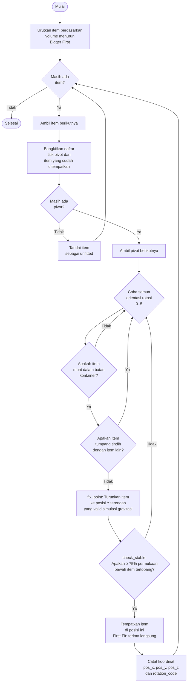
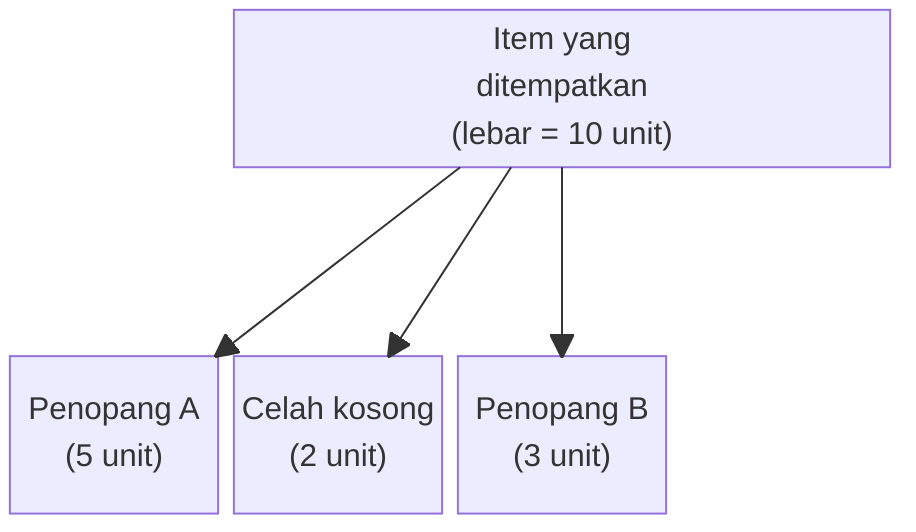

***PLATFORM LOAD* & *STUFFING CALCULATOR* DENGAN ALGORITMA *3D BIN
PACKING* UNTUK OPTIMASI DAN VISUALISASI PEMUATAN**

**LAPORAN PROYEK III**

Diajukan untuk memenuhi kelulusan pada mata kuliah Proyek III

Program Studi DIV Teknik Informatika

{width="4.222064741907261in"
height="1.5416666666666667in"}

Disusun oleh:

MUHAMAD SALADIN EKA SEPTIAN (714230037)

DINA OKTAFIANI (714230047)

**PROGRAM STUDI DIPLOMA IV TEKNIK INFORMATIKA**

**SEKOLAH VOKASI**

**UNIVERSITAS LOGISTIK BISNIS** **INTERNASIONAL**

**BANDUNG**

**2026**[\
]{.mark}

# 

# LEMBAR PENGESAHAN

Laporan Proyek III ini telah diperiksa, disetujui dan disidangkan di\
Bandung, 18 Januari 2026

**Oleh:**

  -----------------------------------------------------------------------
          Penguji Pendamping,                    Penguji Utama,
  ------------------------------------ ----------------------------------
          [Nisa Hanum Harani,            [Roni Andarsyah, S.T., M.Kom.,
   S.Kom.,M.T.,CDSP,SFPC]{.underline}          SFPC]{.underline}

            NIK: 117.89.223                     NIK: 115.88.193

              Pembimbing,                    Koordinator Proyek III

     [Roni Andarsyah, S.T., M.Kom.,       [Roni Habibi, S.Kom., M.T.,
           SFPC]{.underline}                   SFPC,]{.underline}

            NIK: 115.88.193                     NIK: 117.88.233

              Menyetujui,\             
    Ketua Program Studi D-IV Teknik    
              Informatika              

     [Roni Andarsyah, S.T., M.Kom.,    
           SFPC]{.underline}           

            NIK: 115.88.193            
  -----------------------------------------------------------------------

# SURAT PERNYATAAN TIDAK MELAKUKAN PLAGIARISME I

Nama : Muhamad Saladin Eka Septian

NPM : 714230047

Program Studi : DIV Teknik Informatika

Judul : *Platform Load* & *Stuffing Calculator* Dengan Algoritma *3d Bin
Packing* Untuk Optimasi Dan Visualisasi Pemuatan

Menyatakan bahwa :

1.  Proyek pemrograman Sistem Informasi (Proyek 3) saya ini adalah asli
    dan belum pernah diajukan untuk memenuhi kelulusan proyek 3 pada
    program studi DIV Teknik Informatika baik di Universitas Logistik &
    Bisnis Internasional maupun di perguruan tinggi lainnya.

2.  Proyek pemrograman Sistem Informasi (Proyek 3) ini adalah murni
    gagasan, rumusan, dan penelitian saya sendiri tanpa bantuan orang
    lain, kecuali arahan pembimbing.

3.  Dalam proyek pemrograman Sistem Informasi (Proyek 3) ini tidak
    terdapat karya atau pendapat yang telah ditulis ataupun dipublikasi
    orang lain, kecuali secara tertulis dengan jelas dicantumkan sebagai
    acuan dalam naskah dengan disebutkan nama pengarang dan dicantumkan
    dalam daftar pustaka.

4.  Pernyataan ini saya buat dengan sesungguhnya dan apabila dikemudian
    hari terdapat penyimpangan-penyimpangan dan ketidakbenaran dalam
    pernyataan ini, maka saya bersedia menerima sanksi akademik berupa
    pencabutan gelar yang telah diperoleh karena karya ini, sanksi
    lainnya sesuai norma yang berlaku di perguruan tinggi lain.

> Bandung, 8 Januari 2026
>
> Yang membuat pernyataan
>
> Muhamad Saladin Eka Septian
>
> NPM : 714230047

# SURAT PERNYATAAN TIDAK MELAKUKAN PLAGIARISME II

Nama : Dina Oktafiani

NPM : 714230047

Program Studi : DIV Teknik Informatika

Judul : *Platform Load* & *Stuffing Calculator* Dengan Algoritma *3d Bin
Packing* Untuk Optimasi Dan Visualisasi Pemuatan

Menyatakan bahwa :

1.  Proyek pemrograman Sistem Informasi (Proyek 3) saya ini adalah asli
    dan belum pernah diajukan untuk memenuhi kelulusan proyek 3 pada
    program studi DIV Teknik Informatika baik di Universitas Logistik &
    Bisnis Internasional maupun di perguruan tinggi lainnya.

2.  Proyek pemrograman Sistem Informasi (Proyek 3) ini adalah murni
    gagasan, rumusan, dan penelitian saya sendiri tanpa bantuan orang
    lain, kecuali arahan pembimbing.

3.  Dalam proyek pemrograman Sistem Informasi (Proyek 3) ini tidak
    terdapat karya atau pendapat yang telah ditulis ataupun dipublikasi
    orang lain, kecuali secara tertulis dengan jelas dicantumkan sebagai
    acuan dalam naskah dengan disebutkan nama pengarang dan dicantumkan
    dalam daftar pustaka.

4.  Pernyataan ini saya buat dengan sesungguhnya dan apabila dikemudian
    hari terdapat penyimpangan-penyimpangan dan ketidakbenaran dalam
    pernyataan ini, maka saya bersedia menerima sanksi akademik berupa
    pencabutan gelar yang telah diperoleh karena karya ini, sanksi
    lainnya sesuai norma yang berlaku di perguruan tinggi lain.

> Bandung, 8 Januari 2026
>
> Yang membuat pernyataan
>
> Dina Oktafiani
>
> NPM : 714230047

# ABSTRAK

Operasi pemuatan kontainer menghadapi tantangan efisiensi yang persisten
akibat ketergantungan pada pengalaman operator tanpa adanya alat
pendukung keputusan, sementara solusi algoritmik yang ada saat ini
kurang memberikan panduan praktis bagi staf gudang. Penelitian ini
mengembangkan sistem perencanaan pemuatan kontainer berbasis web yang
mengintegrasikan algoritma *3D bin packing* dengan visualisasi
interaktif. Sistem ini menggunakan arsitektur berlapis yang memisahkan
mesin kalkulasi dari *backend* manajemen data, serta visualisasi 3D
berbasis WebGL yang menyediakan panduan pemuatan langkah demi langkah
yang dapat diakses melalui peramban web standar. Evaluasi terhadap lima
skenario barang heterogen (50--300 barang dengan dimensi dan jenis yang
bervariasi) menunjukkan tingkat keberhasilan penempatan yang konsisten
sebesar 100%, dengan utilitas volume mencapai 55,26% pada skenario yang
paling kompleks. Waktu komputasi menunjukkan pertumbuhan kuadratik namun
tetap di bawah 40 detik untuk 300 barang, sehingga cocok untuk operasi
perencanaan *offline*. Perbandingan algoritma mengungkapkan bahwa
strategi pengurutan *Bigger First* menghasilkan utilitas 43% lebih
tinggi dibandingkan *Smaller First*, sementara pemeriksaan stabilitas
hanya menambah beban komputasi sebesar 8%. Hasil penelitian ini
memvalidasi kelayakan sistem *3D bin packing* berbasis web untuk operasi
logistik praktis dan menunjukkan bahwa integrasi visualisasi pemutaran
langkah demi langkah secara efektif menjembatani kesenjangan antara
optimasi algoritmik dan kebutuhan eksekusi fisik di lapangan.

**Kata Kunci**: *3D bin packing*, pemuatan kontainer, optimasi logistik,
algoritma heuristik, visualisasi *web*

# ABSTRACT

*Container loading operations face persistent efficiency challenges due
to reliance on operator experience without decision support tools, while
existing algorithmic solutions lack practical guidance for warehouse
staff. This research develops a web-based container loading planning
system integrating a 3D bin packing algorithm with interactive
visualization. The system employs a layered architecture separating the
calculation engine from the data management backend, with WebGL-based 3D
visualization providing step-by-step loading guidance accessible through
standard web browsers. Evaluation across five heterogeneous item
scenarios (50--300 items with varying dimensions and types) demonstrates
consistent 100% placement success rate with volume utilization reaching
55.26% in the most complex scenario. Computation time exhibits quadratic
growth, remaining under 40 seconds for 300 items, suitable for offline
planning operations. Algorithm comparison reveals the Bigger First
sorting strategy achieves 43% higher utilization than Smaller First,
while stability checking adds only 8% computational overhead. Results
validate the feasibility of web-based 3D bin packing systems for
practical logistics operations and demonstrate that integrating
step-by-step playback visualization effectively bridges the gap between
algorithmic optimization and physical execution requirements.*

***Keywords**: 3D bin packing, container loading, logistics
optimization, heuristic algorithm, web visualization*

# KATA PENGANTAR

Puji syukur kehadirat Tuhan Yang Maha Esa. Atas rahmat dan hidayahnya,
penulis dapat menyelesaikan Proyek III yang berjudul "*Platform Load* &
*Stuffing Calculator* Dengan Algoritma *3d Bin Packing* Untuk Optimasi
Dan Visualisasi Pemuatan" dengan tepat waktu dan tanpa halangan apapun.
Tak lupa shalawat beserta salam tunjukkan kepada Nabi besar Muhammad
SAW.

Penulis menyadari bahwa proyek ini bisa diselesaikan berkat dukungan dan
bantuan dari macam pihak. Penulis mengucapkan terima kasih kepada
seluruh pihak yang sudah membantu pada penyelesaian proyek ini dan dalam
kesempatan ini penulis memberikan ucapan terima kasih pada yang
terhormat:

1.  Bapak Roni Andarsyah, S.T.,M.Kom.,SFPC, selaku Dosen pembimbing
    sekaligus ketua program studi DIV Teknik Informatika.

2.  Bapak Roni Habibi, S.Kom.,M.T., SFPC selaku koordinator proyek 3.

3.  Ibu Nisa Hanum Harani, S.Kom.,M.T.,CDSP,SFPC selaku Dosen penguji
    utama sekaligus pembimbing.

4.  Orang tua yang senantiasa memberikan doa, dukungan moral, dan
    materi.

5.  Teman-teman dan rekan kerja yang turut membantu, baik secara
    langsung maupun tidak langsung, dalam menyelesaikan proyek ini.

Demikian tugas proyek ini disusun, semoga dapat berguna bagi seluruh
pihak dan penulis sendiri. Akhir istilah penulis ucapkan terima kasih.

Bandung, 8 Januari 2026

**\
**

#  DAFTAR ISI 

#  {#section-1 .TOC-Heading}

[LEMBAR PENGESAHAN [2](#section)](#section)

[SURAT PERNYATAAN TIDAK MELAKUKAN PLAGIARISME I
[3](#surat-pernyataan-tidak-melakukan-plagiarisme-i)](#surat-pernyataan-tidak-melakukan-plagiarisme-i)

[SURAT PERNYATAAN TIDAK MELAKUKAN PLAGIARISME II
[4](#surat-pernyataan-tidak-melakukan-plagiarisme-ii)](#surat-pernyataan-tidak-melakukan-plagiarisme-ii)

[ABSTRAK [5](#abstrak)](#abstrak)

[ABSTRACT [6](#abstract)](#abstract)

[KATA PENGANTAR [7](#kata-pengantar)](#kata-pengantar)

[DAFTAR ISI [8](#daftar-isi)](#daftar-isi)

[DAFTAR TABEL [10](#daftar-tabel)](#daftar-tabel)

[DAFTAR GAMBAR [11](#daftar-gambar)](#daftar-gambar)

[BAB I PENDAHULUAN [13](#section-2)](#section-2)

[1.1 Latar Belakang [13](#latar-belakang)](#latar-belakang)

[1.2 Rumusan Masalah [14](#rumusan-masalah)](#rumusan-masalah)

[1.3 Tujuan Penelitian [14](#tujuan-penelitian)](#tujuan-penelitian)

[1.4 Ruang Lingkup [14](#ruang-lingkup)](#ruang-lingkup)

[BAB II LANDASAN TEORI [16](#landasan-teori)](#landasan-teori)

[2.1 Tinjauan Pustaka [16](#tinjauan-pustaka)](#tinjauan-pustaka)

[2.1.1 Manajemen Logistik dan Proses *Stuffing*
[16](#manajemen-logistik-dan-proses-stuffing)](#manajemen-logistik-dan-proses-stuffing)

[2.1.2 *Container Loading Problem* (CLP)
[16](#container-loading-problem-clp)](#container-loading-problem-clp)

[2.1.3 Algoritma *3D Bin Packing*
[17](#algoritma-3d-bin-packing)](#algoritma-3d-bin-packing)

[2.1.4 Konsep *Platform* Berbasis *Web* *dan Software as a Service*
(SaaS)
[17](#konsep-platform-berbasis-web-dan-software-as-a-service-saas)](#konsep-platform-berbasis-web-dan-software-as-a-service-saas)

[2.1.5 Visualisasi *3D* Berbasis *Web*
[18](#visualisasi-3d-berbasis-web)](#visualisasi-3d-berbasis-web)

[2.1.6 *Go* (Golang) [18](#go-golang)](#go-golang)

[2.1.7 REST API [19](#rest-api)](#rest-api)

[2.1.8 *PostgreSQL* [19](#postgresql)](#postgresql)

[2.1.9 *JSON* *Web* Token (JWT)
[20](#json-web-token-jwt)](#json-web-token-jwt)

[2.1.10 *JavaScript* [20](#javascript)](#javascript)

[2.1.11 *Tailwind CSS* [20](#tailwind-css)](#tailwind-css)

[2.2 Sintesis Penelitian Terkait
[21](#sintesis-penelitian-terkait)](#sintesis-penelitian-terkait)

[BAB III ANALISIS & PERANCANGAN
[23](#analisis-perancangan)](#analisis-perancangan)

[3.1 Analisis [23](#analisis)](#analisis)

[3.1.1 Analisis Sistem Berjalan
[23](#analisis-sistem-berjalan)](#analisis-sistem-berjalan)

[3.1.2 Analisis Sistem Usulan
[24](#analisis-sistem-usulan)](#analisis-sistem-usulan)

[3.2 Metode Pengembangan Sistem
[26](#metode-pengembangan-sistem)](#metode-pengembangan-sistem)

[3.2.1 Alur Penelitian [26](#alur-penelitian)](#alur-penelitian)

[3.2.2 *Agile* Model [27](#agile-model)](#agile-model)

[3.3 Analisis Kebutuhan Sistem
[30](#analisis-kebutuhan-sistem)](#analisis-kebutuhan-sistem)

[3.3.1 Kebutuhan Fungsional
[30](#kebutuhan-fungsional)](#kebutuhan-fungsional)

[3.3.2 Kebutuhan Non-Fungsional
[32](#kebutuhan-non-fungsional)](#kebutuhan-non-fungsional)

[3.4 Perancangan Sistem [33](#perancangan-sistem)](#perancangan-sistem)

[3.4.1 Diagram *Use Case* [34](#diagram-use-case)](#diagram-use-case)

[3.4.2 *Activity* *Diagram* [46](#activity-diagram)](#activity-diagram)

[3.4.3 *Sequence* *Diagram* [61](#sequence-diagram)](#sequence-diagram)

[3.4.4 Arsitektur Sistem [82](#arsitektur-sistem)](#arsitektur-sistem)

[3.4.5 *Deployment* Diagram
[84](#deployment-diagram)](#deployment-diagram)

[3.4.6 *Class* *Diagram* [85](#class-diagram)](#class-diagram)

[3.4.7 Perancangan Basis Data
[89](#perancangan-basis-data)](#perancangan-basis-data)

[3.4.8 Algoritma Fungsi [91](#algoritma-fungsi)](#algoritma-fungsi)

[3.4.9 Desain Antarmuka [97](#desain-antarmuka)](#desain-antarmuka)

[BAB IV IMPLEMENTASI & PENGUJIAN
[102](#implementasi-pengujian)](#implementasi-pengujian)

[4.1 Lingkungan Implementasi
[102](#lingkungan-implementasi)](#lingkungan-implementasi)

[4.2 Pembahasan Hasil Implementasi
[102](#pembahasan-hasil-implementasi)](#pembahasan-hasil-implementasi)

[4.3 Dokumentasi API [114](#dokumentasi-api)](#dokumentasi-api)

[4.4 Pengujian sistem [123](#pengujian-sistem)](#pengujian-sistem)

[4.4.1 Skenario Pengujian
[124](#skenario-pengujian)](#skenario-pengujian)

[4.4.2 Hasil Pengujian Performa
[125](#hasil-pengujian-performa)](#hasil-pengujian-performa)

[4.4.3 Perbandingan Varian Algoritma
[127](#perbandingan-varian-algoritma)](#perbandingan-varian-algoritma)

[4.4.4 Cakupan Pengujian [128](#cakupan-pengujian)](#cakupan-pengujian)

[BAB V KESIMPULAN & SARAN [131](#kesimpulan-saran)](#kesimpulan-saran)

[5.1 Kesimpulan [131](#kesimpulan)](#kesimpulan)

[5.2 Saran [132](#saran)](#saran)

[DAFTAR PUSTAKA [133](#section-6)](#section-6)

[LAMPIRAN [136](#section-7)](#section-7)

# DAFTAR TABEL

[Tabel 2. 1 Perbandingan Penelitian Terkait
[21](#_Toc222226554)](#_Toc222226554)

[Tabel 3. 1 Definisi Aktor [34](#_Toc222226555)](#_Toc222226555)

[Tabel 3. 2 Definisi Use Case [35](#_Toc222226556)](#_Toc222226556)

[Tabel 3. 3 Skenario Use case Login
[35](#_Toc222226557)](#_Toc222226557)

[Tabel 3. 4 Skenario Use Case Kelola Data Master
[36](#_Toc222226558)](#_Toc222226558)

[Tabel 3. 5 Skenario Use Case Kelola Profil Kontainer
[37](#_Toc222226559)](#_Toc222226559)

[Tabel 3. 6 Skenario Use Case Kelola Katalog Produk
[37](#_Toc222226560)](#_Toc222226560)

[Tabel 3. 7 Skenario Use Case Kelola Workspace
[38](#_Toc222226561)](#_Toc222226561)

[Tabel 3. 8 Skenario Use Case Kelola Anggota & Undangan
[39](#_Toc222226562)](#_Toc222226562)

[Tabel 3. 9 Skenario Use Case Kelola Role & Permission
[40](#_Toc222226563)](#_Toc222226563)

[Tabel 3. 10 Skenario Use Case Membuat Rencana Pengiriman
[41](#_Toc222226564)](#_Toc222226564)

[Tabel 3. 11 Skenario Use Case Kelola Barang
[42](#_Toc222226565)](#_Toc222226565)

[Tabel 3. 12 Skenario Use Case Kalkulasi Muatan
[42](#_Toc222226566)](#_Toc222226566)

[Tabel 3. 13 Skenario Use Case Lihat Visualisasi 3D
[44](#_Toc222226567)](#_Toc222226567)

[Tabel 3. 14 Skenario Use Case Export PDF
[44](#_Toc222226568)](#_Toc222226568)

[Tabel 3. 15 Skenario Use Case Akses Trial
[45](#_Toc222226569)](#_Toc222226569)

[Tabel 4. 1 Skenario Pengujian dan Komposisi Item
[124](#_Toc222226570)](#_Toc222226570)

[Tabel 4. 2 Spesifikasi Dimensi Kontainer dan Item Pengujian
[124](#_Toc222226571)](#_Toc222226571)

[Tabel 4. 3 Hasil Pengujian Performa Algoritma pada Berbagai Skenario
[125](#_Toc222226572)](#_Toc222226572)

[Tabel 4. 4 Statistik Waktu Komputasi (Computation Time)
[126](#_Toc222226573)](#_Toc222226573)

[Tabel 4. 5 Perbandingan Hasil Pengujian Antar Tipe Kontainer
[127](#_Toc222226576)](#_Toc222226576)

[Tabel 4. 6 Perbandingan Performa Varian Konfigurasi Algoritma
[128](#_Toc222226574)](#_Toc222226574)

[Tabel 4. 7 Rincian Code Coverage Berdasarkan Modul Sistem
[130](#_Toc222226575)](#_Toc222226575)

# DAFTAR GAMBAR

[Gambar 3. 1 Alur Penelitian [26](#_Toc218780631)](#_Toc218780631)

[Gambar 3. 2 Metode Agile [27](#_Toc222226577)](#_Toc222226577)

[Gambar 3. 3 Diagram Use Case [34](#_Toc218780632)](#_Toc218780632)

[Gambar 3. 4 Activity Diagram Login
[47](#Xbff2db88516a2619b5f9a324e190e3e01b44946)](#Xbff2db88516a2619b5f9a324e190e3e01b44946)

[Gambar 3. 5 Activity Diagram Manajemen Container
[48](#X93dc6f13f65cd49718e57d1c2cea6992226f37b)](#X93dc6f13f65cd49718e57d1c2cea6992226f37b)

[Gambar 3. 6 Activity Diagram Manajemen Product
[49](#Xfd2011ad0553e4da1540b1ea7e9b0ef40cb7290)](#Xfd2011ad0553e4da1540b1ea7e9b0ef40cb7290)

[Gambar 3. 7 Activity Diagram Manajemen Workspace
[50](#Xd7c50f652bcba1efb3242e092dc4d6642c2c073)](#Xd7c50f652bcba1efb3242e092dc4d6642c2c073)

[Gambar 3. 8 Activity Diagram Manajemen Member
[51](#X04c9fce783a40f5890188f2041fae9371ed6554)](#X04c9fce783a40f5890188f2041fae9371ed6554)

[Gambar 3. 9 Activity Diagram Manajemen Invite
[52](#X858d5358b5cc501cda0d3ab35ef5345c9d6c4fb)](#X858d5358b5cc501cda0d3ab35ef5345c9d6c4fb)

[Gambar 3. 10 Activity Diagram Manajemen Role
[53](#X4f689a777ad022ba514b7532d9d4b49670aa99e)](#X4f689a777ad022ba514b7532d9d4b49670aa99e)

[Gambar 3. 11 Activity Diagram Manajemen Permission
[54](#X46805f6704ec71c271ab060988a797f27520a51)](#X46805f6704ec71c271ab060988a797f27520a51)

[Gambar 3. 12 Activity Diagram Pembuatan Rencana Muat
[55](#Xe3f6e74301ec1ce6b4f2245172b54ca1325525a)](#Xe3f6e74301ec1ce6b4f2245172b54ca1325525a)

[Gambar 3. 13 Activity Diagram Manajemen Item
[56](#X9dec9c460686c962a1eab28fd2dda9126d74ca4)](#X9dec9c460686c962a1eab28fd2dda9126d74ca4)

[Gambar 3. 14 Activity Diagram Kalkulasi Muatan
[57](#X04dd1e1c01a53a4d24dc4d88320a68fc6c2a817)](#X04dd1e1c01a53a4d24dc4d88320a68fc6c2a817)

[Gambar 3. 15 Activity Diagram Visualisasi 3D
[58](#X2aaa274d32e14fce8d8fd838283d629f6ecc718)](#X2aaa274d32e14fce8d8fd838283d629f6ecc718)

[Gambar 3. 16 Activity Diagram Export PDF
[59](#Xe674bb911eff73000cf6b71a5b6d38e836baaa8)](#Xe674bb911eff73000cf6b71a5b6d38e836baaa8)

[Gambar 3. 17 Activity Diagram Akses Trial
[60](#Xef38bb07579434077b05cb7ed347fad25cc06d1)](#Xef38bb07579434077b05cb7ed347fad25cc06d1)

[Gambar 3. 18 Sequence Diagram Autentikasi dan Konteks Workspace
[62](#X14df47a8d606c3b63ad0587e6d12c83973a3674)](#X14df47a8d606c3b63ad0587e6d12c83973a3674)

[Gambar 3. 19 Sequence Diagram Pembuatan Rencana Muat
[63](#Xd5c7ceb3a1f1b1071633b3f76aa16b3b795515f)](#Xd5c7ceb3a1f1b1071633b3f76aa16b3b795515f)

[Gambar 3. 20 Sequence Diagram Kalkulasi Muatan dan Visualisasi 3D
[64](#Xa1d02f5c426c4e6ae94a10ba8468b8e2f21a2cc)](#Xa1d02f5c426c4e6ae94a10ba8468b8e2f21a2cc)

[Gambar 3. 21 Sequence Diagram Manajemen Container
[66](#Xe4c7e5c7ad93a5821e5fca487ea02fd79a015d3)](#Xe4c7e5c7ad93a5821e5fca487ea02fd79a015d3)

[Gambar 3. 22 Sequence Diagram Manajemen Product
[67](#Xb60cb7783b41cc8d34d5068bbd17b641dd7febd)](#Xb60cb7783b41cc8d34d5068bbd17b641dd7febd)

[Gambar 3. 23 Sequence Diagram Manajemen Workspace
[69](#X40b63950d390a66c2b3bccc20c76f823330565e)](#X40b63950d390a66c2b3bccc20c76f823330565e)

[Gambar 3. 24 Sequence Diagram Manajemen Member
[71](#Xbe76cfaa9e8e600bd187cedfd9f1fcb0bcfbc6c)](#Xbe76cfaa9e8e600bd187cedfd9f1fcb0bcfbc6c)

[Gambar 3. 25 Sequence Diagram Manajemen Invite
[73](#X39946213d965449ae832c4d9058a152b3f3f405)](#X39946213d965449ae832c4d9058a152b3f3f405)

[Gambar 3. 26 Sequence Diagram Manajemen Role
[75](#X3cdbdcf041c05f793a81610ca1142877ccbd063)](#X3cdbdcf041c05f793a81610ca1142877ccbd063)

[Gambar 3. 27 equence Diagram Manajemen Permission
[77](#X6e700b3d8d595ec13c7bdedce065300e31d5eaa)](#X6e700b3d8d595ec13c7bdedce065300e31d5eaa)

[Gambar 3. 28 Sequence Diagram Manajemen Item
[78](#X95826a64b68d192fbd5c08c8d8b632396202378)](#X95826a64b68d192fbd5c08c8d8b632396202378)

[Gambar 3. 29 Sequence Diagram Export PDF
[80](#Xe02cf3897ff06957e2cda33cebab8eb685259c7)](#Xe02cf3897ff06957e2cda33cebab8eb685259c7)

[Gambar 3. 30 Sequence Diagram Akses Trial
[81](#X0f432eb1dccfddefdc90683b1f989b9dc3fcf35)](#X0f432eb1dccfddefdc90683b1f989b9dc3fcf35)

[Gambar 3. 31 Arsitektur Sistem [82](#_Toc222226606)](#_Toc222226606)

[Gambar 3. 32 Diagram Deployment [84](#_Toc222226607)](#_Toc222226607)

[Gambar 3. 33 Class Diagram Entitas Domain
[86](#X6b4f5538ce5e6c886da92edfc09b27a3be9072c)](#X6b4f5538ce5e6c886da92edfc09b27a3be9072c)

[Gambar 3. 34 Class Diagram Lapisan Service
[88](#X80ff573a461b86ba2f92a5c1d50a96a9d4f2322)](#X80ff573a461b86ba2f92a5c1d50a96a9d4f2322)

[Gambar 3. 35 Perancangan Basis Data
[90](#_Toc222226610)](#_Toc222226610)

[Gambar 3. 36 Flowchart Autentikasi
[92](#X262632947934efe255d4e43405748d76714287b)](#X262632947934efe255d4e43405748d76714287b)

[Gambar 3. 37 Flowchart Pembuatan Rencana Muat
[93](#Xd379cc7b1d950ba13c7737c631723b32f68c07d)](#Xd379cc7b1d950ba13c7737c631723b32f68c07d)

[Gambar 3. 38 Flowchart Kalkulasi Packing
[94](#X59da5d621e4d6f316cb6acf5642efe0303f5dc5)](#X59da5d621e4d6f316cb6acf5642efe0303f5dc5)

[Gambar 3. 39 Flowchart Visualisasi 3D
[96](#Xb68d753559c4245826e13481cdf015bec666e8f)](#Xb68d753559c4245826e13481cdf015bec666e8f)

[Gambar 3. 40 Desain Halaman Login
[97](#X6df55c46d1243e633cca6285e68fe5f80f5376a)](#X6df55c46d1243e633cca6285e68fe5f80f5376a)

[Gambar 3. 41 Desain Halaman Dashboard
[98](#X9ba0d6847faef8ef142dbfd20f294535789ef0c)](#X9ba0d6847faef8ef142dbfd20f294535789ef0c)

[Gambar 3. 42 Desain Halaman Manajemen Kontainer
[98](#X6df38a5368afb451257dbdd281f9525ed5dab8a)](#X6df38a5368afb451257dbdd281f9525ed5dab8a)

[Gambar 3. 43 Desain Halaman Manajemen Produk
[99](#X62cb59bba7bb8e2431d3d58000acdd88aa0bc4c)](#X62cb59bba7bb8e2431d3d58000acdd88aa0bc4c)

[Gambar 3. 44 Desain Halaman Daftar Rencana Muat
[100](#Xa1d48974dbd6553103dab0d0c724f351c3fa7b4)](#Xa1d48974dbd6553103dab0d0c724f351c3fa7b4)

[Gambar 3. 45 Desain Formulir Rencana Muat
[100](#X74059b9ded235dd7a6a324acac22ef3f6d67ea1)](#X74059b9ded235dd7a6a324acac22ef3f6d67ea1)

[Gambar 3. 46 Desain Halaman Visualisasi 3D
[101](#Xf673e26c99f48576fbe2bdd339977fb0acbec90)](#Xf673e26c99f48576fbe2bdd339977fb0acbec90)

[Gambar 4. 1 Tampilan Halaman Login
[111](#_Toc222331274)](#_Toc222331274)

[Gambar 4. 2 Tampilan Halaman Register
[112](#_Toc222331275)](#_Toc222331275)

[Gambar 4. 3 Tampilan Halaman Dashboard
[113](#_Toc222331276)](#_Toc222331276)

[Gambar 4. 4 Tampilan Halaman Container Profiles
[114](#_Toc222331277)](#_Toc222331277)

[Gambar 4. 5 Tampilan Halaman Product Catalog
[115](#_Toc222331278)](#_Toc222331278)

[Gambar 4. 6 Tampilan Halaman Create Shipment
[116](#_Toc222331279)](#_Toc222331279)

[Gambar 4. 7 Tampilan Halaman All Shipments
[117](#_Toc222331280)](#_Toc222331280)

[Gambar 4. 8 Tampilan Halaman Visualisasi 3D
[118](#_Toc222331281)](#_Toc222331281)

[Gambar 4. 9 Tampilan Halaman Members
[119](#_Toc222331282)](#_Toc222331282)

[Gambar 4. 10 Tampilan Halaman Invites
[120](#_Toc222331283)](#_Toc222331283)

[Gambar 4. 11 Tampilan Halaman User Management
[121](#_Toc222331284)](#_Toc222331284)

[Gambar 4. 12 Tampilan Halaman Workspaces Management
[122](#_Toc222331285)](#_Toc222331285)

[Gambar 4. 13 Tampilan Halaman Roles
[123](#_Toc222331286)](#_Toc222331286)

[Gambar 4. 14 Tampilan Halaman Permissions
[124](#_Toc222331287)](#_Toc222331287)

[Gambar 4. 15 Endpoint Penerbitan Token Trial
[125](#_Toc222331288)](#_Toc222331288)

[Gambar 4. 16 Endpoint Registrasi Akun Baru
[126](#_Toc222331289)](#_Toc222331289)

[Gambar 4. 17 Endpoint Autentikasi Pengguna
[127](#_Toc222331290)](#_Toc222331290)

[Gambar 4. 18 Endpoint Pembuatan Profil Kontainer
[128](#_Toc222331291)](#_Toc222331291)

[Gambar 4. 19 Endpoint Pengambilan Daftar Kontainer
[129](#_Toc222331292)](#_Toc222331292)

[Gambar 4. 20 Endpoint Pembuatan Data Produk
[130](#_Toc222331293)](#_Toc222331293)

[Gambar 4. 21 Endpoint Pengambilan Katalog Produk
[131](#_Toc222331294)](#_Toc222331294)

[Gambar 4. 22 Endpoint Pembuatan Rencana Pengiriman
[132](#_Toc222331295)](#_Toc222331295)

[Gambar 4. 23 Endpoint Eksekusi Kalkulasi Muatan
[133](#_Toc222331296)](#_Toc222331296)

[Gambar 4. 24 Endpoint Pengambilan Detail Rencana
[134](#_Toc222331297)](#_Toc222331297)

[Gambar 4. 25 Grafik Perbandingan Utilisasi Volume dan Berat per
Skenario [137](#_Toc222331298)](#_Toc222331298)

[Gambar 4. 26 Grafik Skalabilitas Waktu Komputasi Algoritma
[138](#_Toc222331299)](#_Toc222331299)

[Gambar 4. 27 Ringkasan Visual Metrik Performa Algoritma
[139](#_Toc222331300)](#_Toc222331300)

# 

# BAB I PENDAHULUAN

## Latar Belakang

> Dalam era perdagangan global yang semakin kompetitif, efisiensi
> logistik memegang peranan vital dalam menentukan daya saing suatu
> perusahaan\[1\]. Biaya pengiriman, khususnya dalam transportasi laut
> menggunakan kontainer, merupakan salah satu komponen biaya terbesar
> dalam rantai pasok\[2\]. Optimalisasi kapasitas muat kontainer tidak
> hanya berdampak pada pengurangan biaya operasional, tetapi juga
> berkontribusi pada efisiensi logistik maritim secara keseluruhan
> \[3\]. Namun, tantangan utama yang sering dihadapi oleh industri
> logistik adalah ketidakefisienan dalam pemanfaatan ruang kargo, di
> mana seringkali terdapat ruang kosong (*void space*) yang terbuang
> akibat perencanaan pemuatan yang kurang \[4\].
>
> Masalah optimasi pemuatan ini dikenal secara akademis sebagai
> *Container Loading Problem* (CLP). CLP dikategorikan sebagai masalah
> NP*-hard*, yang berarti kompleksitas perhitungan meningkat secara
> eksponensial seiring bertambahnya jumlah barang dengan dimensi yang
> berbeda-beda \[5\]. Metode perencanaan manual yang masih banyak
> diterapkan oleh perusahaan *freight forwarder* atau eksportir
> seringkali mengandalkan intuisi manusia, yang tidak hanya memakan
> waktu lama tetapi juga rentan terhadap *human error* dan jarang
> menghasilkan solusi optimal\[6\]. Ketidakakuratan dalam estimasi
> muatan ini dapat menyebabkan kerugian finansial akibat kelebihan
> kontainer atau kerusakan barang karena penumpukan yang tidak stabil
> \[7\].
>
> Untuk mengatasi permasalahan tersebut, pendekatan algoritmik menjadi
> solusi yang tidak terelakkan. Penerapan algoritma optimasi seperti
> *3D* *Bin Packing* telah terbukti mampu meningkatkan persentase
> pengisian kontainer (*fill rate*) secara signifikan\[8\]. Penggunaan
> algoritma komputasi dalam simulasi packing dapat memberikan solusi
> penataan yang jauh lebih efisien dibandingkan metode manual\[9\].
> Namun, sekadar perhitungan matematis seringkali tidak cukup bagi
> pengguna lapangan mereka membutuhkan representasi visual untuk
> memahami instruksi pemuatan \[10\].
>
> Meskipun berbagai algoritma telah dikembangkan, masih terdapat
> kesenjangan dalam ketersediaan *platform* yang mengintegrasikan
> perhitungan algoritma yang presisi dengan visualisasi interaktif yang
> mudah dipahami, serta fitur manajemen kolaboratif. Berdasarkan
> analisis kebutuhan tersebut, penulis mengembangkan sebuah sistem
> berbasis *web* berjudul \"Platform Load & Stuffing Calculator dengan
> Algoritma 3D Bin Packing untuk Optimasi dan Visualisasi Pemuatan\".
> Sistem ini dirancang menggunakan arsitektur modern yang menggabungkan
> keandalan bahasa pemrograman *Go* dan *Python* untuk pemrosesan data,
> serta *Next.js* untuk antarmuka visualisasi *3D*, guna memberikan
> solusi perencanaan pemuatan yang akurat, visual, dan dapat diakses
> secara *real-time*.

## Rumusan Masalah

> Berdasarkan latar belakang yang telah diuraikan, rumusan masalah dalam
> penelitian ini adalah sebagai berikut:

1.  Bagaimana merancang dan mengimplementasikan algoritma *3D Bin
    Packing* untuk mengoptimalkan penataan barang dalam kontainer guna
    meminimalkan ruang kosong?

2.  Bagaimana membangun sistem visualisasi *3D* interaktif berbasis
    *web* yang dapat menampilkan hasil rencana pemuatan (*stuffing
    plan*) secara detail kepada pengguna?

3.  Bagaimana mengembangkan platform berbasis *Software as a Service*
    (SaaS) yang memungkinkan pengelolaan multi-pengguna
    (*multi-tenancy*), manajemen produk, dan rencana pengiriman secara
    terpusat?

## Tujuan Penelitian

> Berdasarkan rumusan masalah diatas, maka tujuan dalam penelitian ini
> adalah:

1.  Menghasilkan layanan kalkulator pemuatan (*backend service*) yang
    mampu memproses data dimensi produk dan kontainer menggunakan
    algoritma *3D Bin Packing* untuk menghasilkan skema pemuatan yang
    optimal.

2.  Membangun antarmuka pengguna (*frontend*) yang interaktif dengan
    fitur visualisasi *3D*, sehingga pengguna dapat melihat posisi,
    rotasi, dan urutan pemuatan barang di dalam kontainer.

3.  Menyediakan *platform* manajemen logistik yang memiliki fitur
    autentikasi, manajemen ruang kerja (*workspace*), dan peran pengguna
    (*Role-Based Access Control*) untuk mendukung kolaborasi tim dalam
    perencanaan pengiriman.

## Ruang Lingkup

> Agar pembahasan dan pengembangan sistem lebih terarah, penulis
> menetapkan batasan masalah dan ruang lingkup sebagai berikut:

1.  Sistem dibangun sebagai aplikasi *web* yang dapat diakses melalui
    *browser*, sehingga pengguna tidak perlu melakukan instalasi
    perangkat lunak khusus

2.  Fokus utama sistem adalah menghitung susunan barang dalam kontainer
    secara otomatis menggunakan algoritma *3D Bin Packing* dan
    menampilkannya dalam bentuk visualisasi *3D* interaktif.

3.  Pengguna menginputkan data dimensi barang (panjang, lebar, tinggi)
    dan jenis kontainer. Sistem akan menghasilkan output berupa rencana
    pemuatan (*stuffing plan*) dan laporan manifest.

4.  Perhitungan saat ini dibatasi pada barang berbentuk balok atau kubus
    (box) dan menggunakan standar ukuran kontainer umum (20ft, 40ft).

5.  Aplikasi dirancang untuk digunakan oleh admin logistik atau
    *planner* yang bertugas merencanakan pengiriman barang.

# 

#  LANDASAN TEORI

## Tinjauan Pustaka

> Dalam pengembangan sistem ini, kajian literatur dilakukan untuk
> memahami urgensi efisiensi logistik serta pendekatan teknologi yang
> tepat dalam menangani permasalahan pemuatan (*stuffing*). Berikut
> adalah pemaparan teori yang relevan berdasarkan penelitian terdahulu:

### **Manajemen Logistik dan Proses *Stuffing***

> Manajemen logistik modern menuntut efisiensi tinggi dalam setiap
> rantai pasok, terutama pada tahap pemuatan barang (*stuffing*) ke
> dalam kontainer. *Stuffing* didefinisikan sebagai proses fisik
> memindahkan kargo dari area gudang ke dalam kontainer untuk
> pengiriman. Efisiensi dalam proses ini sangat krusial karena biaya
> transportasi laut seringkali dihitung berdasarkan volume kontainer
> yang digunakan, bukan hanya berat barang.
>
> Pemanfaatan teknologi informasi dan sistem manajemen logistik
> terintegrasi merupakan strategi kunci dalam meningkatkan efisiensi
> operasional perusahaan \[11\]. Tanpa adanya bantuan perangkat lunak,
> proses *stuffing* seringkali menghadapi kendala berupa *void space*
> (ruang kosong) yang tidak terpakai secara optimal akibat keterbatasan
> estimasi manual manusia. Sejalan dengan itu, Widodo (2023) dalam
> studinya mengenai analisis proses *stuffing* menekankan bahwa
> perencanaan yang buruk tidak hanya menyebabkan pemborosan ruang,
> tetapi juga berisiko merusak barang selama perjalanan akibat penataan
> yang tidak stabil\[12\]. Oleh karena itu, diperlukan transformasi dari
> perencanaan manual menuju sistem kalkulasi berbasis digital yang mampu
> memberikan simulasi penataan muatan secara presisi.

### ***Container Loading Problem* (CLP)**

> Masalah optimasi pemuatan barang ke dalam kontainer dikenal dalam
> literatur akademis sebagai *Container Loading Problem* (CLP). CLP
> adalah permasalahan geometris tiga dimensi di mana tujuannya adalah
> menempatkan sejumlah kotak (items) berukuran kecil ke dalam wadah
> besar (*container*) sedemikian rupa sehingga total volume yang dimuat
> maksimal atau jumlah kontainer yang digunakan minimal.
>
> Hintsch (2025) mengklasifikasikan CLP sebagai masalah NP*-hard*, yang
> berarti kompleksitas komputasi untuk menemukan solusi paling optimal
> akan meningkat secara eksponensial seiring dengan bertambahnya jumlah
> barang. Dalam skenario dunia nyata, CLP tidak hanya memperhitungkan
> volume, tetapi juga batasan-batasan (*constraints*) fisik\[13\]. Thi
> Xuan Hoa (2024) menjelaskan bahwa orientasi barang (apakah boleh
> dibalik atau tidak) dan stabilitas tumpukan menjadi parameter kritis
> yang harus dihitung oleh sistem agar hasil packing dapat diterapkan
> secara aman di lapangan\[14\].

### **Algoritma *3D Bin Packing***

> Untuk menyelesaikan kompleksitas CLP, metode matematis murni
> seringkali terlalu lambat. Oleh karena itu, pendekatan algoritma
> heuristik atau meta-heuristik seperti *3D Bin Packing* banyak
> digunakan. Algoritma ini bekerja dengan menempatkan barang berdasarkan
> aturan prioritas tertentu (misalnya, barang terbesar masuk lebih dulu)
> dan mencari posisi koordinat (x, y, z) yang paling efisien di dalam
> ruang 3D.
>
> Penelitian oleh Poerwandono dan Fiddin \[15\] menunjukkan bahwa
> implementasi algoritma pada kasus *3D Bin Packing* mampu memberikan
> koordinat penempatan objek yang jauh lebih baik dibandingkan metode
> intuisi manual. Algoritma ini biasanya bekerja dengan langkah-langkah
> berikut:

1.  *Sorting*: Mengurutkan daftar barang berdasarkan volume, luas alas,
    atau dimensi terpanjang.

2.  *Positioning*: Menentukan titik koordinat pojok kiri-bawah-belakang
    (*Deepest Bottom-Left Fill*) yang tersedia untuk menempatkan barang.

3.  *Validation*: Memeriksa apakah penempatan tersebut melanggar batasan
    dimensi kontainer atau tumpang tindih dengan barang lain.

> Dalam konteks pengembangan perangkat lunak, algoritma ini sering
> diimplementasikan menggunakan bahasa pemrograman yang efisien dalam
> perhitungan matematika seperti *Python* atau *Go*, sebagaimana
> diterapkan dalam sistem ini.

> Untuk memahami mengapa pendekatan ini efektif sekaligus memiliki
> batasan tertentu, perlu dipahami terlebih dahulu konsep-konsep
> fundamental yang mendasarinya: *heuristik*, *meta-heuristik*, dan
> strategi *greedy* yang menjadi inti dari cara kerja algoritma ini.

#### **Heuristik dan Meta-Heuristik**

> Dalam literatur optimasi kombinatorial, terdapat dua pendekatan utama
> yang digunakan untuk menyelesaikan masalah NP-*hard* seperti CLP secara
> praktis: *heuristik* dan *meta-heuristik*. Keduanya berbeda secara
> fundamental dalam cara mengeksplorasi ruang solusi.
>
> *Heuristik* adalah strategi berbasis aturan (*rule-based*) yang
> membangun solusi secara langsung dari awal (*constructive*) menggunakan
> sekumpulan keputusan terurut tanpa menjamin optimalitas global. Setiap
> keputusan dibuat berdasarkan kondisi saat itu tanpa mengevaluasi ulang
> keputusan sebelumnya. Karakteristik utama heuristik adalah
> *deterministik*: untuk input yang sama, algoritma selalu menghasilkan
> output yang identik. Hal ini menjadikannya cepat, mudah diprediksi, dan
> cocok untuk kebutuhan perencanaan *offline* di mana konsistensi hasil
> lebih diutamakan daripada eksplorasi alternatif \[15\].
>
> *Meta-heuristik* adalah kerangka kerja tingkat lebih tinggi yang
> mengarahkan dan mengelola satu atau lebih heuristik dengan tujuan
> keluar dari *local optima* — kondisi di mana solusi yang ditemukan
> sudah tidak bisa diperbaiki lagi oleh langkah lokal, meskipun solusi
> global yang lebih baik sebenarnya masih ada. Contoh meta-heuristik
> yang umum digunakan dalam 3D BPP meliputi *Genetic Algorithm* (GA),
> *Simulated Annealing* (SA), dan *Deep Reinforcement Learning* (Deep
> RL) \[28\]\[29\]. Pendekatan ini umumnya menghasilkan solusi yang lebih
> mendekati optimal, namun dengan kompleksitas implementasi dan waktu
> komputasi yang jauh lebih tinggi serta output yang tidak selalu
> deterministik.
>
> Sistem yang dikembangkan dalam penelitian ini menggunakan pendekatan
> **heuristik konstruktif**, bukan meta-heuristik. Pilihan ini didasarkan
> pada kebutuhan sistem untuk menghasilkan output yang konsisten dan dapat
> diprediksi (*deterministic output*) serta waktu respons yang memadai
> untuk operasi perencanaan *offline*.

#### **Pendekatan *Greedy* dalam Algoritma Heuristik**

> Di dalam keluarga algoritma heuristik, salah satu strategi pengambilan
> keputusan yang paling mendasar adalah pendekatan *greedy* (rakus).
> Algoritma *greedy* membuat keputusan yang paling optimal secara lokal
> pada setiap langkah tanpa mengevaluasi ulang keputusan yang telah
> dibuat sebelumnya (*no backtracking*). Dengan kata lain, begitu suatu
> barang ditempatkan pada posisi tertentu, keputusan tersebut bersifat
> final dan tidak dapat dibatalkan demi mencari kombinasi yang mungkin
> lebih baik secara global \[33\].
>
> Dalam konteks 3D Bin Packing, karakteristik *greedy* muncul pada tahap
> *positioning*: untuk setiap barang yang akan ditempatkan, algoritma
> mengevaluasi titik-titik pivot yang tersedia secara berurutan dan
> langsung menerima posisi valid pertama yang ditemukan — tanpa
> membandingkannya dengan posisi valid lain yang mungkin menghasilkan
> pemanfaatan ruang yang lebih baik. Konsekuensi langsung dari sifat
> *greedy* ini adalah algoritma bersifat **deterministik**: untuk
> susunan input yang sama, urutan evaluasi pivot selalu identik sehingga
> output koordinat yang dihasilkan pun selalu sama. Keterbatasan ini
> adalah *trade-off* yang disengaja — sistem mengorbankan kemampuan
> eksplorasi solusi alternatif demi kecepatan komputasi dan konsistensi
> hasil yang dapat diandalkan oleh operator lapangan.

#### ***First-Fit Decreasing* (FFD) — Algoritma yang Digunakan**

> Algoritma yang diimplementasikan dalam sistem ini adalah ***First-Fit
> Decreasing* (FFD)**, sebuah heuristik konstruktif klasik yang
> menggabungkan dua komponen utama. Pertama, komponen **Decreasing**:
> seluruh daftar barang diurutkan berdasarkan volume dari yang terbesar
> ke yang terkecil sebelum proses penempatan dimulai. Strategi ini
> dikenal sebagai *Bigger First* dan bertujuan memastikan barang-barang
> besar yang sulit ditempatkan diproses lebih awal ketika ruang kosong
> masih banyak tersedia, sehingga menghasilkan utilisasi volume yang
> lebih tinggi. Kedua, komponen **First-Fit**: untuk setiap barang,
> algoritma menerima posisi valid *pertama* yang ditemukan tanpa
> membandingkan dengan kandidat posisi lain — inilah karakteristik
> *greedy* yang dijelaskan pada subbab sebelumnya.
>
> FFD berbeda dari variannya *Best-Fit Decreasing* (BFD) yang
> mengevaluasi *semua* posisi valid dan memilih posisi yang menyisakan
> ruang paling sedikit (*tightest fit*). BFD menghasilkan utilisasi yang
> lebih baik tetapi membutuhkan waktu komputasi lebih tinggi karena harus
> membandingkan seluruh kandidat posisi. Dibandingkan dengan pendekatan
> meta-heuristik seperti *Genetic Algorithm*, FFD tidak mampu keluar dari
> *local optima*, namun memiliki kompleksitas waktu yang jauh lebih
> rendah dan output yang sepenuhnya deterministik \[13\].

Berikut adalah diagram alur algoritma FFD yang diimplementasikan dalam sistem:

> **Catatan**: Diagram di atas menunjukkan bahwa segera setelah posisi
> valid ditemukan (node "Tempatkan item"), algoritma langsung melanjutkan
> ke item berikutnya tanpa mengevaluasi pivot-pivot yang tersisa. Inilah
> yang membedakan FFD dari BFD maupun meta-heuristik.

#### **Mekanisme Gravitasi dan Stabilitas**

> Implementasi FFD dalam sistem ini diperkaya dengan dua mekanisme
> tambahan yang memastikan hasil kalkulasi dapat diterapkan secara fisik
> di lapangan, tidak hanya valid secara geometris.
>
> Mekanisme pertama adalah **simulasi gravitasi** (*fix_point*). Setelah
> algoritma menemukan posisi pivot yang valid untuk suatu barang, posisi
> tersebut tidak langsung digunakan sebagai posisi final. Sistem
> menurunkan item tersebut secara vertikal ke koordinat Y terendah yang
> masih valid — yaitu posisi di mana item bertumpu pada lantai kontainer
> atau permukaan atas item lain di bawahnya. Mekanisme ini memastikan
> tidak ada barang yang "melayang" di udara dalam hasil visualisasi,
> sehingga instruksi pemuatan yang dihasilkan mencerminkan kondisi fisik
> yang nyata.
>
> Mekanisme kedua adalah **pemeriksaan stabilitas** (*check_stable*).
> Sebuah penempatan dinyatakan stabil apabila setidaknya **75%** dari
> luas permukaan bawah item tertopang oleh lantai kontainer atau
> permukaan atas item lain di bawahnya (*support surface ratio* ≥ 0,75).
> Penempatan yang tidak memenuhi ambang batas ini ditolak dan algoritma
> mencoba orientasi atau pivot berikutnya. Nilai rasio 75% dipilih sebagai
> keseimbangan antara kelayakan fisik dan fleksibilitas penempatan —
> mensyaratkan 100% akan terlalu restriktif untuk barang dengan ukuran
> tidak seragam, sementara nilai yang terlalu rendah berisiko menghasilkan
> susunan yang tidak stabil selama pengiriman.

Ilustrasi konsep *support surface ratio* ditunjukkan pada diagram berikut:

> Pada ilustrasi di atas, item selebar 10 unit ditopang oleh dua item di
> bawahnya dengan total lebar penopang 5 + 3 = 8 unit, sehingga *support
> surface ratio* = 8/10 = **80% ≥ 75%** → penempatan **diterima**.
> Apabila celah kosong lebih besar sehingga rasio turun di bawah 75%,
> penempatan **ditolak** dan algoritma mencoba orientasi atau pivot lain.
> Kombinasi simulasi gravitasi dan pemeriksaan stabilitas inilah yang
> menjadikan output sistem bukan sekadar solusi matematis, melainkan
> panduan pemuatan yang dapat dieksekusi secara fisik oleh operator
> gudang.

### **Konsep *Platform* Berbasis *Web* *dan Software as a Service* (SaaS)**

> Aplikasi berbasis *web* didefinisikan sebagai sistem perangkat lunak
> yang diakses melalui jaringan, baik internet maupun intranet, dengan
> menggunakan peramban *web* (*web browser*). Menurut Pressman (2020),
> model ini mengeliminasi ketergantungan instalasi perangkat lunak pada
> sisi klien (*client-side*), yang memberikan keunggulan berupa
> aksesibilitas lintas *platform* (*cross-platform*) serta kemudahan
> dalam pemeliharaan sistem secara terpusat\[16\].
>
> Dalam perkembangannya, arsitektur web modern sering diintegrasikan
> dengan model distribusi *Software as a Service* (SaaS). SaaS merupakan
> model implementasi *cloud computing* di mana aplikasi di-*hosting*
> oleh penyedia layanan dan diakses oleh pengguna melalui internet, yang
> memungkinkan pengelolaan data terpusat dan kemudahan akses informasi
> tanpa kendala infrastruktur fisik yang rumit \[17\]. Salah satu
> karakteristik fundamental dari arsitektur ini adalah *multi-tenancy*,
> yaitu kemampuan satu instansi perangkat lunak untuk melayani banyak
> penyewa atau organisasi secara simultan dengan isolasi data yang aman
> \[17\]. Penerapan model SaaS memungkinkan efisiensi sumber daya
> komputasi yang signifikan serta memfasilitasi kolaborasi jarak jauh
> tanpa memerlukan pengadaan server fisik secara mandiri oleh setiap
> organisasi.

### **Visualisasi *3D* Berbasis *Web***

> Hasil perhitungan algoritma yang berupa sekumpulan data koordinat
> angka sulit dipahami oleh operator lapangan. Oleh karena itu,
> visualisasi data menjadi jembatan penting antara sistem komputasi dan
> pengguna manusia. Perkembangan teknologi *web* modern memungkinkan
> *rendering* grafis *3D* dilakukan langsung di dalam peramban (browser)
> tanpa perlu menginstal aplikasi desktop berat.
>
> Kartiko dan Primandari \[18\] mencatat bahwa penggunaan media visual
> interaktif dalam pengenalan peti kemas logistik sangat efektif dalam
> meningkatkan pemahaman pengguna. Dalam pengembangan aplikasi *web*,
> teknologi seperti *WebGL* dan pustaka *Three.js* memungkinkan
> pembuatan \"Digital Twin\" dari kontainer dan barang. Dengan
> visualisasi ini, pengguna dapat memutar, memperbesar (zoom), dan
> melihat lapisan demi lapisan (*layer-by-layer*) rencana pemuatan
> barang sebelum eksekusi fisik dilakukan, sehingga meminimalisir
> kesalahan bongkar-muat di lapangan.

### ***Go* (Golang)**

> Golang adalah bahasa pemrograman sistem yang dikompilasi (*compiled*)
> dan dirancang untuk menangani beban kerja server yang tinggi. Menurut
> penelitian oleh Muharam dan Hidayat (2024), Golang menawarkan
> keunggulan signifikan dalam hal efisiensi memori dan kecepatan
> eksekusi dibandingkan bahasa berbasis interpreter, berkat dukungannya
> terhadap konkurensi melalui fitur *goroutine*\[19\].
>
> Dalam pengembangan sistem *Load & Stuffing Calculator* ini, pemilihan
> Golang didasarkan pada kebutuhan untuk melakukan perhitungan algoritma
> muatan yang kompleks dengan performa tinggi. Sebagaimana dijelaskan
> oleh Fernando dan Engel (2025), arsitektur Golang sangat efektif dalam
> menangani ribuan koneksi simultan dengan latensi rendah, yang
> merupakan syarat utama agar hasil simulasi *stuffing* dapat
> ditampilkan secara instan kepada pengguna tanpa waktu tunggu yang
> lama\[20\].

### **REST API**

> *Representational State Transfer* (REST) API merupakan standar
> arsitektur komunikasi data yang menggunakan protokol HTTP untuk
> pertukaran informasi antar sistem. Simbulan dan Aryanto (2024)
> menyatakan bahwa penerapan REST API memungkinkan integrasi sistem yang
> fleksibel dan skalabel karena sifatnya yang *stateless*, di mana
> server tidak perlu menyimpan status sesi dari klien, sehingga beban
> server menjadi lebih ringan\[21\].
>
> Pada proyek ini, REST API berfungsi sebagai jembatan penghubung antara
> antarmuka pengguna (*frontend*) berbasis *web* dengan logika
> pemrosesan di server (*backend*). Penggunaan format data JSON yang
> ringan dalam arsitektur ini, menurut Farhandika *et al*. (2024),
> terbukti meningkatkan efisiensi *bandwidth* dan mempercepat waktu
> respons aplikasi, yang sangat krusial untuk menyajikan data kalkulasi
> muatan secara akurat dan cepat kepada admin operasional\[22\].

### ***PostgreSQL***

> *PostgreSQL* adalah sistem manajemen basis data relasional (RDBMS)
> *open-source* yang dikenal memiliki keandalan tinggi dan fitur yang
> mendukung integritas data kompleks. Berdasarkan analisis performa
> terbaru yang dilakukan oleh Salunke dan Ouda (2024), *PostgreSQL*
> terbukti lebih unggul dalam menangani kueri yang kompleks dan
> konkurensi (banyak akses bersamaan) dibandingkan basis data relasional
> lainnya, serta menjamin keamanan data melalui kepatuhan terhadap
> standar ACID (*Atomicity, Consistency, Isolation, Durability*)\[23\].
>
> Relevansi *PostgreSQL* dalam sistem *Load & Stuffing Calculator* ini
> terletak pada kemampuannya menjaga konsistensi data profil kontainer
> dan spesifikasi barang. Selain itu, fitur penyimpanan tipe data
> *JSONB* pada *PostgreSQL* memungkinkan fleksibilitas skema data, yang
> menurut studi Han dan Choi (2024) sangat berguna untuk menyimpan
> riwayat hasil simulasi *stuffing* dan *manifest* muatan yang memiliki
> struktur bervariasi, tanpa mengorbankan kecepatan performa pencarian
> data saat dibutuhkan kembali oleh admin\[24\].

### ***JSON* *Web* Token (JWT)** 

> JSON *Web* Token (JWT) adalah standar otentikasi berbasis token yang
> dirancang untuk mengamankan pertukaran informasi antar pihak secara
> ringkas. Dalimunthe *et al*. menjelaskan bahwa penggunaan *JWT* dengan
> algoritma enkripsi *HMAC-SHA256* memberikan mekanisme keamanan yang
> kuat karena setiap token ditandatangani secara digital, sehingga
> integritas data pengguna terjamin dan terhindar dari manipulasi pihak
> yang tidak berwenang\[25\].
>
> Implementasi *JWT* dalam proyek ini mendukung sistem keamanan
> *stateless* yang efisien. Dengan mekanisme ini, otorisasi hak akses
> antara peran Admin, *Planner*, dan Operator dapat dikelola langsung
> melalui *payload* token, sehingga mempermudah pengelolaan akses pada
> arsitektur terdistribusi tanpa membebani basis data untuk pengecekan
> sesi berulang kali.

### ***JavaScript***

> *JavaScript* merupakan bahasa pemrograman utama di sisi klien yang
> memungkinkan interaktivitas tinggi pada aplikasi berbasis *web*.
> Perkembangan teknologi *web* modern menempatkan JavaScript sebagai
> fondasi dalam pembangunan *Single Page Application* (SPA). Menurut
> Bismoputro *et al.* (2017), penggunaan *JavaScript* modern
> memungkinkan aplikasi *web* memiliki responsivitas setara aplikasi
> desktop, di mana pembaruan konten dilakukan secara dinamis tanpa perlu
> memuat ulang seluruh halaman\[26\].
>
> Dalam konteks sistem visualisasi muatan, *JavaScript* berperan vital
> untuk merender simulasi *3D* susunan barang di dalam kontainer secara
> interaktif. Teknologi ini memungkinkan *Planner* untuk memutar sudut
> pandang dan memverifikasi posisi barang secara visual langsung melalui
> peramban, serta menerima notifikasi status validasi sensor secara
> real-time.

### ***Tailwind CSS***

> *Tailwind CSS* adalah kerangka kerja *CSS* yang mengusung konsep
> *utility-first*, yang menyediakan kelas-kelas utilitas tingkat rendah
> untuk membangun antarmuka pengguna dengan cepat. Penelitian oleh
> Azhariyah dan Mukhlis (2023) menunjukkan bahwa pendekatan ini secara
> signifikan mempercepat proses pengembangan *frontend* dan menghasilkan
> kode *CSS* yang lebih ringkas dibandingkan metode *CSS* tradisional,
> sekaligus menjamin konsistensi desain di seluruh aplikasi\[27\].
>
> Penerapan *Tailwind* *CSS* dalam proyek ini bertujuan untuk memastikan
> antarmuka pengguna, terutama pada modul Operator, bersifat responsif
> (*mobile-friendly*) dan mudah digunakan. Dengan pendekatan ini,
> penyesuaian tampilan instruksi muat pada berbagai ukuran layar
> perangkat operator dapat dilakukan dengan efisien dan konsisten.

## Sintesis Penelitian Terkait

> Berbagai penelitian telah mengeksplorasi *Container Loading Problem*
> (CLP) dan *3D Bin Packing Problem* melalui pendekatan algoritma
> optimasi, *machine learning*, serta metode heuristik.
> Penelitian-penelitian tersebut berkontribusi dalam meningkatkan
> efisiensi pemanfaatan ruang kontainer dan mempercepat proses
> komputasi. Namun, masih terdapat kesenjangan dalam hal integrasi
> sistem berbasis web yang menyediakan panduan *step-by-step* untuk
> operator lapangan. Tabel 2.1 merangkum perbandingan penelitian terkait
> yang menjadi landasan pengembangan sistem ini.

[]{#_Toc222226554 .anchor}Tabel 2. Perbandingan Penelitian Terkait

  -------------------------------------------------------------------------
  Penelitian    Pendekatan         Kelebihan           Keterbatasan
  ------------- ------------------ ------------------- --------------------
  Ma et         *Hybrid            Optimasi placement  Waktu komputasi
  al. \[28\]    Block-Building*    untuk *cargo* yang  tinggi sehingga
                dengan *Genetic    sangat *heterogen*  tidak cocok untuk
                Algorithm*         dengan hasil        kebutuhan interaksi
                                   mendekati optimal   *real-time* di
                                                       lapangan

  Ananno et     *Multi-Heuristic   Sangat baik dalam   Waktu komputasi
  al. (2024)    Algorithm* untuk   menangani           cenderung lama untuk
  \[29\]        multi-container    *constraint* berat, skenario interaktif
                dengan             volume, dan         yang membutuhkan
                *constraint* dunia stabilitas secara   respons cepat
                nyata              simultan            

  Zhang et      GAN-*based*        Menghasilkan solusi Kompleksitas model
  al. (2024)\   *Genetic           dengan kualitas     tinggi, memerlukan
  \[30\]        Algorithm* untuk   tinggi melalui      data *training* yang
                *3D bin packing*   kombinasi           besar dan waktu
                                   *generative* model  pelatihan yang lama
                                   dan evolusi genetik 

  Shokhikha &   *Deep              Mampu belajar dari  Membutuhkan
  Jumyung\      Reinforcement      simulasi dan        *environment* setup
  \[8\]         Learning* dalam    mengadaptasi        kompleks dan belum
                lingkungan virtual strategi *packing*  teruji pada skenario
                logistik           secara otomatis     produksi skala besar

  Wong et al.   Integrasi          Menggabungkan       *Overhead* komputasi
  (2024) \[31\] *heuristic         kecepatan           untuk *training* dan
                methods* dengan    *heuristic* dengan  *inference* masih
                *Deep              adaptabilitas       menjadi tantangan
                Reinforcement      *machine learning*  implementasi
                Learning*          untuk *online       
                                   optimization*       

  Zhao et       *Learning          Fokus pada          Masih memerlukan
  al. (2022)    practically        kebijakan yang      *fine-tuning* untuk
  \[32\]        feasible policies* dapat diterapkan    berbagai jenis
                untuk online *3D   secara praktis      kontainer dan produk
                bin packing*       dalam operasi       
                                   *real-time*         

  Giulia et al. *Layer-building    Pendekatan          Hasil optimasi tidak
  (2024) \[33\] matheuristics*     deterministik       sefleksibel metode
                untuk automasi     dengan kompleksitas *evolutionary* untuk
                *bin packing*      rendah, cocok untuk kasus sangat
                                   logistik            heterogen
                                   *cost-effective*    

  Poerwandono   Visualisasi 3D     Visualisasi *3D*    Hanya menampilkan
  et            berbasis web       dapat diakses       hasil akhir secara
  al. (2023)\   menggunakan        melalui *browser*   statis, tidak
  \[34\]        *Three.js* untuk   tanpa instalasi     menyediakan panduan
                hasil *packing*    *software* khusus   *step-by-step* untuk
                                                       proses *loading*
  -------------------------------------------------------------------------

> Berdasarkan tinjauan di atas, penelitian ini mengisi gap dengan
> mengembangkan sistem berbasis web yang tidak hanya mengoptimasi
> *placement* tetapi juga menyediakan visualisasi 3D interaktif dengan
> panduan *step-by-step* untuk operator gudang, mengintegrasikan
> algoritma packing dengan workflow operasional.

**\
**

# 

#  ANALISIS & PERANCANGAN

## Analisis

> Tahap analisis merupakan tahap penelitian dengan melakukan suatu
> percobaan yang menghasilkan kesimpulan dari penguraian suatu sistem
> aplikasi, sehingga dapat diketahui mekanisme sistem, masalah-masalah
> yang terjadi. Dari proses penelitian tersebut, dapat diusulkan
> perbaikan-perbaikan yang dapat membangun dan mempertinggi sistem
> kinerja alat yang akan dibuat. Analisis sistem yang akan dibangun
> disesuaikan dengan kebutuhan, berdasarkan hasil evaluasi terhadap
> sistem yang sedang berjalan.

### **Analisis Sistem Berjalan**

> Berdasarkan hasil pengamatan terhadap proses manajemen muatan logistik
> yang berjalan saat ini, ditemukan bahwa sebagian besar perusahaan
> logistik masih mengandalkan metode manual dalam merencanakan pemuatan
> kontainer. Belum adanya sistem perencanaan digital yang dilengkapi
> dengan algoritma optimasi dan visualisasi *3D* menyebabkan utilisasi
> ruang kontainer tidak maksimal dan proses perencanaan memakan waktu
> lama. Secara garis besar, prosedur sistem yang sedang berjalan dapat
> diuraikan sebagai berikut:

1.  **Perancangan Muatan**

> Perencanaan penyusunan barang ke dalam kontainer dilakukan oleh
> *Planner* berdasarkan intuisi atau estimasi kasar menggunakan
> perhitungan sederhana. Tidak adanya visualisasi *3D* dan algoritma
> optimasi menyebabkan sering terjadinya ruang kosong di dalam kontainer
> yang seharusnya bisa dimanfaatkan. Selain itu, perhitungan manual
> sulit untuk mengantisipasi batasan teknis seperti keseimbangan berat,
> urutan tumpukan, dan stabilitas muatan.

2.  **Eksekusi Pemuatan**

> Pada tahap eksekusi, instruksi muat yang diberikan kepada operator
> lapangan seringkali hanya berupa daftar barang tanpa panduan posisi
> yang spesifik. Tidak adanya visualisasi *3D* atau panduan
> langkah-demi-langkah menyebabkan operator harus mengandalkan
> pengalaman pribadi dalam menata barang, yang dapat menghasilkan
> susunan yang berbeda dari rencana awal dan berpotensi tidak optimal.

3.  **Pelaporan dan Arsip**

> Data riwayat pengiriman tersimpan dalam file-file terpisah yang tidak
> terhubung dengan data master barang. Jika terjadi perubahan
> spesifikasi barang di kemudian hari, sulit untuk melacak data historis
> pengiriman yang akurat karena tidak adanya mekanisme snapshot data
> yang sistematis. Hal ini dapat menimbulkan inkonsistensi data dalam
> laporan historis.

### **Analisis Sistem Usulan**

> Untuk mengatasi permasalahan yang telah diuraikan pada analisis sistem
> berjalan, peneliti mengembangkan *platform* *web* \"Load & Stuffing
> Calculator\" yang dilengkapi algoritma optimasi *3D Bin Packing* dan
> visualisasi interaktif. Solusi yang ditawarkan dalam sistem usulan ini
> mencakup lima aspek utama:

1.  ***Platform* Berbasis *Web* dengan Arsitektur Multi-Tenant**

> Sistem dibangun sebagai aplikasi *web* yang dapat diakses melalui
> browser tanpa memerlukan instalasi perangkat lunak khusus. Sistem
> mendukung arsitektur multi-tenant yang memungkinkan *multiple*
> organisasi atau perusahaan menggunakan *platform* yang sama dengan
> data yang terisolasi secara logis. Setiap *workspace* memiliki katalog
> produk, profil kontainer, dan rencana pengiriman yang independen.
> Arsitektur ini mendukung *deployment* sebagai *Software-as-a-Service*
> (SaaS) dengan pengelolaan hak akses berbasis *role* (*Role-Based
> Access Control*) yang granular.

2.  **Algoritma Optimasi *3D Bin Packing* dengan Pertimbangan Batasan
    Fisik**

> Berbeda dengan perencanaan manual yang mengandalkan intuisi, sistem
> dilengkapi dengan mesin kalkulasi yang menerapkan algoritma *3D Bin
> Packing*. Algoritma yang digunakan merupakan pengembangan dari
> *library py3dbp* yang telah ditingkatkan dengan kemampuan
> memperhitungkan gravitasi, verifikasi stabilitas muatan, dan
> perhitungan rasio permukaan penyangga. Sistem mampu menghitung susunan
> barang yang paling optimal dengan mempertimbangkan batasan fisik
> seperti dimensi kontainer, berat maksimum, keseimbangan distribusi
> berat, dan stabilitas tumpukan. Implementasi dilakukan menggunakan
> layanan terpisah yang memungkinkan skalabilitas dan pemilihan
> algoritma yang optimal.

3.  **Visualisasi *3D* Interaktif dan Panduan Pemuatan**

> Hasil perhitungan algoritma disajikan dalam bentuk visualisasi *3D*
> interaktif menggunakan teknologi Three.js yang memungkinkan *Planner*
> untuk melihat simulasi posisi barang secara *real-time*. Visualisasi
> dilengkapi dengan fitur *step-by-step playback* yang menampilkan
> urutan pemuatan barang secara bertahap, sehingga operator lapangan
> dapat memahami *sequence* yang optimal. Sistem juga menyediakan fitur
> *export* ke format PDF yang berisi instruksi pemuatan lengkap dengan
> *snapshot* *3D* untuk setiap langkah, koordinat posisi, dan informasi
> detail barang. Dokumen ini dapat dicetak dan digunakan sebagai panduan
> di lapangan.

4.  **Manajemen Data Master dan Katalog Produk**

> Sistem menyediakan fitur manajemen data master yang komprehensif,
> mencakup katalog produk (dimensi, berat, warna visualisasi, opsi
> rotasi) dan profil kontainer standar (dimensi internal, kapasitas
> berat maksimum). Data master ini dapat digunakan berulang kali untuk
> mempercepat proses perencanaan pengiriman. Sistem mendukung input data
> secara manual melalui *form* yang tervalidasi, memastikan konsistensi
> dan akurasi data yang tersimpan dalam database.

5.  **Integritas Data Historis dengan *Snapshot Pattern***

> Sistem menerapkan design pattern Snapshot Data, di mana setiap detail
> barang dan spesifikasi kontainer yang masuk ke dalam rencana
> pengiriman akan diduplikasi dari data master pada saat pembuatan
> rencana. Hal ini menjamin bahwa data riwayat pengiriman tetap akurat
> dan tidak terpengaruh jika terjadi perubahan spesifikasi pada data
> master di masa mendatang. Mekanisme ini sangat penting untuk menjaga
> integritas laporan historis dan audit *trail*, memastikan bahwa
> dokumentasi pengiriman yang telah dilakukan tidak mengalami distorsi
> akibat perubahan data master.
>
> Dengan penerapan sistem usulan ini, diharapkan proses perencanaan
> muatan menjadi lebih akurat dan efisien, utilisasi ruang kontainer
> dapat dimaksimalkan melalui algoritma optimasi, dan dokumentasi
> pengiriman terjaga integritasnya untuk keperluan analisis dan
> pelaporan di masa mendatang.

## Metode Pengembangan Sistem

> Metode pengembangan sistem merupakan kerangka kerja yang digunakan
> untuk menyusun, merancang, dan mengendalikan proses pembuatan sistem
> informasi agar sesuai dengan target yang diharapkan. Dalam penelitian
> ini, penulis menerapkan pendekatan yang terstruktur untuk membangun
> *platform Load* & *Stuffing Calculator*, mulai dari pemahaman masalah
> di lapangan hingga implementasi teknis. Metode yang digunakan mencakup
> tahapan pengumpulan data, analisis kebutuhan sistem, serta penggunaan
> model pengembangan perangkat lunak yang adaptif untuk memastikan
> algoritma optimasi dan fitur visualisasi dapat berjalan dengan akurat
> dan efisien

### **Alur Penelitian**

> Untuk memastikan pengembangan sistem berjalan sistematis dan terarah,
> penulis merancang alur penelitian yang terdiri dari tiga tahapan
> utama: Pengumpulan Data (Data *Collection*), Analisis (*Analysis*),
> dan Pengembangan Sistem (*Agile Model*). Alur penelitian ini
> digambarkan pada gambar berikut:

{width="3.584613954505687in"
height="4.990964566929134in"}

[]{#_Toc218780631 .anchor}Gambar 3. Alur Penelitian

> Tahapan penelitian dijelaskan sebagai berikut:

1.  Pengumpulan data (Data *Collection*): Tahap ini merupakan langkah
    awal penelitian yang bertujuan untuk mengidentifikasi permasalahan
    pada sistem manual yang sedang berjalan serta merumuskan kebutuhan
    sistem yang akan dibangun

2.  Analisis (*System Analysis*): Data yang terkumpul dianalisis untuk
    merumuskan solusi.

3.  Tahap *Agile*: Model Ini adalah fase utama pembuatan perangkat lunak
    dan keras. Proses ini dilakukan secara berulang mulai dari *System
    Planning* hingga *Feedback Review*.

### ***Agile* Model**

{width="3.3037959317585304in"
height="2.853312554680665in"}

[]{#_Toc222226577 .anchor}Gambar 3. Metode Agile

> Metode *Agile* \[35\] adalah pendekatan pengembangan perangkat lunak
> yang fleksibel dan iteratif, di mana produk dikembangkan dalam siklus
> pendek yang disebut sprint. Setiap sprint berfokus pada pembuatan
> fitur tertentu, memungkinkan tim untuk menyesuaikan pengembangan
> dengan perubahan kebutuhan pengguna dan *stakeholder*. Dengan
> pendekatan ini, pengembang dapat bekerja lebih efektif dalam menangani
> proyek yang kompleks, menghindari masalah perencanaan jangka panjang
> yang kaku, serta memastikan bahwa produk akhir benar-benar sesuai
> dengan kebutuhan operasional logistik.
>
> Dalam pengembangan sistem perencanaan muatan ini, *Agile* memberikan
> fleksibilitas yang memungkinkan perubahan pada algoritma atau
> arsitektur sistem dilakukan dengan cepat tanpa mengganggu keseluruhan
> proyek. Tim bekerja dalam siklus pendek yang memungkinkan evaluasi dan
> perbaikan terus-menerus, menjadikan hasil pengembangan lebih optimal
> dan relevan bagi *Planner* maupun Operator di lapangan. Pendekatan ini
> juga meningkatkan komunikasi dalam tim, memastikan bahwa setiap aspek
> dari kalkulasi muatan hingga visualisasi *3D* dipahami dengan jelas.

1.  ***Requirements***

> Tahap pertama adalah menentukan kebutuhan pengguna dan merancang
> *Product Backlog*, yaitu daftar fitur yang akan dikembangkan dalam
> beberapa *sprint* ke depan. Dengan pendekatan ini, kebutuhan
> operasional dapat disesuaikan secara berkala, memungkinkan tim untuk
> fokus pada fitur-fitur krusial terlebih dahulu.
>
> Dalam proyek ini, fitur-fitur utama yang diidentifikasi meliputi
> Sistem Autentikasi dan Manajemen Pengguna (RBAC), Manajemen Master
> Data (Kontainer & Produk), Algoritma *3D Bin Packing* dengan
> Pertimbangan Batasan Fisik, Visualisasi *3D* Interaktif, Arsitektur
> Multi-*Tenant* untuk isolasi data antar organisasi, serta fitur
> *Export* PDF untuk panduan pemuatan. Semua fitur ini dirancang
> berdasarkan observasi masalah di operasional logistik dan studi
> literatur yang mendukung implementasi algoritma optimasi ruang
> kontainer.

2.  ***Design***

> Setelah kebutuhan dikumpulkan, tim melakukan perancangan sistem yang
> mencakup arsitektur perangkat lunak, skema *database*, serta alur
> pengguna. Semua aspek ini dirancang untuk memastikan bahwa sistem
> berjalan dengan efisien, aman, dan mudah digunakan. Tahapan ini
> melibatkan pembuatan *Use Case Diagram*, *Activity Diagram*, *Entity
> Relationship Diagram*, serta System *Architecture* yang menggambarkan
> komunikasi data antara *frontend*, *backend* *API*, layanan kalkulasi,
> dan *database*. Arsitektur dirancang dengan pemisahan layanan
> (*backend* *Go*, layanan kalkulasi *Python*, *frontend* *Next.js*)
> untuk memungkinkan skalabilitas dan pemeliharaan yang lebih baik.
>
> Desain basis data dilakukan dengan memperhatikan aturan bisnis khusus
> seperti *Snapshot Pattern* untuk memastikan integritas data historis
> pengiriman. Perancangan antarmuka juga dilakukan, meliputi *dashboard*
> perencanaan berbasis *web* untuk Admin/*Planner* dan tampilan
> visualisasi *3D* yang interaktif untuk memahami hasil kalkulasi
> pemuatan.

3.  ***Development***

> Pengembangan sistem dilakukan dalam beberapa *sprint* dengan
> masing-masing *sprint* berfokus pada modul tertentu. Pendekatan ini
> memungkinkan tim untuk membangun, menguji, dan memperbaiki fitur
> secara berkala. Pengembangan dimulai dari *setup environment* dan
> *database* menggunakan *PostgreSQL*, kemudian berlanjut ke
> implementasi *backend API* menggunakan *Go* dengan *framework Gin*,
> integrasi layanan kalkulasi terpisah menggunakan *Python* untuk
> algoritma *3D Bin Packing*, pengembangan *frontend* dengan *Next.js*
> dan TypeScript, implementasi visualisasi *3D* menggunakan *Three.js*,
> hingga akhirnya penyempurnaan fitur multi-*tenancy* dan sistem
> autentikasi berbasis JWT.
>
> Teknologi yang digunakan mencakup Go untuk REST API *backend*, Python
> dengan *library py3dbp* untuk layanan kalkulasi, *Next.js* untuk *web
> frontend*, *PostgreSQL* untuk *database*, dan *Docker* untuk
> *containerization* dan *deployment*. Semua komponen dikembangkan
> dengan pendekatan modular untuk memudahkan testing dan maintenance.

4.  ***Testing***

> Setelah fitur dikembangkan, sistem menjalani serangkaian pengujian
> untuk memastikan bahwa sistem bekerja dengan baik dan sesuai dengan
> kebutuhan pengguna. Pengujian dilakukan dengan pendekatan Unit
> *Testing* untuk logika bisnis dan algoritma, serta *Integration
> Testing* untuk *endpoint API* dan komunikasi antar layanan. Khusus
> pada sistem ini, dilakukan juga pengujian akurasi algoritma kalkulasi
> untuk memastikan hasil penataan barang optimal dan *feasible* secara
> fisik.
>
> Target pengujian adalah memastikan sistem mampu menghitung posisi
> barang dengan akurat, visualisasi *3D* menampilkan hasil dengan benar,
> dan performa sistem dapat menangani beban kalkulasi untuk rencana
> muatan dengan jumlah barang yang banyak. Pengujian juga mencakup
> validasi keamanan autentikasi dan otorisasi untuk memastikan isolasi
> data antar *workspace*.

5.  ***Deployment***

> Setelah sistem melewati tahap pengujian dan dianggap stabil,
> *platform* akan memasuki tahap *deployment*. *Deployment* dilakukan
> menggunakan *Docker Compose* yang mengorkestra beberapa container:
> PostgreSQL untuk *database*, *backend* API Go, layanan kalkulasi
> Python, dan *frontend* Next.js. Konfigurasi *deployment* mencakup
> *setup database* *schema* melalui *migration* *tools* (*Goose*),
> optimalisasi performa *database* dengan *indexing* yang tepat, serta
> konfigurasi *environment variables* untuk keamanan *credential*.
>
> *Platform* di-deploy pada server dengan akses melalui *web* browser,
> memudahkan pengguna untuk mengakses sistem dari berbagai perangkat
> tanpa instalasi khusus. Dokumentasi API juga dipublikasikan melalui
> Swagger *UI* untuk memudahkan integrasi dengan sistem lain jika
> diperlukan.

6.  ***Review***

> Setelah setiap *sprint* selesai, dilakukan tinjauan untuk
> mendemonstrasikan fitur yang telah dikembangkan. Melalui evaluasi yang
> terus-menerus, tim dapat meningkatkan akurasi algoritma penataan
> barang, memperbaiki performa visualisasi 3D, mengoptimalkan response
> *time* API, serta meningkatkan pengalaman pengguna pada antarmuka.
> Dengan adanya pendekatan *Agile* ini, *platform Load* & *Stuffing*
> *Calculator* berhasil memberikan solusi yang efektif dalam
> mengoptimalkan kapasitas muatan dan menyediakan visualisasi yang
> intuitif untuk operasional logistik.

## Analisis Kebutuhan Sistem

> Analisis kebutuhan bertujuan untuk mendefinisikan spesifikasi
> fungsional dan non-fungsional yang harus dipenuhi oleh sistem *Load* &
> *Stuffing Calculator*. Identifikasi kebutuhan ini didasarkan pada
> hasil analisis masalah dan kebutuhan pengguna yang telah dirumuskan
> pada tahap perencanaan.

### **Kebutuhan Fungsional**

> Kebutuhan fungsional menggambarkan proses-proses layanan yang harus
> disediakan oleh sistem bagi pengguna. Berdasarkan hak aksesnya,
> kebutuhan fungsional dibagi menjadi empat kategori:

1.  **Kebutuhan Fungsional - Admin**

    a.  Sistem harus menyediakan fitur pengelolaan data pengguna (*User
        Management*), termasuk pembuatan akun dengan pengaturan role dan
        permission yang granular.

    b.  Sistem harus mendukung pembuatan dan pengelolaan *workspace*
        untuk isolasi data antar organisasi, memungkinkan *deployment*
        sebagai *platform* multi-*tenant*.

    c.  Sistem harus dapat mengelola keanggotaan *workspace* dan
        mengirim undangan kepada *user* baru untuk bergabung ke dalam
        *workspace* tertentu dengan *role* yang ditentukan.

    d.  Sistem harus dapat mengelola data master profil kontainer, yang
        mencakup nama, dimensi dalam (panjang, lebar, tinggi), dan
        kapasitas berat maksimum.

    e.  Sistem harus menyediakan fitur pengelolaan katalog produk
        (*Master Product*), mencakup spesifikasi fisik (dimensi dan
        berat), warna visualisasi, dan opsi rotasi untuk keperluan
        kalkulasi.

    f.  Sistem harus dapat mengelola *role* dan permission secara
        fleksibel untuk mengatur hak akses *user* pada berbagai fitur
        sistem.

    g.  Admin memiliki beberapa level (*founder* untuk akses
        *platform-wide*, workspace owner untuk pengelolaan organisasi,
        dan personal *workspace* untuk user individual). Implementasi
        *role* ini menggunakan sistem *Role-Based Access Control* (RBAC)
        dengan *wildcard permission matching* untuk fleksibilitas
        pengelolaan hak akses.

2.  **Kebutuhan Fungsional - *Planner***

    a.  Sistem harus memungkinkan *Planner* membuat rencana pengiriman
        baru (*Shipment Plan*) dengan memilih jenis kontainer yang
        tersedia dari katalog.

    b.  Sistem harus mendukung input data barang secara hibrida, yaitu
        melalui pemilihan dari katalog master atau *input* manual untuk
        barang non-standar dengan spesifikasi khusus.

    c.  Sistem harus memiliki mesin kalkulasi yang mampu menghitung
        susunan barang paling optimal menggunakan algoritma *3D Bin
        Packing* dengan pertimbangan batasan fisik seperti gravitasi,
        stabilitas, dan distribusi berat.

    d.  Sistem harus menyediakan opsi konfigurasi parameter kalkulasi
        seperti strategi *packing*, verifikasi stabilitas, dan rasio
        permukaan penyangga untuk menghasilkan hasil yang sesuai dengan
        kebutuhan spesifik.

    e.  Sistem harus menampilkan hasil perhitungan dalam bentuk
        visualisasi *3D* interaktif yang dapat diputar, diperbesar, dan
        dilihat urutan penataannya secara *step-by-step*.

    f.  Sistem harus dapat mengekspor hasil kalkulasi ke format PDF yang
        berisi instruksi pemuatan lengkap dengan visualisasi *3D* per
        langkah, koordinat posisi, dan informasi detail barang.

3.  **Kebutuhan Fungsional - Operator**

    a.  Sistem harus menyediakan antarmuka untuk melihat daftar rencana
        pengiriman yang telah dikalkulasi beserta statusnya.

    b.  Sistem harus menampilkan visualisasi *3D* interaktif dari hasil
        kalkulasi dengan fitur *step-by-step playback* untuk memahami
        urutan pemuatan yang optimal.

    c.  Sistem harus menyediakan akses ke dokumen instruksi pemuatan
        dalam format PDF untuk digunakan sebagai panduan di lapangan.

    d.  Sistem harus menampilkan informasi detail setiap barang termasuk
        dimensi, berat, posisi koordinat, dan urutan pemuatan.

4.  **Kebutuhan Fungsional - *Guest/Trial***

    a.  Sistem harus memungkinkan *user Guest* mencoba *platform* tanpa
        registrasi penuh dengan batasan jumlah rencana pengiriman yang
        dapat dibuat.

    b.  Sistem harus menyediakan mekanisme untuk mengkonversi akun
        *Guest* menjadi akun penuh dengan kemampuan mengklaim data trial
        yang telah dibuat sebelumnya.

### **Kebutuhan Non-Fungsional**

> Kebutuhan non-fungsional mendefinisikan batasan, standar kualitas, dan
> elemen teknis yang mendukung operasional sistem:

1.  *Reliability*: Sistem harus menerapkan mekanisme *Snapshot* Data, di
    mana setiap data barang dan spesifikasi kontainer yang masuk ke
    dalam rencana pengiriman akan diduplikasi dari data master pada saat
    pembuatan rencana. Hal ini menjamin bahwa data riwayat pengiriman
    tetap akurat dan tidak terpengaruh oleh perubahan pada data master
    di masa depan.

2.  *Performance*: Sistem harus memiliki response *time* yang baik untuk
    operasi-operasi kritis seperti kalkulasi *bin packing* dan rendering
    visualisasi *3D*. API *endpoints* harus responsif untuk mendukung
    pengalaman pengguna yang lancar, dan proses kalkulasi harus dapat
    menangani rencana pengiriman dengan jumlah barang yang banyak dalam
    waktu yang *reasonable*.

3.  *Usability*: Antarmuka pengguna harus didesain responsif dan
    intuitif, dapat diakses dari berbagai perangkat (desktop, tablet,
    mobile) melalui *web* browser tanpa memerlukan instalasi aplikasi
    khusus. *Dashboard* harus disesuaikan dengan *role* pengguna untuk
    menampilkan informasi yang relevan.

4.  *Scalability*: Sistem harus dapat menangani *multiple workspace*
    dengan *multiple* user secara *concurrent*. Arsitektur layanan
    terpisah untuk proses kalkulasi memungkinkan scaling independen
    berdasarkan beban kerja.

5.  *Interoperability*: Sistem harus menggunakan format pertukaran data
    standar (JSON) untuk komunikasi antara *frontend* dan *backend* API.
    Dokumentasi API harus tersedia melalui Swagger UI untuk memudahkan
    integrasi dengan sistem eksternal jika diperlukan.

6.  *Security*: Akses ke dalam sistem harus dibatasi melalui otentikasi
    berbasis token JWT dengan mekanisme *refresh* token. *Password*
    harus disimpan dalam bentuk hash. Sistem harus menerapkan otorisasi
    berbasis *role* dan *permission* untuk memastikan user hanya dapat
    mengakses fitur sesuai hak aksesnya.

7.  Data *Isolation*: Sistem harus memastikan data antar *workspace*
    terisolasi secara logis dalam *database*. Setiap *query* harus
    otomatis di-*scope* berdasarkan *workspace* aktif *user* untuk
    mencegah kebocoran data antar organisasi.

8.  *Maintainability*: Sistem harus dibangun dengan arsitektur modular
    yang memisahkan *concern* (*frontend, backend* API, layanan
    kalkulasi) untuk memudahkan pengembangan, *testing*, dan
    *maintenance*. Kode harus menggunakan *type-safe queries* untuk
    mengurangi *runtime error*.

## Perancangan Sistem

> Perancangan sistem bertujuan untuk memberikan gambaran visual mengenai
> arsitektur, alur data, dan interaksi antar komponen dalam aplikasi
> *Load* & *Stuffing Calculator*. Perancangan ini menjadi acuan utama
> dalam tahap implementasi.

### **Diagram *Use Case*** 

> {width="5.022186132983377in"
> height="2.5394706911636047in"}

[]{#_Toc218780632 .anchor}Gambar 3. Diagram Use Case

> *Use case* diagram pada Gambar 3.3 menggambarkan interaksi antara
> pengguna dan sistem. Aktor utama dalam sistem ini adalah Admin,
> *Planner*, Operator, dan *Guest*. *Use case* utama mencakup Manajemen
> Data Master, Manajemen *Workspace*, Perencanaan Pengiriman (*Shipment
> Plan*), Kalkulasi Muatan dengan Algoritma *3D Bin Packing*, dan
> Visualisasi *3D* Interaktif.

1.  **Definisi Use Case**

[]{#_Toc222226555 .anchor}Tabel 3. Definisi Aktor

  -----------------------------------------------------------------------------
   **No.**  **Aktor**   **Keterangan**
  --------- ----------- -------------------------------------------------------
     1\.    Admin       Aktor yang memiliki hak akses penuh untuk melakukan
                        manajemen sistem, meliputi pengelolaan *user*,
                        *workspace*, *role* & permission, profil kontainer, dan
                        katalog produk.

     2\.    *Planner*   *User* yang bertugas membuat rencana pengiriman (*Load
                        Planning*), melakukan input data barang dari katalog
                        atau manual, menjalankan kalkulasi optimasi muatan, dan
                        mengekspor hasil ke PDF.

     3\.    Operator    *User* yang bertugas melihat rencana pengiriman yang
                        telah dikalkulasi, mengakses visualisasi *3D* dengan
                        *step-by-step playback*, dan melihat instruksi pemuatan
                        untuk eksekusi di lapangan.

     4\.    *Guest*     *User trial* yang dapat mencoba *platform* dengan
                        batasan (maksimal 3 rencana pengiriman) sebelum
                        melakukan registrasi penuh.
  -----------------------------------------------------------------------------

  ----------------------------------------------------------------------------
   **No.**  **Use Case**    **Deskripsi**
  --------- --------------- --------------------------------------------------
      1     *Login*         Proses autentikasi pengguna (Admin, Planner,
                            Operator, Guest) untuk masuk ke dalam sistem
                            sesuai hak akses masing-masing.

      2     Manage Master   *Use case* induk untuk pengelolaan data referensi
            Data            sistem (container profiles, product catalog).

      3     *Manage         Proses pengelolaan (tambah, ubah, hapus) data
            Container       jenis kontainer, termasuk dimensi dan batas berat.
            Profiles*       

      4     *Manage Product Proses pengelolaan data barang yang sering dikirim
            Catalog*        untuk mempercepat proses input saat perencanaan.

      5     *Manage         Proses pembuatan dan pengelolaan *workspace* untuk
            Workspace*      isolasi data multi-tenant antar organisasi.

      6     *Manage         Proses pengelolaan keanggotaan *workspace* dan
            Members* &      pengiriman undangan kepada *user* baru dengan
            *Invites*       *role* tertentu.

      7     *Manage Roles*  Proses pengelolaan role dan permission secara
            & *Permissions* granular untuk mengatur hak akses *user* pada
                            berbagai fitur.

      8     *Create         Proses pembuatan dokumen rencana pengiriman baru
            Shipment Plan*  oleh *Planner* dengan memilih container dari
                            katalog.

      9     *Manage Items*  Proses input atau pengelolaan daftar barang yang
                            akan dimasukkan ke dalam rencana pengiriman (dari
                            katalog atau manual).

     10     *Calculate      Proses menjalankan algoritma *3D Bin Packing*
            Load* (Algo)    dengan parameter strategi, *gravity simulation*,
                            dan *stability checking.*

     11     *View 3D        Fitur untuk menampilkan hasil perhitungan
            Result*         algoritma dalam bentuk visualisasi *3D* interaktif
                            dengan *step-by-step playback.*

     12     *Export* PDF    Fitur untuk mengekspor hasil kalkulasi dan
            *Report*        instruksi pemuatan ke dalam format PDF untuk
                            digunakan operator di lapangan.

     13     *Trial Access*  Fitur yang memungkinkan *Guest* mencoba *platform*
                            dengan batasan 3 rencana pengiriman sebelum
                            registrasi penuh.
  ----------------------------------------------------------------------------

  : []{#_Toc222226556 .anchor}Tabel 3. 2 Definisi Use Case

2.  **Skenario *Use Case***

  -----------------------------------------------------------------------
  **Identifikasi**                  
  --------------------------------- -------------------------------------
  Nomor                             UC-01

  Nama                              *Login*

  Tujuan                            Melakukan autentikasi untuk masuk ke
                                    dalam sistem sesuai hak akses

  Deskripsi                         Pengguna masuk ke sistem dengan
                                    memasukkan *Username* dan *Password*
                                    yang terdaftar

  Aktor                             Admin, *Planner*, Operator

  **Skenario**                      

  Kondisi Awal                      Menampilkan halaman Login

  **Aksi Aktor**                    **Reaksi Sistem**

  1\. Aktor memasukkan email dan    2\. Sistem melakukan validasi format
  *password*                        email dan kelengkapan input.

  3\. Aktor menekan tombol "Login"  4\. Sistem memverifikasi kredensial
                                    dengan *database* (password hash
                                    comparison).

                                    5\. Jika berhasil, sistem
                                    menghasilkan *access token* (JWT) dan
                                    *refresh token*.

                                    6\. Sistem mengambil data *workspace*
                                    aktif dan daftar *role/permission
                                    user*.

                                    7\. Mengarahkan ke *dashboard* sesuai
                                    dengan *role user* (Admin Dashboard,
                                    Planner Dashboard, atau Operator
                                    Dashboard).

  Kondisi Akhir                     Menampilkan *dashboard* sesuai dengan
                                    hak akses aktor.
  -----------------------------------------------------------------------

  : []{#_Toc222226557 .anchor}Tabel 3. 3 Skenario Use case Login

  -----------------------------------------------------------------------
  **Identifikasi**                  
  --------------------------------- -------------------------------------
  Nomor                             UC-02

  Nama                              Manage Master Data (Kelola Data
                                    Master)

  Tujuan                            Mengakses menu pengelolaan data
                                    referensi sistem

  Deskripsi                         *Use case* induk di mana Admin
                                    memilih jenis data master yang ingin
                                    dikelola

  Aktor                             Admin

  **Skenario**                      

  Kondisi Awal                      Menampilkan *Dashboard* Admin

  **Aksi Aktor**                    **Reaksi Sistem**

  1\. Aktor memilih menu "Master    2\. Menampilkan sub-menu pilihan:
  Data" pada sidebar                *Container Profiles* dan *Product
                                    Catalog*.

  3\. Aktor memilih salah satu      4\. Sistem mengarahkan ke halaman
  sub-menu                          pengelolaan sesuai sub-menu yang
                                    dipilih (lanjut ke UC-03 atau UC-04).

  Kondisi Akhir                     Menampilkan halaman daftar data (List
                                    View) sesuai pilihan
  -----------------------------------------------------------------------

  : []{#_Toc222226558 .anchor}Tabel 3. 4 Skenario Use Case Kelola Data
  Master

  -----------------------------------------------------------------------
  **Identifikasi**                  
  --------------------------------- -------------------------------------
  Nomor                             UC-03

  Nama                              *Manage* Container Profiles (Kelola
                                    Profil Kontainer)

  Tujuan                            Menambah, mengubah, atau menghapus
                                    jenis kontainer standar perusahaan

  Deskripsi                         Admin menginput spesifikasi fisik
                                    kontainer (Dimensi & Berat)

  Aktor                             Admin

  **Skenario**                      

  Kondisi Awal                      Menampilkan halaman daftar Container
                                    *Profiles*

  **Aksi Aktor**                    **Reaksi Sistem**

  1\. Aktor menekan tombol \"Tambah 2\. Menampilkan form input data
  Kontainer\"                       kontainer.

  3\. Menginput Nama (misal: \"20ft 4\. Validasi input (angka harus
  Dry\"), Dimensi Dalam (PxLxT mm), positif).
  dan Berat Maks (kg).              

  5\. Menekan tombol \"Simpan\"     6\. Menyimpan data profil kontainer
                                    baru ke *database*.

                                    7\. Menampilkan pesan sukses dan
                                    memperbarui daftar kontainer.

  Kondisi Akhir                     Data jenis kontainer baru tersedia
                                    untuk digunakan dalam Planning
  -----------------------------------------------------------------------

  : []{#_Toc222226559 .anchor}Tabel 3. 5 Skenario Use Case Kelola Profil
  Kontainer

  -----------------------------------------------------------------------
  **Identifikasi**                  
  --------------------------------- -------------------------------------
  Nomor                             UC-04

  Nama                              *Manage Product Catalog* (Kelola
                                    Katalog Produk)

  Tujuan                            Mengelola data induk barang agar bisa
                                    digunakan berulang kali oleh
                                    *Planner*

  Deskripsi                         Admin melakukan tambah, ubah, atau
                                    hapus data spesifikasi barang (SKU,
                                    Dimensi, Berat, Opsi Rotasi)

  Aktor                             Admin

  **Skenario**                      

  Kondisi Awal                      Menampilkan halaman daftar *Product
                                    Catalog*

  **Aksi Aktor**                    **Reaksi Sistem**

  1\. Aktor menekan tombol "Tambah  2\. Menampilkan form input data
  Produk"                           produk.

  3\. Menginput SKU, Nama Barang,   4\. Melakukan validasi input
  Dimensi (PxLxT), Berat, Warna     (pastikan SKU unik dan dimensi
  Visualisasi, dan Opsi Rotasi.     valid).

  5\. Menekan tombol "Simpan"       6\. Menyimpan data produk baru ke
                                    *database*.

                                    7\. Menampilkan notifikasi sukses dan
                                    memperbarui tampilan daftar produk.

  Kondisi Akhir                     Produk baru terdaftar di sistem dan
                                    siap dipilih saat perencanaan.
  -----------------------------------------------------------------------

  : []{#_Toc222226560 .anchor}Tabel 3. 6 Skenario Use Case Kelola
  Katalog Produk

  -----------------------------------------------------------------------
  **Identifikasi**                  
  --------------------------------- -------------------------------------
  Nomor                             UC-05

  Nama                              *Manage Workspace* (Kelola Workspace)

  Tujuan                            Membuat dan mengelola *workspace*
                                    untuk isolasi data multi-*tenant*
                                    antar organisasi

  Deskripsi                         Admin membuat *workspace* baru dengan
                                    tipe tertentu
                                    (personal/team/organization) untuk
                                    memisahkan data antar *tenant*

  Aktor                             Admin

  **Skenario**                      

  Kondisi Awal                      Menampilkan Dashboard Admin

  **Aksi Aktor**                    **Reaksi Sistem**

  1\. Aktor memilih menu "Workspace 2\. Menampilkan daftar *workspace*
  Management"                       yang sudah ada beserta statusnya.

  3\. Aktor menekan tombol "Create  4\. Menampilkan *form* pembuatan
  Workspace"                        *workspace* baru.

  5\. Menginput Nama *Workspace*    6\. Melakukan validasi kelengkapan
  (misal: "PT Logistik Indonesia")  data dan keunikan nama *workspace*
  dan memilih Tipe                  dalam *scope user*.
  (Personal/Team/Organization).     

  7\. Menekan tombol "Create"       8\. Menyimpan data *workspace* baru
                                    ke *database*.

                                    9\. Membuat relasi *workspace_member*
                                    dengan *user* sebagai *founder/owner*
                                    dengan *role* admin penuh.

                                    10\. Menampilkan pesan sukses dan
                                    memperbarui daftar *workspace*.

  Kondisi Akhir                     *Workspace* baru terdaftar di sistem
                                    dan siap digunakan untuk mengelola
                                    data (container, product, shipment
                                    plan)
  -----------------------------------------------------------------------

  : []{#_Toc222226561 .anchor}Tabel 3. 7 Skenario Use Case Kelola
  Workspace

  -----------------------------------------------------------------------
  **Identifikasi**                  
  --------------------------------- -------------------------------------
  Nomor                             UC-06

  Nama                              *Manage Members* & *Invites* (Kelola
                                    Anggota & Undangan)

  Tujuan                            Mengelola keanggotaan *workspace* dan
                                    mengirim undangan kepada *user* baru
                                    dengan *role* tertentu

  Deskripsi                         Admin mengundang *user* baru untuk
                                    bergabung ke *workspace* dan mengatur
                                    *role* mereka
                                    (admin/planner/operator)

  Aktor                             Admin

  **Skenario**                      

  Kondisi Awal                      Menampilkan halaman detail
                                    *Workspace*

  **Aksi Aktor**                    **Reaksi Sistem**

  1\. Aktor memilih tab "Members"   2\. Menampilkan daftar member yang
                                    sudah tergabung beserta *role*-nya.

  3\. Aktor menekan tombol "Invite  4\. Menampilkan *form* undangan.
  Member"                           

  5\. Menginput *email address      6\. Melakukan validasi format email
  user* yang diundang dan memilih   dan memeriksa apakah *user* sudah
  role (Admin/Planner/ Operator).   terdaftar di sistem.

  7\. Menekan tombol "Send          8\. Menyimpan data undangan ke
  Invitation"                       *database* dengan status "pending".

                                    9\. Mengirimkan email undangan ke
                                    alamat yang dituju dengan link
                                    konfirmasi.

                                    10\. Menampilkan notifikasi sukses
                                    dan memperbarui daftar pending
                                    *invitations*.

  Kondisi Akhir                     Undangan terkirim dan menunggu
                                    konfirmasi dari *user* yang diundang
  -----------------------------------------------------------------------

  : []{#_Toc222226562 .anchor}Tabel 3. 8 Skenario Use Case Kelola
  Anggota & Undangan

  -----------------------------------------------------------------------
  **Identifikasi**                  
  --------------------------------- -------------------------------------
  Nomor                             UC-07

  Nama                              *Manage Roles* & *Permissions*
                                    (Kelola Role & Permission)

  Tujuan                            Mengkonfigurasi permission secara
                                    granular untuk custom *role*

  Deskripsi                         Admin membuat atau mengedit *role*
                                    dengan mengatur permission spesifik
                                    untuk setiap *resource*
                                    (read/write/delete)

  Aktor                             Admin

  **Skenario**                      

  Kondisi Awal                      Menampilkan *Dashboard* Admin

  **Aksi Aktor**                    **Reaksi Sistem**

  1\. Aktor memilih menu "Roles &   2\. Menampilkan daftar role yang
  Permissions"                      tersedia (default roles + custom
                                    roles).

  3\. Aktor menekan tombol "Create  4\. Menampilkan *form* pembuatan
  Role" atau memilih *role          *role* baru.
  existing* untuk di-edit           

  5\. Menginput nama *role* (misal: 6\. Menampilkan daftar *permission*
  "Warehouse Manager") dan          yang dapat diatur dalam bentuk
  deskripsi.                        *checklist* atau toggle untuk setiap
                                    *resource* (Users, Workspaces,
                                    Containers, Products, Plans, Items).

  7\. Mengatur permission untuk     8\. Melakukan validasi kelengkapan
  setiap *resource* (centang read,  data.
  write, delete sesuai kebutuhan).  

  9\. Menekan tombol "Save"         10\. Menyimpan konfigurasi *role* dan
                                    permission ke *database* (tabel roles
                                    dan role_permissions).

                                    11\. Menampilkan notifikasi sukses
                                    dan memperbarui daftar *role*.

  Kondisi Akhir                     *Role* baru tersedia dan dapat
                                    di-*assign* ke user melalui UC-06
  -----------------------------------------------------------------------

  : []{#_Toc222226563 .anchor}Tabel 3. 9 Skenario Use Case Kelola Role &
  Permission

  -----------------------------------------------------------------------
  **Identifikasi**                  
  --------------------------------- -------------------------------------
  Nomor                             UC-08

  Nama                              *Create Shipment Plan* (Buat Rencana
                                    Pengiriman)

  Tujuan                            Membuat dokumen rencana muatan baru
                                    dan menentukan jenis kontainer

  Deskripsi                         *Planner* menginisialisasi rencana
                                    pengiriman dengan memilih profil
                                    kontainer yang akan digunakan

  Aktor                             *Planner*

  **Skenario**                      

  Kondisi Awal                      Menampilkan *Dashboard Planner*

  **Aksi Aktor**                    **Reaksi Sistem**

  1\. Aktor memilih menu \"Buat     2\. Menampilkan *form* pembuatan
  Rencana Baru\" (Create New Plan)  rencana pengiriman.

  3\. Menginput Kode Rencana (Plan  4\. Melakukan validasi kelengkapan
  Code) dan memilih Jenis Kontainer data input.
  dari *dropdown*.                  

  5\. Menekan tombol \"Simpan\"     6\. Mengambil data detail kontainer
  (Create)                          (dimensi & berat maks) dari Master
                                    Data.

                                    7\. Menyimpan data rencana baru ke
                                    *database* sekaligus menyalin data
                                    kontainer sebagai *snapshot* (agar
                                    perubahan data kontainer di masa
                                    depan tidak merusak rencana ini).

                                    8\. Menampilkan halaman detail
                                    rencana untuk mulai memasukkan
                                    barang.

  Kondisi Akhir                     Menampilkan halaman detail rencana
                                    pengiriman (status: Draft)
  -----------------------------------------------------------------------

  : []{#_Toc222226564 .anchor}Tabel 3. 10 Skenario Use Case Membuat
  Rencana Pengiriman

  -----------------------------------------------------------------------
  **Identifikasi**                   
  ---------------------------------- ------------------------------------
  Nomor                              UC-09

  Nama                               *Manage Items* (Kelola Barang)

  Tujuan                             Menambahkan daftar barang yang akan
                                     dimuat ke dalam rencana pengiriman

  Deskripsi                          Planner memasukkan detail barang
                                     (dimensi, berat, jumlah) ke dalam
                                     sistem, baik secara manual maupun
                                     dari katalog

  Aktor                              *Planner*

  **Skenario**                       

  Kondisi Awal                       Menampilkan halaman detail Rencana
                                     Pengiriman (Shipment Plan Detail)

  **Aksi Aktor**                     **Reaksi Sistem**

  1\. Aktor menekan tombol "Tambah   2\. Menampilkan *form* *input*
  Barang" (Add Item)                 barang.

  3\. Aktor memilih produk dari      4\. Sistem mengambil data dimensi
  Katalog Master dan memasukkan      dan berat dari Master Data produk
  jumlah (Qty), atau memilih "Custom tersebut untuk mengisi *form*
  Input" untuk barang yang tidak ada otomatis. Jika *Custom Input*,
  di katalog.                        *user* harus mengisi semua field
                                     manual.

  5\. Menekan tombol "Simpan Item"   6\. Sistem melakukan validasi data
                                     (angka dimensi/berat harus positif).

                                     7\. Sistem melakukan *Snapshot* Data
                                     (menyalin atribut dimensi dan berat
                                     saat ini ke tabel transaksi) untuk
                                     menjaga integritas data historis.

                                     8\. Menambahkan barang ke dalam
                                     daftar tabel rencana di layar.

  Kondisi Akhir                      Barang berhasil ditambahkan ke dalam
                                     daftar rencana pengiriman
  -----------------------------------------------------------------------

  : []{#_Toc222226565 .anchor}Tabel 3. 11 Skenario Use Case Kelola
  Barang

  -----------------------------------------------------------------------
  **Identifikasi**                    
  ----------------------------------- -----------------------------------
  Nomor                               UC-10

  Nama                                *Calculate Load* (Kalkulasi Muatan)

  Tujuan                              Mendapatkan susunan barang *3D*
                                      yang paling optimal

  Deskripsi                           Sistem memproses daftar barang dan
                                      dimensi kontainer menggunakan
                                      algoritma 3D *Bin Packing* dengan
                                      simulasi gravitasi dan pengecekan
                                      stabilitas

  Aktor                               *Planner*

  **Skenario**                        

  Kondisi Awal                        Menampilkan detail rencana
                                      pengiriman dengan daftar barang
                                      yang sudah terisi

  **Aksi Aktor**                      **Reaksi Sistem**

  1\. Aktor dapat mengatur parameter  2\. Menampilkan form konfigurasi
  kalkulasi (opsional) dengan menekan parameter (Strategi Packing,
  tombol "Configure"                  Stability Ratio, Gravity
                                      Simulation).

  3\. Aktor menekan tombol "Hitung    4\. Mengambil seluruh data dimensi
  Optimasi" (Calculate/Optimize)      barang dan spesifikasi kontainer
                                      dari *database*.

                                      5\. Menjalankan *Calculation
                                      Engine* (Algoritma 3D Bin Packing)
                                      dengan parameter yang dipilih.

                                      6\. Menghitung posisi koordinat (x,
                                      y, z) dan rotasi untuk setiap
                                      barang dengan mempertimbangkan
                                      gravitasi dan stabilitas tumpukan.

                                      7\. Menyimpan hasil perhitungan ke
                                      tabel *plan_results* dan
                                      *plan_placements*.

                                      8\. Menampilkan ringkasan hasil
                                      (Total Berat, Persentase Volume
                                      Terpakai, Jumlah Barang Termuat).

  Kondisi Akhir                       Status rencana berubah menjadi
                                      \"Calculated\" dan hasil
                                      perhitungan tersimpan
  -----------------------------------------------------------------------

  : []{#_Toc222226566 .anchor}Tabel 3. 12 Skenario Use Case Kalkulasi
  Muatan

  -----------------------------------------------------------------------
  **Identifikasi**                    
  ----------------------------------- -----------------------------------
  Nomor                               UC-11

  Nama                                *View 3D Result* (Lihat Visualisasi
                                      3D)

  Tujuan                              Memvisualisasikan hasil penataan
                                      barang di dalam kontainer

  Deskripsi                           Menampilkan model *3D* interaktif
                                      yang menunjukkan posisi setiap
                                      barang sesuai hasil algoritma
                                      dengan fitur *step-by-step
                                      playback*

  Aktor                               *Planner*, Operator

  **Skenario**                        

  Kondisi Awal                        Proses kalkulasi (UC-10) telah
                                      selesai berhasil

  **Aksi Aktor**                      **Reaksi Sistem**

  1\. Aktor memilih tab "Visualisasi  2\. Mengambil data koordinat
  3D"                                 penempatan (placements) dari
                                      *database*.

                                      3\. Merender model *3D* kontainer
                                      dan kotak-kotak barang sesuai
                                      dimensi dan warnanya menggunakan
                                      Three.js.

  4\. Aktor melakukan interaksi       5\. Aplikasi merespons interaksi
  (memutar, memperbesar, zoom in/out) visual secara *real-time*.

  6\. Aktor menggunakan kontrol *step 7\. Sistem memfilter tampilan
  playback* (tombol play/ pause,      barang berdasarkan *step_number*
  slider step)                        dan menampilkan proses pemuatan
                                      secara bertahap sesuai urutan yang
                                      dihitung algoritma.

  Kondisi Akhir                       Menampilkan visualisasi susunan
                                      muatan yang interaktif dengan
                                      kontrol *playback*
  -----------------------------------------------------------------------

  : []{#_Toc222226567 .anchor}Tabel 3. 13 Skenario Use Case Lihat
  Visualisasi 3D

  -----------------------------------------------------------------------
  **Identifikasi**                    
  ----------------------------------- -----------------------------------
  Nomor                               UC-12

  Nama                                *Export* PDF *Report* (Ekspor
                                      Laporan PDF)

  Tujuan                              Mengekspor hasil kalkulasi dan
                                      instruksi pemuatan ke format PDF
                                      untuk digunakan operator di
                                      lapangan

  Deskripsi                           Sistem menghasilkan dokumen PDF
                                      yang berisi detail rencana
                                      pengiriman, daftar *placement*, dan
                                      *snapshot* visualisasi *3D*

  Aktor                               *Planner*, Operator

  **Skenario**                        

  Kondisi Awal                        Menampilkan halaman detail
                                      *shipment* *plan* yang sudah
                                      dikalkulasi (UC-10)

  **Aksi Aktor**                      **Reaksi Sistem**

  1\. Aktor menekan tombol "Export to 2\. Sistem mengambil data rencana
  PDF"                                pengiriman, hasil kalkulasi, dan
                                      daftar placements dari database.

                                      3\. Sistem menghasilkan dokumen PDF
                                      yang berisi: informasi kontainer,
                                      daftar barang dengan koordinat,
                                      urutan pemuatan (step-by-step), dan
                                      gambar snapshot visualisasi *3D*.

                                      4\. Sistem men-*trigger* *download*
                                      file PDF ke perangkat *user*.

  5\. Aktor menyimpan file PDF dan    6\. File PDF tersimpan di perangkat
  dapat membukanya dengan aplikasi    lokal dan dapat dibuka dengan PDF
  PDF reader                          reader untuk digunakan di lapangan.

  Kondisi Akhir                       Dokumen PDF instruksi pemuatan
                                      tersedia untuk dibawa operator ke
                                      lapangan
  -----------------------------------------------------------------------

  : []{#_Toc222226568 .anchor}Tabel 3. 14 Skenario Use Case Export PDF

  -----------------------------------------------------------------------
  **Identifikasi**                    
  ----------------------------------- -----------------------------------
  Nomor                               UC-13

  Nama                                *Trial Access* (Akses Trial)

  Tujuan                              Memungkinkan calon *user* mencoba
                                      *platform* dengan batasan tertentu
                                      sebelum melakukan registrasi penuh

  Deskripsi                           *Guest user* dapat mengakses
                                      *platform* dengan batasan maksimal
                                      3 rencana pengiriman untuk
                                      mengevaluasi fitur sistem

  Aktor                               *Guest*

  **Skenario**                        

  Kondisi Awal                        Menampilkan *landing page* atau
                                      halaman *login*

  **Aksi Aktor**                      **Reaksi Sistem**

  1\. Aktor memilih opsi "Try for     2\. Sistem membuat akun *trial*
  Free" atau "Start Trial"            *temporary* dengan *workspace*
                                      personal otomatis.

                                      3\. Sistem memberikan akses token
                                      sementara dan mengarahkan ke
                                      *dashboard*.

  4\. Aktor dapat menggunakan fitur   5\. Sistem menampilkan *banner*
  *platform* (buat plan, tambah item, notifikasi di *header*: "Trial
  kalkulasi, view 3D)                 Mode - X plans remaining" untuk
                                      mengingatkan batasan.

                                      6\. Setiap kali membuat *plan*
                                      baru, sistem mengurangi *counter
                                      trial* (maksimal 3 plan).

  7\. Setelah mencapai batas, aktor   8\. Sistem menampilkan *prompt*
  tidak dapat membuat plan baru       registrasi dan menawarkan opsi
                                      untuk *claim* data *trial* setelah
                                      registrasi penuh.

  Kondisi Akhir                       *Guest* berhasil mencoba *platform*
                                      dan dapat memutuskan untuk
                                      melakukan registrasi penuh
  -----------------------------------------------------------------------

  : []{#_Toc222226569 .anchor}Tabel 3. 15 Skenario Use Case Akses Trial

### ***Activity* *Diagram***

> *Activity* diagram menggambarkan alur proses dan aktivitas dalam
> sistem secara visual dengan menampilkan urutan langkah-langkah yang
> terjadi pada setiap *use case*. Diagram ini menggunakan empat
> *swimlane* yang merepresentasikan aktor atau komponen yang berperan:
> *User* (pengguna), *Frontend* (antarmuka web), *Backend* (server API),
> dan *Database* (basis data). Setiap diagram menunjukkan alur kerja
> lengkap dari inisiasi tindakan pengguna hingga respon sistem, termasuk
> titik keputusan (decision points), jalur alternatif, dan penanganan
> error. Pada sub-bab ini, dijelaskan *activity* diagram untuk setiap
> *use case* yang telah didefinisikan sebelumnya, mencakup proses
> autentikasi, manajemen data master, manajemen *workspace*
> multi-*tenant* dengan RBAC, perencanaan pengiriman dengan snapshot
> pattern, kalkulasi muatan dengan algoritma *3D bin packing*,
> visualisasi interaktif, *export* PDF, serta fitur *trial access* untuk
> pengguna *guest*.

1.  ***Activity Diagram Login***

> > {width="4.895609142607174in"
> > height="3.0998468941382327in"}

[]{#Xbff2db88516a2619b5f9a324e190e3e01b44946 .anchor}Gambar 3. Activity
Diagram Login

> Diagram pada Gambar 3.4 menunjukkan alur aktivitas proses *login*
> pengguna ke dalam sistem. Alur dimulai ketika *user* mengakses halaman
> *login* dan memasukkan kredensial berupa email atau *username* dan
> *password*. *Frontend* melakukan validasi format *input* sebelum
> mengirim *request* ke *backend*. *Backend* kemudian memverifikasi
> kredensial dengan membandingkan *password hash* yang tersimpan di
> *database* menggunakan algoritma *bcrypt*. Jika validasi berhasil,
> sistem menghasilkan token autentikasi JWT dan mengambil daftar
> *workspace* yang dapat diakses oleh *user* beserta *role* dan
> *permission*-nya. *Frontend* menyimpan token dan mengarahkan *user* ke
> *dashboard* sesuai dengan *role*-nya (Admin, Planner, atau Operator).
> Jika validasi gagal, sistem menampilkan pesan error dan memungkinkan
> user untuk mencoba kembali. Mekanisme ini memastikan keamanan akses
> dan penerapan *Role-Based Access Control* (RBAC) yang granular.

2.  ***Activity Diagram* Manajemen *Container***

> > {width="4.83979549431321in"
> > height="3.95167104111986in"}

[]{#X93dc6f13f65cd49718e57d1c2cea6992226f37b .anchor}Gambar 3. Activity
Diagram Manajemen Container

> Diagram pada Gambar 3.5 menunjukkan alur operasi CRUD (*Create, Read,
> Update, Delete*) untuk pengelolaan profil kontainer. Admin dapat
> melihat daftar kontainer yang tersedia dalam *workspace*, membuat
> profil kontainer baru dengan memasukkan spesifikasi dimensi internal
> (panjang, lebar, tinggi) dan kapasitas berat maksimum, mengubah data
> kontainer yang sudah ada, atau menghapus kontainer yang tidak
> digunakan. Sistem melakukan validasi data untuk memastikan nilai
> dimensi dan berat adalah angka positif. Aspek penting dalam alur ini
> adalah isolasi data multi-*tenant*, di mana setiap operasi *database*
> di-*scope* berdasarkan *workspace_id* untuk memastikan kontainer hanya
> dapat diakses oleh anggota *workspace* yang bersangkutan. Operasi
> *delete* akan gagal jika kontainer sedang direferensi oleh rencana
> pengiriman aktif, untuk menjaga integritas referensial data.

3.  ***Activity Diagram* Manajemen *Product***

> > {width="4.838682195975503in"
> > height="4.0610148731408575in"}

[]{#Xfd2011ad0553e4da1540b1ea7e9b0ef40cb7290 .anchor}Gambar 3. Activity
Diagram Manajemen Product

> Gambar 3.6 menggambarkan alur pengelolaan katalog produk yang
> berfungsi sebagai master data barang yang sering dikirim. Alur operasi
> mirip dengan manajemen *container*, namun dengan atribut tambahan yang
> spesifik untuk produk seperti SKU (*Stock Keeping Unit*) yang harus
> unik dalam *workspace*, *color_hex* untuk keperluan visualisasi *3D*,
> *can_rotate* untuk *constraint* rotasi algoritma *packing*, dan
> *max_stack* untuk batasan tumpukan vertikal. Sistem melakukan validasi
> *unique* *constraint* untuk *field* SKU, di mana operasi *create* atau
> *update* akan gagal jika terjadi duplikasi SKU dalam *workspace* yang
> sama. Seluruh operasi *database* di-*scope* dengan *workspace_id*
> untuk isolasi multi-*tenant*, dan *delete operation* akan gagal jika
> produk sedang direferensi oleh *load items* aktif dalam rencana
> pengiriman.

4.  ***Activity Diagram* Manajemen *Workspace***

> > {width="4.75630249343832in"
> > height="3.0852734033245843in"}

[]{#Xd7c50f652bcba1efb3242e092dc4d6642c2c073 .anchor}Gambar 3. Activity
Diagram Manajemen Workspace

> Diagram pada Gambar 3.7 menunjukkan alur pengelolaan *workspace* yang
> merupakan unit isolasi data dalam sistem multi-*tenant*. Admin dengan
> *role* *founder* dapat melihat semua *workspace* dalam sistem,
> sedangkan *user* regular hanya dapat melihat *workspace* di mana
> mereka menjadi member. Operasi *create workspace* melibatkan transaksi
> yang membuat *record workspace* baru dan secara otomatis menambahkan
> *creator* sebagai member dengan *role owner*. *Update workspace*
> mendukung perubahan nama dan *transfer ownership*, di mana transfer
> *ownership* memerlukan validasi bahwa penerima sudah menjadi member
> dan akan mengubah *role owner* lama menjadi admin. *Delete workspace*
> hanya dapat dilakukan oleh *owner* dan akan melakukan CASCADE *delete*
> terhadap semua data terkait (*members, invites, plans, items, results,
> placements, containers, products*). Fitur *switch workspace*
> memungkinkan *user* berpindah konteks dengan men-*generate access*
> token baru yang menyertakan *workspace_id* dan *role* yang sesuai.

5.  ***Activity Diagram* Manajemen *Member***

> > {width="4.6839654418197725in"
> > height="3.7011811023622045in"}

[]{#X04c9fce783a40f5890188f2041fae9371ed6554 .anchor}Gambar 3. Activity
Diagram Manajemen Member

> Gambar 3.8 menampilkan alur operasi untuk manajemen keanggotaan
> *workspace* organisasi. Owner atau admin *workspace* dapat melihat
> daftar member yang tergabung beserta *role* masing-masing, menambahkan
> *user* yang sudah terdaftar di sistem dengan menggunakan identifier
> berupa UUID, email, atau *username*, mengubah *role* member (kecuali
> *owner*), atau menghapus member dari *workspace*. Sistem melakukan
> beberapa validasi penting: memastikan *workspace* bertipe
> *organization* (bukan personal workspace), memvalidasi bahwa *user*
> target belum menjadi member untuk menghindari duplikasi, dan menolak
> operasi *update* atau *delete* terhadap member dengan *role* *owner*
> untuk menjaga integritas kepemilikan *workspace*. Seluruh operasi
> di-*scope* dengan *workspace_id* untuk isolasi multi-*tenant* dan
> memerlukan *permission* yang sesuai (member:create, member:update,
> member:delete).

6.  ***Activity Diagram* Manajemen *Invite***

> > {width="4.728642825896763in"
> > height="3.8253499562554683in"}

[]{#X858d5358b5cc501cda0d3ab35ef5345c9d6c4fb .anchor}Gambar 3. Activity
Diagram Manajemen Invite

> Diagram pada Gambar 3.9 menunjukkan sistem undangan berbasis token
> untuk menambahkan *user* yang belum terdaftar ke dalam *workspace*
> organisasi. Admin membuat *invite* dengan men-*generate* token acak
> 32-*byte* yang aman secara *kriptografis*, menyimpan *hash* token
> (bukan plaintext) ke *database* beserta email target dan *role* yang
> akan diberikan, dengan masa berlaku 7 hari. Token mentah hanya
> ditampilkan sekali kepada admin untuk dibagikan melalui email atau
> metode komunikasi lainnya, dan tidak dapat diakses kembali setelah
> response dikirim demi keamanan. Ketika *user* baru melakukan
> registrasi atau *login* dengan menyertakan token *invite*, sistem
> memvalidasi token dengan membandingkan *hash* dan memastikan belum
> *expired*, serta memverifikasi bahwa email *user* sesuai dengan email
> pada *invite*. Setelah validasi berhasil, sistem membuat *record*
> member baru dengan *role* yang ditentukan, menghapus *record invite*
> untuk mencegah *reuse*, dan men-*generate access* token JWT yang
> menyertakan *workspace_id* sehingga *user* langsung masuk ke
> *workspace* yang mengundangnya.

7.  ***Activity Diagram* Manajemen *Role***

> > {width="4.849248687664042in"
> > height="3.2590791776028in"}

[]{#X4f689a777ad022ba514b7532d9d4b49670aa99e .anchor}Gambar 3. Activity
Diagram Manajemen Role

> Gambar 3.10 menggambarkan alur operasi CRUD untuk entitas role dalam
> sistem *Role-Based Access Control* (RBAC). Admin dapat melihat daftar
> *role* yang tersedia, membuat *role* baru dengan nama dan deskripsi,
> mengubah properti *role existing*, atau menghapus *role* yang tidak
> digunakan. Aspek penting dari *role management* adalah pengelolaan
> *permission assignment*, di mana admin dapat mengatur *permission*
> mana saja yang diberikan kepada *role* tertentu. Operasi *update*
> *permissions* menggunakan strategi *replace* (*delete-then-insert*),
> yaitu menghapus seluruh relasi lama di tabel *role_permissions*
> kemudian melakukan *bulk insert* untuk permission baru yang dipilih.
> Setiap kali terjadi perubahan pada *permission assignment*, sistem
> melakukan *cache invalidation* untuk memastikan *middleware*
> *authorization* selalu menggunakan data *permission* terbaru. Operasi
> *delete role* memerlukan validasi bahwa *role* tidak sedang digunakan
> oleh *user* aktif untuk mencegah *orphaned references*.

8.  ***Activity Diagram* Manajemen *Permission***

> > {width="4.697695756780402in"
> > height="2.9375371828521435in"}

[]{#X46805f6704ec71c271ab060988a797f27520a51 .anchor}Gambar 3. Activity
Diagram Manajemen Permission

> Diagram pada Gambar 3.11 menunjukkan alur pengelolaan *permission*
> yang merupakan unit dasar akses dalam sistem RBAC. Permission
> menggunakan *naming convention* berbasis *resource* dan *action*
> dengan format *resource:action* (contoh: *product:create, plan:update,
> workspace:delete*) yang memungkinkan granular *access* control. Admin
> dapat melihat daftar *permission* yang tersedia, membuat *permission*
> baru dengan nama yang unik, mengubah nama atau deskripsi *permission*,
> atau menghapus *permission* yang tidak digunakan. *Permission*
> bersifat global (tidak di-scope per *workspace*) sehingga dapat
> digunakan oleh *role* di berbagai *workspace*. Aspek kritis dari
> *permission* *management* adalah *cache invalidation* yang
> di-*trigger* setiap kali terjadi operasi *create, update,* atau
> *delete* untuk memastikan konsistensi data *permission* di seluruh
> sistem. Operasi *delete* akan gagal jika *permission* sedang digunakan
> oleh *role* aktif melalui *constraint violation*, melindungi
> integritas relasi data dalam sistem RBAC.

9.  ***Activity Diagram* Pembuatan Rencana Muat**

> > {width="4.768173665791776in"
> > height="5.06886811023622in"}

[]{#Xe3f6e74301ec1ce6b4f2245172b54ca1325525a .anchor}Gambar 3. Activity
Diagram Pembuatan Rencana Muat

> Gambar 3.12 menggambarkan alur pembuatan rencana pengiriman (load
> plan) yang dimulai ketika Planner mengklik tombol "Buat Rencana Baru"
> dan mengisi *form*. *Form* pembuatan plan mencakup kode rencana,
> deskripsi, serta pilihan *container* yang dapat diambil dari katalog
> *master* atau di *input* secara *custom* dengan dimensi manual. Sistem
> juga menyediakan opsi *auto-calculate* untuk menjalankan perhitungan
> otomatis setelah plan dibuat. Aspek penting dalam alur ini adalah
> implementasi *Snapshot Pattern*, di mana sistem menyalin seluruh
> dimensi *container* (panjang, lebar, tinggi, berat maksimum) ke tabel
> *load_plans* tanpa menyimpan *foreign key reference* ke tabel master,
> menjaga integritas data historis sehingga perubahan data master tidak
> mempengaruhi rencana yang sudah dibuat. Setelah *frontend* melakukan
> validasi input, *request* dikirim ke *backend* yang memverifikasi
> autentikasi dan *permission*. Khusus untuk *user Trial*, sistem
> melakukan pengecekan limit maksimal 3 rencana muat dan menampilkan
> error beserta prompt registrasi jika limit tercapai. Jika validasi
> berhasil, plan disimpan dengan status DRAFT dan user diarahkan ke
> halaman detail untuk melanjutkan dengan penambahan item (UC-09) dan
> kalkulasi (UC-10).

10. ***Activity Diagram* Manajemen Item**

> > {width="4.744765966754156in"
> > height="4.113286307961505in"}

[]{#X9dec9c460686c962a1eab28fd2dda9126d74ca4 .anchor}Gambar 3. Activity
Diagram Manajemen Item

> Diagram pada Gambar 3.13 menunjukkan alur pengelolaan item barang
> dalam rencana pengiriman dengan pola CRUD yang abstrak. Planner dapat
> melakukan operasi *Create, Update,* atau *Delete* item melalui *form*
> yang sama. Sistem mendukung dua metode input: menggunakan *product*
> dari katalog yang akan menyalin atribut produk secara otomatis
> (*Snapshot Pattern*), atau *input* manual untuk barang yang tidak ada
> dalam katalog dengan mengisi nama, dimensi, berat, *quantity*, warna,
> dan pengaturan rotasi. Implementasi *Snapshot Pattern* memastikan
> bahwa dimensi, berat, warna, dan atribut lain dari produk disalin ke
> tabel *load_items* tanpa menyimpan *foreign key reference*, sehingga
> perubahan data master produk tidak mempengaruhi item yang sudah
> ditambahkan. Setelah *frontend* memvalidasi *input*, *request* dikirim
> ke *backend* untuk verifikasi autentikasi dan *authorization*.
> *Backend* kemudian memeriksa status plan melalui *database* - operasi
> hanya diizinkan jika plan berstatus DRAFT atau PARTIAL, karena plan
> dengan status COMPLETED tidak dapat dimodifikasi. Jika item berhasil
> dimodifikasi (*create/update/delete*), sistem secara otomatis
> menghapus hasil kalkulasi sebelumnya dan mengubah status plan kembali
> ke DRAFT, menandakan bahwa kalkulasi perlu dijalankan ulang.
> *Frontend* menampilkan pesan sukses beserta warning "Recalculate
> needed" jika kalkulasi sebelumnya telah dihapus.

11. ***Activity Diagram* Kalkulasi Muatan**

> > {width="4.74321084864392in"
> > height="3.7700688976377954in"}

[]{#X04dd1e1c01a53a4d24dc4d88320a68fc6c2a817 .anchor}Gambar 3. Activity
Diagram Kalkulasi Muatan

> Gambar 3.14 menunjukkan alur perhitungan *packing* yang dimulai ketika
> *Planner* menekan tombol "Hitung Optimasi". Sebelum menjalankan
> kalkulasi, *user* dapat mengkonfigurasi parameter algoritma seperti
> strategi *packing* (*BestFitDecreasing atau Parallel*), *stability*
> ratio, dan simulasi gravitasi melalui dialog konfigurasi opsional.
> *Frontend* menampilkan *loading indicator* dan mengirim *request* ke
> *backend*. Setelah validasi autentikasi dan *permission*, *backend*
> mengambil data plan dan *items* dari *database*, kemudian mengeksekusi
> algoritma *3D bin packing*. Algoritma melakukan ekspansi item
> berdasarkan *quantity*, menghitung posisi optimal dengan strategi
> *best fit decreasing*, menentukan koordinat (x, y, z) dan kode rotasi
> untuk setiap item, serta menetapkan *step number* sebagai urutan
> pemuatan. *Backend* menentukan status hasil: COMPLETED jika semua item
> berhasil dimuat, atau PARTIAL jika ada item yang tidak muat. Statistik
> utilisasi volume dan berat juga dihitung. Hasil kalkulasi (summary dan
> placements) disimpan ke *database*, kemudian *response* dikirim ke
> *frontend*. *Frontend* menampilkan ringkasan hasil, menunjukkan
> *warning* beserta daftar *unfitted* *items* jika status PARTIAL, dan
> mengaktifkan tombol untuk visualisasi *3D* (UC-11) dan *export* PDF
> (UC-12).

12. ***Activity Diagram* Visualisasi *3D***

> > {width="4.768903105861767in"
> > height="2.853115704286964in"}

[]{#X2aaa274d32e14fce8d8fd838283d629f6ecc718 .anchor}Gambar 3. Activity
Diagram Visualisasi 3D

> Diagram pada Gambar 3.15 menggambarkan alur visualisasi *3D*
> interaktif dari hasil kalkulasi. Alur dimulai ketika *user* mengklik
> tab "Visualisasi 3D" pada halaman detail *plan*. *Frontend* mengirim
> *request* ke *backend* untuk mengambil data plan beserta *placements*.
> *Backend* memvalidasi autentikasi dan *permission*, kemudian memeriksa
> apakah plan sudah memiliki hasil kalkulasi. Jika belum ada kalkulasi,
> sistem menampilkan pesan "Calculate first" dan alur berhenti. Jika
> data tersedia, *frontend* menginisialisasi *scene* *3D* menggunakan
> Three.js yang terdiri dari *container wireframe* sebagai batas visual,
> item-item sebagai *colored meshes* yang diposisikan sesuai koordinat
> dan rotasi dari *database*, serta kamera dengan lighting yang sesuai.
> Kontrol *step playback* juga diinisialisasi untuk memungkinkan animasi
> urutan pemuatan. *User* dapat berinteraksi dengan *scene* melalui
> berbagai cara: *drag mouse* untuk rotate kamera, *scroll* untuk *zoom*
> *in/out, right-click drag* untuk *pan*, menggunakan step *slider* atau
> tombol *play* untuk melihat animasi pemuatan item satu per satu
> berdasarkan *step_number*, mengklik item untuk melihat detail
> informasi (nama, dimensi, berat, posisi, rotasi, step number), serta
> tombol reset untuk mengembalikan posisi kamera ke *default*. Setiap
> interaksi akan men-*trigger update scene* dan re-*render* untuk
> menampilkan perubahan secara *real-time*.

13. ***Activity Diagram Export* PDF**

> > {width="4.728930446194226in"
> > height="3.8830205599300087in"}

[]{#Xe674bb911eff73000cf6b71a5b6d38e836baaa8 .anchor}Gambar 3. Activity
Diagram Export PDF

> Gambar 3.16 menggambarkan alur *export* hasil kalkulasi ke format PDF
> yang merupakan operasi *frontend-only* tanpa melibatkan *backend* API.
> Alur dimulai ketika *user* menekan tombol "Export to PDF" pada halaman
> detail plan. *Frontend* terlebih dahulu memeriksa apakah plan sudah
> memiliki hasil kalkulasi jika belum, sistem menampilkan pesan error
> "Calculate first" dan alur berhenti. Jika data tersedia, *frontend*
> menampilkan *loading indicator* dan memulai proses generasi PDF
> menggunakan *library jsPDF*. Dokumen PDF yang dihasilkan mencakup:
> halaman *summary* dengan *header* laporan dan informasi *container*,
> statistik utilisasi volume dan berat, tabel *breakdown* item yang
> dikelompokkan, serta *section unfitted items* dengan warning jika ada
> item yang tidak muat. Selanjutnya, untuk setiap *loading step*, sistem
> men-*generate* halaman terpisah yang menampilkan *schematic 2D* dari
> tiga sudut pandang (tampak atas, depan, dan samping) beserta tabel
> detail *placement* untuk item-item pada step tersebut. Setelah PDF
> selesai di-*generate* sebagai *Blob*, *browser* men-*trigger* file
> download menggunakan mekanisme *URL.createObjectURL()* dan manipulasi
> DOM *element*, sehingga file PDF langsung tersimpan di perangkat
> *user* tanpa memerlukan *request* ke server. Pendekatan ini menghemat
> *bandwidth* dan meningkatkan *responsiveness* aplikasi.

14. ***Activity Diagram* Akses Trial**

> > {width="4.796017060367454in"
> > height="4.065641951006124in"}

[]{#Xef38bb07579434077b05cb7ed347fad25cc06d1 .anchor}Gambar 3. Activity
Diagram Akses Trial

> Diagram pada Gambar 3.17 menunjukkan fitur *trial access* yang
> memungkinkan pengguna mencoba *platform* tanpa registrasi penuh. Alur
> dimulai dengan user mengakses *landing page* dan mengklik tombol "Try
> for Free". *Frontend* mengirim *request* ke *backend* untuk
> mendapatkan *guest* token. *Backend* men*-generate guest* token berupa
> JWT dengan TTL 30 hari yang berisi guest UUID dan role "trial" tanpa
> membuat *record* di *database*. *Frontend* menyimpan token di browser,
> menampilkan *trial banner* "Trial Mode - X plans remaining", dan
> mengarahkan *user* ke *dashboard*. Selama mode trial, *user* dapat
> menggunakan fitur *platform* secara penuh (membuat plan, menambah
> item, kalkulasi, visualisasi 3D, export PDF) dengan batasan maksimal 3
> rencana muat. Plan yang dibuat disimpan dengan
> *created_by_type='guest'* dan *created_by_id* berisi guest UUID dari
> token. Ketika user memutuskan untuk melakukan registrasi atau *login*
> untuk mengklaim data trial, *frontend* mengirim *request* autentikasi
> dengan menyertakan *guest* token. *Backend* melakukan autentikasi
> *user*, dan jika valid, sistem mentransfer kepemilikan plan *guest* ke
> *user* yang baru *login*. Proses transfer dilakukan dengan UPDATE
> *query* yang mengubah *created_by_type* dari 'guest' menjadi 'user',
> mengisi *workspace_id* dengan *workspace* aktif *user*, dan mengubah
> *created_by_id* menjadi *user* ID sebenarnya. *Frontend* kemudian
> mengganti *guest* token dengan *user* token, menghapus trial banner,
> dan menampilkan pesan sukses beserta jumlah plan yang berhasil
> ditransfer, sehingga semua data yang dibuat selama trial tetap
> tersimpan dan dapat diakses setelah user memiliki akun penuh.

### ***Sequence* *Diagram***

> *Sequence diagram* menggambarkan interaksi antar komponen sistem dalam
> urutan waktu (timeline). Diagram ini menunjukkan bagaimana objek-objek
> dalam sistem berkomunikasi satu sama ini mencakup alur autentikasi dan
> akses *workspace*, manajemen data master, manajemen *workspace*
> multi-*tenant* dengan RBAC (role dan permission), perencanaan
> pengiriman dengan *snapshot pattern*, kalkulasi muatan dengan
> algoritma *3D bin packing*, visualisasi interaktif, *export* PDF,
> serta fitur trial *access* untuk pengguna *guest*.

1.  ***Sequence Diagram* Autentikasi dan Konteks *Workspace***

> > {width="5.20135498687664in"
> > height="5.492984470691163in"}

[]{#X14df47a8d606c3b63ad0587e6d12c83973a3674 .anchor}Gambar 3. Sequence
Diagram Autentikasi dan Konteks Workspace

> Diagram pada Gambar 3.18 menunjukkan proses autentikasi pengguna dan
> pengaturan konteks *workspace*. Alur dimulai ketika *user* menginput
> kredensial di *frontend* Next.js, yang kemudian mengirim *request*
> POST ke *endpoint* \`/api/v1/auth/login\` pada Go API. *Backend*
> melakukan validasi kredensial dengan membandingkan *password hash*
> menggunakan *bcrypt*, kemudian menghasilkan pasangan token JWT (access
> token & refresh token). Sistem juga secara otomatis mengambil daftar
> *workspace* yang dapat diakses oleh *user* beserta *role* dan
> *permission*-nya dari tabel \`workspace_members\` dan \`roles\`. Token
> *refresh* disimpan di *database* untuk keamanan, sementara *access*
> token dikirim ke *frontend* dan disimpan di *localStorage*. *Frontend*
> kemudian mengatur *workspace context* aktif dan mengarahkan *user* ke
> *dashboard* sesuai dengan role-nya (Admin/Planner/Operator). Mekanisme
> ini memastikan isolasi data multi-*tenant* dan kontrol akses berbasis
> *role* (RBAC) yang granular *Sequence Diagram.*

2.  ***Sequence Diagram* Pembuatan Rencana Muat**

> > {width="5.359115266841645in"
> > height="4.283988407699038in"}

[]{#Xd5c7ceb3a1f1b1071633b3f76aa16b3b795515f .anchor}Gambar 3. Sequence
Diagram Pembuatan Rencana Muat

> Gambar 3.19 menggambarkan alur pembuatan rencana muat (load plan) yang
> dimulai ketika *user* mengisi *form* di *frontend* dengan memilih
> *container* dan menambahkan item-item barang, lalu mengirimkan
> *request* POST ke *endpoint* \`/api/v1/plans\`. Setelah melewati
> validasi JWT dan pengecekan *permission* \`plan:create\`, sistem akan
> melakukan pengecekan khusus untuk *user* Trial yang dibatasi maksimal
> 3 rencana muat. *Service* kemudian mengambil dimensi *container* dari
> master data (jika \`container_id\` disertakan) atau menggunakan
> dimensi *custom* dari *request*.
>
> Aspek penting dalam alur ini adalah implementasi *Snapshot Pattern*,
> di mana sistem menyalin seluruh dimensi *container* dan item (panjang,
> lebar, tinggi, berat) ke tabel \`load_plans\` dan \`load_items\` tanpa
> menyimpan *foreign key* *reference* ke tabel master. Pendekatan ini
> menjaga integritas data historis sehingga perubahan atau penghapusan
> data master tidak mempengaruhi rencana yang sudah dibuat. Setelah plan
> dan items tersimpan dengan status \`DRAFT\`, sistem dapat langsung
> menjalankan perhitungan packing jika opsi \`auto_calculate\`
> diaktifkan, yang akan berkomunikasi dengan *microservice* Python untuk
> algoritma *3D bin packing* (detail pada Sequence Diagram 3). Seluruh
> operasi menyertakan filter \`workspace_id\` untuk isolasi
> multi-*tenant*.

3.  ***Sequence Diagram* Kalkulasi Muatan dan Visualisasi *3D***

> > {width="5.243044619422572in"
> > height="6.419004811898513in"}

[]{#Xa1d02f5c426c4e6ae94a10ba8468b8e2f21a2cc .anchor}Gambar 3. Sequence
Diagram Kalkulasi Muatan dan Visualisasi 3D

> Gambar 3.20 menunjukkan alur perhitungan packing dan visualisasi 3D
> yang dimulai ketika *user* menekan tombol \"Calculate\" pada halaman
> detail rencana muat, disertai dengan opsi strategi algoritma (seperti
> BestFitDecreasing atau Parallel) dan parameter *gravity simulation*.
> *Frontend* mengirimkan *request* POST ke *endpoint*
> \`/api/v1/plans/:id/calculate\` yang kemudian diproses oleh *Plan
> Service* untuk mengambil data plan dan items dari database. *Service*
> menyiapkan *input* untuk algoritma dengan mengekspansi setiap item
> berdasarkan *quantity*-nya, misalnya item dengan *quantity* 3 akan
> menghasilkan 3 *instance* item individual yang akan ditempatkan secara
> independen oleh algoritma.
>
> Algoritma *bin packing 3D* menggunakan *library boxpacker3* yang
> menjalankan strategi seperti B*estFitDecreasing* untuk menentukan
> posisi optimal setiap item dalam *container* dengan mempertimbangkan
> *constraint* rotasi dan simulasi gravitasi untuk stabilitas. Hasil
> perhitungan berupa posisi koordinat (x, y, z), kode rotasi, dan step
> number untuk setiap item yang berhasil ditempatkan, serta informasi
> mengenai item yang tidak muat (unfits) jika *container* tidak
> mencukupi. *Service* kemudian menyimpan hasil ke *database* dengan
> menghapus *result* lama terlebih dahulu, lalu membuat *record* baru di
> tabel \`plan_results\` untuk statistik global (volume utilization,
> weight utilization, feasibility) dan *bulk insert* ke tabel
> \`plan_placements\` untuk detail posisi setiap item. Status plan
> diupdate menjadi \`COMPLETED\` jika semua item berhasil dimuat, atau
> \`PARTIAL\` jika ada item yang tidak muat.
>
> *Frontend* menerima *response* berupa *CalculationResult* yang berisi
> *array placements*, kemudian melakukan konversi data *placement* ke
> format yang dapat dirender oleh Three.js dengan memetakan koordinat
> *database* ke sistem koordinat 3D *scene* dan menginterpretasikan
> *rotation_code* menjadi orientasi *mesh* 3D. Three.js *Viewer* membuat
> *scene* yang terdiri dari *container box* sebagai *wireframe*,
> item-item sebagai *colored meshes* sesuai *color_hex*, serta kamera
> dengan orbit *controls* untuk navigasi. *User* dapat berinteraksi
> dengan *step-by-step playback controls* yang memfilter *placements*
> berdasarkan *step_number*, sehingga visualisasi menampilkan animasi
> urutan pemuatan item satu per satu sesuai dengan hasil algoritma,
> membantu operator memahami *sequence* optimal untuk loading fisik di
> lapangan.

***\
***

4.  ***Sequence Diagram* Manajemen *Container***

> > {width="5.340274496937883in"
> > height="6.573056649168854in"}

[]{#Xe4c7e5c7ad93a5821e5fca487ea02fd79a015d3 .anchor}Gambar 3. Sequence
Diagram Manajemen Container

> Diagram pada Gambar 3.21 menunjukkan operasi CRUD (Create, Read,
> Update, Delete) untuk manajemen data *container* yang digunakan
> sebagai referensi dalam perencanaan muat. Alur dimulai ketika *user*
> (Admin atau Planner) melakukan aksi manajemen *container* melalui
> *frontend* Next.js, yang mengirim *request* ke *endpoint*
> /api/v1/containers dengan method HTTP yang sesuai (POST untuk create,
> GET untuk list/read, PUT untuk update, DELETE untuk delete). Setiap
> *request* melewati *middleware* autentikasi JWT dan validasi
> *permission* spesifik (container:create, container:read,
> container:update, container:delete) sesuai dengan operasi yang
> dilakukan. *Request* kemudian diteruskan ke *ContainerHandler* yang
> memanggil *ContainerService* untuk menjalankan logika bisnis, dan
> akhirnya melakukan operasi *database* melalui *query* yang di-*scope*
> berdasarkan *workspace_id* untuk menjaga isolasi data multi-*tenant*.
> Penanganan error mencakup kasus *not found* (404), *constraint
> violation* untuk *delete operation* jika *container* sedang digunakan
> oleh plan aktif (409 Conflict), serta *response* sukses dengan status
> *code* yang sesuai (201 *Created* untuk *insert*, 200 OK untuk
> *update*, 204 No Content untuk delete).

5.  ***Sequence Diagram* Manajemen Product**

> > {width="5.291426071741032in"
> > height="6.712414698162729in"}

[]{#Xb60cb7783b41cc8d34d5068bbd17b641dd7febd .anchor}Gambar 3. Sequence
Diagram Manajemen Product

> Gambar 3.22 menggambarkan alur operasi CRUD untuk manajemen katalog
> produk yang berfungsi sebagai master data barang yang sering dikirim.
> Mekanisme serupa dengan *container* management, di mana *user*
> mengirimkan *request* ke *endpoint /api/v1/products* dengan *method*
> HTTP yang sesuai setelah melewati validasi JWT dan *permission check*
> (product:create, product:read, product:update, product:delete). Aspek
> khusus pada *product management* adalah validasi *unique constraint*
> untuk *field* SKU (Stock Keeping Unit), di mana sistem akan
> mengembalikan *error 409 Conflict* jika terjadi duplikasi SKU dalam
> *workspace* yang sama. *ProductService* menangani *mapping* antara
> *request* data dan *database record*, termasuk atribut tambahan
> seperti *color_hex* untuk visualisasi *3D*, *can_rotate* untuk
> *constraint* rotasi algoritma, dan *max_stack* untuk batasan tumpukan
> vertikal. Seluruh operasi *database* di-*scope* dengan *workspace_id*
> untuk memastikan isolasi data antar organisasi dalam arsitektur
> multi-*tenant*, dan *delete* *operation* akan gagal dengan error 409
> jika produk sedang direferensi oleh *load_items* aktif.

6.  ***Sequence Diagram* Manajemen *Workspace***

> > {width="5.29678915135608in"
> > height="8.705980971128609in"}

[]{#X40b63950d390a66c2b3bccc20c76f823330565e .anchor}Gambar 3. Sequence
Diagram Manajemen Workspace

> Diagram pada Gambar 3.23 menunjukkan alur pengelolaan *workspace* yang
> merupakan unit isolasi data dalam sistem multi-*tenant*. Operasi LIST
> *workspace* membedakan akses berdasarkan *role user*, di mana
> *founder* dapat melihat semua *workspace* dalam sistem, sedangkan
> *user* regular hanya melihat *workspace* di mana mereka menjadi member
> melalui join *query* dengan tabel *workspace_members*. Operasi CREATE
> *workspace* melibatkan transaksi *database* yang membuat *record
> workspace* baru dan secara otomatis menambahkan *creator* sebagai
> member dengan *role owner*. UPDATE *workspace* mendukung dua jenis
> modifikasi: perubahan nama *workspace* dan *transfer ownership*, di
> mana *transfer ownership* memerlukan validasi bahwa penerima sudah
> menjadi member dan secara otomatis mengubah *role owner* lama menjadi
> admin. DELETE *workspace* hanya dapat dilakukan oleh *owner* dan akan
> melakukan CASCADE delete terhadap semua data terkait (members,
> invites, plans, items, results, placements, containers, products).
> Fitur SWITCH *workspace* memungkinkan user berpindah konteks
> *workspace* aktif dengan cara memvalidasi keanggotaan *user* di
> *workspace* target, kemudian men-*generate access* token baru yang
> menyertakan *workspace_id* dan *role* yang sesuai dalam JWT *claims*.

7.  ***Sequence Diagram* Manajemen *Member dan Invite***

> > {width="5.318173665791776in"
> > height="7.356065179352581in"}

[]{#Xbe76cfaa9e8e600bd187cedfd9f1fcb0bcfbc6c .anchor}Gambar 3. Sequence
Diagram Manajemen Member

> Diagram pada Gambar 3.24 menampilkan operasi CRUD untuk manajemen
> keanggotaan *workspace* organisasi. Operasi LIST member mengembalikan
> semua *user* yang tergabung dalam *workspace* dengan informasi *role*
> masing-masing melalui *join* *query* antara tabel *workspace_members*
> dan *users*. Operasi ADD *member* menerima parameter *user_identifier*
> yang dapat berupa UUID, email, atau *username* untuk memberikan
> fleksibilitas dalam pencarian *user* yang sudah terdaftar di sistem,
> kemudian menambahkan *user* tersebut ke *workspace* dengan *role* yang
> ditentukan. Sistem melakukan beberapa validasi penting sebelum operasi
> *write*: memastikan *workspace* bertipe *organization* (bukan personal
> workspace), memvalidasi bahwa *user* target belum menjadi member untuk
> menghindari duplikasi keanggotaan, dan menolak operasi UPDATE atau
> DELETE terhadap member dengan *role owner* untuk menjaga integritas
> kepemilikan *workspace*. Operasi UPDATE *role* member memungkinkan
> perubahan *role* kecuali untuk *owner*, sedangkan operasi REMOVE
> member menghapus *record* dari tabel *workspace_members* dengan
> validasi yang sama. Seluruh operasi di-*scope* dengan *workspace_id*
> untuk isolasi multi-*tenant* dan memerlukan *permission*
> *member:create, member:update,* atau *member:delete* sesuai dengan
> aksi yang dilakukan.
>
> > {width="5.31817804024497in"
> > height="6.8557545931758535in"}

[]{#X39946213d965449ae832c4d9058a152b3f3f405 .anchor}Gambar 3. Sequence
Diagram Manajemen Invite

> Gambar 3.25 menunjukkan sistem undangan berbasis token untuk
> menambahkan *user* yang belum terdaftar ke dalam *workspace*
> organisasi. Operasi CREATE *invite* men*-generate* random token
> *32-byte* menggunakan *crypto-secure* random generator, kemudian
> menyimpan *hash* dari token tersebut (bukan plaintext) ke *database*
> beserta email target dan *role* yang akan diberikan, dengan masa
> berlaku 7 hari dari waktu pembuatan. Token mentah hanya ditampilkan
> sekali kepada admin yang membuat *invite* untuk dibagikan kepada calon
> member melalui email atau metode komunikasi lainnya, dan tidak dapat
> diakses kembali setelah *response* dikirim demi alasan keamanan.
> Operasi ACCEPT *invite* dimulai ketika *user* baru melakukan
> registrasi atau *login* dengan menyertakan token *invite* sebagai
> parameter tambahan, yang kemudian divalidasi dengan cara membandingkan
> *hash* token dan memastikan belum *expired*. Sistem juga melakukan
> validasi bahwa email *user* yang melakukan *accept* sesuai dengan
> email yang tercatat pada *invite* untuk mencegah *invite* digunakan
> oleh pihak yang tidak berhak. Setelah validasi berhasil, sistem
> membuat *record* baru di tabel *workspace_members* dengan *user* ID
> dan *role* yang sudah ditentukan, menghapus *record invite* untuk
> mencegah *reuse*, dan men-*generate access* token JWT baru yang
> menyertakan *workspace_id* target dalam *claims*, sehingga *user*
> langsung masuk ke dalam konteks *workspace* yang mengundangnya setelah
> proses autentikasi selesai.

8.  ***Sequence Diagram* Manajemen *Role* dan *Permission***

> > {width="5.338456911636046in"
> > height="7.239795494313211in"}

[]{#X3cdbdcf041c05f793a81610ca1142877ccbd063 .anchor}Gambar 3. Sequence
Diagram Manajemen Role

> Diagram pada Gambar 3.26 menggambarkan operasi CRUD untuk entitas
> *role* dalam sistem *Role-Based Access Control* (RBAC) yang mengatur
> hak akses *user* terhadap fitur sistem. Operasi LIST dan GET *role*
> menampilkan informasi *role* beserta metadata-nya, sedangkan CREATE
> dan UPDATE memungkinkan admin membuat *role* baru atau mengubah
> properti *role* yang sudah ada seperti nama dan deskripsi. Aspek
> khusus dari *role management* adalah dua operasi tambahan untuk
> mengelola *permission assignment*: GET *role permissions*
> mengembalikan *array* berisi *permission* IDs yang terkait dengan
> *role* tersebut melalui *query join* dengan tabel *role_permissions*,
> dan UPDATE *role permissions* melakukan *replace operation* dengan
> strategi *delete-then-insert*, yaitu menghapus seluruh relasi lama di
> tabel *role_permissions* kemudian melakukan *bulk insert* untuk
> *permission* baru yang dipilih. Setiap kali terjadi perubahan pada
> *permission assignment*, sistem memanggil method
> *PermissionCache.Invalidate()* untuk menghapus *cache permission* yang
> tersimpan di memory aplikasi, memastikan bahwa *middleware
> authorization* selalu menggunakan data *permission* terbaru saat
> melakukan pengecekan akses. Operasi DELETE *role* memerlukan validasi
> bahwa *role* tidak sedang digunakan oleh *user* aktif untuk mencegah
> *orphaned references*, dan seluruh operasi *write* memerlukan
> permission yang sesuai (role:create, role:update, role:delete).
>
> > {width="5.315384951881015in"
> > height="5.913902012248469in"}

[]{#X6e700b3d8d595ec13c7bdedce065300e31d5eaa .anchor}Gambar 3. equence
Diagram Manajemen Permission

> Gambar 3.27 menunjukkan operasi CRUD untuk entitas *permission* yang
> merupakan unit dasar akses dalam sistem RBAC. *Permission* menggunakan
> *naming convention* berbasis *resource* dan *action* dengan format
> *resource:action* (contoh: product:create, plan:update,
> workspace:delete), yang memungkinkan granular *access* control
> terhadap setiap operasi di dalam sistem. Operasi CREATE *permission*
> men*-generate record* baru dengan nama unik di seluruh sistem (tidak
> di-scope per workspace), sehingga *permission* bersifat global dan
> dapat digunakan oleh *role* di berbagai *workspace*. Operasi UPDATE
> memungkinkan perubahan nama atau deskripsi *permission*, sedangkan
> operasi LIST dan GET menampilkan informasi *permission* yang tersedia
> untuk *assignment* ke *role*. Aspek penting dari *permission
> management* adalah *cache invalidation* yang di-*trigger* setiap kali
> terjadi operasi CREATE, UPDATE, atau DELETE *permission*, dengan cara
> memanggil *PermissionCache.Invalidate()* untuk memastikan konsistensi
> data *permission* di seluruh sistem dan mencegah penggunaan data
> *stale* dalam pengecekan *authorization*. Operasi DELETE permission
> akan gagal dengan error *constraint violation* jika *permission*
> sedang digunakan oleh *role* aktif melalui tabel *role_permissions*,
> karena adanya *foreign key constraint* yang melindungi integritas
> relasi data dalam sistem RBAC.

9.  ***Sequence Diagram* Manajemen Item Muat**

> > {width="5.26152668416448in"
> > height="6.910075459317586in"}

[]{#X95826a64b68d192fbd5c08c8d8b632396202378 .anchor}Gambar 3. Sequence
Diagram Manajemen Item

> Diagram pada Gambar 3.28 menunjukkan alur pengelolaan item barang
> dalam rencana pengiriman (load plan). Operasi ADD item mendukung dua
> mode input: menggunakan *product_id* untuk menyalin data dari katalog
> produk (Snapshot Pattern), atau menggunakan *custom dimensions* untuk
> barang yang tidak ada dalam katalog. Sebelum melakukan operasi *write*
> (ADD, UPDATE, DELETE), sistem memvalidasi bahwa status plan adalah
> DRAFT atau PARTIAL, karena plan dengan status COMPLETED tidak dapat
> diubah tanpa menghapus hasil kalkulasi terlebih dahulu. Implementasi
> Snapshot *Pattern* pada operasi ADD memastikan bahwa dimensi, berat,
> warna, dan atribut lain dari produk disalin ke tabel *load_items*
> tanpa menyimpan *foreign key reference* ke tabel *products*, sehingga
> perubahan atau penghapusan data master produk tidak mempengaruhi item
> yang sudah ditambahkan ke plan. Operasi UPDATE dan DELETE item akan
> secara otomatis menghapus *record* di tabel *plan_results* dan
> *plan_placements* jika ada, serta mengubah status plan kembali ke
> DRAFT untuk menandakan bahwa kalkulasi perlu dijalankan ulang. Operasi
> LIST *items* tidak memiliki *endpoint* tersendiri melainkan disertakan
> dalam response GET plan detail, yang juga menyertakan data
> *calculation result* dan *placements* jika tersedia.

10. ***Sequence Diagram Export* PDF**

> > {width="5.284596456692913in"
> > height="5.408800306211724in"}

[]{#Xe02cf3897ff06957e2cda33cebab8eb685259c7 .anchor}Gambar 3. Sequence
Diagram Export PDF

> Gambar 3.30 menggambarkan alur *export* hasil kalkulasi ke format PDF
> yang bersifat *frontend-only* tanpa melibatkan *backend* API. Alur
> dimulai ketika *user* menekan tombol "Download PDF" pada halaman
> detail plan yang sudah dikalkulasi, kemudian *StuffingViewer
> component* memanggil *method generateReport()* pada
> *StuffingVisualizer* yang telah di-*load* dengan data plan lengkap
> termasuk *placements*. *ReportGenerator* menggunakan *library jsPDF*
> untuk membuat dokumen PDF dengan orientasi *landscape* format A4,
> terdiri dari halaman *summary* yang menampilkan informasi *container*,
> statistik utilisasi volume dan berat, serta *breakdown* tabel item
> yang dikelompokkan berdasarkan *item_id*, diikuti dengan halaman
> *step-by-step* untuk setiap *placement* yang menampilkan *vector
> schematic* (tampak atas, depan, samping) dan detail posisi koordinat
> (x, y, z), dimensi, berat, serta kode rotasi. Setelah PDF selesai
> di-*generate* sebagai Blob, browser men-*trigger* file download
> menggunakan mekanisme *URL.createObjectURL()* dan manipulasi *DOM
> \<a\> element* dengan *attribute download*, sehingga file PDF langsung
> tersimpan di perangkat *user* tanpa perlu request ke server, menghemat
> *bandwidth* dan meningkatkan *responsiveness* aplikasi.

11. ***Sequence Diagram* Akses Trial**

> > {width="5.376919291338583in"
> > height="6.6224486001749785in"}

[]{#X0f432eb1dccfddefdc90683b1f989b9dc3fcf35 .anchor}Gambar 3. Sequence
Diagram Akses Trial

> Diagram pada Gambar 3.30 menunjukkan fitur *trial access* yang
> memungkinkan pengguna mencoba *platform* tanpa registrasi penuh. Alur
> dimulai dengan *user* mengakses *landing page* dan mendapatkan *guest*
> token dari *endpoint /api/v1/auth/guest*, yang men-*generate* JWT
> dengan TTL 30 hari, *role* "trial", dan *workspace_id NULL* tanpa
> membuat *record* di *database*. *Guest user* dapat membuat maksimal 3
> rencana muat dengan *created_by_type=\'guest\'* dan *created_by_id*
> berisi *guest UUID* dari token, serta dapat melihat *list* plan milik
> mereka sendiri melalui filter *query* berdasarkan kombinasi
> *created_by_type* dan *created_by_id*. Fitur *claiming* memungkinkan
> *guest user* yang memutuskan untuk melakukan registrasi atau *login*
> dapat mentransfer kepemilikan plan yang telah dibuat selama mode trial
> ke dalam *workspace* personal atau organisasi mereka. Proses
> *claiming* dilakukan dengan cara mengirimkan *guest_token* sebagai
> parameter tambahan pada *request register* atau *login*, yang kemudian
> men-*trigger* *method claimGuestPlansWithWorkspace()* untuk melakukan
> UPDATE *query* yang mengubah *created_by_type* dari 'guest' menjadi
> 'user', mengisi *workspace_id* dengan *workspace* aktif *user*, dan
> mengubah *created_by_id* menjadi *user* ID yang sebenarnya, sehingga
> plan yang dibuat saat trial tetap tersimpan dan dapat diakses setelah
> *user login* dengan akun penuh.

### **Arsitektur Sistem**

{width="5.926410761154855in"
height="1.6911329833770778in"}

[]{#_Toc222226606 .anchor}Gambar 3. Arsitektur Sistem

> Arsitektur sistem dirancang untuk menggambarkan topologi menyeluruh
> dari aplikasi berbasis *web* yang mengintegrasikan perencangaan
> logistik, algoritma *bin packing 3D*, dan visualisasi interaktif.
> Desain arsitektur pada Gambar 3.31 mengadopsi pola layanan berlapis
> (*service-based architecture*) dengan REST API sebagai jembatan
> komunikasi antara *frontend* dan *backend*, serta mendukung arsitektur
> multi-*tenant* melalui mekanisme isolasi *workspace*. Sistem dibagi ke
> dalam tiga lapisan utama untuk memastikan modularitas, skalabilitas,
> dan pemisahan tanggung jawab (*separation of concerns*).

1.  Aktor dan *Client* (*Frontend Layer*): Sisi klien dibangun
    menggunakan *framework* Next.js 14 sebagai aplikasi *web* responsif
    yang melayani empat kategori pengguna, yaitu Admin untuk mengelola
    data master dan pengaturan *workspace*, *Planner* untuk membuat
    rencana muat dan melakukan simulasi *3D*, Operator untuk membaca
    instruksi pemuatan secara bertahap, serta *Guest* (Trial User) yang
    dapat mengakses sistem dengan kapasitas terbatas tanpa proses
    registrasi penuh. Antarmuka pengguna menyediakan halaman manajemen
    *workspace* untuk kolaborasi tim berbasis *workspace-based access
    control*, serta modul visualisasi *3D* berbasis Three.js yang
    memungkinkan pengguna memutar ulang proses pemuatan barang langkah
    per langkah (*step-by-step playback*) dengan rotasi kamera
    interaktif. Komunikasi antara *frontend* dan *backend* dilakukan
    secara sinkron menggunakan protokol HTTP melalui REST API yang
    menerapkan autentikasi berbasis JSON *Web Token* (JWT).

2.  *Backend System* (Server Layer): Sisi *backend* berfungsi sebagai
    pusat pemrosesan logika bisnis yang terdiri dari beberapa lapisan
    sub-modul. Lapisan pertama adalah *Gateway* (*Controllers*) yang
    bertindak sebagai pintu gerbang API untuk menangani permintaan
    klien, meliputi kontroler autentikasi, manajemen *workspace*,
    perencanaan, dan data master. Sebelum permintaan mencapai kontroler,
    *request* melewati *Middleware Layer* yang melakukan autentikasi
    JWT, validasi keanggotaan *workspace* (*workspace context*), serta
    pemeriksaan hak akses berbasis *Role-Based Access* *Control* (RBAC).
    Di bawahnya terdapat *Service Layer* yang memuat logika inti, yaitu:
    *Snapshot Manager* untuk menangani validasi *input* dan duplikasi
    data master (dimensi dan berat) ke tabel transaksi agar data
    historis permanen dan tidak terpengaruh oleh perubahan master data
    serta *Plan Service* yang mengatur pembuatan rencana muat,
    penambahan item, dan pemicu kalkulasi. Untuk proses perhitungan *bin
    packing*, sistem *backend* menggunakan arsitektur *microservice*
    dengan memanggil layanan terpisah berbasis Python melalui HTTP POST
    ke *endpoint* \`/pack\`. Layanan packing ini menggunakan pustaka
    *py3dbp* yang telah di-*fork* dengan penambahan fitur simulasi
    gravitasi dan pemeriksaan stabilitas tumpukan (*gravity simulation &
    stability checking*). Hasil kalkulasi berupa koordinat posisi *3D*
    (x, y, z), kode rotasi, dan nomor urut langkah pemuatan dikirim
    kembali ke *backend Go* untuk disimpan ke basis data menggunakan
    SQLC (*type-safe SQL query generator*). *Backend* Go dibangun
    menggunakan *framework Gin* dengan dukungan API *documentation*
    melalui Swagger.

3.  *Database Layer*: Penyimpanan data dilakukan secara terpusat dan
    relasional menggunakan PostgreSQL. Tabel transaksional utama
    meliputi \`load_plans\` untuk header rencana pengiriman yang
    menyimpan snapshot dimensi kontainer, \`load_items\` untuk data
    barang dengan *snapshot* dimensi dan berat produk, \`plan_results\`
    untuk ringkasan hasil kalkulasi (utilization percentage, total
    weight, feasibility status), dan \`plan_placements\` untuk menyimpan
    koordinat spasial *3D* (pos_x, pos_y, pos_z), kode rotasi, serta
    nomor urut langkah pemuatan. Selain itu, sistem multi-*tenant*
    didukung oleh tabel \`workspaces\` untuk entitas ruang kerja,
    \`workspace_members\` untuk keanggotaan pengguna dalam *workspace*,
    dan \`workspace_invites\` untuk mengelola undangan kolaborasi. Modul
    autentikasi menggunakan tabel \`users\` untuk data akun pengguna,
    \`roles\` dan \`permissions\` untuk *RBAC*, \`role_permissions\`
    untuk relasi *many-to-many*, serta \`refresh_tokens\` untuk
    manajemen sesi JWT yang aman. Data master disimpan dalam tabel
    \`containers\` dan \`products\` yang mencakup atribut dimensi fisik,
    berat maksimal, warna visualisasi, dan batasan tumpukan.

### ***Deployment* Diagram**

> {width="5.9468460192475945in"
> height="2.1297779965004375in"}

[]{#_Toc222226607 .anchor}Gambar 3. Diagram Deployment

> Diagram deployment pada Gambar 3.32 menggambarkan arsitektur
> penyebaran (*deployment*) sistem Load & Stuffing Calculator yang
> menggunakan teknologi kontainerisasi Docker. Seluruh komponen sistem
> dijalankan dalam lingkungan Docker Host yang memungkinkan isolasi,
> portabilitas, dan kemudahan pengelolaan infrastruktur.
>
> Pada lapisan *database*, kontainer *db* menjalankan *PostgreSQL* versi
> 14 yang bertanggung jawab menyimpan seluruh data aplikasi termasuk
> data pengguna, *workspace*, rencana muat, dan hasil kalkulasi. Volume
> pgdata digunakan untuk persistensi data sehingga data tetap aman
> meskipun kontainer di-*restart*. Kontainer *migrate* yang menggunakan
> *Goose* migration tool bersifat efemeral (*ephemeral*) dan hanya
> berjalan saat startup untuk mengeksekusi migrasi skema *database*
> secara otomatis.
>
> Pada lapisan backend, terdapat dua kontainer utama. Kontainer api
> menjalankan aplikasi *Go* dengan *framework* *Gin* yang menangani
> seluruh logika bisnis, autentikasi JWT, manajemen *workspace*, dan
> REST API pada *port* 8080. Kontainer *packing* menjalankan layanan
> *Python* dengan *Gunicorn* yang khusus menangani eksekusi *algoritma
> 3D bin packing* pada port 5051. Pemisahan layanan *packing* ke dalam
> kontainer terpisah mengikuti prinsip *microservice* untuk memudahkan
> *scaling* independen sesuai beban komputasi algoritma.
>
> Pada lapisan *frontend*, kontainer *web* menjalankan aplikasi
> *Next.js* 14 yang menyediakan antarmuka pengguna pada port 3000.
> Komunikasi antara frontend dan backend dilakukan melalui REST API via
> HTTP. Arsitektur deployment ini memungkinkan tim *development*
> melakukan *deployment* secara konsisten di berbagai *environment*
> (development, staging, production) menggunakan perintah "docker
> compose up --build" yang telah didefinisikan dalam file
> "docker-compose.yml".

### ***Class* *Diagram***

> *Class* *diagram* merupakan diagram UML yang menggambarkan struktur
> statis sistem dengan menunjukkan kelas-kelas, atribut, method, dan
> hubungan antar kelas. Dalam konteks aplikasi *Load & Stuffing
> Calculator*, *class* diagram dibagi menjadi dua bagian untuk
> memberikan gambaran yang lebih terstruktur: diagram entitas domain
> yang menunjukkan model data, dan diagram lapisan *service* yang
> menunjukkan arsitektur aplikasi.

1.  **Entitas Domain**

> > {width="4.223229440069991in"
> > height="7.219248687664042in"}

[]{#X6b4f5538ce5e6c886da92edfc09b27a3be9072c .anchor}Gambar 3. Class
Diagram Entitas Domain

> Diagram pada Gambar 3.33 menggambarkan struktur kelas entitas domain
> yang menjadi fondasi model data dalam sistem. Entitas-entitas ini
> dikelompokkan ke dalam empat modul utama berdasarkan tanggung jawab
> fungsionalnya. Modul *Auth* mencakup kelas *User* yang menyimpan
> kredensial pengguna dan berelasi dengan *Role* melalui *foreign key*,
> kelas *Role* dan *Permission* yang membentuk sistem *Role-Based Access
> Control* (RBAC) melalui tabel penghubung *RolePermission*, serta kelas
> *RefreshToken* untuk manajemen sesi JWT yang aman. Modul *Workspace*
> mengimplementasikan arsitektur *multi-tenant* dengan kelas *Workspace*
> sebagai unit isolasi data, kelas Member yang menghubungkan *User*
> dengan *Workspace* beserta role-nya dalam *workspace* tersebut, dan
> kelas Invite untuk sistem undangan berbasis token. Modul Master Data
> terdiri dari kelas *Container* yang menyimpan spesifikasi kontainer
> standar (dimensi dalam milimeter dan berat maksimum dalam kilogram)
> dan kelas *Product* untuk katalog barang dengan atribut dimensi,
> berat, dan warna visualisasi. Modul *Planning* merupakan inti dari
> sistem yang mencakup kelas *LoadPlan* sebagai *header* rencana
> pengiriman dengan snapshot dimensi kontainer, kelas *LoadItem* untuk
> detail barang yang akan dimuat dengan implementasi *Snapshot Pattern*,
> kelas *PlanResult* untuk menyimpan ringkasan hasil kalkulasi
> (utilisasi volume dan berat, status kelayakan), dan kelas
> *PlanPlacement* untuk menyimpan koordinat spasial 3D (pos_x, pos_y,
> pos_z), kode rotasi, dan nomor urut pemuatan. Relasi antar kelas
> ditunjukkan dengan notasi UML standar: komposisi (*filled diamond*)
> untuk relasi kepemilikan kuat seperti *Workspace-Member* dan
> *LoadPlan-LoadItem*, asosiasi (*arrow*) untuk relasi referensial
> seperti *Member-User* dan *PlanPlacement-LoadItem*, serta *dependency*
> (dashed arrow) untuk relasi *template/snapshot* antara
> *Container-LoadPlan* dan *Product-LoadItem* yang menunjukkan bahwa
> data master disalin ke dalam entitas planning untuk menjaga integritas
> historis.

2.  ***Class Diagram* Lapisan *Service***

> {width="5.8345581802274715in"
> height="5.0472222222222225in"}

[]{#X80ff573a461b86ba2f92a5c1d50a96a9d4f2322 .anchor}Gambar 3. Class
Diagram Lapisan Service

> Diagram pada Gambar 3.34 menggambarkan arsitektur lapisan *service*
> yang mengimplementasikan pola *Layered Architecture* dengan pemisahan
> tanggung jawab yang jelas. Lapisan *Handler* terdiri dari sebelas
> kelas *handler* yang bertindak sebagai *entry point* untuk HTTP
> *request*, masing-masing menangani domain spesifik: *AuthHandler*
> untuk autentikasi dan manajemen sesi, *UserHandler* untuk CRUD
> pengguna, *RoleHandler* dan *PermissionHandler* untuk manajemen RBAC,
> *WorkspaceHandler* untuk pengelolaan *workspace*, *MemberHandler* dan
> *InviteHandler* untuk manajemen keanggotaan, *ContainerHandler* dan
> *ProductHandler* untuk data master, *PlanHandler* untuk operasi
> perencanaan muatan termasuk kalkulasi, dan *DashboardHandler* untuk
> statistik *dashboard*. Setiap *handler* memiliki *dependency*
> *injection* terhadap interface *service* yang sesuai, memungkinkan
> *loose* *coupling* dan kemudahan *testing*. Lapisan *Service*
> mendefinisikan dua belas *interface* yang mengenkapsulasi *business*
> logic aplikasi. Interface *PlanService* menjadi yang paling kompleks
> dengan *method* untuk CRUD plan dan item, serta *method*
> *CalculatePlan* yang mengkoordinasikan eksekusi *algoritma bin
> packing*. *Interface Packer* mendefinisikan kontrak untuk algoritma
> *packing* dengan *method Pack* yang menerima *ContainerInput* dan
> array *ItemInput*, mengembalikan *PackingResult*. Implementasi
> *defaultPacker* menggunakan *library boxpacker3* sebagai *engine
> packing* dengan *method* internal untuk konversi format data (*toBox,
> toItems*), pemrosesan hasil (*buildResult*), simulasi gravitasi
> (*applyGravity*), dan inferensi tipe rotasi (*inferRotationType*).
> Lapisan *Store* direpresentasikan oleh *interface Querier* yang
> di-generate oleh SQLC dari file SQL *query*, menyediakan *method
> type-safe* untuk semua operasi *database*. Kelas *PermissionCache*
> mengimplementasikan in-memory *caching* untuk permission *user* dengan
> mekanisme invalidation saat terjadi perubahan pada *role* atau
> *permission*, meningkatkan performa pengecekan otorisasi. Diagram ini
> juga menunjukkan *flow dependency*: *Handler* bergantung pada
> *Service*, *Service* bergantung pada *Querier* untuk akses *database*,
> dan *PlanService* memiliki *dependency* tambahan terhadap *Packer*
> untuk eksekusi algoritma.

### **Perancangan Basis Data**

> Perancangan basis data dilakukan untuk mendefinisikan struktur
> penyimpanan data yang efisien, aman, dan mendukung integritas data
> historis. Sistem ini menggunakan basis data relasional (RDBMS) dengan
> penerapan *Universally Unique Identifier* (UUID) sebagai *Primary Key*
> pada setiap tabel. Penggunaan *UUID* dipilih untuk menjamin keunikan
> data di seluruh sistem terdistribusi dan meningkatkan keamanan
> referensi data.

{width="5.751065179352581in"
height="4.280055774278215in"}

[]{#_Toc222226610 .anchor}Gambar 3. Perancangan Basis Data

> Skema basis data dirancang dengan memisahkan tanggung jawab antar
> modul (*Separation of Concerns*). Pada lapisan keamanan, modul
> autentikasi mengelola data pengguna melalui tabel \`users\` yang
> menyimpan kredensial akun, serta tabel \`roles\` dan \`permissions\`
> yang menerapkan *Role-Based Access Control* (RBAC) untuk membatasi hak
> akses antara Admin, *Planner*, Operator, dan *Guest*. Selain itu,
> tabel \`refresh_tokens\` digunakan untuk manajemen sesi login yang
> aman menggunakan standar JWT dengan mekanisme token *rotation* dan
> *revocation*. Untuk mendukung arsitektur multi-*tenant*, sistem
> menggunakan tabel \`workspaces\` sebagai entitas ruang kerja yang
> mengisolasi data antar organisasi, tabel \`workspace_members\` untuk
> mengelola keanggotaan pengguna dengan *role* spesifik di dalam
> *workspace* (owner, admin, member, viewer), serta tabel
> \`workspace_invites\` untuk menangani proses undangan kolaborasi
> dengan status *pending*, *accepted*, atau *expired*. Di sisi manajemen
> referensi, modul data master menyimpan spesifikasi standar melalui
> tabel \`containers\` untuk data kontainer dan tabel \`products\` untuk
> katalog barang, yang mencakup atribut dimensi fisik, berat, warna
> visualisasi, serta batasan tumpukan.
>
> Inti dari pemrosesan data terletak pada modul kalkulasi yang
> menerapkan aturan bisnis *Snapshot* Data. Tabel \`load_plans\`
> berfungsi sebagai *header* rencana pengiriman dan menyimpan *snapshot*
> dimensi kontainer (length_mm, width_mm, height_mm, max_weight_kg) agar
> tidak terpengaruh oleh perubahan data master di masa depan, sementara
> tabel \`load_items\` menyimpan detail barang yang akan dikirim beserta
> *snapshot* atribut dimensi dan berat dari produk. Tabel \`load_items\`
> didesain untuk menduplikasi atribut dimensi dan berat dari data master
> saat rencana dibuat, bukan sekadar menyimpan referensi kunci asing.
> Mekanisme ini bertujuan menjaga integritas data historis agar riwayat
> pengiriman masa lalu tidak berubah meskipun data master produk
> mengalami pembaruan. Hasil perhitungan algoritma *bin packing* yang
> dieksekusi oleh *microservice Python* disimpan dalam tabel
> \`plan_results\` untuk ringkasan utilisasi volume
> (volume_utilization_pct), total berat yang dimuat
> (total_loaded_weight_kg), dan status kelayakan pemuatan (is_feasible),
> serta tabel \`plan_placements\` untuk menyimpan koordinat spasial
> (pos_x, pos_y, pos_z), kode rotasi (rotation_code), dan nomor urut
> langkah pemuatan (step_number) guna keperluan visualisasi *3D*
> bertahap di antarmuka pengguna.
>
> Seluruh operasi *database* menggunakan migrasi skema yang dikelola
> melalui *Goose migration tool* untuk memastikan konsistensi struktur
> *database* di berbagai *environment* (*development, staging,
> production*). *Query database* diimplementasikan menggunakan *SQLC*
> yang menghasilkan *type-safe* *Go code* dari file SQL, sehingga
> mengurangi risiko kesalahan *runtime* dan meningkatkan performa
> *compile-time* *checking*. Untuk menjaga isolasi data antar
> *workspace*, setiap *query* transaksional secara otomatis menyertakan
> filter \`workspace_id\` melalui *middleware context*, sehingga
> mencegah kebocoran data antar organisasi dalam sistem multi-*tenant*.
> Sistem juga membatasi pengguna trial (guest) dengan maksimal 3 *load
> plans* per *workspace* untuk mengelola kapasitas infrastruktur dan
> mendorong konversi ke akun berbayar.

### **Algoritma Fungsi**

> Algoritma fungsi menggambarkan alur logika dari fungsi-fungsi utama
> dalam sistem *Load* & *Stuffing Calculator*. *Flowchart* berikut
> menyajikan visualisasi tahapan proses yang dilakukan oleh sistem untuk
> setiap operasi kritis, mulai dari autentikasi pengguna hingga
> visualisasi hasil pemuatan *3D*.

1.  ***Flowchart* Autentikasi**

> {width="3.731340769903762in"
> height="5.317928696412948in"}

[]{#X262632947934efe255d4e43405748d76714287b .anchor}Gambar 3. Flowchart
Autentikasi

> *Flowchart* pada Gambar 3.36 menggambarkan alur proses autentikasi
> yang mencakup dua skenario utama: registrasi pengguna baru dan *login*
> pengguna *existing*. Proses dimulai dengan penerimaan *request* dan
> validasi *input* berupa *username*/email dan *password*. Untuk
> registrasi, sistem memeriksa ketersediaan email, melakukan *hashing
> password* menggunakan algoritma *bcrypt*, membuat *record user* baru
> di *database*, dan secara otomatis membuat personal *workspace* untuk
> pengguna tersebut. Untuk *login*, sistem memverifikasi kredensial
> dengan mencocokkan *password* yang diinput dengan *hash* yang
> tersimpan. Kedua alur berakhir pada proses yang sama: *generate* JWT
> (*Access* Token dan *Refresh* Token), penyimpanan *refresh* token di
> database untuk mendukung mekanisme token *rotation*, dan pengembalian
> token pair ke *client*. Proses autentikasi yang gagal akan
> mengembalikan error *response* tanpa membocorkan informasi sensitif
> tentang penyebab kegagalan.

2.  ***Flowchart* Pembuatan Rencana Muat**

> {width="3.6736679790026248in"
> height="5.325092957130359in"}

[]{#Xd379cc7b1d950ba13c7737c631723b32f68c07d .anchor}Gambar 3. Flowchart
Pembuatan Rencana Muat

> *Flowchart* pada Gambar 3.37 mengilustrasikan proses pembuatan rencana
> muat (*load plan*) yang mengimplementasikan *Snapshot Pattern* untuk
> menjaga integritas data historis. Setelah validasi *workspace* dan
> *permission*, pengguna dapat memilih kontainer dari data master atau
> memasukkan dimensi secara manual. Sistem kemudian melakukan snapshot
> dimensi kontainer ke dalam *record* plan, sehingga perubahan pada data
> master di kemudian hari tidak mempengaruhi rencana yang sudah dibuat.
> Proses serupa diterapkan untuk setiap item yang ditambahkan: data
> dimensi dan berat di-*snapshot* dari *product* master ke dalam *load*
> item. Pengguna dapat menambahkan *multiple items* dalam satu sesi.
> Opsi auto *calculate* memungkinkan sistem langsung memicu kalkulasi
> *packing* setelah semua item ditambahkan, atau pengguna dapat
> menyimpan plan dalam status DRAFT untuk dikalkulasi di lain waktu.

3.  ***Flowchart* Kalkulasi *Packing***

> {width="3.3744061679790027in"
> height="6.436622922134733in"}

[]{#X59da5d621e4d6f316cb6acf5642efe0303f5dc5 .anchor}Gambar 3. Flowchart
Kalkulasi Packing

> Flowchart pada Gambar 3.38 menggambarkan alur eksekusi algoritma *3D
> bin packing* yang merupakan inti dari sistem. Proses dimulai dengan
> *fetch* data plan beserta seluruh *load items*, kemudian mengkonversi
> data ke format *input* yang diperlukan oleh *packing engine*. Pengguna
> dapat memilih strategi *packing* (*BestFitDecreasing, Greedy, BestFit,
> NextFit, atau Parallel*) atau menggunakan *default BestFitDecreasing*.
> *Packing engine* yang menggunakan *library boxpacker3* kemudian
> mengeksekusi algoritma untuk menentukan posisi optimal setiap item
> dalam kontainer. Jika opsi *gravity* diaktifkan, sistem menerapkan
> simulasi gravitasi untuk memastikan setiap item memiliki bidang
> penopang yang valid. Hasil kalkulasi mencakup koordinat posisi *3D*
> (x, y, z), kode rotasi, dan nomor urut langkah pemuatan. Statistik
> utilisasi volume dan berat dihitung, kemudian hasil disimpan ke tabel
> *plan_results* dan *plan_placements*. Status plan diperbarui menjadi
> COMPLETED jika semua item berhasil dimuat, atau PARTIAL jika terdapat
> item yang tidak muat.

4.  ***Flowchart* Visualisasi *3D***

> {width="3.657474846894138in"
> height="5.699437882764655in"}

[]{#Xb68d753559c4245826e13481cdf015bec666e8f .anchor}Gambar 3. Flowchart
Visualisasi 3D

> *Flowchart* pada Gambar 3.39 menggambarkan alur proses visualisasi
> hasil pemuatan dalam format *3D* interaktif. Ketika pengguna membuka
> halaman detail plan, sistem melakukan *fetch* data plan beserta
> seluruh *placements*. Jika hasil kalkulasi belum tersedia, sistem
> menampilkan *empty state* dengan opsi untuk memicu kalkulasi. Jika
> data tersedia, sistem menginisialisasi Three.js scene, merender
> kontainer sebagai *wireframe box*, dan mengatur *step playback* ke
> langkah pertama. Untuk setiap step, sistem memfilter *items* yang
> memiliki *step_number* kurang dari atau sama dengan *current step*,
> kemudian merender *box* untuk setiap item dengan posisi, dimensi
> (setelah rotasi), dan warna yang sesuai. UI diperbarui untuk
> menampilkan progress bar dan statistik. Pengguna dapat melakukan
> navigasi *step* (*next/previous*) untuk melihat urutan pemuatan secara
> bertahap, mensimulasikan proses loading aktual di lapangan.

### **Desain Antarmuka**

> Desain antarmuka (*user interface design*) merupakan tahapan penting
> dalam perancangan sistem yang menggambarkan tata letak visual dan
> interaksi pengguna dengan aplikasi. *Wireframe* berikut menyajikan
> rancangan antarmuka untuk fungsi-fungsi utama sistem *Load* &
> *Stuffing Calculator* sebelum diimplementasikan ke dalam kode program.

1.  **Halaman *Login***

> > {width="4.919037620297463in"
> > height="2.458400043744532in"}

[]{#X6df55c46d1243e633cca6285e68fe5f80f5376a .anchor}Gambar 3. Desain
Halaman Login

> *Wireframe* pada Gambar 3.40 menampilkan desain halaman *login* yang
> berfungsi sebagai pintu masuk utama ke sistem. Halaman ini menampilkan
> logo aplikasi "Load & Stuffing Calculator" dengan tagline "Container
> Shipment Planning" di bagian atas. Formulir *login* terdiri dari dua
> *field input* yaitu Email dan *Password* dengan validasi yang sesuai.
> Tombol "Login" berwarna gelap sebagai aksi utama, diikuti opsi "Try as
> Guest" untuk pengguna yang ingin mencoba sistem tanpa registrasi.
> Tautan "Register" disediakan bagi pengguna baru yang belum memiliki
> akun.

2.  **Halaman *Dashboard***

> > {width="4.892270341207349in"
> > height="2.464440069991251in"}

[]{#X9ba0d6847faef8ef142dbfd20f294535789ef0c .anchor}Gambar 3. Desain
Halaman Dashboard

> *Wireframe* pada Gambar 3.41 menunjukkan desain halaman *dashboard*
> yang menjadi halaman utama setelah pengguna berhasil *login*.
> *Sidebar* navigasi di sisi kiri menampilkan menu utama: *Dashboard,
> Containers, Products,* dan *Shipments*. Header bagian atas menampilkan
> *workspace selector* dan tombol logout. Area konten utama menampilkan
> empat kartu statistik (Total *Plans*, *Active Plans, Containers,
> Products*) yang memberikan ringkasan cepat tentang data sistem. Tabel
> "Recent Load Plans" menampilkan daftar rencana muat terbaru dengan
> kolom *Name, Container, Items, Status,* dan *Date*. *Badge* status
> menggunakan warna berbeda: hijau untuk *Completed*, kuning untuk
> *Partial*, dan abu-abu untuk *Draft*.

3.  **Halaman Manajemen Kontainer**

> > {width="4.790644138232721in"
> > height="2.3593842957130358in"}

[]{#X6df38a5368afb451257dbdd281f9525ed5dab8a .anchor}Gambar 3. Desain
Halaman Manajemen Kontainer

> *Wireframe* pada Gambar 3.42 menampilkan desain halaman manajemen
> kontainer untuk pengelolaan data master kontainer. Halaman ini
> memiliki tombol "Add Container" di pojok kanan atas untuk menambah
> data baru. Tabel data menampilkan kolom: Name, *Type* (jenis kontainer
> seperti *Dry* atau *Reefer*), *Dimensions* dalam format panjang ×
> lebar × tinggi (mm), *Max Weight* dalam kilogram, dan kolom *Actions*
> untuk operasi edit dan hapus. Desain ini mendukung operasi CRUD
> (Create, Read, Update, Delete) untuk data master kontainer yang akan
> digunakan dalam pembuatan rencana muat.

4.  **Halaman Manajemen Produk**

> > {width="4.899499125109362in"
> > height="2.4063823272090987in"}

[]{#X62cb59bba7bb8e2431d3d58000acdd88aa0bc4c .anchor}Gambar 3. Desain
Halaman Manajemen Produk

> *Wireframe* pada Gambar 3.43 menunjukkan desain halaman manajemen
> produk untuk pengelolaan katalog barang. Struktur halaman serupa
> dengan halaman kontainer, namun dengan kolom yang berbeda: SKU (*Stock
> Keeping Unit*), *Product Name, Dimensions* (L×W×H dalam mm), *Weight*
> (kg), *Color* (untuk visualisasi 3D), dan *Actions*. Fitur pencarian
> dan filter memudahkan pengguna menemukan produk tertentu dari katalog
> yang mungkin berisi banyak item. Data produk ini akan digunakan
> sebagai referensi saat menambahkan item ke dalam rencana muat.

5.  **Halaman Daftar Rencana Muat**

> > {width="4.89849956255468in"
> > height="2.2133136482939633in"}

[]{#Xa1d48974dbd6553103dab0d0c724f351c3fa7b4 .anchor}Gambar 3. Desain
Halaman Daftar Rencana Muat

> *Wireframe* pada Gambar 3.44 menampilkan desain halaman daftar rencana
> muat (*load plans*). Tab filter di bagian atas memungkinkan pengguna
> memfilter berdasarkan status: *All, Draft, Completed,* atau *Partial*.
> Tabel utama menampilkan informasi penting: *Plan Name, Container* yang
> digunakan, jumlah *Items, persentase* Volume dan *Weight utilization*,
> Status *badge*, tanggal *Created,* dan *Actions*. Tombol "Create New
> Plan" di pojok kanan atas memulai proses pembuatan rencana muat baru.
> Kolom Actions menyediakan ikon untuk *View, Calculate,* dan *Delete*.

6.  **Halaman Formulir Rencana Muat**

> > {width="4.9196555118110235in"
> > height="2.2146084864391953in"}

[]{#X74059b9ded235dd7a6a324acac22ef3f6d67ea1 .anchor}Gambar 3. Desain
Formulir Rencana Muat

> *Wireframe* pada Gambar 3.45 menunjukkan desain formulir pembuatan
> atau pengeditan rencana muat dengan *layout* dua kolom. Kolom kiri
> berisi "Plan Details" dengan *field Plan Name*, *dropdown Container
> selector*, dan *textarea Notes*. Kolom kanan berisi bagian "Items"
> dengan tombol "Add Item" dan tabel daftar item yang sudah ditambahkan.
> Setiap baris item menampilkan *Product, Quantity, Dimensions preview,
> Weight,* dan *tombol Remove*. Baris *footer actions* menyediakan
> tombol "Cancel", "Save as Draft" (*secondary*), dan "Calculate
> Packing" (*primary*) yang akan memicu eksekusi algoritma bin packing.

7.  **Halaman Visualisasi *3D***

> > {width="4.6771620734908135in"
> > height="2.233105861767279in"}

[]{#Xf673e26c99f48576fbe2bdd339977fb0acbec90 .anchor}Gambar 3. Desain
Halaman Visualisasi 3D

> *Wireframe* pada Gambar 3.46 menampilkan desain halaman visualisasi 3D
> hasil kalkulasi packing dengan layout tiga kolom. Panel kiri "Plan
> Info" menampilkan informasi kontainer, dimensi, dan progress bar untuk
> volume dan *weight utilization*, serta legend warna untuk setiap
> produk. Area tengah merupakan *viewport 3D* yang menampilkan
> representasi kontainer dengan item-item yang telah ditempatkan. Panel
> kanan "Loading Steps" menampilkan daftar langkah pemuatan yang dapat
> di-scroll, dengan step yang sedang aktif di-highlight. Kontrol
> *playback* di bagian bawah memungkinkan navigasi *step-by-step* untuk
> mensimulasikan urutan pemuatan barang ke dalam kontainer.

#  IMPLEMENTASI & PENGUJIAN

## Lingkungan Implementasi

> Langkah-langkah implementasi merupakan aspek yang sangat krusial untuk
> memastikan perangkat lunak *Load & Stuffing Calculator* dapat berjalan
> sesuai dengan rancangan sistem. Implementasi ini bertujuan untuk
> menerjemahkan kebutuhan logistik dan algoritma perhitungan muatan ke
> dalam aplikasi berbasis *web* yang dapat diakses oleh admin
> operasional maupun pengguna umum.
>
> Lingkungan implementasi aplikasi ini memanfaatkan integrasi antara
> perangkat keras yang memadai untuk komputasi dan perangkat lunak
> pendukung pengembangan modern. Berikut adalah spesifikasi perangkat
> keras dan perangkat lunak yang digunakan:

1.  Perangkat keras (*Hardware*) yang digunakan dalam pengembangan dan
    pengujian aplikasi ini adalah sebagai berikut:

    a.  *Processor* : *Intel® Core™ i5*

    b.  *Memory* (RAM) : 8.00 GB

    c.  *System type* : *64-bit Operating System, x64-based processor*

    d.  *Storage* : SSD 512 GB

2.  Perangkat lunak (*Software*) yang digunakan dalam pembuatan dan
    pengoperasian aplikasi ini adalah sebagai berikut:

    a.  Sistem Operasi : Windows 11 Home

    b.  *Database* : *PostgreSQL*

    c.  *Backend Programming* : *Go* (Golang) v1.20+

    d.  *Code Editor* : Visual Studio Code

    e.  *Web Browser* : Google Chrome

## Pembahasan Hasil Implementasi

> Setelah tahap pengembangan kode program selesai, implementasi sistem
> dilakukan untuk memvalidasi apakah logika perhitungan muatan dan
> desain antarmuka yang telah dirancang mampu menjawab kebutuhan
> pengguna dalam meminimalkan *void space* pada kontainer. Implementasi
> ini mencakup penyajian visual dari sistem, mulai dari manajemen data
> profil kontainer hingga simulasi hasil *stuffing*.
>
> Antarmuka aplikasi dibangun dengan konsep responsif agar mudah
> digunakan (user-friendly). Berikut adalah pembahasan mengenai tampilan
> dan fungsi dari setiap halaman utama yang telah berhasil
> diimplementasikan:

1.  **Tampilan Halaman *Login***

> Halaman *Login* (Masuk) merupakan gerbang utama keamanan sistem yang
> berfungsi untuk memverifikasi identitas pengguna sebelum memberikan
> akses ke dalam aplikasi *Load & Stuffing Calculator*. Implementasi
> halaman ini dirancang dengan antarmuka yang bersih dan fokus pada
> fungsi autentikasi.
>
> {width="3.8268471128608925in"
> height="3.6224420384951883in"}

[]{#_Toc222331274 .anchor}Gambar 4. Tampilan Halaman Login

> Berdasarkan Gambar 4.1, halaman login menampilkan formulir autentikasi
> yang mewajibkan pengguna untuk memasukkan *Username* dan *Password*
> yang telah terdaftar. Sistem dilengkapi dengan mekanisme validasi di
> mana kredensial yang dimasukkan akan dicocokkan dengan data yang
> tersimpan di *database*. Jika data sesuai, pengguna akan diarahkan ke
> halaman dashboard namun jika salah, sistem akan menolak akses demi
> menjaga keamanan data logistik. Di bagian bawah formulir juga tersedia
> tautan *Create one* untuk memfasilitasi pengguna baru yang belum
> memiliki akun.

2.  **Tampilan Halaman Register**

> Halaman Registrasi (*Create Account*) diimplementasikan untuk
> memfasilitasi pendaftaran pengguna baru yang ingin menggunakan sistem.
> Proses pendaftaran dirancang secara bertahap (*multi-step*) untuk
> memastikan kelengkapan data tanpa membebani pengguna dengan formulir
> yang terlalu panjang dalam satu tampilan.
>
> {width="3.6240791776027996in"
> height="3.705184820647419in"}

[]{#_Toc222331275 .anchor}Gambar 4. Tampilan Halaman Register

> Seperti terlihat pada Gambar 4.2, tahap pertama registrasi (*Step 1 of
> 2*) fokus pada pengumpulan informasi akun dasar. Pengguna diminta
> untuk melengkapi kolom *Username*, Email, dan *Password*. Antarmuka
> ini dirancang untuk memvalidasi format email dan keamanan password
> secara langsung. Tombol 'Continue' berfungsi untuk menyimpan data
> sementara dan mengarahkan pengguna ke langkah selanjutnya dari proses
> pendaftaran. Pemisahan langkah ini bertujuan untuk meningkatkan
> pengalaman pengguna (*user experience*) agar proses pembuatan akun
> terasa lebih ringan dan terorganisir.

3.  **Tampilan Halaman *Dashboard***

> Halaman *Dashboard* ini dirancang sebagai pusat kontrol utama (*main
> hub*) yang muncul pertama kali setelah admin berhasil melakukan login.
> Halaman ini bertujuan untuk memberikan gambaran ringkas mengenai
> status operasional sistem serta menyediakan akses cepat ke berbagai
> fitur manajemen muatan.

[]{#_Toc222331276 .anchor}Gambar 4. *Tampilan Halaman Dashboard*

> Gambar 4.3 mengilustrasikan struktur Class Diagram dengan arsitektur
> Service Layer yang diorganisasikan ke dalam tiga modul fungsional
> utama, yakni modul identitas (*Auth & Identity*), modul ruang kerja
> (*Workspace*), dan modul perencanaan (*Planning*), guna mencapai
> pemisahan tugas (*separation of concerns*) yang optimal. Alur kerja
> sistem direpresentasikan melalui hubungan hierarkis di mana lapisan
> *Handler* berperan sebagai gerbang utama untuk menangani permintaan
> pengguna yang kemudian didelegasikan ke lapisan *Service* untuk
> pemrosesan logika bisnis, sebelum akhirnya berinteraksi dengan lapisan
> infrastruktur seperti *Querier* untuk manajemen basis data dan
> *Packer* untuk eksekusi algoritma perhitungan kargo. Arsitektur ini
> juga mengintegrasikan komponen *PermissionCache* untuk meningkatkan
> efisiensi validasi hak akses serta memanfaatkan pola antarmuka
> (*interface*) pada setiap layanan untuk mendukung fleksibilitas
> pengembangan dan pengujian sistem secara modular.

4.  **Tampilan Halaman *Container Profiles***

> Halaman *Container Profiles* berfungsi sebagai modul manajemen data
> master untuk spesifikasi kontainer. Mengingat perhitungan algoritma
> *stuffing* sangat bergantung pada batasan dimensi ruang, halaman ini
> memungkinkan admin untuk mendefinisikan berbagai tipe kontainer yang
> dimiliki perusahaan secara presisi.
>
> {width="5.174146981627296in"
> height="2.5127832458442696in"}

[]{#_Toc222331277 .anchor}Gambar 4. Tampilan Halaman Container Profiles

> Berdasarkan Gambar 4.4, halaman ini menampilkan daftar kontainer dalam
> bentuk tabel yang memuat informasi krusial seperti Nama Kontainer,
> Dimensi (Panjang x Lebar x Tinggi dalam milimeter), dan Berat Maksimum
> (kg). Sistem menyediakan fitur pencarian (*filter names*) untuk
> memudahkan admin menemukan tipe kontainer tertentu. Selain itu,
> tombol + *New Container* di pojok kanan atas untuk menambah varian
> kontainer baru, semisal kontainer ukuran custom atau tipe *High Cube*,
> guna memastikan fleksibilitas perhitungan kalkulator.

5.  **Tampilan Halaman Product Catalog**

> Modul *Product Catalog* dirancang untuk mengelola inventaris barang
> atau kargo yang akan dimuat. Halaman ini menjadi basis data utama bagi
> spesifikasi barang, sehingga pengguna tidak perlu memasukkan dimensi
> barang berulang kali setiap membuat perencanaan pengiriman.
>
> {width="5.254327427821522in"
> height="2.5596358267716535in"}

[]{#_Toc222331278 .anchor}Gambar 4. Tampilan Halaman Product Catalog

> Seperti terlihat pada Gambar 4.5, setiap entitas produk
> direpresentasikan dengan atribut detail meliputi Dimensi (LxWxH),
> Berat, dan Kode Warna. Fitur kode warna (*Color*) diimplementasikan
> untuk memberikan visualisasi yang intuitif pada hasil simulasi 3D
> nanti, membedakan satu jenis barang dengan barang lainnya. Tabel ini
> juga dilengkapi dengan menu aksi di sisi kanan setiap baris untuk
> melakukan penyuntingan atau penghapusan data produk jika terjadi
> perubahan spesifikasi fisik barang.

6.  **Tampilan Halaman *Create Shipment***

> Halaman *Create Shipment* merupakan antarmuka inti dari sistem
> kalkulator ini. Pada halaman ini, pengguna melakukan *input* parameter
> simulasi untuk menghitung susunan muatan yang optimal.
>
> {width="5.23825678040245in"
> height="2.6342180664916883in"}

[]{#_Toc222331279 .anchor}Gambar 4. Tampilan Halaman Create Shipment

> Gambar 4.6 memperlihatkan formulir perencanaan yang terbagi menjadi
> beberapa blok logis. Pada bagian kiri, pengguna mengisi *Shipment
> Title* dan memilih tipe kontainer melalui blok 'Container Selection'
> (bisa memilih preset yang sudah ada atau dimensi *custom*). Pada
> bagian kanan, terdapat blok 'Add Items' di mana pengguna dapat
> memasukkan barang dari katalog (*From Catalog*) atau input manual.
> Sistem secara otomatis menghitung ringkasan total berat dan volume
> pada blok *Summary* di bagian bawah secara *real-time* sebelum
> pengguna menekan tombol *Create Shipment* & *Calculate* untuk
> memproses algoritma *stuffing*.

7.  **Tampilan Halaman *All Shipments***

> Halaman *All Shipments* menyajikan rekapitulasi seluruh aktivitas
> perencanaan pengiriman yang telah dibuat di dalam sistem. Halaman ini
> berfungsi sebagai log riwayat yang memungkinkan pengguna memantau
> status setiap *batch* pengiriman.
>
> {width="5.178357392825896in"
> height="2.506563867016623in"}

[]{#_Toc222331280 .anchor}Gambar 4. Tampilan Halaman All Shipments

> Pada Gambar 4.7, data pengiriman ditampilkan dalam format kartu (*card
> view*) yang informatif. Setiap kartu memuat ID Pengiriman, Tanggal
> Pembuatan, Jumlah Item, serta Status pengiriman (seperti *COMPLETED*
> atau *PARTIAL*). Desain visual ini memudahkan admin operasional untuk
> dengan cepat mengidentifikasi pengiriman mana yang sudah selesai
> diproses dan mana yang masih dalam tahap perencanaan atau tertunda.

8.  **Tampilan Halaman Visualisasi *3D***

> Halaman Detail Hasil Optimasi menyajikan laporan komprehensif mengenai
> rencana pemuatan yang telah diproses oleh algoritma. Halaman ini
> berfungsi sebagai alat validasi utama bagi pengguna untuk meninjau
> efisiensi penggunaan ruang kontainer dan melihat simulasi penataan
> barang secara tiga dimensi sebelum eksekusi fisik dilakukan.
>
> {width="5.255150918635171in"
> height="2.599628171478565in"}

[]{#_Toc222331281 .anchor}Gambar 4. Tampilan Halaman Visualisasi 3D

> Pada Gambar 4.8, antarmuka menampilkan panel *3D Simulation* di bagian
> tengah yang memvisualisasikan kontainer 40ft *High Cube* beserta
> susunan barang di dalamnya. Model *3D* ini bersifat interaktif dan
> dilengkapi dengan kontrol *playback* (slider langkah 210/210) di
> bagian bawah, yang memungkinkan pengguna melihat urutan pemuatan
> barang secara bertahap (*step-by-step*) demi memastikan stabilitas
> tumpukan. Di sisi kanan, terdapat panel *Summary* yang memberikan
> metrik efisiensi secara *real-time*, menunjukkan bahwa rencana ini
> memanfaatkan 52.8% volume kargo dan 25.7% kapasitas berat. Selain itu,
> panel *Cargo Breakdown* menyajikan grafik donat dan legenda daftar
> barang (seperti *Euro Pallet, Large Crate,* dan *Medium Box*) yang
> diberi kode warna spesifik, memudahkan admin untuk mengidentifikasi
> distribusi jenis barang dalam visualisasi tumpukan tersebut.

9.  **Tampilan Halaman *Members***

> Halaman *Members* dirancang untuk memfasilitasi kolaborasi tim dalam
> satu ruang kerja (*workspace*). Fitur ini memungkinkan pemilik
> *workspace* untuk melihat dan mengelola siapa saja yang memiliki akses
> terhadap data pengiriman dan profil kontainer di dalam organisasi
> mereka.
>
> {width="5.037199256342957in"
> height="2.417587489063867in"}

[]{#_Toc222331282 .anchor}Gambar 4. Tampilan Halaman Members

> Sebagaimana ditampilkan pada Gambar 4.9, halaman ini menyajikan daftar
> anggota aktif dalam format tabel yang memuat informasi *Username*,
> Email, *Role* (peran), dan tanggal bergabung (*Added*). Kolom *Role*
> berfungsi krusial untuk membatasi hak akses pengguna, misalnya sebagai
> *Owner* yang memiliki akses penuh atau *Planner* yang hanya fokus pada
> perencanaan. Di sisi kanan, terdapat tombol aksi *Remove* berwarna
> merah yang memungkinkan admin untuk mencabut akses anggota jika
> diperlukan, serta tombol *Add* Member di pojok kanan atas untuk
> menambahkan personil baru.

10. **Tampilan Halaman *Invites***

> Halaman *Invites* berfungsi sebagai mekanisme keamanan untuk
> penambahan anggota baru. Alih-alih mendaftar secara bebas dan masuk ke
> sembarang *workspace*, pengguna baru harus melalui proses undangan
> yang dikirimkan oleh admin.
>
> {width="5.153620953630796in"
> height="2.508293963254593in"}

[]{#_Toc222331283 .anchor}Gambar 4. Tampilan Halaman Invites

> Gambar 4.10 memperlihatkan antarmuka pengelolaan undangan yang
> statusnya masih tertunda (*pending*). Tabel ini mencatat detail
> penting seperti alamat Email penerima, *Role* yang ditawarkan, siapa
> pengundangnya (*Invited By*), serta masa berlaku undangan tersebut
> (*Expires*). Fitur ini menjamin bahwa akses ke dalam sistem hanya
> diberikan kepada pihak yang terautorisasi secara resmi.

11. **Tampilan Halaman *User Management***

> Halaman *User Management* adalah fitur level administrator sistem
> (Super Admin) yang digunakan untuk memantau seluruh basis pengguna
> yang terdaftar dalam aplikasi *Load & Stuffing Calculator*, lintas
> *workspace*.
>
> {width="5.113734689413823in"
> height="2.5483694225721787in"}

[]{#_Toc222331284 .anchor}Gambar 4. Tampilan Halaman User Management

> Berdasarkan Gambar 4.11, halaman ini menampilkan inventarisasi akun
> pengguna secara global. Informasi yang disajikan meliputi *Username*,
> Email, dan *Role* sistem (seperti admin sistem, *planner*, atau
> *founder*). Fitur ini memungkinkan pengelola aplikasi untuk melakukan
> audit terhadap pertumbuhan pengguna dan memverifikasi peran setiap
> akun yang terdaftar di dalam database.

12. **Tampilan Halaman *Workspaces Management***

> Sistem ini menganut arsitektur multi-*tenancy*, di mana data antar
> pengguna atau organisasi dipisahkan dalam wadah yang disebut
> *Workspace*. Halaman *Workspace* *Management* berfungsi untuk
> mengelola ruang-ruang kerja tersebut.
>
> {width="5.128461286089239in"
> height="2.540935039370079in"}

[]{#_Toc222331285 .anchor}Gambar 4. Tampilan Halaman Workspaces
Management

> Pada Gambar 4.12, terlihat daftar *workspace* yang aktif beserta
> atributnya, yaitu Nama, Tipe (apakah Personal untuk perorangan atau
> *Organization* untuk perusahaan), serta informasi *Owner* (pemilik).
> Pemisahan data melalui *workspace* ini sangat vital untuk menjamin
> privasi dan keamanan data logistik masing-masing perusahaan pengguna
> agar tidak tercampur satu sama lain.

13. **Tampilan Halaman *Roles***

> Untuk menjamin keamanan sistem yang granular, aplikasi ini menerapkan
> konsep *Role-Based Access Control* (RBAC). Halaman *Roles* dan
> *Permissions* digunakan untuk mendefinisikan kebijakan akses tersebut
> secara teknis.
>
> {width="5.094386482939632in"
> height="2.4698687664041996in"}

[]{#_Toc222331286 .anchor}Gambar 4. Tampilan Halaman Roles

> Gambar 4.13 menunjukkan dua tampilan konfigurasi keamanan. Pada bagian
> *Roles*, sistem mendefinisikan tingkatan jabatan pengguna seperti
> Admin, Operator, *Planner*, hingga *Trial User*, lengkap dengan
> deskripsi tanggung jawabnya. Sementara itu, pada bagian *Permissions*,
> sistem memetakan hak akses teknis secara spesifik menggunakan format
> *key-value* (contoh: container:create untuk izin membuat kontainer,
> atau dashboard:read untuk izin melihat dasbor). Implementasi ini
> memastikan bahwa setiap pengguna hanya dapat melakukan aksi sesuai
> dengan kewenangannya masing-masing, meminimalkan risiko penyalahgunaan
> fitur.

14. **Tampilan Halaman *Permissions***

> Halaman *Permissions* merupakan lapisan keamanan teknis yang mendasari
> sistem *Role-Based Access Control* (RBAC). Jika halaman Roles
> mendefinisikan \"siapa\" (jabatan), maka halaman Permissions
> mendefinisikan \"apa\" (tindakan spesifik) yang boleh dilakukan oleh
> sistem.
>
> {width="4.912667322834646in"
> height="2.48790135608049in"}

[]{#_Toc222331287 .anchor}Gambar 4. Tampilan Halaman Permissions

> Berdasarkan Gambar 4.14, sistem ini menerapkan kontrol akses yang
> sangat granular (terperinci). Setiap izin direpresentasikan dalam
> format *key-value* yang teknis namun deskriptif pada kolom *Name*,
> seperti 'container:create' untuk izin membuat data kontainer,
> 'dashboard:read' untuk izin melihat dasbor, atau 'invite:\*' untuk
> akses penuh terhadap fitur undangan. Kolom '**Description**'
> memberikan penjelasan fungsi dari setiap kode izin tersebut agar mudah
> dipahami oleh administrator. Keberadaan halaman ini membuktikan bahwa
> aplikasi *Load* & *Stuffing Calculator* dirancang dengan standar
> keamanan modular, di mana hak akses dapat dikonfigurasi secara
> spesifik tanpa harus merombak kode program.

## Dokumentasi API

> Sistem *Load & Stuffing Calculator* menyediakan antarmuka pemrograman
> aplikasi (API) berbasis REST yang memfasilitasi komunikasi terstruktur
> antara klien dan server. API dibangun menggunakan framework Gin (Go)
> dengan spesifikasi OpenAPI 3.0 dan menggunakan format pertukaran data
> JSON untuk seluruh endpoint. Autentikasi diterapkan melalui mekanisme
> JSON Web Token (JWT) dengan pemisahan access token (masa berlaku
> pendek) dan refresh token (masa berlaku panjang). Dokumentasi ini
> menjabarkan sepuluh endpoint kritis yang mendukung operasi inti
> sistem, mencakup autentikasi, manajemen master data, dan eksekusi
> algoritma packing.

1.  **Penerbitan Token Trial**

<figure>

<figcaption>
Gambar 4.
Endpoint Penerbitan Token Trial
</figcaption>
</figure>

Endpoint ini memfasilitasi akses uji coba sistem tanpa proses registrasi
formal dengan menerbitkan access token sementara. Mekanisme ini
memungkinkan pengguna anonim untuk membuat dan mengelola load plan dalam
lingkup terbatas. Token yang dihasilkan memiliki batasan operasional:
maksimal 3 plan per token dan tidak memiliki akses workspace. Server
menghasilkan UUID unik sebagai identitas trial user dan menyimpan
metadata dalam tabel users dengan flag khusus. Access token yang
dikembalikan menggunakan standar JWT dengan klaim minimal (user_id,
trial status) tanpa refresh token untuk mencegah penyalahgunaan. Token
trial dapat dikonversi menjadi akun permanen melalui endpoint registrasi
dengan menyertakan guest_token, sehingga rencana yang telah dibuat dapat
ditransfer kepemilikannya ke akun definitif.

2.  **Registrasi Akun Baru**

<figure>

<figcaption>
Gambar 4.
Endpoint Registrasi Akun Baru
</figcaption>
</figure>

Endpoint registrasi menginisialisasi akun pengguna baru dalam sistem
dengan validasi komprehensif terhadap data input. Proses registrasi
mencakup verifikasi keunikan username dan email, enkripsi password
menggunakan algoritma bcrypt dengan cost factor 10, dan pembuatan
workspace default bertipe personal untuk isolasi data multi-tenant.
Request body memerlukan field wajib username (4-50 karakter), email
(format valid), password (minimal 6 karakter), serta opsional
account_type dan workspace_name. Jika guest_token disertakan dalam
request, sistem melakukan migrasi kepemilikan plan yang telah dibuat
selama trial ke akun yang baru terdaftar melalui transaksi database
atomik. Response mengembalikan token pair (access dan refresh), user
summary, dan active_workspace_id yang dapat langsung digunakan untuk
autentikasi endpoint berikutnya. Endpoint ini mengimplementasikan
transactional integrity untuk memastikan rollback otomatis jika terjadi
kegagalan pada tahap manapun dalam proses registrasi.

3.  **Autentikasi Pengguna**

<figure>

<figcaption>
Gambar 4.
Endpoint Autentikasi Pengguna
</figcaption>
</figure>

Endpoint login mengimplementasikan mekanisme autentikasi berbasis
kredensial dengan output berupa token pair untuk session management.
Sistem melakukan verifikasi password melalui perbandingan hash bcrypt
terhadap password yang tersimpan dalam database. Pada autentikasi
berhasil, server membangkitkan access token dengan durasi 15 menit dan
refresh token dengan durasi 7 hari, keduanya ditandatangani menggunakan
HMAC-SHA256 dengan secret key yang tersimpan dalam environment variable.
Access token memuat klaim user_id, workspace_id, role, dan permissions
untuk mendukung otorisasi granular pada protected endpoint. Refresh
token disimpan dalam tabel refresh_tokens dengan hash untuk mendukung
rotasi token dan revokasi manual. Response mencakup user summary (id,
username, role), active_workspace_id untuk konteks operasional, serta
kedua token. Seluruh protected endpoint mewajibkan header Authorization:
Bearer \[access_token\] untuk validasi identitas dan kewenangan.

4.  **Pembuatan Profil Kontainer**

<figure>

<figcaption>
Gambar 4.
Endpoint Pembuatan Profil Kontainer
</figcaption>
</figure>

Endpoint ini memfasilitasi registrasi tipe kontainer baru ke dalam
master data dengan spesifikasi dimensi internal dan kapasitas berat.
Request body memerlukan field wajib name (2-100 karakter),
inner_length_mm, inner_width_mm, inner_height_mm (dalam milimeter), dan
max_weight_kg untuk batas muatan. Field opsional description menyediakan
ruang metadata tambahan hingga 500 karakter. Sistem menerapkan validasi
nilai positif untuk semua dimensi dan berat, serta memeriksa keunikan
nama kontainer dalam workspace yang sama. Kontainer yang terdaftar dapat
direferensikan oleh load plan melalui container_id atau pengguna dapat
menggunakan custom container dengan mendefinisikan dimensi secara
langsung saat pembuatan plan. Endpoint ini memerlukan privilege admin
atau planner, divalidasi melalui middleware RBAC. Data kontainer
disimpan dengan workspace_id untuk isolasi multi-tenant dan mendukung
query parameter workspace_id untuk founder platform yang memerlukan
akses lintas workspace.

5.  **Pengambilan Daftar Kontainer**

<figure>

<figcaption>
Gambar 4.
Endpoint Pengambilan Daftar Kontainer
</figcaption>
</figure>

Endpoint ini mengembalikan daftar kontainer yang terdaftar dalam
workspace aktif dengan dukungan pagination untuk mengelola volume data
besar. Query parameter page (default: 1) dan limit (default: 10)
mengontrol segmentasi data yang dikembalikan. Response mengikuti
struktur APIResponse standar dengan field data berisi array
ContainerResponse, serta meta object yang mencakup total record,
current_page, per_page, dan total_pages untuk memfasilitasi navigasi
pagination di sisi klien. Setiap ContainerResponse mencakup id, name,
dimensi internal (inner_length_mm, inner_width_mm, inner_height_mm),
max_weight_kg, dan description. Endpoint mengimplementasikan filtering
berbasis workspace_id dari JWT claim, memastikan isolasi data antar
tenant. Founder platform dapat menyertakan query parameter workspace_id
untuk override dan mengakses kontainer dari workspace lain. Data
diurutkan berdasarkan created_at descending untuk menampilkan kontainer
terbaru terlebih dahulu.

6.  **Pembuatan Data Produk**

<figure>

<figcaption>
Gambar 4.
Endpoint Pembuatan Data Produk
</figcaption>
</figure>

Endpoint ini mendaftarkan spesifikasi produk ke dalam katalog master
data untuk digunakan sebagai template item dalam load plan. Request body
memerlukan field wajib name (2-150 karakter), length_mm, width_mm,
height_mm (dimensi dalam milimeter), dan weight_kg (berat dalam
kilogram). Field opsional color_hex memungkinkan penetapan warna
visualisasi dalam format hexadecimal (contoh: #FF5733) untuk rendering
3D. Sistem menerapkan validasi nilai positif untuk dimensi dan berat,
memastikan data fisik produk konsisten dengan realitas operasional.
Produk yang terdaftar dapat direferensikan saat menambahkan item ke load
plan melalui product_sku, memfasilitasi input data yang cepat dengan
menggunakan dimensi dan berat preset. Endpoint memerlukan privilege
admin, divalidasi melalui middleware RBAC sebelum eksekusi service
layer. Data produk terisolasi per workspace melalui workspace_id dan
mendukung override akses untuk founder platform.

7.  **Pengambilan Katalog Produk**

<figure>

<figcaption>
Gambar 4.
Endpoint Pengambilan Katalog Produk
</figcaption>
</figure>

Endpoint ini mengembalikan katalog produk yang terdaftar dalam workspace
aktif dengan mekanisme pagination identik dengan endpoint list
kontainer. Query parameter page dan limit mengontrol batasan data yang
dikembalikan, dengan default value masing-masing 1 dan 10. Response
structure mengikuti standar APIResponse dengan data array berisi
ProductResponse objects dan meta object untuk navigasi pagination.
Setiap ProductResponse mencakup id, name, dimensi produk (length_mm,
width_mm, height_mm), weight_kg, dan color_hex untuk visualisasi.
Endpoint mengimplementasikan filtering workspace otomatis berdasarkan
workspace_id dari JWT claim untuk memastikan isolasi data multi-tenant.
Founder platform dapat menggunakan query parameter workspace_id untuk
mengakses katalog produk dari workspace berbeda. Data produk diurutkan
berdasarkan timestamp pembuatan (created_at) secara descending untuk
memprioritaskan produk terbaru dalam tampilan list.

8.  **Pembuatan Rencana Pengiriman**

<figure>

<figcaption>
Gambar 4.
Endpoint Pembuatan Rencana Pengiriman
</figcaption>
</figure>

Endpoint ini menginisialisasi load plan baru dengan konfigurasi
kontainer dan daftar item yang akan dimuat. Request body memerlukan
field title (maksimal 150 karakter), container object (dapat berupa
container_id preset atau custom dimensions), dan array items (minimal 1,
maksimal 1000 item) dengan spesifikasi dimensi, berat, quantity, dan
properti tambahan seperti allow_rotation dan color_hex. Field opsional
notes menyediakan ruang catatan hingga 500 karakter dan auto_calculate
(boolean) menentukan apakah algoritma packing dieksekusi otomatis
setelah pembuatan plan. Sistem membangkitkan plan_code unik berbasis
timestamp untuk identifikasi human-readable. Jika auto_calculate
diaktifkan, response mencakup calculation object dengan hasil packing,
jika tidak maka plan tersimpan dengan status DRAFT. Endpoint menghitung
agregat total_items, total_weight_kg, dan total_volume_m3 dari seluruh
item untuk keperluan validasi kapasitas. Plan disimpan dengan creator
user_id dan workspace_id untuk otorisasi akses dan isolasi tenant.

9.  **Eksekusi Kalkulasi Muatan**

<figure>

<figcaption>
Gambar 4.
Endpoint Eksekusi Kalkulasi Muatan
</figcaption>
</figure>

Endpoint ini mentrigger eksekusi algoritma 3D bin packing terhadap plan
yang telah terdefinisi untuk menghasilkan placement coordinates dan
metrics optimisasi. Request body bersifat opsional dengan parameter
strategy (contoh: bestfitdecreasing), goal (contoh: tightest untuk
maksimisasi kepadatan ruang), dan gravity (boolean untuk simulasi
gravitasi dan stability checking). Algoritma menggunakan library
boxpacker3 dengan unit konversi otomatis: dimensi dari milimeter dan
berat dari kilogram ke gram. Proses kalkulasi menghasilkan placement
records yang disimpan dalam tabel plan_placements, mencakup pos_x,
pos_y, pos_z (koordinat milimeter), rotation_code (orientasi item), dan
step_number (urutan pemuatan). Summary statistics disimpan dalam
plan_results dengan metrik volume_utilization_pct, efficiency_score,
duration_ms, dan visualization_url. Endpoint menghitung metrics secara
real-time dan memperbarui status plan menjadi COMPLETED, PARTIAL, atau
FAILED berdasarkan hasil packing. Response mengembalikan
CalculationResult lengkap dengan array placements untuk rendering
visualisasi 3D.

10. **Pengambilan Detail Rencana**

<figure>

<figcaption>
Gambar 4.
Endpoint Pengambilan Detail Rencana
</figcaption>
</figure>

Endpoint ini mengembalikan informasi komprehensif dari load plan
spesifik berdasarkan plan_id, mencakup metadata plan, container
specifications, daftar item, calculation results, dan placement data.
Response structure tipe PlanDetailResponse mencakup field plan_id,
plan_code, title, status, notes, timestamps (created_at, updated_at,
completed_at), dan created_by (user summary). Nested object container
menyediakan dimensi dan volume kontainer, items array berisi detail
setiap item dengan quantity dan dimensi fisik, stats object mengagregasi
total items, volume utilization, dan weight utilization, serta
calculation object (jika plan telah dikalkulasi) yang mencakup
placements array dengan koordinat 3D lengkap untuk rendering visualizer.
Endpoint mengimplementasikan join query kompleks untuk mengambil data
terkait dari multiple tables (load_plans, load_items, plan_results,
plan_placements, users) dalam single request. Otorisasi RBAC memvalidasi
bahwa user memiliki read access terhadap workspace plan, mendukung role
planner, operator, dan admin. Data placement diurutkan berdasarkan
step_number untuk mendukung animasi step-by-step loading sequence di UI
klien.

## Pengujian sistem

> Pengujian sistem merupakan tahapan krusial dalam siklus pengembangan
> perangkat lunak untuk memastikan bahwa sistem yang dibangun telah
> memenuhi spesifikasi kebutuhan fungsional maupun non-fungsional. Pada
> penelitian ini, pengujian dilakukan dengan dua pendekatan utama.
> Pertama, pengujian performa algoritma (*Performance Testing*) yang
> bertujuan untuk mengukur efektivitas algoritma *3D Bin Packing* dalam
> mengoptimalkan ruang kontainer serta efisiensi waktu komputasinya saat
> menangani beban data yang bervariasi. Kedua, pengujian struktural kode
> (*Code Coverage Testing*) untuk memvalidasi kualitas kode program dan
> memastikan bahwa logika bisnis pada sisi *backend* telah teruji secara
> menyeluruh dan bebas dari kesalahan logika (*bug*) yang kritis. Hasil
> dari kedua pengujian ini akan menjadi tolak ukur kelayakan sistem
> sebelum diterapkan pada lingkungan operasional.

### **Skenario Pengujian**

Pengujian difokuskan pada evaluasi performa algoritma *3D Bin Packing*
dengan lima skenario yang berbeda berdasarkan jumlah dan komposisi item
yang dimuat. Lima skenario dirancang untuk merepresentasikan spektrum
beban operasional secara progresif: dari muatan ringan yang homogen
hingga *stress test* yang mensimulasikan kapasitas penuh kontainer.
Rentang 50 hingga 300 item dipilih karena mencerminkan batas bawah
operasi harian tipikal hingga batas atas kapasitas realistis kontainer
ekspor standar.

Untuk menjamin validitas dan konsistensi data, setiap skenario pengujian
dijalankan sebanyak 25 kali secara berulang. Pengulangan ini dilakukan
untuk meminimalkan pengaruh *noise* sistem seperti variasi penjadwalan
prosesor dan latensi *I/O* yang dapat memengaruhi hasil pengukuran waktu
komputasi. Nilai yang dilaporkan merupakan nilai rata-rata (*mean*) dari
seluruh pengulangan tersebut. Karena algoritma *FFD* bersifat
deterministik, nilai *volume utilization*, *weight utilization*, dan
*fill rate* tidak mengalami variasi antar iterasi — hanya waktu komputasi
yang bervariasi.

[]{#_Toc222226570 .anchor}Tabel 4. 1 Skenario Pengujian dan Komposisi Item

| Skenario | Jumlah Item | Euro Pallet | Large Crate | Medium Box | Small Box | Karakteristik |
|----------|-------------|-------------|-------------|------------|-----------|---------------|
| S1 | 50 | 0 | 0 | 50 | 0 | Homogen — seluruh item bertipe sama |
| S2 | 100 | 0 | 0 | 60 | 40 | Heterogen Ringan — 2 jenis item |
| S3 | 150 | 0 | 40 | 60 | 50 | Heterogen Sedang — 3 jenis item dengan variasi dimensi signifikan |
| S4 | 200 | 30 | 50 | 70 | 50 | Sangat Heterogen — seluruh 4 jenis item, kompleksitas tinggi |
| S5 | 300 | 50 | 80 | 100 | 70 | Stress Test — seluruh 4 jenis item, volume total mendekati batas kontainer |

Heterogenitas item sengaja ditingkatkan secara bertahap antar skenario.
S1 menggunakan satu jenis item untuk mengukur performa dasar algoritma.
S2 dan S3 memperkenalkan item dengan dimensi berbeda secara bertahap.
S4 dan S5 menggunakan seluruh empat jenis item secara simultan, termasuk
*Euro Pallet* yang berukuran paling besar (1,200 × 800 × 144 mm), untuk
mensimulasikan kondisi pengiriman kargo heterogen yang sesungguhnya.

Empat jenis produk dengan dimensi berbeda digunakan untuk mensimulasikan
heterogenitas kargo. Selain itu, pengujian dilakukan terhadap tiga tipe
kontainer yang berbeda untuk mengevaluasi bagaimana karakteristik ruang
kontainer memengaruhi hasil penempatan, sebagaimana dirinci pada Tabel
4.2.

[]{#_Toc222226571 .anchor}Tabel 4. 2 Spesifikasi Dimensi Kontainer dan
Item Pengujian

| Komponen | Dimensi (mm) | Volume/Berat |
|----------|-------------|--------------|
| Kontainer 20ft Std | 5,898 × 2,352 × 2,393 | 33.20 m³, 21,770 kg |
| Kontainer 40ft Std | 12,032 × 2,352 × 2,393 | 67.71 m³, 26,680 kg |
| Kontainer 40ft HC | 12,032 × 2,352 × 2,698 | 76.35 m³, 26,460 kg |
| Euro Pallet | 1,200 × 800 × 144 | 0.138 m³, 25.0 kg |
| Large Crate | 1,000 × 600 × 500 | 0.300 m³, 45.0 kg |
| Medium Box | 600 × 400 × 400 | 0.096 m³, 15.0 kg |
| Small Box | 400 × 300 × 200 | 0.024 m³, 5.0 kg |

Ketiga kontainer mewakili standar ukuran yang paling umum digunakan
dalam pengiriman ekspor internasional. Kontainer 20-foot Standard (20ft
Std) memiliki volume interior 33.20 m³ dan merupakan pilihan untuk
muatan dengan volume lebih kecil. Kontainer 40-foot Standard (40ft Std)
dengan volume 67.71 m³ merupakan kontainer ekspor paling umum. Kontainer
40-foot High Cube (40ft HC) memiliki volume terbesar yaitu 76.35 m³,
dengan ketinggian ekstra 305 mm dibandingkan 40ft Standard, yang cocok
untuk muatan bulky seperti *Euro Pallet*.

### **Hasil Pengujian Performa**

Sebelum memaparkan hasil, perlu didefinisikan terlebih dahulu keempat
metrik yang digunakan dalam evaluasi ini:

- ***Volume Utilization* (%)**: persentase volume interior kontainer yang
  terisi oleh item yang berhasil ditempatkan. Dihitung sebagai total
  volume item terpasang dibagi volume interior kontainer dikali 100.
  Metrik ini mencerminkan seberapa efisien algoritma memanfaatkan ruang
  yang tersedia.

- ***Weight Utilization* (%)**: persentase kapasitas berat maksimum
  kontainer yang terpakai oleh seluruh item terpasang. Metrik ini
  menunjukkan apakah muatan dibatasi oleh ruang atau oleh berat.

- ***Fill Rate* (%)**: persentase item yang berhasil ditempatkan dari
  total item yang diminta. Nilai 100% berarti seluruh item dapat
  diakomodasi di dalam kontainer; nilai di bawah 100% mengindikasikan
  bahwa kapasitas kontainer tidak mencukupi untuk seluruh item
  (*overflow*).

- ***Computation Time* (ms)**: durasi eksekusi algoritma dari saat input
  diterima oleh layanan packing hingga hasil penempatan dikembalikan.
  Diukur dalam milidetik dan dirata-ratakan dari 25 iterasi pengujian.

Tabel berikut menunjukkan hasil pengujian untuk seluruh skenario dengan
konfigurasi algoritma *baseline* (strategi *Bigger First* dengan
*stability checking* aktif) menggunakan kontainer 40ft High Cube sebagai
kontainer referensi utama.

[]{#_Toc222226572 .anchor}Tabel 4. 3 Hasil Pengujian Performa Algoritma
pada Berbagai Skenario (Kontainer 40ft High Cube)

| Skenario | Jumlah Item | Vol. Util. (%) | Weight Util. (%) | Fill Rate (%) | Waktu Avg (ms) |
|----------|-------------|----------------|------------------|---------------|----------------|
| S1 | 50 | 6.3 | 2.8 | 100.0 | 262 |
| S2 | 100 | 8.8 | 4.2 | 100.0 | 1,211 |
| S3 | 150 | 24.8 | 11.2 | 100.0 | 3,461 |
| S4 | 200 | 35.5 | 16.3 | 100.0 | 7,308 |
| S5 | 300 | 55.3 | 25.3 | 100.0 | 25,004 |

Hasil pengujian menunjukkan bahwa algoritma berhasil menempatkan
**seluruh item** (*fill rate* 100%) pada semua skenario dengan kontainer
40ft High Cube. Ini berarti tidak ada satu pun item yang gagal
ditempatkan — seluruh kargo dari S1 hingga S5 dapat diakomodasi sepenuhnya.
Keberhasilan ini mengkonfirmasi bahwa kapasitas kontainer 40ft High Cube
(76.35 m³) memadai untuk seluruh konfigurasi muatan yang diuji.

*Volume utilization* meningkat secara proporsional seiring bertambahnya
jumlah dan keberagaman item, dari 6.3% pada S1 hingga 55.3% pada S5.
Pola ini terjadi karena S1 hanya menggunakan *Medium Box* berukuran sama,
sehingga terdapat banyak ruang tidak terpakai akibat geometri kotak yang
tidak dapat mengisi sudut-sudut kontainer secara sempurna. Nilai
*weight utilization* yang konsisten sekitar separuh dari *volume
utilization* (rasio ≈ 2:1) mengkonfirmasi bahwa pengujian ini bersifat
***volume-constrained***: batas ruang kontainer menjadi faktor pembatas
utama, bukan kapasitas berat. Implikasinya, sistem ini sangat sesuai
untuk kargo berjenis *bulky goods* (barang besar namun ringan) yang
justru merupakan karakteristik umum dari muatan ekspor manufaktur.

Dari sisi waktu komputasi, S5 yang memiliki 300 item memerlukan rata-rata
25 detik. Nilai ini berada dalam batas toleransi yang wajar untuk
aplikasi *load planning* yang bersifat *offline*, di mana perencanaan
pemuatan dilakukan di meja kerja sebelum aktivitas *physical loading*
dimulai di gudang — berbeda dengan sistem *real-time* yang menuntut
respons di bawah satu detik.

Gambar 4.25 memvisualisasikan perbandingan volume dan *weight
utilization* untuk setiap skenario. Terlihat pola konsisten di mana
volume *utilization* selalu lebih tinggi dengan rasio sekitar 2:1,
mengkonfirmasi karakteristik *volume-constrained* dari konfigurasi
pengujian. Aspek kritis dalam evaluasi algoritma *3D-BPP* adalah
skalabilitas *computation time* terhadap peningkatan jumlah item. Tabel
4.4 menyajikan statistik *computation time* yang lebih detail, mencakup
nilai minimum, rata-rata, dan maksimum untuk setiap skenario.

[]{#_Toc222226573 .anchor}Tabel 4. 4 Statistik Waktu Komputasi
(Computation Time) — Kontainer 40ft High Cube

| Skenario | Jumlah Item | Min (ms) | Avg (ms) | Max (ms) |
|----------|-------------|----------|----------|----------|
| S1 | 50 | 257 | 262 | 265 |
| S2 | 100 | 1,143 | 1,211 | 1,274 |
| S3 | 150 | 3,352 | 3,461 | 3,563 |
| S4 | 200 | 7,120 | 7,308 | 7,472 |
| S5 | 300 | 24,102 | 25,004 | 25,893 |

Gambar 4.26 mengilustrasikan hubungan antara jumlah item dan
*computation time*. Kurva menunjukkan pola pertumbuhan yang mendekati
kuadratik (O(n²)), konsisten dengan karakteristik algoritma *bin packing*
berbasis *heuristic*. Untuk setiap item yang akan ditempatkan, algoritma
harus melakukan pengecekan *collision* dengan seluruh item yang telah
diposisikan sebelumnya, menghasilkan pertumbuhan kompleksitas kuadratik.
Meskipun *computation time* pada skenario S5 (300 item) mencapai
rata-rata 25 detik, nilai ini masih dalam batas toleransi untuk aplikasi
*load planning offline*, di mana proses perencanaan pemuatan dilakukan
sebelum aktivitas *physical loading* dimulai.

Gambar 4.27 menyajikan ringkasan visual dari seluruh metrik performa
yang diukur, mencakup volume *utilization*, *fill rate*, *time
scalability*, dan korelasi *volume-weight utilization* dalam empat panel
yang terintegrasi.

### **Perbandingan Performa Antar Kontainer**

Untuk memahami pengaruh pemilihan tipe kontainer terhadap hasil
penempatan, seluruh lima skenario dijalankan pada ketiga tipe kontainer
yang telah didefinisikan. Pengujian ini penting karena dalam praktik
operasional, *planner* seringkali perlu memutuskan tipe kontainer yang
paling sesuai dengan muatan yang ada.

[]{#_Toc222226576 .anchor}Tabel 4. 5 Perbandingan Hasil Pengujian Antar
Tipe Kontainer (Varian Baseline, 25 Iterasi)

| Skenario | Kontainer | Vol. Util. (%) | Fill Rate (%) | Waktu Avg (ms) |
|----------|-----------|----------------|---------------|----------------|
| S1 (50) | 20ft Std | 14.5 | 100.0 | 275 |
| S1 (50) | 40ft Std | 7.1 | 100.0 | 263 |
| S1 (50) | 40ft HC | 6.3 | 100.0 | 262 |
| S2 (100) | 20ft Std | 20.2 | 100.0 | 1,241 |
| S2 (100) | 40ft Std | 9.9 | 100.0 | 1,213 |
| S2 (100) | 40ft HC | 8.8 | 100.0 | 1,211 |
| S3 (150) | 20ft Std | 57.1 | 100.0 | 6,345 |
| S3 (150) | 40ft Std | 28.0 | 100.0 | 3,450 |
| S3 (150) | 40ft HC | 24.8 | 100.0 | 3,461 |
| S4 (200) | 20ft Std | 72.0 | **83.5** | 24,156 |
| S4 (200) | 40ft Std | 40.0 | 100.0 | 7,462 |
| S4 (200) | 40ft HC | 35.5 | 100.0 | 7,308 |
| S5 (300) | 20ft Std | 88.1 | **47.3** | 36,057 |
| S5 (300) | 40ft Std | 62.3 | 100.0 | 24,312 |
| S5 (300) | 40ft HC | 55.3 | 100.0 | 25,004 |

Hasil perbandingan antar kontainer menghasilkan beberapa temuan yang
relevan secara operasional. **Pertama**, kontainer 20ft Standard terbukti
tidak memadai untuk skenario S4 dan S5. Pada S4, hanya 83.5% item yang
berhasil ditempatkan (167 dari 200 item), dan pada S5 hanya 47.3% (141
dari 300 item). Ini terjadi karena total volume muatan S4 (≈27.1 m³) dan
S5 (≈42.2 m³) melebihi kapasitas kontainer 20ft (33.2 m³) setelah
memperhitungkan inefisiensi penempatan akibat geometri item yang heterogen.
Kondisi *overflow* ini menunjukkan bahwa 20ft Standard hanya cocok
digunakan untuk muatan di bawah S3 (≤150 item dengan komposisi ini).

**Kedua**, perbedaan antara 40ft Standard dan 40ft High Cube relatif
kecil dalam hal *fill rate* (keduanya 100% untuk S1–S5), namun
*volume utilization* pada 40ft Standard konsisten lebih tinggi karena
volume interiornya lebih kecil. Sebagai contoh pada S5: 62.3% (40ft Std)
vs 55.3% (40ft HC) untuk muatan yang identik. Dari perspektif praktis,
jika seluruh item dapat dimuat ke dalam 40ft Standard, kontainer tersebut
lebih efisien secara biaya karena tarif *freight*-nya lebih rendah
dibandingkan 40ft High Cube. Sebaliknya, 40ft High Cube memberikan
fleksibilitas lebih untuk muatan *high-cube* seperti *Euro Pallet* yang
memiliki tinggi signifikan.

**Ketiga**, waktu komputasi pada 20ft Standard untuk S4 dan S5 lebih
tinggi dibandingkan kedua kontainer 40ft. Hal ini disebabkan oleh
meningkatnya jumlah *failed placement attempts* — algoritma mencoba lebih
banyak posisi pivot yang tidak valid karena ruang yang tersedia semakin
sempit seiring item yang terus ditempatkan, sehingga memerlukan iterasi
lebih banyak sebelum menemukan posisi valid atau mendeklarasikan item
sebagai *unfitted*.

### **Perbandingan Varian Algoritma**

Untuk memahami kontribusi setiap komponen algoritma secara terisolasi,
dilakukan pengujian komparatif dengan tiga varian konfigurasi pada
skenario S3 (150 item) menggunakan kontainer 40ft High Cube. Pemilihan
S3 sebagai skenario acuan didasarkan pada karakteristiknya yang
merepresentasikan muatan heterogen tipikal — menggunakan tiga jenis item
dengan variasi dimensi yang signifikan — sehingga perbedaan antar varian
dapat terlihat jelas. Tabel 4.6 menunjukkan hasil perbandingan antara
konfigurasi *baseline* (*Bigger First* + *stability checking*), varian
tanpa *stability checking*, dan varian dengan strategi *Smaller First*.

[]{#_Toc222226574 .anchor}Tabel 4. 6 Perbandingan Performa Varian Konfigurasi Algoritma (S3, 40ft High Cube, 25 Iterasi)

| Varian | Vol. Util. (%) | Fill Rate (%) | Waktu Avg (ms) | Item Termuat |
|--------|----------------|---------------|----------------|--------------|
| Bigger First + Stability (baseline) | 24.8 | 100.0 | 3,620 | 150 |
| Bigger First (No Stability) | 24.8 | 100.0 | 3,638 | 150 |
| Smaller First + Stability | 17.4 | 87.3 | 25,144 | 131 |

Hasil perbandingan mengungkap tiga temuan yang memiliki implikasi
langsung terhadap keputusan konfigurasi sistem di lapangan.

**Pertama**, strategi *Bigger First* terbukti superior dibandingkan
*Smaller First* dalam semua aspek. Secara absolut, *Bigger First*
menghasilkan *volume utilization* 24.8% dibandingkan 17.4% pada *Smaller
First* — selisih 7.4 poin persentase, atau **42.9% lebih tinggi secara
relatif**. *Fill rate* juga lebih baik: 100% vs 87.3%, yang berarti
*Smaller First* gagal menempatkan 19 item dari total 150. Secara
operasional, perbedaan ini signifikan: dalam satu kontainer yang sama,
*Bigger First* dapat memuat seluruh kargo sementara *Smaller First*
meninggalkan hampir 20% item tidak termuat — yang berarti dibutuhkan
kontainer tambahan dengan biaya *freight* ekstra. Penyebabnya adalah
prinsip dasar *bin packing*: menempatkan item kecil lebih dulu menciptakan
banyak celah kecil yang tidak dapat diisi oleh item besar, mengakibatkan
fragmentasi ruang yang boros.

**Kedua**, pengaruh *stability checking* terhadap *volume utilization*
adalah **nol** — kedua varian *Bigger First* menghasilkan utilization
identik (24.8%). Ini terjadi karena *stability checking* hanya menolak
posisi yang tidak memenuhi rasio penopang 75%, namun FFD selalu dapat
menemukan posisi alternatif yang valid dalam skenario S3. Perbedaan
waktu komputasi antara baseline (3,620 ms) dan no-stability (3,638 ms)
sangat kecil — bahkan baseline sedikit lebih cepat karena posisi yang
stabil cenderung lebih dekat ke lantai kontainer sehingga lebih cepat
ditemukan. Artinya, *stability checking* dapat diaktifkan tanpa dampak
performa yang berarti, namun memberikan jaminan bahwa seluruh muatan
memiliki penopang yang memadai secara fisik dan aman untuk dieksekusi
di lapangan.

**Ketiga**, *Smaller First* memerlukan waktu **6.9 kali lebih lama**
(25,144 ms vs 3,620 ms). Penyebabnya bukan algoritma yang lebih kompleks,
melainkan **jumlah** ***failed placement attempts*** **yang jauh lebih
tinggi**. Ketika item kecil ditempatkan lebih dulu, ruang besar terisi
oleh kombinasi item-item kecil yang tidak teratur, sehingga saat item
besar (*Large Crate*) giliran ditempatkan, algoritma harus mencoba
puluhan hingga ratusan posisi pivot sebelum menemukan satu posisi valid
atau akhirnya mendeklarasikan item tersebut sebagai *unfitted*. Setiap
percobaan yang gagal memerlukan pengecekan *collision* dengan seluruh
item yang sudah terpasang, sehingga waktu komputasi meledak secara
signifikan.

### **Cakupan Pengujian**

Dilakukan pengujian unit dan integrasi secara menyeluruh terhadap
seluruh komponen sistem yang dibangun menggunakan Go. Hasil pengujian
menunjukkan *coverage* keseluruhan sebesar 94.48% (3,170 dari 3,355
baris kode tercakup). Tabel 4.7 menyajikan *breakdown coverage* per
modul *backend*, menunjukkan distribusi pengujian pada berbagai layer
aplikasi.

[]{#_Toc222226575 .anchor}Tabel 4. 7 Rincian Code Coverage Berdasarkan Modul Sistem

| Modul | Tracked Lines | Covered | Partial | Missed | Coverage (%) |
|-------|---------------|---------|---------|--------|--------------|
| Middleware | 96 | 96 | 0 | 0 | 100.00 |
| config | 13 | 13 | 0 | 0 | 100.00 |
| env | 21 | 21 | 0 | 0 | 100.00 |
| response | 17 | 17 | 0 | 0 | 100.00 |
| types | 15 | 15 | 0 | 0 | 100.00 |
| handler | 708 | 695 | 2 | 11 | 98.16 |
| packer | 227 | 221 | 0 | 6 | 97.36 |
| auth | 70 | 65 | 2 | 3 | 92.86 |
| service | 2,132 | 1,975 | 69 | 88 | 92.64 |
| gateway | 40 | 36 | 2 | 2 | 90.00 |
| cache | 16 | 16 | 0 | 0 | 100.00 |
| **Total** | **3,355** | **3,170** | **75** | **110** | **94.48** |

Analisis *coverage* menunjukkan bahwa modul-modul kritis mencapai
*coverage* sangat tinggi. Modul *middleware* mencapai 100% coverage,
memastikan bahwa seluruh *logic authentication* dan *RBAC* (*Role-Based
Access Control*) berfungsi dengan benar. Modul *handler* yang menangani
API *endpoints* mencapai 98.16% coverage, mengindikasikan bahwa hampir
seluruh *request-response* *flow* telah diuji. Modul *packer* yang
mengimplementasikan logika *3D bin packing* mencapai 97.36% *coverage*,
memvalidasi kebenaran algoritma penataan barang. Modul *service* sebagai
*business* *logic layer* mencapai 92.64% *coverage*, menguji sebagian
besar skenario operasional sistem.

Area yang belum tercakup (5.52% dari total kode) umumnya terdiri dari
error handling *paths* yang sulit di-*reproduce* dalam *environment
testing*, seperti *failure* *scenarios* pada koneksi *database*,
*external* *service timeouts*, atau *edge cases* yang jarang terjadi
dalam kondisi normal. *Coverage* di atas 90% untuk semua modul kritis
menunjukkan bahwa sistem telah diuji dengan baik dan memiliki tingkat
*confidence* yang tinggi untuk *deployment production*.

# 

#  KESIMPULAN & SARAN

## Kesimpulan 

> Berdasarkan hasil pengembangan dan pengujian yang telah dilaksanakan,
> dapat disimpulkan bahwa penelitian ini telah berhasil membangun
> *Platform Load & Stuffing Calculator* yang komprehensif, aman, dan
> teruji secara teknis. Melalui arsitektur yang mengintegrasikan layanan
> kalkulasi berbasis *Python*, *backend* berbasis *Go*, dan *frontend*
> menggunakan *Next.js*, sistem ini mampu menangani proses perhitungan
> muatan secara digital dengan tingkat akurasi yang tinggi. Implementasi
> algoritma *3D Bin Packing* dengan strategi *Bigger First* terbukti
> superior dibandingkan varian *Smaller* *First*, di mana strategi ini
> mampu memberikan *volume utilization* hingga 42,9% lebih tinggi dan
> memastikan seluruh item termuat secara optimal dalam berbagai skenario
> pengujian.
>
> Validitas sistem dibuktikan melalui pengujian performa pada lima
> skenario beban (S1 hingga S5) menggunakan kontainer 40-*foot High
> Cube* dan berbagai jenis kargo seperti Euro Pallet, Large Crate,
> hingga Small Box. Hasil pengujian menunjukkan bahwa sistem berhasil
> mencapai *fill rate* sebesar 100% pada seluruh skenario, dengan volume
> *utilization* yang meningkat secara proporsional mencapai 55,26% pada
> beban maksimal 300 item. Dari sisi skalabilitas, waktu komputasi
> menunjukkan pola pertumbuhan kuadratik yang tetap berada dalam batas
> toleransi operasional, yaitu rata-rata 25 detik untuk skenario kargo
> paling kompleks. Hal ini mengonfirmasi bahwa meskipun terdapat
> overhead dari fitur *stability checking* untuk menjamin keamanan
> posisi barang, sistem tetap efisien untuk digunakan dalam perencanaan
> pemuatan kargo yang heterogen.
>
> Selain aspek algoritma, kualitas perangkat lunak juga divalidasi
> melalui pengujian struktural kode (*Code Coverage*) pada sisi backend
> yang mencapai angka 94,48%. Pencapaian *coverage* yang tinggi pada
> modul-modul kritis, seperti modul *middleware* (100%) dan handler
> (98,16%), memastikan bahwa seluruh logika bisnis, fitur autentikasi,
> serta sistem *Role-Based Access Control* (RBAC) berfungsi dengan benar
> dan bebas dari *bug* kritis. Integrasi fitur manajemen workspace dan
> visualisasi *3D* yang interaktif semakin melengkapi platform ini
> sebagai solusi logistik yang andal. Dengan demikian, sistem tidak
> hanya mampu memberikan rekomendasi penataan kargo yang maksimal,
> tetapi juga menyediakan lingkungan kolaborasi tim yang aman dan siap
> untuk diimplementasikan pada lingkungan operasional nyata.

## Saran

> Meskipun sistem *Load* & *Stuffing Calculator* telah berhasil dibangun
> dan memenuhi kebutuhan fungsional utama, terdapat beberapa aspek yang
> dapat dikembangkan lebih lanjut untuk meningkatkan kinerja dan cakupan
> sistem di masa mendatang:

1.  Pengembangan Variasi Bentuk Barang Saat ini, algoritma kalkulasi
    difokuskan pada barang berbentuk kotak atau kubus (box). Untuk
    pengembangan selanjutnya, disarankan agar algoritma ditingkatkan
    untuk mendukung bentuk barang yang lebih kompleks, seperti silinder
    (drum), bentuk L, atau barang dengan bentuk tidak beraturan, guna
    memperluas jangkauan penggunaan aplikasi di berbagai industri
    logistik.

2.  Integrasi dengan Sistem Eksternal (ERP) Sistem saat ini beroperasi
    sebagai *platform* mandiri. Kedepannya, disarankan untuk
    mengembangkan fitur integrasi API publik (Public API) yang
    memungkinkan sistem ini terhubung secara langsung dengan perangkat
    lunak *Enterprise Resource Planning* (ERP) atau *Warehouse
    Management System* (WMS) yang sudah ada di perusahaan, sehingga data
    stok barang dapat ditarik secara otomatis tanpa input manual.

3.  Pengembangan Aplikasi *Mobile Native* Meskipun antarmuka *web* saat
    ini sudah responsif, pengembangan aplikasi *mobile native*
    (Android/iOS) untuk sisi Operator lapangan akan sangat bermanfaat.
    Aplikasi *mobile* dapat dilengkapi dengan fitur pemindai *barcode*
    atau *QR Code* untuk memvalidasi barang secara *real-time* saat
    proses pemuatan berlangsung ke dalam kontainer.

4.  Penambahan Parameter Kerapuhan Barang Disarankan untuk menambahkan
    parameter \"tingkat kerapuhan\" (fragility) pada data master produk.
    Algoritma dapat dikembangkan lebih lanjut untuk memastikan barang
    yang mudah pecah otomatis ditempatkan di lapisan paling atas (Top
    Load Only) demi keamanan muatan yang lebih terjamin.

# 

# DAFTAR PUSTAKA

\[1\] F. Bugarčić, V. Mićić, and N. Stanišić, "The role of logistics in
economic growth and global competitiveness," *Zb. Rad. Ekon. Fak. u
Rijeci / Proc. Rijeka Fac. Econ.*, vol. 41, no. 2, pp. 499--520, 2023,
doi: 10.18045/zbefri.2023.2.499.

\[2\] N. K. Tran, H.-D. Haasis, and T. Buer, "Container shipping route
design incorporating the costs of shipping, inland/feeder transport,
inventory and CO2 emission," *Marit. Econ. Logist.*, vol. 19, no. 4, pp.
667--694, 2017, doi: 10.1057/mel.2016.11.

\[3\] N. Triningsih, "Peran Terminal Petikemas Dalam Meningkatkan Daya
Saing Dan Efisiensi Logistik Maritim Indonesia," *J. Ilm. Wahana
Pendidikan, Desember*, vol. 2024, no. 24, pp. 304--311.

\[4\] S. Oktavia, "CENTRAL PUBLISHER PERAN TEKNOLOGI DALAM MENINGKATKAN
EFISIENSI OPERASIONAL PERUSAHAAN LOGISTIK", \[Online\]. Available:
http://centralpublisher.co.id

\[5\] G. Mihu, "BIN PACKING PROBLEM - AN EFFICIENCY ANALYSIS BETWEEN
COMMERCIAL CONTAINER LOADING AND OPEN-SOURCE OPTIMIZATION ALGORITHMS,"
2024.

\[6\] R. Serhii, "Fundamental Issues in Business Processes of Large
Logistics Companies," *Univers. Libr. Bus. Econ.*, pp. 01--04, 2023,
doi: 10.70315/uloap.ulbec.2023.001.

\[7\] N. T. X. Hoa, "Optimizing Container Fill Rates for the Textile and
Garment Industry Using a 3D Bin Packing Approach," *HighTech Innov. J.*,
vol. 5, no. 2, pp. 462--478, 2024, doi: 10.28991/HIJ-2024-05-02-017.

\[8\] S. A. Murdivien and J. Um, "BoxStacker: Deep Reinforcement
Learning for 3D Bin Packing Problem in Virtual Environment of Logistics
Systems," *Sensors*, vol. 23, no. 15, Aug. 2023, doi: 10.3390/s23156928.

\[9\] Q. Zhuang, Z. Chen, K. He, J. Cao, and W. Wang, "Dynamics
simulation-based packing of irregular 3D objects," *Comput. Graph.*,
vol. 123, p. 103996, 2024, doi:
https://doi.org/10.1016/j.cag.2024.103996.

\[10\] E. Poerwandono, F. Fiddin, and E. Poerwandono, "Implementasi 3D
Bin Packing Problem Menggunakan Algoritma Tabu Search," *J. Sains dan
Teknol.*, vol. 5, no. 1, pp. 477--482, 2023.

\[11\] S. Oktavia, "Peran Teknologi Dalam Meningkatkan Efisiensi
Operasional Perusahaan Logistik," *J. Cent. Publ.*, vol. 1, no. 9, pp.
1049--1056, 2023.

\[12\] D. Widodo, "ANALISIS PROSES STUFFING CONTAINER MUATAN KARET PADA
PT. SAMUDERA INDONESIA CABANG JAMBI," Politeknik Pelayaran Sumatera
Barat, 2023.

\[13\] K. Heßler, T. Hintsch, and L. Wienkamp, "A fast optimization
approach for a complex real-life 3D Multiple Bin Size Bin Packing
Problem," *Eur. J. Oper. Res.*, vol. 327, no. 3, pp. 820--837, 2025,
doi: 10.1016/j.ejor.2025.05.016.

\[14\] N. T. X. Hoa, "Optimizing Container Fill Rates for the Textile
and Garment Industry Using a 3D Bin Packing Approach," *HighTech Innov.
J.*, vol. 5, no. 2, pp. 462--478, Jun. 2024, doi:
10.28991/HIJ-2024-05-02-017.

\[15\] E. Poerwandono, F. Fiddin, and E. Poerwandono, "Implementasi 3D
Bin Packing Problem Menggunakan Algoritma Tabu Search," *J. Sains dan
Teknol.*, vol. 5, no. 1, pp. 477--482, 2023, doi:
10.55338/saintek.v5i1.1393.

\[16\] R. S. Pressman and B. R. Maxim, *Software Engineering: A
Practitioner's Approach*, 9th ed. New York: McGraw-Hill Education, 2020.

\[17\] M. Zulhaqi and I. Afrianto, "Tinjauan Literatur: Arsitektur
Sistem E-Learning SaaS Berbasis Komputasi Awan," *Researchgate.Net*, no.
February, pp. 1--4, 2023.

\[18\] V. Kartiko and P. N. Primandari, "Media Pengenalan Peti Kemas
Logistik Menggunakan Augmented Reality Berbasis Android," *JTIM J.
Teknol. Inf. dan Multimed.*, vol. 5, no. 2, pp. 134--148, 2023, doi:
10.35746/jtim.v5i2.369.

\[19\] Y. Muharam and T. Hidayat, "PENGEMBANGAN APLIKASI BACK-END
E-COMMERCE MENGGUNAKAN REST API GOLANG UNTUK OPTIMALISASI KINERJA
SERVER," *J. Inform. Comput.*, vol. 11, no. 1, pp. 7--13, 2024.

\[20\] L. Fernando and M. M. Engel, "Comparative Performance
Benchmarking of WebSocket Libraries on Node . js and Golang," vol. 9,
no. 4, pp. 2051--2060, 2025.

\[21\] R. Simbulan and J. Aryanto, "Implementasi REST API Web Services
pada Aplikasi Sumber Daya Manusia," *J. Indones. Manaj. Inform. dan
Komun.*, vol. 5, no. 1, pp. 552--560, 2024, doi:
10.35870/jimik.v5i1.507.

\[22\] R. Farhandika, M. Sabariah, and M. Adrian, "Penerapan Arsitektur
REST API pada Aplikasi Backend Manajemen Informasi Fakultas Industri
Kreatif (MI- FIK) Universitas Telkom," *Log. J. Penelit. Inform.*, vol.
2, 2024, doi: 10.25124/logic.v2i1.7530.

\[23\] S. V. Salunke and A. Ouda, "A Performance Benchmark for the
PostgreSQL and MySQL Databases," *Futur. Internet*, vol. 16, no. 10,
2024, doi: 10.3390/fi16100382.

\[24\] J. Han and Y. Choi, "Analyzing Performance Characteristics of
PostgreSQL and MariaDB on NVMeVirt," 2024, \[Online\]. Available:
http://arxiv.org/abs/2411.10005

\[25\] S. Dalimunthe, E. H. Putra, M. Arif, F. Ridha, and P. C. Riau,
"RESTFUL API SECURITY USING JSON WEB TOKEN ( JWT ) WITH HMAC-SHA512
ALGORITHM IN SESSION," vol. 8, no. 1, pp. 81--94, 2023.

\[26\] I. Bismoputro, F. Al Huda, and A. H. Brata, "PENGEMBANGAN SINGLE
PAGE APPLICATION BERBASIS REACTJS UNTUK USAHA PERCETAKAN ONLINE ( STUDI
KASUS : GLOBAL GRAFIKA )," vol. 1, no. 1, pp. 1--10, 2017.

\[27\] S. Azhariyah and M. Mukhlis, "Framework CSS : Tailwind CSS Untuk
Front-End Website Store PT . XYZ," vol. 2, pp. 30--36, 2023.

\[28\] Y. Ma, Y. Zhou, Q. Fang, S. Xia, and W. Chen, "A
three-dimensional container loading algorithm for solving logistics
packing problem," *EURO J. Transp. Logist.*, vol. 14, Jan. 2025, doi:
10.1016/j.ejtl.2025.100167.

\[29\] A. A. Ananno and L. Ribeiro, "A Multi-Heuristic Algorithm for
Multi-Container 3-D Bin Packing Problem Optimization Using Real World
Constraints," *IEEE Access*, vol. 12, pp. 42105--42130, 2024, doi:
10.1109/ACCESS.2024.3378063.

\[30\] B. Zhang, Y. Yao, H. K. Kan, and W. Luo, "A GAN-based genetic
algorithm for solving the 3D bin packing problem," *Sci. Rep.*, vol. 14,
no. 1, Dec. 2024, doi: 10.1038/s41598-024-56699-7.

\[31\] C. C. Wong, T. T. Tsai, and C. K. Ou, "Integrating Heuristic
Methods with Deep Reinforcement Learning for Online 3D Bin-Packing
Optimization," *Sensors*, vol. 24, no. 16, Aug. 2024, doi:
10.3390/s24165370.

\[32\] H. Zhao, C. Zhu, X. Xu, H. Huang, and K. Xu, "Learning
practically feasible policies for online 3D bin packing," *Sci. China
Inf. Sci.*, vol. 65, no. 1, Jan. 2022, doi: 10.1007/s11432-021-3348-6.

\[33\] G. Tresca, G. Cavone, R. Carli, A. Cerviotti, and M. Dotoli,
"Automating Bin Packing: A Layer Building Matheuristics for Cost
Effective Logistics," *IEEE Trans. Autom. Sci. Eng.*, vol. 19, no. 3,
pp. 1599--1613, Jul. 2022, doi: 10.1109/TASE.2022.3177422.

\[34\] ( Edhy Poerwandono, F. Fiddin, and E. Poerwandono, "Implementasi
3D Bin Packing Problem Menggunakan Algoritma Tabu Search," *J. Sains dan
Teknol.*, vol. 5, no. 1, pp. 477--482, 2023, doi:
10.55338/saintek.v5i1.1393.

\[35\] IT Telkom University, "Agile Adalah: Solusi Pengembangan Software
Mutakhir." \[Online\]. Available:
https://it.telkomuniversity.ac.id/agile-adalah-solusi-pengembangan-software-mutakhir/

**\
**

# 

# LAMPIRAN

**Lampiran 1 *Draft* Artikel**

{width="6.219444444444444in"
height="7.495138888888889in"}

{width="6.163888888888889in"
height="7.817361111111111in"}

{width="6.268055555555556in"
height="7.8909722222222225in"}

{width="6.268055555555556in"
height="7.978472222222222in"}

{width="6.268055555555556in"
height="7.945833333333334in"}

{width="6.268055555555556in"
height="8.118055555555555in"}

{width="6.268055555555556in" height="8.0625in"}

{width="6.268055555555556in"
height="8.028472222222222in"}

{width="6.268055555555556in"
height="8.174305555555556in"}

{width="6.268055555555556in"
height="8.10138888888889in"}

{width="6.268055555555556in"
height="8.253472222222221in"}

{width="6.268055555555556in"
height="8.047222222222222in"}

{width="6.268055555555556in"
height="8.068055555555556in"}

{width="6.268055555555556in"
height="8.103472222222223in"}
