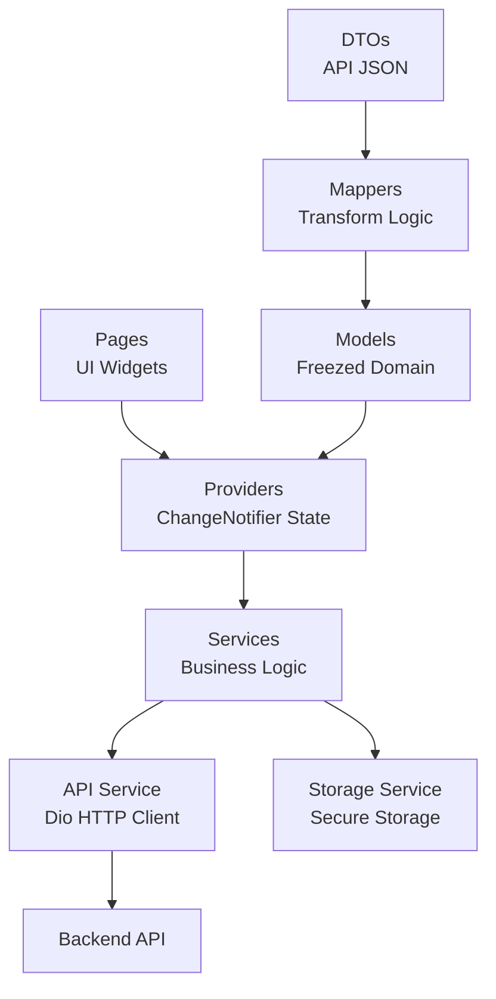
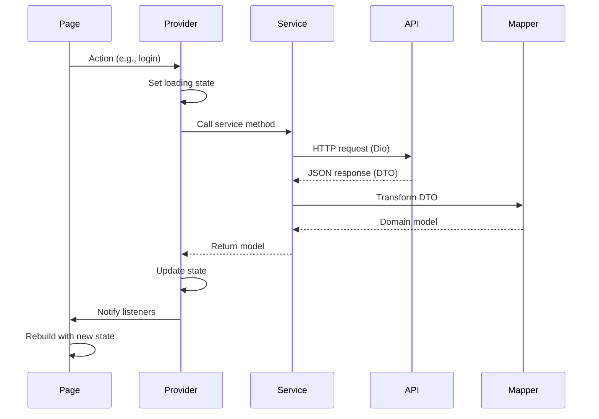
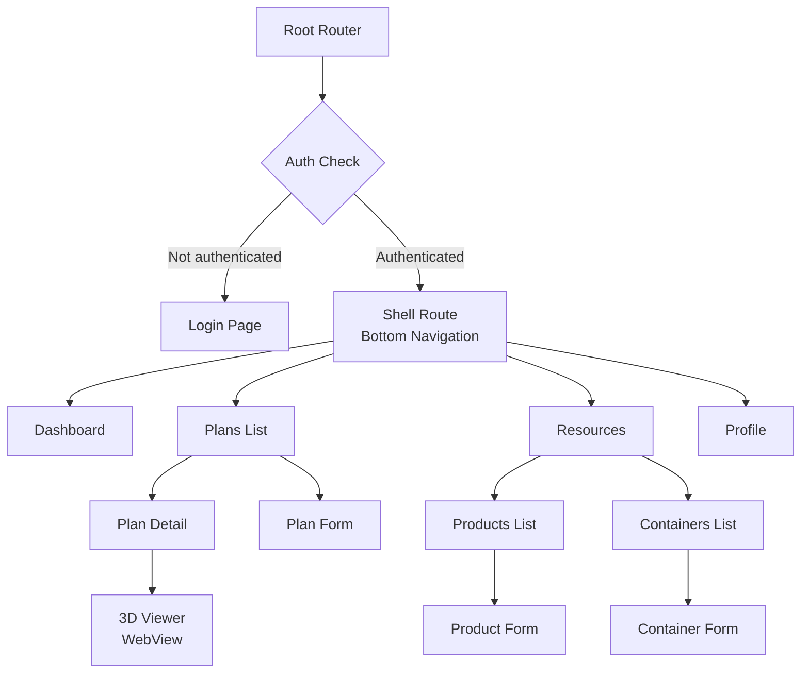
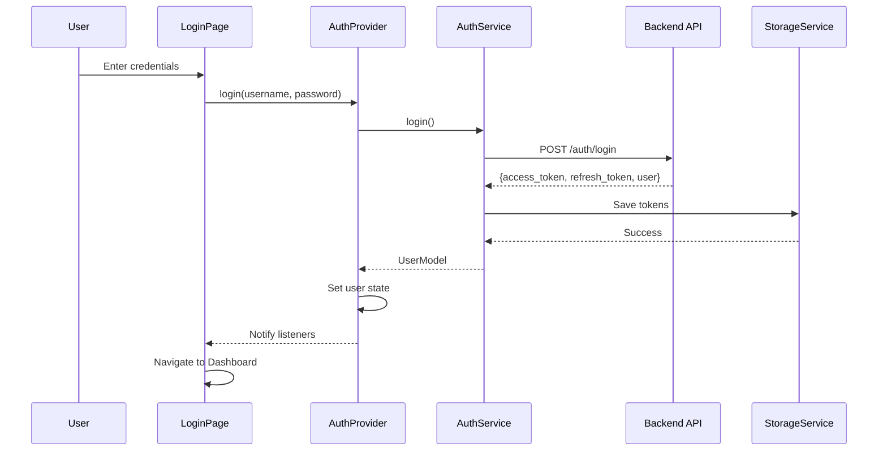

# Load Stuffing Calculator - Mobile App

Flutter application for iOS and Android with desktop support.

## Overview

This mobile client provides native access to the Load Stuffing Calculator system. It implements CRUD operations for plans, products, and containers, with 3D visualization handled through an embedded WebView that displays the Next.js web interface.

**Target users:**
- Warehouse planners managing personal workspaces
- Operators viewing plans and loading instructions on mobile devices

**Design approach:**
- Personal workspace focus (no organization/team management)
- Native UI using Flutter Material 3
- WebView for 3D visualization (reuses web client)
- JWT authentication with encrypted token storage

## Features

**Core functionality:**
- User authentication (login, session persistence)
- Dashboard with role-based statistics
- Load plan management (create, view, recalculate, delete)
- Product catalog management (CRUD operations)
- Container catalog management (CRUD operations)
- 3D visualization via embedded WebView
- Status tracking (DRAFT, IN_PROGRESS, COMPLETED, FAILED, PARTIAL, CANCELLED)

**Authentication:**
- Login with username and password
- JWT tokens stored in device keychain (flutter_secure_storage)
- Session persistence across app restarts
- Auto-logout on token expiration
- User-friendly login error messages (invalid credentials, network errors)

**Plans:**
- List plans with pagination
- Create plans with container selection and item configuration
- View plan details in three tabs (Overview, 3D View, Items)
- Recalculate placements with algorithm selection (bestfitdecreasing, minimizeboxes, greedy, parallel)
- Delete plans
- View utilization statistics (volume, weight)

**Master data:**
- Products: name, dimensions (mm), weight (kg), color
- Containers: name, dimensions (mm), max weight (kg)
- Full CRUD operations for both resources

**Limitations:**
- Token refresh not implemented (requires re-login after access token expires)
- No offline mode (network-required for all operations)
- No QR/barcode scanning (dependency installed but not integrated)
- Desktop WebView support limited (Linux shows fallback, macOS/Windows partial)

## Tech Stack

**Core:**
- Flutter 3.9+
- Dart 3.9+
- Material 3 design system

**Key dependencies:**
- `dio` (5.9.1) - HTTP client
- `provider` (6.1.5) - State management
- `flutter_secure_storage` (10.0.0) - Encrypted token storage
- `go_router` (17.0.1) - Navigation with auth guards
- `freezed` (3.2.4) - Immutable models
- `json_serializable` (6.12.0) - JSON serialization
- `webview_flutter` (4.13.1) - 3D visualization WebView
- `google_fonts` (8.0.0) - Inter font family
- `mobile_scanner` (7.1.4) - QR/barcode scanning (not integrated)

**Code generation:**
- Freezed for immutable models (`.freezed.dart` files)
- json_serializable for DTOs (`.g.dart` files)

## Architecture

### Layered structure



### Data flow



### Navigation structure



## Project Structure

```
mobile/
├── lib/
│   ├── main.dart               # App entry point, provider setup
│   ├── config/
│   │   ├── assets.dart         # Asset paths
│   │   ├── constants.dart      # API URLs, storage keys
│   │   ├── routes.dart         # GoRouter configuration
│   │   └── theme.dart          # Material 3 theme
│   ├── components/
│   │   ├── buttons/            # AppButton, QuickActionButton, PlanActionButton
│   │   ├── cards/              # StatCard, ResourceListItem, PlanItemCard, InfoRow, UtilizationProgressCard
│   │   ├── dialogs/            # ConfirmDialog, RecalculateDialog
│   │   ├── fields/             # ColorPickerField
│   │   ├── forms/              # LoginFormContent, ProductFormContent, ContainerFormContent
│   │   ├── inputs/             # AppTextField, NumberField, DimensionInputs
│   │   ├── sections/           # Composable page sections (plan, dashboard, auth, settings, resources)
│   │   ├── viewers/            # PlanVisualizerView (WebView)
│   │   └── widgets/            # LoadingState, ErrorState, EmptyState, StatusBadge, ProfileHeader, SettingsListItem
│   ├── dtos/                   # API data transfer objects (json_serializable)
│   │   ├── api_response_dto.dart
│   │   ├── auth_dto.dart
│   │   ├── container_dto.dart
│   │   ├── dashboard_dto.dart
│   │   ├── plan_dto.dart
│   │   ├── plan_detail_dto.dart
│   │   └── product_dto.dart
│   ├── exceptions/             # Custom exceptions
│   │   └── login_exception.dart
│   ├── mappers/                # DTO to Model transformers
│   │   ├── auth_mapper.dart
│   │   ├── container_mapper.dart
│   │   ├── plan_mapper.dart
│   │   └── product_mapper.dart
│   ├── models/                 # Domain models (Freezed)
│   │   ├── container_model.dart
│   │   ├── plan_detail_model.dart
│   │   ├── plan_model.dart
│   │   ├── product_model.dart
│   │   └── user_model.dart
│   ├── pages/
│   │   ├── auth/               # LoginPage
│   │   ├── dashboard/          # DashboardPage
│   │   ├── plans/              # PlanListPage, PlanFormPage, PlanDetailPage
│   │   ├── profile/            # ProfilePage (settings, logout)
│   │   ├── resources/          # Product and Container pages
│   │   └── main_shell_page.dart # Bottom navigation shell
│   ├── providers/              # State management (ChangeNotifier)
│   │   ├── auth_provider.dart
│   │   ├── container_provider.dart
│   │   ├── dashboard_provider.dart
│   │   ├── plan_detail_provider.dart
│   │   ├── plan_provider.dart
│   │   └── product_provider.dart
│   ├── services/               # Business logic
│   │   ├── api_service.dart    # Dio client + interceptors
│   │   ├── auth_service.dart
│   │   ├── container_service.dart
│   │   ├── dashboard_service.dart
│   │   ├── plan_service.dart
│   │   ├── product_service.dart
│   │   └── storage_service.dart # flutter_secure_storage wrapper
│   └── utils/
│       └── ui_helpers.dart
├── android/                    # Android native config
├── ios/                        # iOS native config
├── linux/                      # Linux desktop config
├── macos/                      # macOS desktop config
├── windows/                    # Windows desktop config
├── web/                        # Flutter web config
├── test/                       # Tests (not implemented)
├── pubspec.yaml                # Dependencies
└── analysis_options.yaml       # Linter rules
```

## Quick Start

### Prerequisites

- Flutter 3.9.2+
- Dart 3.9.2+
- Android Studio / Xcode (for mobile)
- API server running (see root README)

### Setup

```bash
# Navigate to mobile directory
cd mobile

# Install dependencies
flutter pub get

# Generate code (Freezed + json_serializable)
flutter pub run build_runner build --delete-conflicting-outputs

# Configure API endpoint (optional)
# Edit lib/config/constants.dart to change apiBaseUrl
```

### Run

```bash
# List available devices
flutter devices

# Run on specific device
flutter run -d <device_id>

# Android
flutter run -d android

# iOS
flutter run -d ios

# Linux desktop
flutter run -d linux

# Web
flutter run -d chrome
```

### Default configuration

```dart
// lib/config/constants.dart
apiBaseUrl: 'https://stuffing-api.irc-enter.tech/api/v1'
webBaseUrl: 'https://stuffing.irc-enter.tech'
```

Override with environment variables:
```bash
flutter run --dart-define=API_URL=http://localhost:8080/api/v1
```

## Development

### Code generation

Run after modifying DTOs or Models:
```bash
# One-time generation
flutter pub run build_runner build --delete-conflicting-outputs

# Watch mode (auto-rebuild on save)
flutter pub run build_runner watch
```

### Platform-specific setup

**Android:**
```bash
cd android
./gradlew clean
cd ..
flutter build apk --debug
```

**iOS:**
```bash
cd ios
pod install
cd ..
flutter build ios --debug --no-codesign
```

**Desktop (Linux example):**
```bash
flutter config --enable-linux-desktop
flutter build linux
```

### Build production

```bash
# Android APK
flutter build apk --release

# Android App Bundle
flutter build appbundle

# iOS
flutter build ios --release

# Linux
flutter build linux --release

# Windows
flutter build windows --release

# macOS
flutter build macos --release

# Web
flutter build web --release
```

### Common commands

```bash
# Clean build artifacts
flutter clean

# Check for issues
flutter doctor

# Analyze code
flutter analyze

# Format code
dart format lib/

# Update dependencies
flutter pub upgrade
```

## Authentication

### Token flow



### Session restore

On app launch, `AuthProvider.initialize()` attempts to validate stored tokens:

```dart
// Simplified flow
1. Check if access_token exists in secure storage
2. If yes, call GET /auth/me
3. If successful, restore user state
4. If failed (401), clear tokens and redirect to login
```

### Token injection

All authenticated requests automatically include Bearer token via `AuthInterceptor`:

```dart
// Dio interceptor in api_service.dart
onRequest: (options, handler) async {
  final token = await storageService.getAccessToken();
  if (token != null) {
    options.headers['Authorization'] = 'Bearer $token';
  }
}

onError: (error, handler) {
  if (error.response?.statusCode == 401) {
    // Trigger logout
  }
}
```

### Security

- Tokens stored in device keychain/keystore (flutter_secure_storage)
- iOS: Keychain Services
- Android: EncryptedSharedPreferences
- Access token expiry: 2 hours (backend configured)
- Refresh token not used (will require re-login after expiry)

## API Integration

### Endpoints used

| Service | Endpoint | Method | Purpose |
|---------|----------|--------|---------|
| Auth | `/auth/login` | POST | Login |
| Auth | `/auth/me` | GET | Validate token |
| Dashboard | `/dashboard` | GET | Stats |
| Plans | `/plans` | GET | List plans |
| Plans | `/plans` | POST | Create plan |
| Plans | `/plans/:id` | GET | Plan detail |
| Plans | `/plans/:id` | DELETE | Delete plan |
| Plans | `/plans/:id/calculate` | POST | Recalculate |
| Products | `/products` | GET, POST | List, Create |
| Products | `/products/:id` | GET, PUT, DELETE | Read, Update, Delete |
| Containers | `/containers` | GET, POST | List, Create |
| Containers | `/containers/:id` | GET, PUT, DELETE | Read, Update, Delete |

### Response format

All API responses use consistent wrapper:
```json
{
  "success": true,
  "data": { ... },
  "errors": null
}
```

Error responses:
```json
{
  "success": false,
  "data": null,
  "errors": [
    {
      "field": "username",
      "message": "Invalid credentials"
    }
  ]
}
```

### Error handling

Services throw exceptions with user-friendly messages:
```dart
// In service layer
if (!responseDto.success) {
  throw Exception(
    responseDto.errors?.first.message ?? 'Unknown error'
  );
}

// In provider layer
try {
  _data = await _service.fetchData();
} catch (e) {
  _error = e.toString();
} finally {
  notifyListeners();
}
```

## 3D Visualization

### WebView approach

The app embeds the Next.js web client's 3D viewer instead of implementing native 3D rendering.

**Implementation:**
```dart
// components/viewers/plan_visualizer_view.dart
WebView(
  initialUrl: '${webBaseUrl}/embed/shipments/${planId}?token=${accessToken}',
  javascriptMode: JavascriptMode.unrestricted,
)
```

**Web embed route:**
- URL: `https://stuffing.irc-enter.tech/embed/shipments/:id`
- Token passed as query parameter for authentication
- Web client renders Three.js scene in embed mode (no header/footer)

**Design rationale:**
- Reuses existing web implementation (avoids porting Three.js to Flutter)
- Single source of 3D visualization logic (updates automatically)
- Reduces mobile app complexity and maintenance burden

**Platform support:**
- Android: Full support via `webview_flutter`
- iOS: Full support via `webview_flutter`
- Linux: Limited (shows fallback UI with "Open in Browser" button)
- macOS: Partial support
- Windows: Partial support
- Web: Full support (direct render, no WebView needed)

**Desktop fallback:**
```dart
// Detects desktop platforms
if (Platform.isLinux || Platform.isWindows || Platform.isMacOS) {
  return FallbackUI(
    message: '3D Viewer not available on desktop',
    action: OpenInBrowserButton(url: viewerUrl),
  );
}
```

## State Management

### Provider pattern

Uses `provider` package with `ChangeNotifier` for state management.

**Typical provider structure:**
```dart
class ExampleProvider extends ChangeNotifier {
  final ExampleService _service;
  
  ExampleProvider({required ExampleService service}) 
      : _service = service;
  
  // State
  List<Item> _items = [];
  bool _isLoading = false;
  String? _error;
  
  // Getters
  List<Item> get items => _items;
  bool get isLoading => _isLoading;
  String? get error => _error;
  
  // Actions
  Future<void> fetchItems() async {
    _isLoading = true;
    _error = null;
    notifyListeners();
    
    try {
      _items = await _service.getItems();
    } catch (e) {
      _error = e.toString();
    } finally {
      _isLoading = false;
      notifyListeners();
    }
  }
}
```

**UI consumption:**
```dart
// Listen to provider
Consumer<ExampleProvider>(
  builder: (context, provider, child) {
    if (provider.isLoading) return LoadingState();
    if (provider.error != null) return ErrorState(message: provider.error);
    return ItemList(items: provider.items);
  },
)

// Call action
context.read<ExampleProvider>().fetchItems();
```

**Provider setup in main.dart:**
```dart
MultiProvider(
  providers: [
    ChangeNotifierProvider(
      create: (_) => AuthProvider(authService: authService),
    ),
    ChangeNotifierProvider(
      create: (_) => PlanProvider(planService: planService),
    ),
    // ... other providers
  ],
  child: MaterialApp.router(routerConfig: router),
)
```

## Platform Support

| Platform | Status | Notes |
|----------|--------|-------|
| Android | Full support | Minimum SDK 21 (Android 5.0+) |
| iOS | Full support | iOS 12+ |
| Linux | Partial | WebView shows fallback UI |
| macOS | Partial | WebView limited support |
| Windows | Partial | WebView limited support |
| Web | Full support | Flutter web build |

**WebView limitations on desktop:**
- `webview_flutter` plugin has limited desktop support
- Linux: No WebView, shows "Open in Browser" button
- macOS: Limited functionality
- Windows: Limited functionality
- Recommendation: Use web client on desktop browsers

## Testing

**Current status:** No tests implemented (test directory empty)

**Recommended test structure:**

```
test/
├── unit/
│   ├── services/        # API service mocks
│   ├── mappers/         # DTO to Model transformation
│   └── providers/       # State management logic
├── widget/
│   ├── components/      # Reusable widget tests
│   └── pages/           # Page widget tests
└── integration/
    └── flows/           # Full user flows
```

**Example unit test:**
```dart
// test/unit/mappers/product_mapper_test.dart
void main() {
  group('ProductMapper', () {
    test('toModel converts DTO to Model correctly', () {
      final dto = ProductResponseDto(
        id: 'test-id',
        name: 'Test Product',
        lengthMm: 100,
        widthMm: 50,
        heightMm: 30,
        weightKg: 1.5,
        colorHex: '#FF0000',
      );
      
      final model = ProductMapper.toModel(dto);
      
      expect(model.id, 'test-id');
      expect(model.name, 'Test Product');
      expect(model.lengthMm, 100);
    });
  });
}
```

**Run tests (when implemented):**
```bash
# All tests
flutter test

# Specific file
flutter test test/unit/mappers/product_mapper_test.dart

# With coverage
flutter test --coverage
genhtml coverage/lcov.info -o coverage/html
open coverage/html/index.html
```

## Known Limitations

**Authentication:**
- Token refresh not implemented (requires manual re-login after 2 hours)
- No biometric authentication (Touch ID, Face ID)

**Features:**
- No QR/barcode scanning integration (dependency installed, not used)
- No offline mode (all operations require network)
- Plans list pagination hardcoded (page 1, limit 10, no "Load More")

**UI/UX:**
- No dark mode support
- No localization (English only)
- Limited loading indicators on some screens

**Platform-specific:**
- Desktop WebView limited (Linux fallback, macOS/Windows partial)
- No native 3D rendering (WebView only)

**Testing:**
- Zero test coverage (no unit, widget, or integration tests)

## Troubleshooting

### Connection errors

**Problem:** "Failed to connect to API"

Check API URL configuration:
```dart
// lib/config/constants.dart
static const String apiBaseUrl = 'http://10.0.2.2:8080/api/v1'; // Android emulator
static const String apiBaseUrl = 'http://localhost:8080/api/v1'; // iOS simulator
```

Verify API server is running:
```bash
curl http://localhost:8080/api/v1/health
```

### Authentication failed

**Problem:** "Invalid credentials" or "Unauthorized"

- Verify username and password are correct
- Check if API `/auth/login` endpoint is accessible
- Ensure JWT_SECRET is configured on backend

### Token expired

**Problem:** Redirected to login after some time

Access tokens expire after 2 hours. Token refresh not implemented, manual re-login required.

### WebView blank screen

**Problem:** 3D viewer shows blank white screen

- Check `webBaseUrl` configuration points to running web client
- Verify token is valid (check network logs)
- Try opening URL in mobile browser directly
- Desktop: Use fallback "Open in Browser" button

### Code generation errors

**Problem:** "Missing part 'file.g.dart'" or "Missing part 'file.freezed.dart'"

Run code generation:
```bash
flutter pub run build_runner build --delete-conflicting-outputs
```

### Build failures

**Android:**
```bash
cd android
./gradlew clean
cd ..
flutter clean
flutter pub get
flutter build apk
```

**iOS:**
```bash
cd ios
pod deintegrate
pod install
cd ..
flutter clean
flutter pub get
flutter build ios --no-codesign
```

## Roadmap

### High priority

- Implement token refresh flow (auto-refresh when access token expires)
- Add unit tests for services and mappers
- Add widget tests for critical components
- Add loading indicators to all async operations

### Medium priority

- Implement pagination UI for plans list ("Load More" button)
- Add search functionality for products and containers
- Integrate QR/barcode scanning for item tracking
- Offline mode with local caching (Hive or Isar)
- Dark mode support
- Localization (i18n) setup

### Low priority

- Native 3D rendering (if desktop becomes priority)
- Biometric authentication
- Push notifications for plan status changes
- Analytics and crash reporting (Firebase)
- PDF export functionality

## Comparison to Web Client

**Feature parity:**

| Feature | Web | Mobile | Notes |
|---------|-----|--------|-------|
| Authentication | Yes | Yes | Mobile missing token refresh |
| Dashboard | Yes | Yes | Same API endpoint |
| Plans CRUD | Yes | Yes | Full feature parity |
| Products CRUD | Yes | Yes | Full feature parity |
| Containers CRUD | Yes | Yes | Full feature parity |
| 3D Visualization | Three.js | WebView | Mobile embeds web client |
| Recalculation | Yes | Yes | Same algorithm options |
| User Management | Yes | No | Admin features not in mobile |
| Workspace Switching | Yes | No | Mobile personal workspace only |
| Reports/Export | Yes | No | PDF generation web only |

**Key differences:**

- **UI:** Web uses sidebar navigation, mobile uses bottom navigation
- **3D Rendering:** Web renders directly with Three.js, mobile embeds web client in WebView
- **Scope:** Web supports organization workspaces, mobile focuses on personal workspaces
- **Admin Features:** Web has user/role management, mobile does not
- **Platform:** Web runs in browsers, mobile runs natively on devices

**When to use each:**

- **Web:** Desktop users, admin tasks, organization workspace management, PDF exports
- **Mobile:** On-site operators, warehouse planners on the move, mobile-first users
