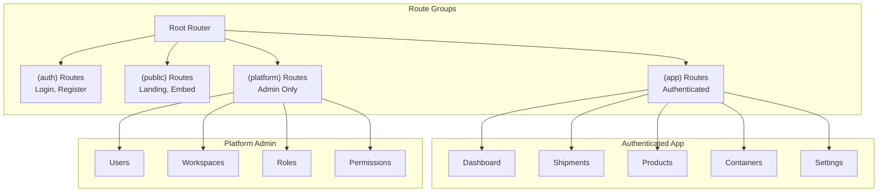
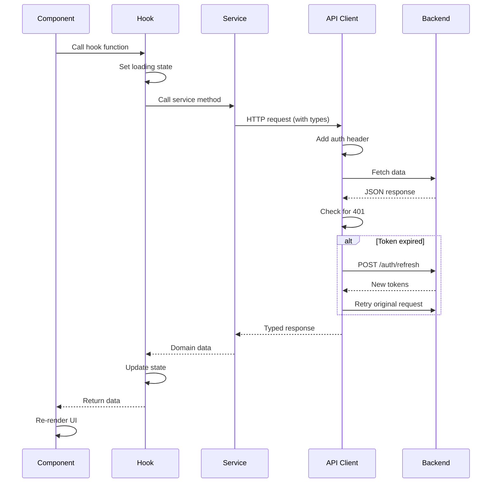
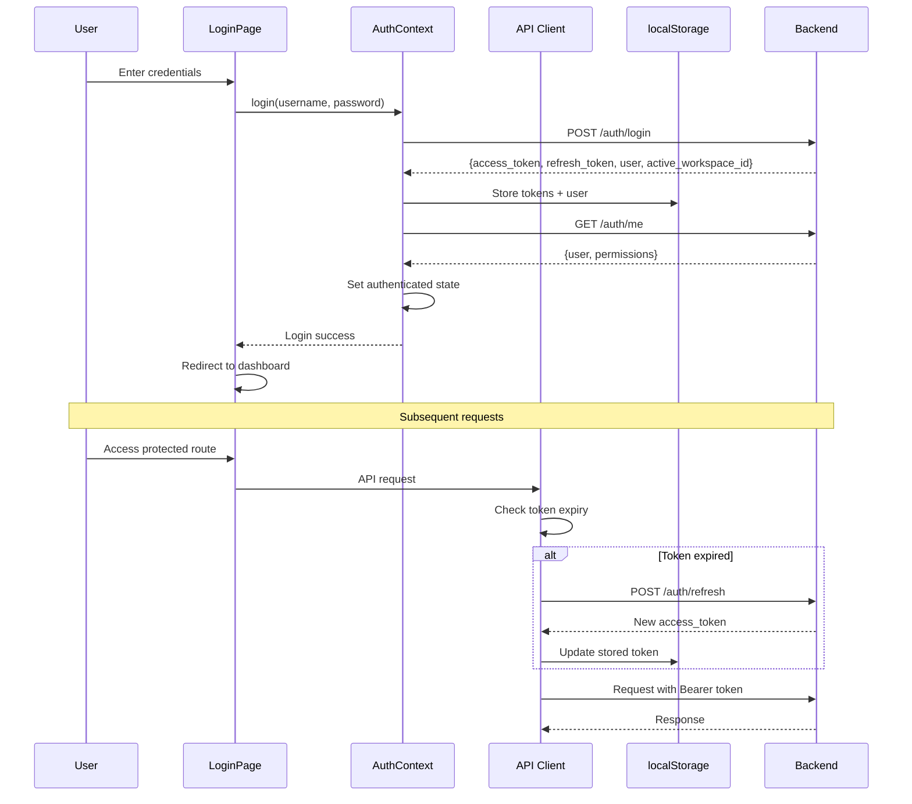
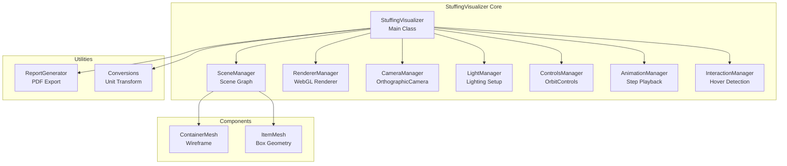

# Load Stuffing Calculator - Web Application

Next.js application for warehouse load planning and 3D visualization.

## Overview

This web application provides a complete load planning system with native 3D visualization using Three.js. It supports multi-tenant workspaces, role-based access control, and comprehensive shipment management with real-time 3D container stuffing visualization.

**Target users:**
- Warehouse planners creating and optimizing load plans
- Operators viewing loading instructions
- Workspace administrators managing members and permissions
- Platform administrators managing users and workspaces across the system

**Design approach:**
- Multi-tenant architecture with workspace isolation
- JWT authentication with automatic token refresh
- Native Three.js 3D rendering engine (1731 lines)
- Service layer pattern for API integration
- Permission-based route protection
- Guest sessions for trial calculator on landing page

## Features

**Authentication & Multi-Tenancy:**
- User registration with automatic workspace creation
- Login with JWT access and refresh tokens
- Workspace switching for multi-tenant users
- Guest sessions for unauthenticated trial calculator access
- Session persistence across browser refreshes
- Automatic token refresh on expiration

**Shipment Management:**
- Create shipments with container selection and item configuration
- Add items from product catalog or manual entry
- Calculate 3D placements with algorithm selection (bestfitdecreasing, minimizeboxes, greedy, parallel)
- View shipment details with three-dimensional visualization
- Step-by-step animation playback of loading sequence
- Hover tooltips showing item details
- Generate PDF reports with vector graphics
- Delete shipments
- Status tracking (DRAFT, IN_PROGRESS, COMPLETED, FAILED, PARTIAL, CANCELLED)

**3D Visualization:**
- Native Three.js implementation with custom engine (StuffingVisualizer)
- OrthographicCamera with auto-fit to container size
- Step-by-step animation controls (play, pause, reset, step forward/backward)
- Interactive hover detection with raycasting
- Screenshot capture (1920x1080 for reports)
- PDF generation with summary page and step-by-step diagrams
- Embeddable viewer at `/embed/shipments/[id]` with token authentication
- Copy embed URL functionality

**Trial Calculator:**
- Fully functional load calculator on landing page
- Guest session creation without registration
- Preset containers or custom dimensions
- Add items from catalog or manual entry
- Real-time calculation and 3D visualization
- Rate limiting to encourage signup (429 redirects to login)

**Master Data:**
- Product catalog management (name, dimensions, weight, color)
- Container profile management (name, dimensions, max weight)
- Full CRUD operations for both resources

**Workspace Management:**
- Member management (invite, remove, update roles)
- Invitation system with email-based invites
- Role assignment (owner, admin, planner, operator)
- Workspace settings configuration

**Platform Administration:**
- User management (create, view, update, delete users)
- Workspace management across all tenants
- Role management (create, edit, assign permissions)
- Permission management (create, edit, assign to roles)
- Platform-level access control (founder and admin roles)

**Dashboard:**
- Role-specific statistics display
- Recent shipments list
- Quick actions based on permissions
- Utilization metrics

**Incomplete Features:**
Reports module pages exist but data display not implemented:
- Audit logs page (route exists, no data integration)
- Execution logs page (route exists, no data integration)  
- Manifest generation page (route exists, minimal implementation)

Loading module routes exist but not implemented:
- `/loading` - Loading instructions view
- `/loading/[sessionId]` - Real-time loading session tracking

Real-time features not implemented:
- IoT sensor integration
- WebSocket for live updates
- Execution validator with tolerance checks
- MQTT ingestion

## Tech Stack

**Core Framework:**
- Next.js 16.0.7 (App Router)
- React 19.2.0
- TypeScript 5.x (strict mode)

**UI & Styling:**
- Radix UI primitives (18 components: Dialog, Select, Dropdown, Tabs, etc.)
- shadcn/ui component library (New York style)
- Tailwind CSS 4.1.9 with PostCSS
- lucide-react 0.454.0 (icon library)
- class-variance-authority, clsx, tailwind-merge (styling utilities)

**3D Visualization:**
- Three.js 0.182.0
- Custom StuffingVisualizer engine (1731 lines)

**Forms & Validation:**
- react-hook-form 7.60.0
- zod 3.25.76 (schema validation)
- @hookform/resolvers 3.10.0

**Data Display:**
- @tanstack/react-table 8.21.3 (tables)
- recharts 2.15.4 (charts and graphs)
- date-fns 4.1.0 (date formatting)

**Document Generation:**
- jspdf 3.0.4 (PDF reports)

**Development Tools:**
- Vitest 4.0.16 (testing framework)
- ESLint (next/core-web-vitals preset)
- @vercel/analytics 1.3.1

## Architecture

### Application structure



### Data flow pattern



### Authentication flow



### StuffingVisualizer architecture



## Project Structure

```
web/
├── app/                          # Next.js App Router
│   ├── (app)/                   # Authenticated application routes
│   │   ├── containers/          # Container management
│   │   │   ├── page.tsx         # List containers
│   │   │   └── [id]/            # Container detail/edit
│   │   ├── dashboard/           # Main dashboard
│   │   │   └── page.tsx         # Role-based stats
│   │   ├── loading/             # Loading module (not implemented)
│   │   ├── (platform)/          # Platform admin routes
│   │   │   ├── permissions/     # Permission management
│   │   │   ├── roles/           # Role management
│   │   │   ├── users/           # User management
│   │   │   └── workspaces/      # Workspace management
│   │   ├── products/            # Product catalog
│   │   │   ├── page.tsx         # List products
│   │   │   └── [id]/            # Product detail/edit
│   │   ├── reports/             # Reporting (incomplete)
│   │   │   ├── audit/           # Audit logs
│   │   │   ├── execution/       # Execution logs
│   │   │   └── manifest/        # Manifests
│   │   ├── settings/            # Workspace settings
│   │   │   ├── invites/         # Invitation management
│   │   │   └── members/         # Member management
│   │   ├── shipments/           # Shipment/plan management
│   │   │   ├── page.tsx         # List shipments
│   │   │   ├── new/             # Create shipment wizard
│   │   │   │   └── page.tsx
│   │   │   └── [id]/            # Shipment detail + 3D viewer
│   │   │       └── page.tsx     # 423 lines, 3 main sections
│   │   └── layout.tsx           # App layout with sidebar
│   ├── (auth)/                  # Authentication routes
│   │   ├── login/               # Login page
│   │   │   └── page.tsx
│   │   └── register/            # Registration page
│   │       └── page.tsx
│   ├── invites/                 # Public invite acceptance
│   │   └── accept/
│   │       └── page.tsx
│   ├── (public)/                # Public routes
│   │   ├── embed/               # Embeddable 3D viewer
│   │   │   └── shipments/
│   │   │       └── [id]/
│   │   │           └── page.tsx
│   │   └── page.tsx             # Landing page with trial calculator
│   ├── layout.tsx               # Root layout
│   └── globals.css              # Global styles, Tailwind directives
├── components/                   # React components
│   ├── ui/                      # shadcn/ui primitives (18 files)
│   │   ├── button.tsx
│   │   ├── card.tsx
│   │   ├── dialog.tsx
│   │   ├── dropdown-menu.tsx
│   │   ├── form.tsx
│   │   ├── input.tsx
│   │   ├── label.tsx
│   │   ├── select.tsx
│   │   ├── table.tsx
│   │   ├── tabs.tsx
│   │   └── ... (8 more)
│   ├── animation-controls.tsx   # 3D viewer playback controls
│   ├── container-form.tsx       # Container CRUD form
│   ├── dashboard-layout.tsx     # Sidebar + navigation
│   ├── item-input-form.tsx      # Add items to shipment
│   ├── login-form.tsx           # Login form component
│   ├── product-form.tsx         # Product CRUD form
│   ├── shipment-wizard.tsx      # Multi-step shipment creation
│   ├── stuffing-viewer.tsx      # Main 3D visualization wrapper
│   └── trial-load-calculator.tsx # Landing page calculator (739 lines)
├── hooks/                        # React hooks for data fetching
│   ├── use-containers.ts        # Container operations
│   ├── use-dashboard.ts         # Dashboard stats
│   ├── use-invites.ts           # Invite operations
│   ├── use-members.ts           # Member operations
│   ├── use-permissions.ts       # Permission operations
│   ├── use-plans.ts             # Plan/shipment operations
│   ├── use-products.ts          # Product operations
│   ├── use-roles.ts             # Role operations
│   ├── use-users.ts             # User operations
│   └── use-workspaces.ts        # Workspace operations
├── lib/                          # Core library code
│   ├── services/                # API service layer (11 files)
│   │   ├── auth.ts              # Auth operations
│   │   ├── containers.ts        # Container API
│   │   ├── dashboard.ts         # Dashboard API
│   │   ├── invites.ts           # Invite API
│   │   ├── members.ts           # Member API
│   │   ├── permissions.ts       # Permission API
│   │   ├── plans.ts             # Plan/shipment API
│   │   ├── products.ts          # Product API
│   │   ├── roles.ts             # Role API
│   │   ├── users.ts             # User API
│   │   └── workspaces.ts        # Workspace API
│   ├── types/                   # TypeScript type definitions (418 lines)
│   │   ├── api.ts               # API response types
│   │   ├── auth.ts              # Auth types
│   │   ├── container.ts         # Container types
│   │   ├── invite.ts            # Invite types
│   │   ├── member.ts            # Member types
│   │   ├── permission.ts        # Permission types
│   │   ├── plan.ts              # Plan types
│   │   ├── product.ts           # Product types
│   │   ├── role.ts              # Role types
│   │   ├── user.ts              # User types
│   │   └── workspace.ts         # Workspace types
│   ├── StuffingVisualizer/      # 3D visualization engine (1731 lines, 14 files)
│   │   ├── components/          # Three.js mesh components
│   │   │   ├── container-mesh.ts # Wireframe container
│   │   │   └── item-mesh.ts     # Box mesh with rotation
│   │   ├── core/                # Core managers
│   │   │   ├── animation-manager.ts      # Step playback (133 lines)
│   │   │   ├── camera-manager.ts         # Camera positioning
│   │   │   ├── controls-manager.ts       # OrbitControls
│   │   │   ├── interaction-manager.ts    # Hover detection (100 lines)
│   │   │   ├── light-manager.ts          # Lighting setup
│   │   │   ├── renderer-manager.ts       # WebGL renderer
│   │   │   └── scene-manager.ts          # Scene graph
│   │   ├── report/
│   │   │   └── report-generator.ts       # PDF export (580 lines)
│   │   ├── utils/
│   │   │   └── conversions.ts            # Unit conversions
│   │   ├── stuffing-visualizer.ts        # Main class (282 lines)
│   │   └── types.ts                      # Internal types
│   ├── api.ts                   # HTTP client with token refresh
│   ├── auth-context.tsx         # Authentication context provider
│   ├── audit-context.tsx        # Audit logging context (stub)
│   ├── bin-packing.ts           # Client-side packing utilities
│   ├── execution-context.tsx    # Execution tracking context (stub)
│   ├── guest-session.ts         # Guest token management
│   ├── permissions.ts           # Permission matching logic
│   ├── planning-context.tsx     # Local planning state (legacy)
│   ├── route-guard.tsx          # Route protection component
│   ├── storage-context.tsx      # Local storage context (stub)
│   └── utils.ts                 # Utility functions
├── test/                         # Vitest test files (8 files)
│   └── lib/
│       ├── services/            # Service tests
│       │   ├── auth.test.ts
│       │   ├── containers.test.ts
│       │   ├── permissions.test.ts
│       │   ├── plans.test.ts
│       │   ├── products.test.ts
│       │   ├── roles.test.ts
│       │   └── users.test.ts
│       └── utils.test.ts        # Utility tests
├── components.json               # shadcn/ui configuration
├── eslint.config.mjs            # ESLint configuration
├── next.config.ts               # Next.js configuration
├── package.json                 # Dependencies and scripts
├── postcss.config.mjs           # PostCSS configuration
├── tailwind.config.ts           # Tailwind CSS configuration
├── tsconfig.json                # TypeScript configuration
└── vitest.config.ts             # Vitest test configuration
```

## Quick Start

### Prerequisites

- Node.js 18.x or higher
- pnpm 8.x (or npm/yarn)
- Backend API server running (see root README)

### Setup

```bash
# Navigate to web directory
cd web

# Install dependencies
pnpm install

# Configure environment variables (optional)
cp .env.example .env.local
# Edit .env.local to set NEXT_PUBLIC_API_URL
```

### Environment variables

Create `.env.local` file:

```bash
# Backend API base URL (default: http://localhost:8080/api/v1)
NEXT_PUBLIC_API_URL=http://localhost:8080/api/v1
```

If not set, defaults to `http://localhost:8080/api/v1`.

### Run development server

```bash
# Start dev server
pnpm dev

# Open browser
# Navigate to http://localhost:3000
```

### Build production

```bash
# Create production build
pnpm build

# Start production server
pnpm start

# Server runs on http://localhost:3000
```

## Development

### Available scripts

```bash
# Development server (hot reload)
pnpm dev

# Production build
pnpm build

# Start production server
pnpm start

# Run ESLint
pnpm lint

# Run tests
pnpm test

# Run tests in watch mode
pnpm test -- --watch

# Run specific test file
pnpm test -- test/lib/services/auth.test.ts

# Run tests matching pattern
pnpm test -- -t "login should"
```

### Adding a new route

1. Create page in appropriate route group:
```tsx
// app/(app)/my-feature/page.tsx
import { RouteGuard } from "@/lib/route-guard"

export default function MyFeaturePage() {
  return (
    <RouteGuard requiredPermissions={["my_feature:read"]}>
      <div>My Feature Content</div>
    </RouteGuard>
  )
}
```

2. Add navigation item in `components/dashboard-layout.tsx`:
```tsx
const navItems = [
  // ... existing items
  {
    name: "My Feature",
    href: "/my-feature",
    icon: Icon,
    requiredPermissions: ["my_feature:read"],
  },
]
```

### Adding a new service

1. Define types in `lib/types/`:
```typescript
// lib/types/my-resource.ts
export interface MyResource {
  id: string
  name: string
  createdAt: string
}

export interface CreateMyResourceRequest {
  name: string
}
```

2. Create service in `lib/services/`:
```typescript
// lib/services/my-resource.ts
import { apiGet, apiPost, apiPut, apiDelete } from "@/lib/api"
import type { MyResource, CreateMyResourceRequest } from "@/lib/types/my-resource"

export const MyResourceService = {
  async list(): Promise<MyResource[]> {
    return apiGet<MyResource[]>("/my-resources")
  },

  async get(id: string): Promise<MyResource> {
    return apiGet<MyResource>(`/my-resources/${id}`)
  },

  async create(data: CreateMyResourceRequest): Promise<MyResource> {
    return apiPost<MyResource>("/my-resources", data)
  },

  async update(id: string, data: Partial<CreateMyResourceRequest>): Promise<MyResource> {
    return apiPut<MyResource>(`/my-resources/${id}`, data)
  },

  async delete(id: string): Promise<void> {
    return apiDelete(`/my-resources/${id}`)
  },
}
```

3. Create hook in `hooks/`:
```typescript
// hooks/use-my-resource.ts
"use client"

import { useState, useEffect } from "react"
import { MyResourceService } from "@/lib/services/my-resource"
import type { MyResource } from "@/lib/types/my-resource"

export function useMyResources() {
  const [resources, setResources] = useState<MyResource[]>([])
  const [loading, setLoading] = useState(true)
  const [error, setError] = useState<string | null>(null)

  useEffect(() => {
    loadResources()
  }, [])

  async function loadResources() {
    try {
      setLoading(true)
      const data = await MyResourceService.list()
      setResources(data)
    } catch (err) {
      setError(err instanceof Error ? err.message : "Failed to load")
    } finally {
      setLoading(false)
    }
  }

  return { resources, loading, error, reload: loadResources }
}
```

### Adding shadcn/ui components

```bash
# Add a new component
pnpm dlx shadcn@latest add [component-name]

# Example: Add toast component
pnpm dlx shadcn@latest add toast

# Component will be added to components/ui/
```

### Type definitions

All types in `lib/types/` should match backend API responses. Use TypeScript strict mode:

```typescript
// Good: explicit types
interface User {
  id: string
  username: string
  role: string
}

// Good: typed API responses
async function getUser(id: string): Promise<User> {
  return apiGet<User>(`/users/${id}`)
}

// Avoid: any types
// Bad
async function getUser(id: string): Promise<any> { ... }
```

## Authentication & Authorization

### Authentication flow

The application uses JWT tokens with automatic refresh:

1. User logs in via `/login`
2. Backend returns `{ access_token, refresh_token, user, active_workspace_id }`
3. Tokens stored in localStorage
4. All API requests include `Authorization: Bearer ${access_token}` header
5. On 401 response, API client automatically calls `/auth/refresh`
6. New access token obtained and original request retried
7. If refresh fails, user redirected to login

### AuthContext usage

```tsx
"use client"

import { useAuth } from "@/lib/auth-context"

function MyComponent() {
  const { user, permissions, isAuthenticated, login, logout } = useAuth()

  if (!isAuthenticated) {
    return <div>Please login</div>
  }

  return (
    <div>
      <p>Welcome, {user?.username}</p>
      <button onClick={logout}>Logout</button>
    </div>
  )
}
```

### Permission system

Permissions follow `resource:action` format:

- `plan:read` - Read plans
- `plan:write` - Create/update plans
- `plan:*` - All plan actions (wildcard)
- `*` - All permissions (admin/founder)

**Check permissions:**
```tsx
import { hasAnyPermission } from "@/lib/permissions"

const granted = ["plan:read", "product:*"]
const required = ["plan:write"]

if (hasAnyPermission(granted, required)) {
  // User has permission
}
```

### RouteGuard component

Protect routes with permission requirements:

```tsx
import { RouteGuard } from "@/lib/route-guard"

export default function ProtectedPage() {
  return (
    <RouteGuard requiredPermissions={["plan:write", "product:read"]}>
      <div>This content requires plan:write and product:read</div>
    </RouteGuard>
  )
}
```

If user lacks permissions, redirects to `/login?next=/current-path`.

### Guest sessions

The trial calculator uses guest tokens:

```typescript
import { ensureGuestSession } from "@/lib/guest-session"

// Creates guest token if not exists
const token = await ensureGuestSession()

// Guest requests hit rate limits (429)
// Redirects to login with message
```

Guest tokens stored separately in localStorage (`guest_token`).

### Workspace switching

Multi-tenant users can switch workspaces:

```tsx
const { switchWorkspace } = useAuth()

// Switch to different workspace
await switchWorkspace("workspace-id")

// Gets new JWT tokens scoped to workspace
// All subsequent API calls use new workspace context
```

### Role definitions

| Role | Description | Typical Permissions |
|------|-------------|---------------------|
| `founder` | Platform superuser | `*` (all permissions) |
| `owner` | Workspace owner/CEO | Full workspace access |
| `admin` | Workspace administrator | Manage members, roles, resources |
| `personal` | Personal workspace owner | Own workspace only, no member management |
| `planner` | Load planner | Create/edit plans, products, containers |
| `operator` | Warehouse operator | Read plans, execute loading |

Roles are assigned per-workspace. Platform roles (`founder`) apply globally.

## API Integration

### Base URL configuration

API base URL configured via environment variable or defaults to localhost:

```typescript
// lib/api.ts
const API_BASE_URL = process.env.NEXT_PUBLIC_API_URL || "http://localhost:8080/api/v1"
```

Override in `.env.local`:
```bash
NEXT_PUBLIC_API_URL=https://api.example.com/api/v1
```

### API client

Centralized HTTP client in `lib/api.ts`:

```typescript
import { apiGet, apiPost, apiPut, apiDelete } from "@/lib/api"

// GET request
const users = await apiGet<User[]>("/users")

// POST request
const newUser = await apiPost<User>("/users", { username: "john" })

// PUT request
const updated = await apiPut<User>("/users/123", { username: "jane" })

// DELETE request
await apiDelete("/users/123")
```

**Features:**
- Automatic Bearer token injection
- Token refresh on 401 responses
- Retry logic after refresh
- Guest token handling
- Rate limit detection (429 for guests)
- TypeScript typed responses

### Token refresh mechanism

Automatic token refresh on expiration:

```typescript
// Simplified flow from lib/api.ts
async function request(url: string, options: RequestInit) {
  let response = await fetch(url, {
    ...options,
    headers: {
      ...options.headers,
      Authorization: `Bearer ${accessToken}`,
    },
  })

  if (response.status === 401) {
    // Token expired, refresh
    const refreshResponse = await fetch("/auth/refresh", {
      method: "POST",
      body: JSON.stringify({ refresh_token: refreshToken }),
    })

    const { access_token } = await refreshResponse.json()
    
    // Store new token
    localStorage.setItem("access_token", access_token)

    // Retry original request with new token
    response = await fetch(url, {
      ...options,
      headers: {
        ...options.headers,
        Authorization: `Bearer ${access_token}`,
      },
    })
  }

  return response
}
```

### Service layer architecture

All API integration follows service pattern:

```
Component
  ↓ uses
Hook (use-*.ts)
  ↓ calls
Service (services/*.ts)
  ↓ uses
API Client (api.ts)
  ↓ makes
HTTP Request
```

Services return typed domain objects, never raw responses.

### Available services

All services in `lib/services/`:

| Service | Endpoints | Operations |
|---------|-----------|------------|
| AuthService | `/auth/*` | login, register, me, refresh, guest, switchWorkspace |
| PlanService | `/plans/*` | list, get, create, update, delete, calculate, items |
| ContainerService | `/containers/*` | list, get, create, update, delete |
| ProductService | `/products/*` | list, get, create, update, delete |
| UserService | `/users/*` | list, get, create, update, delete |
| RoleService | `/roles/*` | list, get, create, update, delete, assignPermissions |
| PermissionService | `/permissions/*` | list, get, create, update, delete |
| WorkspaceService | `/workspaces/*` | list, get, create, update, delete |
| MemberService | `/members/*` | list, get, create, update, delete |
| InviteService | `/invites/*` | list, create, accept, delete |
| DashboardService | `/dashboard/*` | getStats (role-based) |

### Error handling

Services throw typed errors:

```typescript
try {
  const plan = await PlanService.get("invalid-id")
} catch (error) {
  if (error instanceof Error) {
    console.error(error.message) // User-friendly message
  }
}
```

API client unwraps error responses:

```typescript
// Backend error response
{
  "success": false,
  "errors": [
    { "field": "name", "message": "Name is required" }
  ]
}

// Thrown as: Error("Name is required")
```

## 3D Visualization

### StuffingVisualizer API

Main class for 3D container visualization. Located in `lib/StuffingVisualizer/`.

#### Creating an instance

```typescript
import { StuffingVisualizer } from "@/lib/StuffingVisualizer/stuffing-visualizer"
import type { VisualizerConfig } from "@/lib/StuffingVisualizer/types"

const config: VisualizerConfig = {
  containerId: "canvas-container", // DOM element ID
  width: 800,
  height: 600,
  enableControls: true,
  enableAnimation: true,
  showAxes: false,
  cameraDistance: 2000,
}

const visualizer = new StuffingVisualizer(config)
```

#### Loading plan data

```typescript
import type { PlanData } from "@/lib/StuffingVisualizer/types"

const planData: PlanData = {
  container: {
    length: 12000, // mm
    width: 2400,
    height: 2600,
    maxWeight: 25000, // kg
  },
  items: [
    {
      id: "item-1",
      name: "Box A",
      length: 1000,
      width: 800,
      height: 600,
      weight: 50,
      quantity: 10,
      colorHex: "#FF0000",
    },
  ],
  placements: [
    {
      placementId: "p-1",
      itemId: "item-1",
      posX: 0,
      posY: 0,
      posZ: 0,
      rotationCode: 0, // 0-5 for different orientations
      stepNumber: 1,
    },
  ],
}

visualizer.loadPlanData(planData)
```

#### Animation controls

```typescript
// Play animation
visualizer.play()

// Pause animation
visualizer.pause()

// Reset to beginning
visualizer.reset()

// Step forward/backward
visualizer.stepForward()
visualizer.stepBackward()

// Jump to specific step
visualizer.goToStep(5)

// Get current state
const isPlaying = visualizer.isPlaying()
const currentStep = visualizer.getCurrentStep()
const totalSteps = visualizer.getTotalSteps()
```

#### Event subscription

```typescript
// Listen for step changes
visualizer.onStepChange((step: number) => {
  console.log(`Now on step ${step}`)
})

// Listen for play state changes
visualizer.onPlayStateChange((isPlaying: boolean) => {
  console.log(`Playing: ${isPlaying}`)
})

// Listen for hover events
visualizer.onItemHover((item: ItemInfo | null) => {
  if (item) {
    console.log(`Hovering: ${item.name}`)
  }
})
```

#### Camera operations

```typescript
// Auto-fit camera to container
visualizer.fitCameraToContainer()

// Reset camera position
visualizer.resetCamera()

// Capture screenshot (1920x1080)
const dataUrl = await visualizer.captureScreenshot()
```

#### PDF generation

```typescript
import { ReportGenerator } from "@/lib/StuffingVisualizer/report/report-generator"

// Generate PDF report
const pdfBytes = await ReportGenerator.generateReport(
  planData,
  visualizer,
  {
    title: "Load Plan Report",
    date: new Date(),
    generatedBy: "John Doe",
  }
)

// Download PDF
const blob = new Blob([pdfBytes], { type: "application/pdf" })
const url = URL.createObjectURL(blob)
const link = document.createElement("a")
link.href = url
link.download = "load-plan.pdf"
link.click()
```

#### Cleanup

```typescript
// Dispose when component unmounts
visualizer.dispose()
```

### Using StuffingViewer component

High-level React component wrapper:

```tsx
import { StuffingViewer } from "@/components/stuffing-viewer"

function MyPage() {
  return (
    <StuffingViewer
      planId="plan-123"
      containerData={containerData}
      items={items}
      placements={placements}
      showControls={true}
      enablePdfExport={true}
      height="600px"
    />
  )
}
```

Component handles:
- Visualizer lifecycle (init, load, dispose)
- Animation controls UI
- Hover tooltips
- PDF download button
- Loading states
- Error handling

### Manager classes

StuffingVisualizer uses manager pattern for separation of concerns:

**CameraManager** (`core/camera-manager.ts`):
- OrthographicCamera setup
- Auto-fit to container dimensions
- Screenshot configuration (1920x1080)
- Position calculation

**RendererManager** (`core/renderer-manager.ts`):
- WebGL renderer initialization
- Resize handling
- Background color
- Anti-aliasing

**SceneManager** (`core/scene-manager.ts`):
- Scene graph management
- Add/remove meshes
- Container and item tracking
- Dispose cleanup

**LightManager** (`core/light-manager.ts`):
- Ambient light (intensity 0.6)
- Directional light (intensity 0.5)
- Light positioning

**ControlsManager** (`core/controls-manager.ts`):
- OrbitControls integration
- Mouse/touch interaction
- Zoom limits
- Damping

**AnimationManager** (`core/animation-manager.ts`, 133 lines):
- Step-by-step playback
- Play/pause/reset
- Frame timing (500ms per step)
- Step navigation (forward/backward)
- Event emission

**InteractionManager** (`core/interaction-manager.ts`, 100 lines):
- Raycasting for hover detection
- Mouse position tracking
- Item selection
- Hover event emission

### Mesh components

**ContainerMesh** (`components/container-mesh.ts`):
- Wireframe box geometry
- Edge rendering
- Gray color (#808080)
- Positioned at container center

**ItemMesh** (`components/item-mesh.ts`):
- Box geometry with dimensions
- Custom color per item
- Rotation support (6 orientations)
- Positioned based on placement coordinates

### Performance considerations

- Efficient rendering: only updates when needed
- RequestAnimationFrame for smooth animation
- Proper disposal prevents memory leaks
- Raycasting limited to visible items
- Screenshot generation optimized (reuses renderer)

## Routing & Navigation

### Route groups

Next.js App Router uses route groups for layout isolation:

- `(auth)` - Login and registration, minimal layout
- `(public)` - Landing page and embed viewer, public access
- `(app)` - Authenticated app, uses dashboard layout with sidebar
- `(platform)` - Platform admin routes, nested under (app)

### Protected routes

All `(app)` routes check authentication in layout:

```tsx
// app/(app)/layout.tsx
export default function AppLayout({ children }: { children: React.ReactNode }) {
  const { user, isLoading } = useAuth()

  if (isLoading) return <LoadingState />
  if (!user) redirect("/login")

  return <DashboardLayout>{children}</DashboardLayout>
}
```

Individual pages add permission checks:

```tsx
// app/(app)/shipments/new/page.tsx
export default function NewShipmentPage() {
  return (
    <RouteGuard requiredPermissions={["plan:write"]}>
      <ShipmentWizard />
    </RouteGuard>
  )
}
```

### Dynamic navigation

Sidebar navigation filters by permissions:

```tsx
// components/dashboard-layout.tsx
const navItems = [
  {
    name: "Dashboard",
    href: "/dashboard",
    icon: LayoutDashboard,
    requiredPermissions: [],
  },
  {
    name: "All Shipments",
    href: "/shipments",
    icon: Package,
    requiredPermissions: ["plan:read"],
  },
  {
    name: "Create Shipment",
    href: "/shipments/new",
    icon: Plus,
    requiredPermissions: ["plan:write"],
  },
  // Platform admin items
  {
    name: "Users",
    href: "/users",
    icon: Users,
    requiredPermissions: ["user:read"],
    isPlatformOnly: true,
  },
]

// Filter visible items
const visibleItems = navItems.filter((item) => {
  if (item.isPlatformOnly && !isPlatformMember) return false
  return hasAnyPermission(permissions, item.requiredPermissions)
})
```

### Redirect handling

Unauthorized access redirects to login with return URL:

```typescript
// lib/route-guard.tsx
if (!hasAnyPermission(userPermissions, requiredPermissions)) {
  const currentPath = window.location.pathname
  redirect(`/login?next=${encodeURIComponent(currentPath)}`)
}
```

After login, redirects to original destination:

```typescript
// app/(auth)/login/page.tsx
const searchParams = useSearchParams()
const next = searchParams.get("next") || "/dashboard"

// After successful login
router.push(next)
```

## Multi-Tenant Architecture

### Workspace scoping

JWT tokens embed workspace context:

```json
{
  "user_id": "user-123",
  "username": "john",
  "role": "planner",
  "workspace_id": "workspace-456",
  "exp": 1234567890
}
```

Backend filters all queries by `workspace_id` from token. No need for custom headers.

### Workspace switching

Users with multiple workspaces can switch:

```tsx
import { useAuth } from "@/lib/auth-context"

function WorkspaceSwitcher() {
  const { user, switchWorkspace } = useAuth()

  async function handleSwitch(workspaceId: string) {
    await switchWorkspace(workspaceId)
    // Gets new JWT tokens scoped to new workspace
    // Page reloads with new context
  }

  return (
    <select onChange={(e) => handleSwitch(e.target.value)}>
      {user?.workspaces?.map((ws) => (
        <option key={ws.id} value={ws.id}>
          {ws.name}
        </option>
      ))}
    </select>
  )
}
```

### Permission inheritance

Workspace roles grant permissions within workspace:

- `owner` - Full workspace access
- `admin` - Manage members, assign roles
- `planner` - Create/edit plans and resources
- `operator` - Read plans, limited write

Platform roles grant global permissions:

- `founder` - Superuser across all workspaces
- Platform admins see `/users`, `/workspaces` routes

### Workspace isolation

All resources scoped to workspace:

- Plans filtered by workspace_id
- Products visible only to workspace members
- Members cannot see other workspaces' data
- Dashboard stats calculated per workspace

Backend enforces isolation via middleware. Frontend trusts backend filtering.

## Trial Calculator

### Guest session mechanism

Landing page calculator uses guest tokens:

```typescript
// lib/guest-session.ts
export async function ensureGuestSession(): Promise<string> {
  // Check if guest token exists
  let token = localStorage.getItem("guest_token")

  if (!token) {
    // Create guest session
    const response = await fetch("/auth/guest", { method: "POST" })
    const { access_token } = await response.json()
    
    localStorage.setItem("guest_token", access_token)
    token = access_token
  }

  return token
}
```

Guest tokens valid for 30 days, no refresh token.

### Rate limiting

Guests hit rate limits to encourage signup:

```typescript
// lib/api.ts
if (response.status === 429) {
  // Rate limit exceeded
  if (isGuestSession()) {
    // Redirect to login with message
    router.push("/login?reason=rate_limit")
  }
}
```

Backend typically allows:
- 10 calculations per guest per day
- Unlimited for authenticated users

### Implementation

Trial calculator on landing page (`components/trial-load-calculator.tsx`, 739 lines):

```tsx
function TrialLoadCalculator() {
  const [container, setContainer] = useState<Container | null>(null)
  const [items, setItems] = useState<Item[]>([])
  const [result, setResult] = useState<CalculationResult | null>(null)

  async function calculate() {
    // Ensure guest session
    await ensureGuestSession()

    // Call calculation API
    const result = await PlanService.calculate({
      container,
      items,
      strategy: "bestfitdecreasing",
    })

    setResult(result)
  }

  return (
    <div>
      <ContainerSelection onSelect={setContainer} />
      <ItemInput onAdd={(item) => setItems([...items, item])} />
      <Button onClick={calculate}>Calculate</Button>
      {result && <StuffingViewer planData={result} />}
    </div>
  )
}
```

Features:
- Preset containers or custom dimensions
- Add items from product catalog
- Manual item entry
- Real-time 3D visualization
- Utilization statistics
- Call-to-action to sign up for unlimited access

## Troubleshooting

### Connection errors

**Problem:** "Failed to connect to API"

**Solution:**

Check API URL configuration:
```bash
# .env.local
NEXT_PUBLIC_API_URL=http://localhost:8080/api/v1
```

Verify backend is running:
```bash
curl http://localhost:8080/api/v1/health
```

Check browser console for CORS errors. Backend must allow frontend origin.

### Authentication failed

**Problem:** "Invalid credentials" or persistent login failures

**Solution:**

1. Verify username and password are correct
2. Check backend `/auth/login` endpoint is accessible
3. Clear localStorage and retry:
```javascript
localStorage.clear()
// Reload page
```

4. Check browser console for error details

### Token expired

**Problem:** Redirected to login unexpectedly

**Solution:**

Automatic token refresh should handle this. If not working:

1. Check refresh token exists in localStorage:
```javascript
console.log(localStorage.getItem("refresh_token"))
```

2. Check backend `/auth/refresh` endpoint
3. Check browser console for 401 errors
4. Clear tokens and re-login:
```javascript
localStorage.removeItem("access_token")
localStorage.removeItem("refresh_token")
```

### 3D viewer blank screen

**Problem:** Shipment detail shows blank white canvas

**Solution:**

1. Check browser console for Three.js errors
2. Verify plan has placements data:
```javascript
// In browser console
fetch("/api/v1/plans/PLAN_ID", {
  headers: {
    Authorization: `Bearer ${localStorage.getItem("access_token")}`
  }
}).then(r => r.json()).then(console.log)
```

3. Check container and item dimensions are valid (non-zero)
4. Try refreshing the page
5. Check WebGL is enabled in browser:
```javascript
// In browser console
document.createElement("canvas").getContext("webgl") !== null
```

### Build failures

**Problem:** `pnpm build` fails with type errors

**Solution:**

1. Clean install dependencies:
```bash
rm -rf node_modules .next
pnpm install
```

2. Check TypeScript version compatibility:
```bash
pnpm list typescript
```

3. Run type check explicitly:
```bash
pnpm tsc --noEmit
```

4. Check for missing type definitions:
```bash
pnpm install --save-dev @types/node @types/react @types/react-dom
```

### Slow PDF generation

**Problem:** PDF download takes long time or freezes browser

**Solution:**

PDF generation is CPU-intensive for plans with many steps:

1. Limit steps per page (currently all steps included)
2. Generate in background (Web Worker - not implemented)
3. Show progress indicator
4. Consider server-side PDF generation for large plans

Current performance: ~2-3 seconds for 50 steps, grows linearly.

### Guest rate limit

**Problem:** "Rate limit exceeded" message on trial calculator

**Solution:**

Expected behavior to encourage signup. Options:

1. Sign up for full account (unlimited calculations)
2. Wait 24 hours for rate limit reset
3. Clear `guest_token` from localStorage for new guest session (limited attempts)

Backend tracks by IP address, clearing token may not work.

## Roadmap

### High priority

- Implement pagination for list pages (shipments, products, containers)
- Add loading states for all mutations (create, update, delete)
- Improve error feedback messages (user-friendly, actionable)
- Add component tests for critical components (StuffingViewer, forms)
- Implement Reports module (audit logs, execution logs, manifests)
- Complete Loading module for warehouse operators

### Medium priority

- Add dark mode toggle (theme already configured)
- Implement search and filtering on list pages
- Add bulk operations (delete multiple, bulk import)
- Add export functionality (CSV, Excel)
- Optimize bundle size (code splitting, lazy loading)
- Add E2E tests with Playwright or Cypress
- Implement real-time updates with WebSocket

### Low priority

- IoT sensor integration for weight validation
- Execution validator with tolerance checks
- MQTT ingestion for real-time data
- Progressive Web App (PWA) features
- Offline mode with service worker
- Analytics dashboard with advanced metrics
